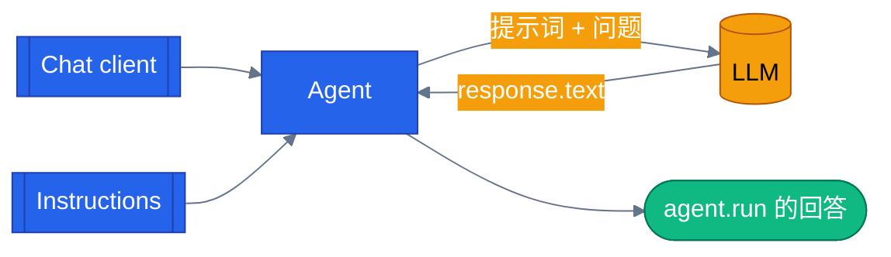

# 第 01 章 · 第一个智能体

[项目首页](../../README.md) · [教程总览](../README.md) · [术语表](../_shared/jargon-glossary.md)

最小的、真正可用的微软智能体框架（MAF）程序 —— 一个 chat client、一段指令、一次 `agent.run()` 调用。

## 本章动机

MAF 中的**智能体**就是「一个 chat client + 一段指令」。仅此而已。在后续章节往上面添加工具、记忆、中间件或工作流之前，我们需要先把这条基线跑起来 —— 之后每一章都只在这个起点上增加一样东西。

本章只回答一个问题：**「法国的首都是哪里？」**

## 前置条件

- 已完成 [第 00 章 · 环境准备](../00-setup/)（uv、Docker）。
- 仓库根目录的 `.env` 中已配置一个 LLM 提供方：

| 提供方 | 必填 | 选填 |
|--------|------|------|
| **OpenAI** | `OPENAI_API_KEY` | `LLM_MODEL`（默认 `gpt-4.1`） |
| **Azure OpenAI** | `AZURE_OPENAI_ENDPOINT`、`AZURE_OPENAI_KEY`、`AZURE_OPENAI_DEPLOYMENT` | `AZURE_OPENAI_API_VERSION`（默认 `2024-10-21`） |

## 核心概念

微软智能体框架的智能体包装了三样东西：

1. **chat client** —— 负责与 LLM 通信的对象（OpenAI Responses API、Chat Completions，或 Azure OpenAI）。
2. **指令（instructions）** —— 智能体的人格设定，作为系统提示词传入。
3. **名称（name，可选）** —— 用于日志与遥测。

调用 `await agent.run(question)`，返回一个带 `.text` 的响应。到这里还没有任何花哨的东西 —— 没有工具、没有记忆、没有编排。


```mermaid
%%{init: {'theme':'base', 'themeVariables': {
  'primaryColor': '#2563eb','primaryTextColor': '#ffffff','primaryBorderColor': '#1e40af',
  'lineColor': '#64748b','secondaryColor': '#f59e0b','tertiaryColor': '#10b981',
  'background': 'transparent'}}}%%
flowchart LR
  classDef core     fill:#2563eb,stroke:#1e40af,color:#ffffff
  classDef external fill:#f59e0b,stroke:#b45309,color:#000000
  classDef success  fill:#10b981,stroke:#047857,color:#ffffff

  client[[Chat client]]
  instr[[Instructions]]
  agent[Agent]
  llm[(LLM)]
  answer([agent.run 的回答])

  client --> agent
  instr --> agent
  agent -- "提示词 + 问题" --> llm
  llm -- "response.text" --> agent
  agent --> answer

  class client core
  class instr core
  class agent core
  class llm external
  class answer success
```

chat client 与指令是 `Agent(...)` 仅有的两个输入；`agent.run()` 是本章唯一触及的调用面。

**输入、处理与输出**：默认问题即「法国的首都是哪里？」，指令要求简短回答地理类问题。客户端把信息发给模型，`ask` 返回 `response.text`，`main` 把问题与答案打印出来。这张流程描述的是**预期的调用关系**，不是本轮真实模型运行记录。

有一个会贯穿整个系列的坑：MAF v1 有两条通往 OpenAI 风格 API 的代码路径 —— **Responses API**（较新、能力更全）与 **Chat Completions**（较旧、但被普遍支持）。公开的 OpenAI 两者都支持；但并非每个 Azure OpenAI 部署都支持 Responses API。因此本章示例在 OpenAI 下默认使用 `OpenAIChatClient`，而在 `LLM_PROVIDER=azure` 时切到 Chat Completions 路径（`OpenAIChatCompletionClient`）。

## Python

源码：[`python/main.py`](./python/main.py)。

在仓库根目录运行，共用 `tutorials/` 这一个 uv 项目（一次 `uv sync` 覆盖全部章节）：

```bash
uv sync --project tutorials
uv run --project tutorials python tutorials/01-first-agent/python/main.py
```

提供方切换与智能体构造：

```python
def _default_client() -> OpenAIChatClient | OpenAIChatCompletionClient | ReplayChatClient:
    provider = os.environ.get("LLM_PROVIDER", "openai").lower()
    if provider == "replay":
        return ReplayChatClient(fixtures_dir=FIXTURES_DIR, ...)
    if provider == "azure":
        return OpenAIChatCompletionClient(
            model=os.environ["AZURE_OPENAI_DEPLOYMENT"],
            azure_endpoint=os.environ["AZURE_OPENAI_ENDPOINT"],
            api_key=os.environ.get("AZURE_OPENAI_KEY") or os.environ.get("AZURE_OPENAI_API_KEY"),
            api_version=os.environ.get("AZURE_OPENAI_API_VERSION", "2024-10-21"),
        )
    return OpenAIChatClient(
        model=os.environ.get("LLM_MODEL", "gpt-4.1"),
        api_key=os.environ["OPENAI_API_KEY"],
    )


def build_agent(client: object | None = None) -> Agent:
    return Agent(client or _default_client(), instructions=INSTRUCTIONS, name="first-agent")


async def ask(agent: Agent, question: str) -> str:
    response = await agent.run(question)
    return response.text
```

关键函数一览：

| 函数 | 作用 |
|------|------|
| `_default_client` | 依据环境变量创建真实模型客户端，或创建回放客户端 |
| `build_agent` | 把客户端、`INSTRUCTIONS` 与 `name` 组装为 `Agent` |
| `ask` | 等待 `agent.run`，然后返回文本 |
| `main` | 接收命令行问题或默认问题，创建并运行智能体 |

`build_agent()` 接受一个可选的、预先构造好的客户端，因此测试套件可以注入受控客户端，而不必真的访问 LLM。依赖注入让测试能观察到**真正传给模型的消息**，而无需每次访问外网。

还有第三个提供方 `replay`，由 `tutorials/_shared/replay_client.py` 支撑 —— 它回放 `tests/fixtures/replay/` 下已提交的 fixture，测试套件正是靠它获得「真实答案」类断言，且不需要网络访问与凭据。

`async def` 定义异步函数，`await` 等待异步结果。它**不**意味着请求会自动无限并发，也**不**代表函数自己又创建了另一个智能体。

## 常见坑

- **Azure 上报「API version not supported」。** 遇到它说明你的部署不支持 Responses API。设置 `LLM_PROVIDER=azure` —— 示例已经会回退到 Chat Completions（Python 中为 `OpenAIChatCompletionClient`），并默认 `api_version=2024-10-21`。
- **MAF 打包缺陷 —— 现已是空操作。** 早期 `agent-framework-core==1.0.0` 的 wheel 里带了一个空的 `__init__.py`。`tutorials/_shared/maf_bootstrap.py` 会在任何 `agent_framework` 导入之前修补它（每章的 `main.py` 都会先调用 `maf_bootstrap.bootstrap()`）。本仓库现已锁定 `agent-framework` 1.14.0，该缺陷在上游已修复，因此这一步只是防御性的、在当前安装下什么都不做 —— 保留 `bootstrap()` 主要是因为**它还负责加载仓库根目录的 `.env`**，而这是每章都需要的。完整项目里有等价的 `agents/python/patch_maf.py`，同样是空操作，原因相同（参见 `CLAUDE.md` 的「MAF 包修补」一节）。
- **回放条件不满足 ≠ 模型不会回答。** 本章的回放记录对应固定的问题与调用配置。改变问题后缺少 fixture，属于回放条件不满足，不能解释成模型不会回答。
- **真实服务的 API、模型名与鉴权方式以实际配置为准。** 不要只复制某个默认模型名就假定它可用。

## 测试

```bash
uv run --project tutorials pytest tutorials/01-first-agent/python/tests -v
```

`python/tests/test_first_agent.py` 共 7 个测试，覆盖：

1. **正常路径** —— `CannedChatClient` 桩客户端证明指令与用户问题都到达了 chat client，且 `ask()` 返回其预设文本。
2. **边界情况** —— 一个测试断言 `build_agent()` 在预设响应耗尽时行为正确。
3. **回放** —— 通过 `LLM_PROVIDER=replay` 回放 `tests/fixtures/replay/` 下已提交的 fixture，无需凭据，因此可在 CI 中运行。
4. **集成** —— 一个 `@pytest.mark.integration` 测试会访问真实 LLM，在未配置凭据时自动跳过。

阅读测试时请关注它**具体断言了什么**：用户问题与指令是否到达客户端、`ask` 是否返回预期文本，以及记录用尽时如何处理。真实模型能否稳定遵守指令需要单独评估 —— 本页没有声称这些测试已在本机通过。

## 在完整项目中的落点

编排器用同样的方式构造智能体，只是字段更多 —— `agents/python/orchestrator/agent.py:150`：

```python
def create_orchestrator_agent() -> Agent:
    """Create the Customer Support orchestrator ChatAgent."""
    return Agent(
        client=create_chat_client(),
        name="orchestrator",
        description="Customer support orchestrator that routes requests to specialist agents.",
        instructions=get_system_prompt(current_user_role.get() or "customer"),
        tools=ORCHESTRATOR_TOOLS,
        context_providers=[ECommerceContextProvider()],
        middleware=build_specialist_middleware(),
        ...
    )
```

同样是本章的 `client` + `instructions` + `name` 三件套，另外多了 `tools`、`context_providers` 与 `middleware` —— 后面几章会逐一讲解。每个专家智能体都遵循完全相同的形态（例如 `agents/python/product_discovery/agent.py:86`）。

完整项目中，[`shared/agent_factory.py`](../../agents/python/shared/agent_factory.py) 集中构造模型客户端；[`product_discovery/agent.py`](../../agents/python/product_discovery/agent.py) 则在此之上增加工具、上下文提供器与中间件。

## 下一步

- 下一章：[第 02 章 · 添加工具](../02-add-tools/)
- 完整源码：[`python/`](./python/)
- 共享材料：[Mermaid 风格指南](../_shared/mermaid-style-guide.md) · [术语表](../_shared/jargon-glossary.md)
- [MAF 官方文档 —— 你的第一个智能体](https://learn.microsoft.com/en-us/agent-framework/get-started/?pivots=programming-language-python)

**本章验收标准**：能够解释输入在哪里进入系统、模型在哪里被调用、输出在哪里提取，以及「回放通过」能够证明什么。
