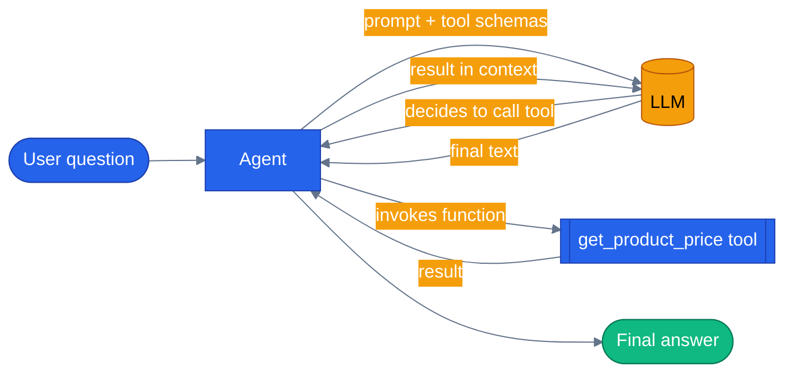

# Chapter 02 — Adding Tools

## Why this chapter

A tool turns a chat agent into something that can actually *do* things. The LLM doesn't call your function directly — it decides *whether* to call it based on the user's question, and MAF handles the back-and-forth until a final answer is produced.

In this chapter we add **one** function: a canned-data product-price lookup backed by a hard-coded dictionary. Boring data, important mechanics. The same shape — a Python `@tool` decorator or a .NET `[Description]`-annotated method — is how every specialist agent in the capstone (`agents/python/`) exposes real database and search capabilities to its LLM.

## Prerequisites

- Completed [Chapter 01 — Your First Agent](../01-first-agent/)
- Repo-root `.env` with a working LLM provider (`OPENAI_API_KEY`, or `AZURE_OPENAI_ENDPOINT` + `AZURE_OPENAI_KEY` + `AZURE_OPENAI_DEPLOYMENT`)

## The concept

A MAF tool is three things:

1. **A function** — regular Python or C#, nothing special.
2. **A name + description** — what the LLM sees when choosing which tool to call.
3. **Parameter annotations** — a JSON schema the LLM uses to format its tool call.

Python uses `@tool(...)` + `Annotated[...]` + `pydantic.Field(description=...)`. .NET uses `AIFunctionFactory.Create(method)` plus `[Description]` attributes on the method and its parameters.

MAF owns the loop: send the prompt plus tool schemas to the LLM, and if the LLM responds with a tool call, MAF invokes the function, feeds the result back into the conversation, and asks the LLM again — repeating until the LLM produces a regular text answer. You write the function; the framework wires the rest. Your code never calls `get_product_price()` directly.



The LLM never executes the function itself — it asks the framework to, then sees the result in its next context window.

## Python

Run from the repo root using the shared `tutorials/` uv project (one `uv sync` covers every chapter):

```bash
uv sync --project tutorials
uv run --project tutorials python tutorials/02-add-tools/python/main.py
```

Source: [`python/main.py`](./python/main.py). The tool itself:

```python
@tool(name="get_product_price", description="Look up the current price for a product SKU.")
def get_product_price(
    sku: Annotated[str, Field(description="The product SKU to look up, e.g. 'SKU-001'.")],
) -> str:
    canned = {
        "sku-001": "$79.99 — Wireless Mouse",
        "sku-002": "$129.99 — Mechanical Keyboard",
        "sku-003": "$45.50 — USB-C Hub",
        "sku-004": "$249.00 — 27-inch Monitor",
    }
    return canned.get(sku.lower(), f"No pricing data for {sku}.")
```

Wiring it onto the agent is a one-line addition to Chapter 01's `build_agent()`:

```python
def build_agent(client: object | None = None) -> Agent:
    return Agent(
        client or _default_client(),
        instructions=INSTRUCTIONS,
        name="product-agent",
        tools=[get_product_price],
    )
```

Run it and ask a price question — the LLM calls `get_product_price("SKU-001")`, reads the canned string, and folds it into a natural-language response. Ask something unrelated and it answers directly without touching the tool; `INSTRUCTIONS` tells the LLM explicitly when the tool applies.

## .NET

```bash
cd tutorials/02-add-tools/dotnet
dotnet run
```

Source: [`dotnet/Program.cs`](./dotnet/Program.cs). Same shape, attribute-driven instead of decorator-driven:

```csharp
[Description("Look up the current price for a product SKU.")]
public static string GetProductPrice(
    [Description("The product SKU to look up, e.g. 'SKU-001'.")] string sku)
{
    var canned = new Dictionary<string, string>(StringComparer.OrdinalIgnoreCase)
    {
        ["SKU-001"] = "$79.99 — Wireless Mouse",
        ["SKU-002"] = "$129.99 — Mechanical Keyboard",
        ["SKU-003"] = "$45.50 — USB-C Hub",
        ["SKU-004"] = "$249.00 — 27-inch Monitor",
    };
    return canned.TryGetValue(sku, out var price) ? price : $"No pricing data for {sku}.";
}
```

`AIFunctionFactory.Create(GetProductPrice)` reflects over the method and its `[Description]` attributes to build the same JSON schema the Python decorator builds by hand:

```csharp
var tools = new AITool[] { AIFunctionFactory.Create(GetProductPrice) };

return chatClient.AsAIAgent(
    instructions: Instructions,
    name: "product-agent",
    tools: tools);
```

Output matches the Python version modulo the LLM's word choices.

## Side-by-side differences

| Aspect | Python | .NET |
|--------|--------|------|
| Tool declaration | `@tool(...)` decorator on function | `AIFunctionFactory.Create(method)` |
| Parameter docs | `Annotated[str, Field(description=...)]` | `[Description(...)]` attribute |
| Passing to agent | `Agent(..., tools=[my_tool])` | `AsAIAgent(..., tools: new AITool[]{ ... })` |
| Tool is callable directly? | Yes — `get_product_price.func(...)` unwraps to the original | Yes — `Program.GetProductPrice(...)` is a plain static method |

Structurally identical. Python hangs its metadata off the decorator; .NET hangs it off attributes and reflection.

## Gotchas

- **The LLM chooses when to call the tool.** If your instructions don't make it clear the product-price tool is available for price questions, the LLM might hallucinate an answer instead. Prefer explicit wording, as `INSTRUCTIONS` does here: *"When the user asks about the price of a product by SKU, call the `get_product_price` tool."*
- **Descriptions matter more than names.** The LLM reads both, but a tight natural-language description beats a cryptic name every time.
- **Python's `@tool` wraps the function.** `get_product_price` is a `FunctionTool`, not the plain function — unit tests call the original via `get_product_price.func(...)`, not `get_product_price(...)`. See `test_product_price_tool_returns_canned_data` in `python/tests/test_add_tools.py`.
- **Async tools need `async def` in Python** and `Task<T>`/`ValueTask<T>` in .NET. This chapter's example is sync for simplicity; every production tool in the capstone (e.g. `agents/python/product_discovery/tools.py`) is `async` because it awaits a database call via `get_pool()`.
- **Real integration tests need real credentials.** The replay test (`test_replay_invokes_product_price_tool`) plays back a committed fixture and needs neither network nor an API key; the two `@pytest.mark.integration` tests hit a real LLM and are skipped automatically when `.env` has no usable key.

## Tests

```bash
# Python
uv run --project tutorials pytest tutorials/02-add-tools/python/tests -v

# .NET
cd tutorials/02-add-tools/dotnet
dotnet test tests/AddTools.Tests.csproj
```

`tutorials/02-add-tools/python/tests/test_add_tools.py` covers, structurally:

1. **Unit tests against the tool function directly** — canned data for a known SKU, a clean fallback message for an unknown one, and case-insensitivity — no LLM involved.
2. **Agent wiring** — `get_product_price` shows up in `build_agent()`'s registered tools.
3. **A replay test** (`test_replay_invokes_product_price_tool`) that plays back a committed fixture in `tests/fixtures/replay/` — no network or credentials required, safe for CI.
4. **Real-LLM integration tests**, skipped unless usable credentials are present — one asserts the LLM calls `get_product_price` for a price question, the other asserts it does *not* leak canned price data into an unrelated answer.

`tutorials/02-add-tools/dotnet/tests/AddToolsTests.cs` mirrors the same structure: three unit tests against `Program.GetProductPrice` directly, plus two `[Trait("Category", "Integration")]` tests that no-op (with a console message) when no LLM credentials are configured.

## How this shows up in the capstone

Every specialist agent in `agents/python/` is this pattern multiplied. `agents/python/product_discovery/tools.py:16` defines `search_products`:

```python
@tool(name="search_products", description="Search the product catalog using natural language. Supports filtering by category, price range, and rating.")
async def search_products(
```

Same shape as this chapter's `get_product_price`: `@tool` with a name and description, `Annotated` parameters. The differences are what production adds — `search_products` is `async` and hits Postgres via `get_pool()` instead of returning a hard-coded dictionary, and it reads the current user's identity from ContextVars (`shared/context.py`) rather than taking it as a parameter. The decorator mechanics on display here don't change.

## What's next

- Next chapter: [Chapter 03 — Streaming and Multi-turn](../03-streaming-and-multiturn/)
- Full source: [`python/`](./python/) · [`dotnet/`](./dotnet/)
- Shared: [Mermaid style guide](../_shared/mermaid-style-guide.md) · [Jargon glossary](../_shared/jargon-glossary.md)
