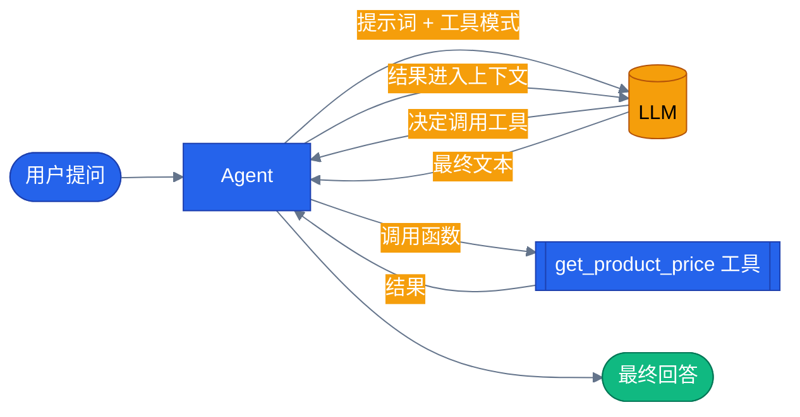

# 第 02 章 · 添加工具

[项目首页](../../README.md) · [教程总览](../README.md) · [术语表](../_shared/jargon-glossary.md)

给 chat agent 装上**一个**工具，让它真正能「做事」。模型不会直接调用你的函数 —— 它根据用户的问题决定**是否**调用，剩下的往返由 MAF 负责，直到产出最终答案。

## 本章动机

工具把 chat agent 变成能真正**做事**的东西。LLM 并不会直接调用你的函数：它依据用户的问题决定**要不要**调用，而 MAF 负责处理这中间的往返，直到产出最终答案。

本章只加**一个**函数：一个查商品价格的工具，数据来自硬编码的字典。数据很无聊，但机制很重要。这个形态 —— 一个 Python `@tool` 装饰器 —— 正是完整项目中每个专家智能体（`agents/python/`）向 LLM 暴露真实数据库与检索能力的方式。

## 前置条件

- 已完成 [第 01 章 · 第一个智能体](../01-first-agent/)
- 仓库根目录的 `.env` 中有一个可用的 LLM 提供方（`OPENAI_API_KEY`，或 `AZURE_OPENAI_ENDPOINT` + `AZURE_OPENAI_KEY` + `AZURE_OPENAI_DEPLOYMENT`）

## 核心概念

MAF 的工具由三部分组成：

1. **一个函数** —— 普通的 Python 函数，没有任何特殊之处。
2. **名称 + 描述** —— LLM 在选择调用哪个工具时看到的内容。
3. **参数标注** —— LLM 用来组织工具调用参数的 JSON 模式（schema）。

Python 用 `@tool(...)` + `Annotated[...]` + `pydantic.Field(description=...)` 来表达这三者。

MAF 负责整个循环：把提示词与工具模式发给 LLM；如果 LLM 返回一个工具调用，MAF 就执行该函数、把结果回喂进对话，然后再次询问 LLM —— 如此重复，直到 LLM 给出普通文本回答。你只写函数，其余由框架接线。**你的代码从不直接调用 `get_product_price()`。**


```mermaid
%%{init: {'theme':'base', 'themeVariables': {
  'primaryColor': '#2563eb','primaryTextColor': '#ffffff','primaryBorderColor': '#1e40af',
  'lineColor': '#64748b','secondaryColor': '#f59e0b','tertiaryColor': '#10b981',
  'background': 'transparent'}}}%%
flowchart LR
  classDef core     fill:#2563eb,stroke:#1e40af,color:#ffffff
  classDef external fill:#f59e0b,stroke:#b45309,color:#000000
  classDef success  fill:#10b981,stroke:#047857,color:#ffffff

  user([用户提问])
  agent[Agent]
  llm[(LLM)]
  tool[[get_product_price 工具]]
  answer([最终回答])

  user --> agent
  agent -- "提示词 + 工具模式" --> llm
  llm -- "决定调用工具" --> agent
  agent -- "调用函数" --> tool
  tool -- "结果" --> agent
  agent -- "结果进入上下文" --> llm
  llm -- "最终文本" --> agent
  agent --> answer

  class agent core
  class llm external
  class tool core
  class answer success
```

**LLM 从不自己执行函数** —— 它请框架去执行，然后在下一个上下文窗口里看到结果。

**本章的数据**：`get_product_price` 查询一个固定的 Python 字典，输入是商品编号 `sku`，输出是字符串。

| 商品编号 | 固定价格 | 商品 |
|----------|----------|------|
| SKU-001 | 79.99 美元 | Wireless Mouse |
| SKU-002 | 129.99 美元 | Mechanical Keyboard |
| SKU-003 | 45.50 美元 | USB-C Hub |
| SKU-004 | 249.00 美元 | 27-inch Monitor |

这些是教学数据，不会访问任何真实价格 API。其他章节可能使用不同的商品与价格，不应混用。

## Python

在仓库根目录运行，共用 `tutorials/` 这一个 uv 项目（一次 `uv sync` 覆盖全部章节）：

```bash
uv sync --project tutorials
uv run --project tutorials python tutorials/02-add-tools/python/main.py
```

源码：[`python/main.py`](./python/main.py)。工具本身：

```python
@tool(name="get_product_price", description="Look up the current price for a product SKU.")
def get_product_price(
    sku: Annotated[str, Field(description="The product SKU to look up, e.g. 'SKU-001'.")],
) -> str:
    canned = {
        "sku-001": "$79.99 — Wireless Mouse",
        "sku-002": "$129.99 — Mechanical Keyboard",
        "sku-003": "$45.50 — USB-C Hub",
        "sku-004": "$249.00 — 27-inch Monitor",
    }
    return canned.get(sku.lower(), f"No pricing data for {sku}.")
```

把它接到智能体上，只需在第 01 章的 `build_agent()` 上加一行：

```python
def build_agent(client: object | None = None) -> Agent:
    return Agent(
        client or _default_client(),
        instructions=INSTRUCTIONS,
        name="product-agent",
        tools=[get_product_price],
    )
```

`sku.lower()` 统一大小写；字典的 `get` 在没有对应商品时返回默认提示。`Annotated` 与 `Field` 为参数附加类型与用途说明，返回标注 `str` 表示预期输出类型。

本章有四处核心代码值得逐一理解：

| 位置 | 要理解的内容 |
|------|--------------|
| `INSTRUCTIONS` | 提示模型在商品价格问题上调用工具 |
| `@tool` 与 `get_product_price` | 声明工具、说明参数，并实现查询 |
| `build_agent` 的 `tools` 参数 | 真正把工具注册给智能体 |
| `ask` 中的 `agent.run` | 由框架驱动模型与工具之间的交互 |

运行它并问一个价格问题 —— LLM 会调用 `get_product_price("SKU-001")`，读到那串预设文本，再把它组织成自然语言回答。问一个无关问题，它会直接回答而不碰工具；`INSTRUCTIONS` 明确告诉了 LLM 工具适用的场合。

## 常见坑

- **由 LLM 决定何时调用工具。** 如果你的指令没有说清「价格问题可以调用该工具」，LLM 可能会凭空编一个答案。措辞要显式，就像本章 `INSTRUCTIONS` 那样：*「当用户询问某 SKU 商品的价格时，调用 `get_product_price` 工具。」*
- **描述比名称更重要。** LLM 两者都读，但一段紧凑的自然语言描述永远胜过含糊的名称。
- **Python 的 `@tool` 会包装函数。** `get_product_price` 是一个 `FunctionTool`，而不是原函数 —— 单元测试要通过 `get_product_price.func(...)` 调用原函数，而不是 `get_product_price(...)`。参见 `python/tests/test_add_tools.py` 中的 `test_product_price_tool_returns_canned_data`。
- **异步工具在 Python 中需要 `async def`。** 本章示例为简单起见是同步的；完整项目中的每个生产级工具（例如 `agents/python/product_discovery/tools.py`）都是 `async` 的，因为它要通过 `get_pool()` 等待数据库调用。
- **真实集成测试需要真实凭据。** 回放测试（`test_replay_invokes_product_price_tool`）回放已提交的 fixture，既不需要网络也不需要 API Key；两个 `@pytest.mark.integration` 测试会访问真实 LLM，当 `.env` 中没有可用 Key 时自动跳过。
- **「回答看起来正确」不等于工具真的被执行。** 例如断言「包含 79.99 或 wireless mouse」会放过「商品名正确但价格错误」的回答，也没有直接证明工具被真实调用。

## 测试

```bash
uv run --project tutorials pytest tutorials/02-add-tools/python/tests -v
```

`python/tests/test_add_tools.py` 在结构上覆盖：

1. **直接针对工具函数的单元测试** —— 已知 SKU 返回预设数据、未知 SKU 返回干净的兜底提示、大小写不敏感 —— 完全不涉及 LLM。
2. **智能体接线** —— `get_product_price` 出现在 `build_agent()` 注册的工具列表中。
3. **回放测试**（`test_replay_invokes_product_price_tool`）—— 回放 `tests/fixtures/replay/` 下已提交的 fixture，无需网络与凭据，可安全用于 CI。
4. **真实 LLM 集成测试** —— 无可用凭据时跳过。一个断言 LLM 在价格问题上调用了 `get_product_price`，另一个断言它**不会**把预设价格数据泄漏进无关回答。

**如何审阅这些测试**：涉及调用行为的测试主要观察回答是否包含预期价格或商品名。因此后续可以分别验证四件事：

1. 是否真的调用了工具。
2. 参数是否指向正确的商品。
3. 工具返回是否正确。
4. 最终回答中的价格是否与工具结果一致。

这是拟开展的改进练习 —— 本轮只说明边界，没有改动测试代码。

## 在完整项目中的落点

`agents/python/` 中每个专家智能体都是这个模式乘以若干倍。`agents/python/product_discovery/tools.py:16` 定义了 `search_products`：

```python
@tool(name="search_products", description="Search the product catalog using natural language. Supports filtering by category, price range, and rating.")
async def search_products(
```

形态与本章的 `get_product_price` 完全一致：`@tool` 带名称与描述、`Annotated` 参数。差别在于生产环境额外附加的东西 —— `search_products` 是 `async` 的，通过 `get_pool()` 访问 Postgres，而不是返回硬编码字典；它从 ContextVar（`shared/context.py`）读取当前用户身份，而不是把身份作为参数传入。装饰器的机制没有变。

售后流程也沿用同样的工具定义方式，但额外需要数据库、身份、业务条件与副作用控制 —— 参见 [`shared/tools/return_tools.py`](../../agents/python/shared/tools/return_tools.py)。价格查询是**只读**操作，创建退货是**写**操作；发生超时之后，两者允许采用的重试策略不同，这是从本章走向可靠性改进时最重要的区别之一。

## 下一步

- 下一章：[第 03 章 · 流式输出与多轮对话](../03-streaming-and-multiturn/)
- 完整源码：[`python/`](./python/)
- 共享材料：[Mermaid 风格指南](../_shared/mermaid-style-guide.md) · [术语表](../_shared/jargon-glossary.md)

**本章验收标准**：能够解释价格来源、未知 SKU 的行为、工具注册与真实执行之间的区别，并能指出「回答看起来正确」为什么不足以证明系统可靠。
