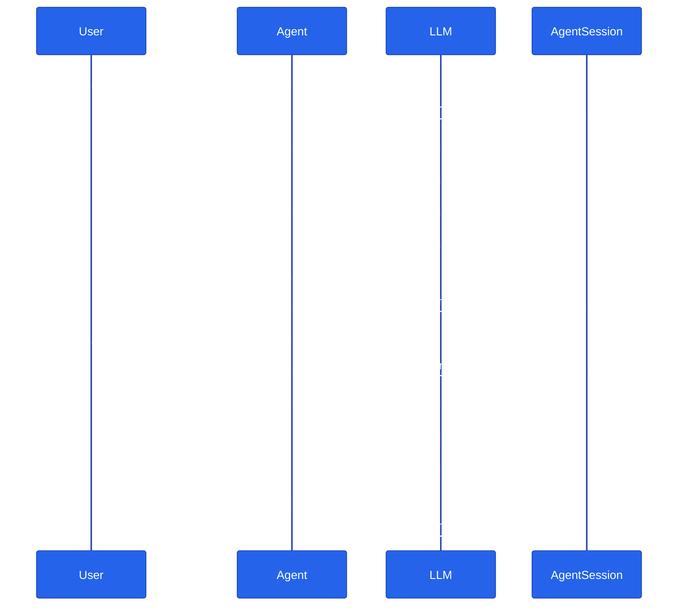

# Chapter 03 — Streaming and Multi-turn

## Why this chapter

Two small upgrades to the Chapter 01 agent:

1. **Streaming** — tokens appear in the terminal as the LLM produces them, instead of all at once when the response is done. For interactive UX this is the difference between "felt broken" and "felt fast". It's exactly what powers the capstone's chat UI: the orchestrator's `/api/chat/stream` endpoint sends the same kind of incremental chunks over SSE as a customer watches an answer about their order status build up word by word.
2. **Multi-turn** — a *session* (`AgentSession` in both languages) carries conversation history between `.run()` calls. Ask *"What's Python?"* and then *"How old is it?"* — the second turn resolves "it" correctly because both turns share one session. In the capstone, a shopper asking "is it in stock?" right after "tell me about the wireless headphones" only works because the specialist agent rehydrates that same conversation history.

These are independent concepts, but in practice every interactive chat UI needs both, so we teach them together.

## Prerequisites

- Completed [Chapter 02 — Adding Tools](../02-add-tools/)
- `.env` at the repo root with working credentials (`OPENAI_API_KEY`, or `AZURE_OPENAI_ENDPOINT` / `AZURE_OPENAI_KEY` / `AZURE_OPENAI_DEPLOYMENT`)

## The concept

**Streaming** switches from `agent.run(q)` (one `AgentResponse`, returned after the model finishes) to `agent.run(q, stream=True)` (an async iterator of `AgentResponseUpdate` objects). Each update carries a fragment of text; concatenating them produces the full answer. Nothing about *what* the model returns changes — only how quickly you can start showing it to a user.

**Sessions** are an opaque container of conversation state. Create one, pass it to every `.run(...)` call for that conversation, and the model sees the accumulated history on each turn. Throw it away (or create a new one) to reset context — that's exactly what a "new conversation" button does in a chat UI.

The diagram below shows both: tokens streaming back within a single turn, and history accumulating across two turns of one session.



The second question never mentions Python by name — the agent answers correctly only because the session carried turn 1's history into turn 2's prompt.

## Python

Source: [`python/main.py`](./python/main.py).

```bash
uv sync --project tutorials
uv run --project tutorials python tutorials/03-streaming-and-multiturn/python/main.py
```

Pass questions as arguments for a scripted one-shot run, or omit them for an interactive REPL:

```bash
uv run --project tutorials python tutorials/03-streaming-and-multiturn/python/main.py \
  "What is Python in one line?" \
  "How old is it? Answer with a year only."
```

The core of the chapter is two small functions in `main.py`:

```python
async def stream_answer(
    agent: Agent,
    question: str,
    session: AgentSession,
) -> list[str]:
    chunks: list[str] = []
    async for update in agent.run(question, stream=True, session=session):
        if update.text:
            chunks.append(update.text)
            print(update.text, end="", flush=True)
    print()
    return chunks


async def chat(agent: Agent, questions: list[str]) -> list[list[str]]:
    """Run a scripted multi-turn conversation on one session; return per-turn chunks."""
    session = agent.create_session()
    all_chunks: list[list[str]] = []
    for q in questions:
        print(f"\nQ: {q}")
        print("A: ", end="", flush=True)
        chunks = await stream_answer(agent, q, session)
        all_chunks.append(chunks)
    return all_chunks
```

`session = agent.create_session()` happens once, outside the loop; every question in `chat()` reuses it. `stream_answer` never sees the session's contents directly — it just hands it to `agent.run(..., stream=True, session=session)` and MAF handles reading and appending history around the call.

## .NET

Source: [`dotnet/Program.cs`](./dotnet/Program.cs).

```bash
cd tutorials/03-streaming-and-multiturn/dotnet
dotnet run -- "What is Python in one line?" "How old is it? Answer with a year only."
```

The equivalent shape:

```csharp
public static async Task<List<string>> StreamAnswer(AIAgent agent, string question, AgentSession thread)
{
    var chunks = new List<string>();
    await foreach (var update in agent.RunStreamingAsync(question, thread))
    {
        if (!string.IsNullOrEmpty(update.Text))
        {
            chunks.Add(update.Text);
            Console.Write(update.Text);
        }
    }
    Console.WriteLine();
    return chunks;
}

public static async Task<List<List<string>>> Chat(AIAgent agent, IReadOnlyList<string> questions)
{
    var thread = await agent.CreateSessionAsync();
    var allChunks = new List<List<string>>();
    foreach (var q in questions)
    {
        Console.WriteLine($"\nQ: {q}");
        Console.Write("A: ");
        allChunks.Add(await StreamAnswer(agent, q, thread));
    }
    return allChunks;
}
```

Same behavior as the Python version: one `AgentSession` created before the loop, reused across every `StreamAnswer` call.

## Side-by-side differences

| Aspect | Python | .NET |
|--------|--------|------|
| Stream method | `agent.run(..., stream=True)` — same function, bool flag | `agent.RunStreamingAsync(...)` — separate method |
| Update type | `AgentResponseUpdate` with `.text` property | `AgentResponseUpdate` with `.Text` property |
| Iterator | `async for update in ...` | `await foreach (var update in ...)` |
| Session creation | `agent.create_session()` (sync) | `await agent.CreateSessionAsync()` (async) |
| Session type | `AgentSession` | `AgentSession` |

The .NET side needs `await` on session creation because `CreateSessionAsync` reaches the service for providers that store sessions server-side (e.g., the Assistants API). In Python the same call is synchronous for the in-process case.

## Gotchas

- **Don't print updates with a trailing newline.** `update.text` is meant to be concatenated; each chunk is a partial fragment, not a full line — printing with `end=""` (Python) or `Console.Write` (.NET) is deliberate, not an oversight.
- **One session per conversation.** Creating a new session every turn silently degrades you back to single-turn behavior. That's sometimes what you want (a new user → a fresh session), but it's easy to do by accident inside a loop.
- **`update.text` can be empty.** Some updates carry tool-call information or metadata only. Skip empty strings when printing or accumulating.
- **Custom `BaseChatClient` subclasses must use `_build_response_stream`, not a bare `ResponseStream(...)`.** This chapter's `LLM_PROVIDER=replay` mode runs through `ReplayChatClient` (`tutorials/_shared/replay_client.py`), a `BaseChatClient` subclass. Its `_inner_get_response` returns `self._build_response_stream(_gen())` rather than constructing `ResponseStream(_gen())` directly — skipping `_build_response_stream` wires no finalizer, which works for a plain `async for update in agent.run(stream=True)` loop but breaks any MAF-internal caller that needs `ResponseStream.get_final_response()` (e.g., an `AgentExecutor` inside a `WorkflowBuilder`). If you write your own chat client for testing or replay, use `_build_response_stream`.
- **.NET `AgentSession` disposal.** Not shown above for brevity — in production, wrap creation in `await using` to release resources deterministically.

## Tests

```bash
# Python — unit tests against a streaming-capable canned client, a replay
# test with a committed fixture, and a real-LLM integration test.
uv run --project tutorials pytest tutorials/03-streaming-and-multiturn/python/tests -v

# .NET — integration tests only (streaming/session behavior is hard to fake
# without reimplementing MAF internals), skip cleanly without credentials.
cd tutorials/03-streaming-and-multiturn/dotnet
dotnet test tests/Streaming.Tests.csproj
```

`python/tests/test_streaming.py` covers: streaming yields multiple chunks, chunks concatenate to the full answer, a second turn's message list is longer than the first (proving the session accumulated history), and a replay-fixture test that asserts the second turn resolves "it" to Python without a live LLM call. `dotnet/tests/StreamingTests.cs` covers the same multi-turn/streaming assertions plus one proving two separate sessions don't share context — all three run only when real credentials are present in `.env`.

## How this shows up in the capstone

- [`agents/python/shared/agent_host.py:87`](../../agents/python/shared/agent_host.py) — `_run_agent_native_stream` (lines 87-115) is the production version of `stream_answer` above: it drives `agent.run(messages, stream=True, options=...)` and yields text chunks the same way, then calls `stream.get_final_response()` once the generator is exhausted to pick up usage/grounding metadata.
- [`agents/python/shared/session.py:224`](../../agents/python/shared/session.py) — `session_from_id` is the production version of `agent.create_session()`: it builds an `AgentSession` bound to a conversation row so a specialist agent can rehydrate a shopper's prior turns from Postgres instead of the in-process session this chapter uses.

## What's next

- Next chapter: [Chapter 04 — Sessions and Memory](../04-sessions/)
- Full source: [`python/`](./python/) · [`dotnet/`](./dotnet/)
- [MAF docs — Running agents](https://learn.microsoft.com/en-us/agent-framework/agents/running-agents)
