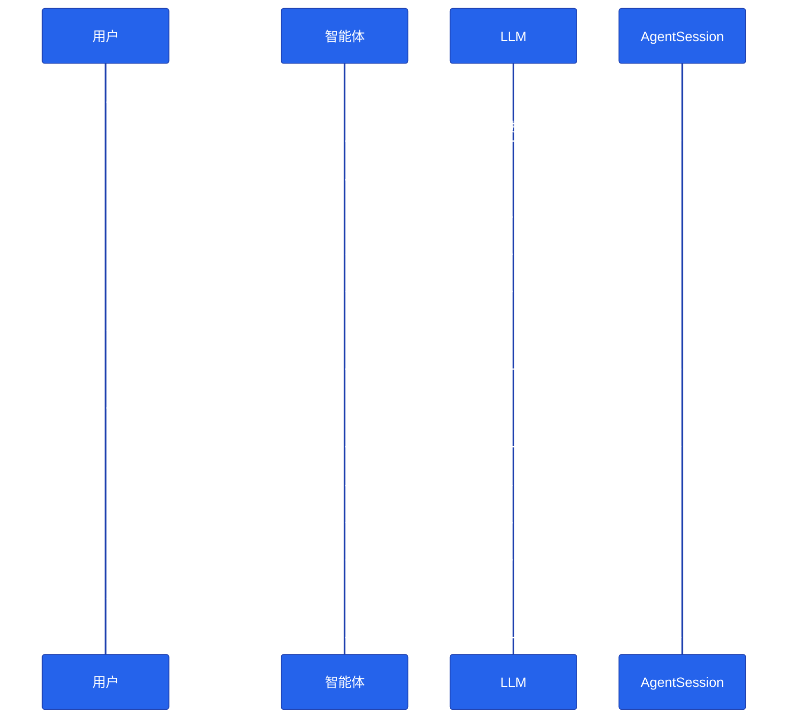

# 第 03 章 · 流式输出与多轮对话

[项目首页](../../README.md) · [教程总览](../README.md) · [术语表](../_shared/jargon-glossary.md)

对第 01 章的智能体做两处小升级：让 token 在生成的**过程中**逐块出现，并让一次对话的历史在多次 `run()` 之间延续。

## 本章动机

两处对第 01 章智能体的小升级：

1. **流式输出** —— token 在 LLM 产出时立即出现在终端，而不是等响应完成才一次性吐出。对交互体验来说，这是「感觉坏了」与「感觉很快」的差别。完整项目的聊天界面正是靠它实现的：编排服务的 `/api/chat/stream` 端点通过 SSE 发送同类的增量分片，用户就能看着关于订单状态的回答一个词一个词地长出来。
2. **多轮对话** —— 一个**会话（session）**（Python 中的 `AgentSession`）在多次 `.run()` 调用之间承载对话历史。先问「Python 是什么？」，再问「它多大了？」—— 第二轮的「它」能被正确解析，正是因为两轮共享同一个会话。在完整项目中，顾客刚问完「介绍一下那款无线耳机」，紧接着问「有货吗」，之所以能成立，就是因为专家智能体重建了同一段对话历史。

这是两个彼此独立的概念，但实践中每个交互式聊天界面都需要它们，所以我们放在一起讲。

## 前置条件

- 已完成 [第 02 章 · 添加工具](../02-add-tools/)
- 仓库根目录的 `.env` 中有可用凭据（`OPENAI_API_KEY`，或 `AZURE_OPENAI_ENDPOINT` / `AZURE_OPENAI_KEY` / `AZURE_OPENAI_DEPLOYMENT`）

## 核心概念

**流式输出** 把 `agent.run(q)`（返回一个 `AgentResponse`，等模型全部完成）换成 `agent.run(q, stream=True)`（返回 `AgentResponseUpdate` 的异步迭代器）。每个 update 携带一小段文本，把它们拼接起来就是完整答案。模型**返回什么**没有任何变化 —— 变的只是你能多快开始把它展示给用户。

**会话** 是一个承载对话状态的不透明容器。创建一个，把它传给该对话的每一次 `.run(...)` 调用，模型就能在每一轮看到累积的历史。把它丢掉（或新建一个）就等于重置上下文 —— 这正是聊天界面里「新建对话」按钮所做的事。

下图同时展示两者：单个轮次内 token 的流式返回，以及一个会话在两个轮次之间累积历史。


```mermaid
%%{init: {'theme':'base', 'themeVariables': {
  'primaryColor': '#2563eb','primaryTextColor': '#ffffff','primaryBorderColor': '#1e40af',
  'lineColor': '#64748b','secondaryColor': '#f59e0b','tertiaryColor': '#10b981',
  'background': 'transparent'}}}%%
sequenceDiagram
  participant U as 用户
  participant A as 智能体
  participant L as LLM
  participant S as AgentSession

  U->>A: run("Python 是什么？", session)
  A->>S: 读取历史（空）
  A->>L: 提示词 + 历史
  L-->>A: token
  L-->>A: token
  L-->>A: token
  A-->>U: 流式分片
  A->>S: 追加第 1 轮（问 + 答）

  U->>A: run("它多大了？", session)
  A->>S: 读取历史（第 1 轮）
  A->>L: 提示词 + 完整历史
  L-->>A: token
  L-->>A: token
  A-->>U: 流式分片（"1991"）
  A->>S: 追加第 2 轮（问 + 答）
```

第二个问题从未提到「Python」这个名字 —— 智能体之所以答得对，只是因为会话把第 1 轮的历史带进了第 2 轮的提示词。

## Python

源码：[`python/main.py`](./python/main.py)。

```bash
uv sync --project tutorials
uv run --project tutorials python tutorials/03-streaming-and-multiturn/python/main.py
```

把问题作为参数传入即可做一次脚本化的单轮运行；不传则进入交互式 REPL：

```bash
uv run --project tutorials python tutorials/03-streaming-and-multiturn/python/main.py \
  "What is Python in one line?" \
  "How old is it? Answer with a year only."
```

本章的核心是 `main.py` 里的两个小函数：

```python
async def stream_answer(
    agent: Agent,
    question: str,
    session: AgentSession,
) -> list[str]:
    chunks: list[str] = []
    async for update in agent.run(question, stream=True, session=session):
        if update.text:
            chunks.append(update.text)
            print(update.text, end="", flush=True)
    print()
    return chunks


async def chat(agent: Agent, questions: list[str]) -> list[list[str]]:
    """Run a scripted multi-turn conversation on one session; return per-turn chunks."""
    session = agent.create_session()
    all_chunks: list[list[str]] = []
    for q in questions:
        print(f"\nQ: {q}")
        print("A: ", end="", flush=True)
        chunks = await stream_answer(agent, q, session)
        all_chunks.append(chunks)
    return all_chunks
```

`session = agent.create_session()` 只在循环之外执行一次；`chat()` 里的每个问题都复用它。`stream_answer` 从不直接看到会话的内容 —— 它只是把会话交给 `agent.run(..., stream=True, session=session)`，由 MAF 负责在这次调用前后读写历史。

## 常见坑

- **打印 update 时不要带换行。** `update.text` 是供拼接用的；每个分片都是局部片段，不是一整行 —— 用 `end=""` 打印是刻意的，不是疏忽。
- **一个对话对应一个会话。** 每一轮都新建会话，会让行为静默退化成单轮。有时这确实是你想要的（新用户 → 新会话），但在循环里很容易无意间这么做。
- **`update.text` 可能为空。** 有些 update 只携带工具调用信息或元数据。打印或累积时要跳过空字符串。
- **自定义 `BaseChatClient` 子类必须用 `_build_response_stream`，而不是裸的 `ResponseStream(...)`。** 本章的 `LLM_PROVIDER=replay` 模式会走 `ReplayChatClient`（`tutorials/_shared/replay_client.py`），它是一个 `BaseChatClient` 子类。它的 `_inner_get_response` 返回 `self._build_response_stream(_gen())`，而不是直接构造 `ResponseStream(_gen())` —— 跳过 `_build_response_stream` 就不会接上 finalizer，这对一个朴素的 `async for update in agent.run(stream=True)` 循环没问题，但会破坏任何需要 `ResponseStream.get_final_response()` 的 MAF 内部调用方（例如 `WorkflowBuilder` 里的 `AgentExecutor`）。如果你要为自己的测试或回放写 chat client，请使用 `_build_response_stream`。

## 测试

```bash
uv run --project tutorials pytest tutorials/03-streaming-and-multiturn/python/tests -v
```

`python/tests/test_streaming.py` 覆盖：流式输出产出多个分片、分片拼接后等于完整答案、第二轮的消息列表比第一轮更长（证明会话累积了历史），以及一个回放 fixture 测试，它断言第二轮能把「它」解析为 Python，且不需要真实 LLM 调用。

## 在完整项目中的落点

- [`agents/python/shared/agent_host.py:82`](../../agents/python/shared/agent_host.py) —— `_run_agent_native_stream`（第 87–115 行）是上面 `stream_answer` 的生产版本：它以同样方式驱动 `agent.run(messages, stream=True, options=...)` 并逐块产出文本，然后在生成器耗尽后调用 `stream.get_final_response()`，以取回用量与核验元数据。
- [`agents/python/shared/session.py:201`](../../agents/python/shared/session.py) —— `session_from_id` 是 `agent.create_session()` 的生产版本：它构造一个绑定到某条会话记录的 `AgentSession`，使专家智能体能从 Postgres 重建顾客此前的轮次，而不是使用本章这种进程内会话。

## 下一步

- 下一章：[第 04 章 · 会话与记忆](../04-sessions/)
- 完整源码：[`python/`](./python/)
- [MAF 官方文档 —— 运行智能体](https://learn.microsoft.com/en-us/agent-framework/agents/running-agents)
