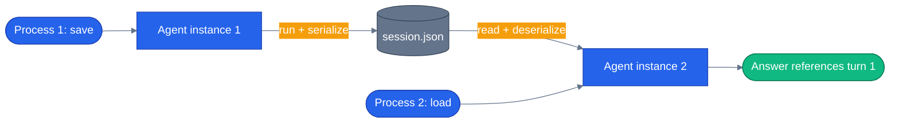

# Chapter 04 — Sessions

## Why this chapter

Chapter 03 reused a session inside one process. That's fine for a REPL, not fine for anything that restarts — HTTP servers, background jobs, mobile clients reconnecting.

A MAF `AgentSession` is a snapshot of everything the agent remembers about a conversation. Serialize it, write it to disk, reload it in a new process, and the agent picks up right where it left off. This chapter's demo is deliberately small — two CLI invocations of the same script, in separate process runs, proving state survived in between. The capstone app does the same thing at a larger scale: every `/api/chat` request rehydrates conversation history from Postgres rather than keeping it in memory between requests.

## Prerequisites

- Completed [Chapter 03 — Streaming and Multi-turn](../03-streaming-and-multiturn/)
- Repo-root `.env` with a working LLM provider (`OPENAI_API_KEY`, or `AZURE_OPENAI_ENDPOINT` + `AZURE_OPENAI_KEY` + `AZURE_OPENAI_DEPLOYMENT`)

## The concept

Both languages expose the same two primitives, framed slightly differently:

- **Python**: `session.to_dict()` returns a JSON-able dict; `AgentSession.from_dict(data)` rehydrates it. Messages land in `session.state` because the agent is built with `context_providers=[InMemoryHistoryProvider()]` — without that provider, the session round-trips but carries no conversation.
- **.NET**: `agent.SerializeSessionAsync(session)` returns a `JsonElement`; `agent.DeserializeSessionAsync(jsonElement)` rehydrates it. History handling is built into the agent, so there's no separate provider to wire up.

Either way, the agent never touches the filesystem itself. Your code owns the disk I/O — read the file if it exists, hand the bytes to MAF to deserialize, run the turn, ask MAF to serialize the result, write it back. MAF owns the *shape* of what gets serialized; you own where it lives.



Two separate `Agent`/`AIAgent` objects, two separate process invocations — the only thing bridging them is the file on disk. That's the property this chapter proves: the session, not the process, is what remembers.

## Python

Run from the repo root using the shared `tutorials/` uv project (one `uv sync` covers every chapter):

```bash
uv sync --project tutorials
uv run --project tutorials python tutorials/04-sessions/python/main.py save "Remember: I want to buy SKU-4471."
uv run --project tutorials python tutorials/04-sessions/python/main.py load "What did I say I wanted to buy? Answer with only the SKU."
```

Source: [`python/main.py`](./python/main.py). The agent is built with a history-carrying context provider:

```python
def build_agent(client: object | None = None) -> Agent:
    return Agent(
        client or _default_client(),
        instructions=INSTRUCTIONS,
        name="stateful-agent",
        # InMemoryHistoryProvider turns AgentSession into a conversation carrier.
        context_providers=[InMemoryHistoryProvider()],
    )
```

And the load/run/save cycle:

```python
async def ask_and_save(agent: Agent, question: str, path: pathlib.Path) -> str:
    """Run one turn on a fresh-or-loaded session, then persist the session to disk."""
    session = _load_or_new(agent, path)
    response = await agent.run(question, session=session)
    _save(session, path)
    return response.text


def _load_or_new(agent: Agent, path: pathlib.Path) -> AgentSession:
    if path.exists():
        data = json.loads(path.read_text())
        return AgentSession.from_dict(data)
    return agent.create_session()


def _save(session: AgentSession, path: pathlib.Path) -> None:
    path.write_text(json.dumps(session.to_dict(), indent=2, default=str))
```

Note that `main.py`'s `save`/`load` argument is cosmetic — both branches call the exact same `ask_and_save()`. The behavior that actually differs is whether `session.json` exists yet: the first invocation creates it, the second finds it and loads prior turns. There's also a third mode, `reset`, that deletes `session.json` so you can start over without hunting for the file by hand.

## .NET

```bash
cd tutorials/04-sessions/dotnet
dotnet run -- save "Remember: I want to buy SKU-4471."
dotnet run -- load "What did I say I wanted to buy? Answer with only the SKU."
```

Source: [`dotnet/Program.cs`](./dotnet/Program.cs). Same load/run/save shape, async because `SerializeSessionAsync`/`DeserializeSessionAsync` support providers that hit a backing service:

```csharp
public static async Task<(string Answer, string Path)> AskAndSave(
    AIAgent agent, string question, string sessionPath)
{
    var session = await LoadOrNew(agent, sessionPath);
    var response = await agent.RunAsync(question, session);
    await Save(agent, session, sessionPath);
    return (response.Text, sessionPath);
}

public static async Task<AgentSession> LoadOrNew(AIAgent agent, string path)
{
    if (!File.Exists(path))
    {
        return await agent.CreateSessionAsync();
    }
    using var stream = File.OpenRead(path);
    using var doc = await JsonDocument.ParseAsync(stream);
    return await agent.DeserializeSessionAsync(doc.RootElement);
}

public static async Task Save(AIAgent agent, AgentSession session, string path)
{
    var element = await agent.SerializeSessionAsync(session);
    var json = JsonSerializer.Serialize(element, new JsonSerializerOptions { WriteIndented = true });
    await File.WriteAllTextAsync(path, json);
}
```

`BuildAgent()` calls `chatClient.AsAIAgent(instructions: Instructions, name: "stateful-agent")` with no explicit history provider — history tracking is bundled into the agent itself on the .NET side. Same observable behavior as Python: run it twice, and the second run answers from what the first run said.

## Side-by-side differences

| Aspect | Python | .NET |
|--------|--------|------|
| Serialize | `session.to_dict()` → `dict` | `agent.SerializeSessionAsync(session)` → `JsonElement` |
| Deserialize | `AgentSession.from_dict(data)` | `agent.DeserializeSessionAsync(jsonElement)` |
| Who owns history | `InMemoryHistoryProvider` (a context provider) writes messages into `session.state` | Built into the agent; no extra provider needed |
| JSON work | `json.dumps(...)` / `json.loads(...)` | `JsonSerializer.Serialize(...)` / `JsonDocument.Parse(...)` |
| New session | `agent.create_session()` | `await agent.CreateSessionAsync()` |

The .NET side bundles history handling into the agent, so you don't register an explicit provider — session and agent are tightly coupled. Python keeps the two loosely coupled: swap `InMemoryHistoryProvider` for something backed by a file or a database (as the capstone does — see below) without touching the agent's construction.

## Gotchas

- **Don't mix agents across sessions.** A session serialized from one agent's configuration isn't guaranteed to deserialize cleanly into a differently-configured agent. Treat the session as opaque: write it, load it, hand it back. Don't inspect or hand-edit the JSON.
- **Size grows unbounded.** Every turn adds to the serialized session. For long-lived conversations you need eviction (summarize-and-replace older messages) — out of scope here, related to *state and checkpointing* in [Chapter 18](../18-state-and-checkpoints/).
- **Python: forgetting the context provider is silent.** Drop `context_providers=[InMemoryHistoryProvider()]` from `build_agent()` and `session.json` still gets written and still round-trips its `session_id` — it just won't carry any messages. The follow-up turn behaves like a brand-new conversation even though the file exists and looks populated.
- **.NET: don't forget `await`** on `DeserializeSessionAsync` and `SerializeSessionAsync` — both are async so providers backed by a real service (not just a local file) can do I/O.
- **`save`/`load` is a naming convention, not a code path.** Both modes call the same `ask_and_save()` / `AskAndSave()`. If you're debugging why "load" isn't loading anything, check whether `session.json` actually exists first — a missing file silently falls back to a fresh session regardless of which mode you typed.

## Tests

```bash
# Python
uv run --project tutorials pytest tutorials/04-sessions/python/tests -v

# .NET
cd tutorials/04-sessions/dotnet
dotnet test tests/Sessions.Tests.csproj
```

`tutorials/04-sessions/python/tests/test_sessions.py` covers, structurally:

1. **Unit tests against `AgentSession` directly** — round-tripping `session_id` through a dict, confirming `to_dict()` is JSON-serializable, round-tripping nested `state` values, and confirming two fresh sessions get distinct ids. No LLM involved.
2. **A replay test** (`test_replay_session_persists_across_fresh_agent_instances`) that plays back committed fixtures in `tests/fixtures/replay/` — no network or credentials required, safe for CI.
3. **A real-LLM integration test** (`test_session_persists_across_fresh_agent_instances`), skipped automatically when `.env` has no usable key — builds two separate `Agent` instances and confirms the second one answers from what the first one was told.

`tutorials/04-sessions/dotnet/tests/SessionsTests.cs` mirrors this: `Session_Persists_Across_Fresh_Agent_Instances` and `Missing_Session_File_Starts_A_Fresh_Conversation` are tagged `[Trait("Category", "Integration")]`; `LoadOrNew_Returns_Fresh_Session_When_File_Missing` isn't tagged but still checks for credentials before running. All three no-op with a console message rather than failing when no LLM key is configured.

## How this shows up in the capstone

The chapter's file-backed load/run/save loop is a good local-dev shape, but the capstone's orchestrator reads its conversation history through a pluggable abstraction instead: `agents/python/shared/session.py` defines `HistoryProvider` backends selected by `settings.MAF_SESSION_BACKEND` — `PostgresSessionHistoryProvider` (production, backed by the `messages`/`conversations` tables), `FileSessionHistoryProvider` (local dev, JSONL under `settings.MAF_SESSION_DIR`), and `InMemorySessionHistoryProvider` (tests). `get_history_provider()` at `agents/python/shared/session.py:201` picks the backend by name — same idea as this chapter's `_load_or_new`/`LoadOrNew`, just with three interchangeable backing stores instead of one file.

The orchestrator calls it directly: `agents/python/orchestrator/routes/chat.py:160` reads `history = await get_history_as_dicts(get_history_provider(pool=pool), conversation_id)` before inserting the current turn's user message — the read has to happen before the insert, or the just-written row would get counted twice once `shared/agent_host.py` appends the current message itself (see the comment right above that line in `chat.py`). Message *writes*, unlike this chapter's single `_save()` call, stay as each route's own richer `INSERT` — a generic `HistoryProvider.save_messages()` only persists role/content, not the `agent_name`/`agents_involved`/`metadata` the timeline UI needs.

## What's next

- Next chapter: [Chapter 05 — Context Providers](../05-context-providers/)
- Full source: [`python/`](./python/) · [`dotnet/`](./dotnet/)
- Shared: [Mermaid style guide](../_shared/mermaid-style-guide.md) · [Jargon glossary](../_shared/jargon-glossary.md)
