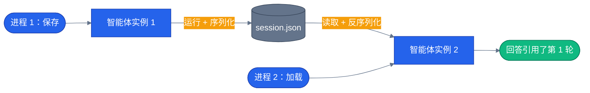

# 第 04 章 · 会话持久化

[项目首页](../../README.md) · [教程总览](../README.md) · [术语表](../_shared/jargon-glossary.md)

把会话序列化到磁盘，在另一个进程里重新加载 —— 证明「记得住」的是会话，而不是进程。

## 本章动机

第 03 章在同一个进程内复用了会话。这对 REPL 够用，但对任何会重启的东西都不够 —— HTTP 服务、后台任务、断线重连的移动客户端。

一个 MAF `AgentSession` 是「智能体关于某段对话所记得的一切」的快照。把它序列化、写到磁盘、在新进程里重新加载，智能体就能从断点继续。本章的演示刻意做得很小 —— 同一脚本的两次 CLI 调用，分属两次进程运行，以此证明状态在两者之间存活了下来。完整项目在更大尺度上做同一件事：每个 `/api/chat` 请求都从 Postgres 重建对话历史，而不是在请求之间把它留在内存里。

## 前置条件

- 已完成 [第 03 章 · 流式输出与多轮对话](../03-streaming-and-multiturn/)
- 仓库根目录的 `.env` 中有一个可用的 LLM 提供方（`OPENAI_API_KEY`，或 `AZURE_OPENAI_ENDPOINT` + `AZURE_OPENAI_KEY` + `AZURE_OPENAI_DEPLOYMENT`）

## 核心概念

两个基本原语：`session.to_dict()` 返回可 JSON 化的字典，`AgentSession.from_dict(data)` 把它重建回来。消息之所以会落到 `session.state` 里，是因为智能体是用 `context_providers=[InMemoryHistoryProvider()]` 构造的 —— **没有这个提供器，会话虽然能往返序列化，却不会携带任何对话内容。**

无论如何，智能体自己从不接触文件系统。**磁盘 I/O 归你的代码管** —— 文件存在就读它，把字节交给 MAF 反序列化，运行这一轮，再请 MAF 把结果序列化，最后写回文件。MAF 负责序列化结果的**形态**；你负责它**存在哪里**。


```mermaid
%%{init: {'theme':'base', 'themeVariables': {
  'primaryColor': '#2563eb','primaryTextColor': '#ffffff','primaryBorderColor': '#1e40af',
  'lineColor': '#64748b','secondaryColor': '#f59e0b','tertiaryColor': '#10b981',
  'background': 'transparent'}}}%%
flowchart LR
  classDef core     fill:#2563eb,stroke:#1e40af,color:#ffffff
  classDef external fill:#f59e0b,stroke:#b45309,color:#000000
  classDef success  fill:#10b981,stroke:#047857,color:#ffffff
  classDef infra    fill:#64748b,stroke:#334155,color:#ffffff

  turn1([进程 1：保存])
  agent1[智能体实例 1]
  disk[(session.json)]
  turn2([进程 2：加载])
  agent2[智能体实例 2]
  answer([回答引用了第 1 轮])

  turn1 --> agent1
  agent1 -- "运行 + 序列化" --> disk
  disk -- "读取 + 反序列化" --> agent2
  turn2 --> agent2
  agent2 --> answer

  class agent1 core
  class agent2 core
  class disk infra
  class answer success
```

两个彼此独立的 `Agent` 对象、两次独立的进程调用 —— 唯一的桥梁是磁盘上那个文件。这正是本章要证明的性质：**记住事情的是会话，不是进程。**

## Python

在仓库根目录运行，共用 `tutorials/` 这一个 uv 项目（一次 `uv sync` 覆盖全部章节）：

```bash
uv sync --project tutorials
uv run --project tutorials python tutorials/04-sessions/python/main.py save "Remember: I want to buy SKU-4471."
uv run --project tutorials python tutorials/04-sessions/python/main.py load "What did I say I wanted to buy? Answer with only the SKU."
```

源码：[`python/main.py`](./python/main.py)。智能体带着一个承载历史的上下文提供器来构造：

```python
def build_agent(client: object | None = None) -> Agent:
    return Agent(
        client or _default_client(),
        instructions=INSTRUCTIONS,
        name="stateful-agent",
        # InMemoryHistoryProvider turns AgentSession into a conversation carrier.
        context_providers=[InMemoryHistoryProvider()],
    )
```

以及「加载 / 运行 / 保存」的循环：

```python
async def ask_and_save(agent: Agent, question: str, path: pathlib.Path) -> str:
    """Run one turn on a fresh-or-loaded session, then persist the session to disk."""
    session = _load_or_new(agent, path)
    response = await agent.run(question, session=session)
    _save(session, path)
    return response.text


def _load_or_new(agent: Agent, path: pathlib.Path) -> AgentSession:
    if path.exists():
        data = json.loads(path.read_text())
        return AgentSession.from_dict(data)
    return agent.create_session()


def _save(session: AgentSession, path: pathlib.Path) -> None:
    path.write_text(json.dumps(session.to_dict(), indent=2, default=str))
```

注意 `main.py` 的 `save` / `load` 参数只是**名义上的** —— 两个分支调用的是完全相同的 `ask_and_save()`。真正不同的，是 `session.json` 此刻是否已经存在：第一次调用创建它，第二次找到它并加载此前的轮次。此外还有一个 `reset` 模式，它会删除 `session.json`，让你不必手工去找那个文件就能从头开始。

## 常见坑

- **不要跨会话混用智能体。** 由某个智能体配置序列化出来的会话，不保证能干净地反序列化进一个配置不同的智能体。把会话当作不透明对象：写它、读它、原样交回。不要检视，也不要手工编辑那段 JSON。
- **体积会无界增长。** 每一轮都会追加进序列化后的会话。对长期存续的对话，你需要淘汰策略（把较早的消息摘要化后替换）—— 这超出本章范围，与 [第 18 章](../18-state-and-checkpoints/) 的「状态与检查点」相关。
- **Python：忘记上下文提供器是静默的。** 从 `build_agent()` 里去掉 `context_providers=[InMemoryHistoryProvider()]`，`session.json` 依然会被写入，`session_id` 也依然能往返 —— 只是它不会携带任何消息。后续轮次的行为会像一段全新对话，尽管那个文件存在、看起来也装满了东西。
- **`save` / `load` 是命名约定，不是代码路径。** 两个模式调用同一个 `ask_and_save()`。如果你在排查「为什么 load 什么都没加载」，先检查 `session.json` 是否真的存在 —— 文件缺失时会静默回退到全新会话，与你敲的是哪个模式无关。

## 测试

```bash
uv run --project tutorials pytest tutorials/04-sessions/python/tests -v
```

`python/tests/test_sessions.py` 在结构上覆盖：

1. **直接针对 `AgentSession` 的单元测试** —— 让 `session_id` 经由字典往返、确认 `to_dict()` 可 JSON 序列化、让嵌套的 `state` 值往返，以及确认两个新会话拿到互不相同的 id。不涉及 LLM。
2. **回放测试**（`test_replay_session_persists_across_fresh_agent_instances`）—— 回放 `tests/fixtures/replay/` 下已提交的 fixture，无需网络与凭据，可安全用于 CI。
3. **真实 LLM 集成测试**（`test_session_persists_across_fresh_agent_instances`）—— 当 `.env` 中没有可用密钥时自动跳过；它构造两个彼此独立的 `Agent` 实例，并确认第二个能依据第一个被告知的内容作答。

## 在完整项目中的落点

本章这种「文件支撑的加载 / 运行 / 保存」循环是很好的本地开发形态，但完整项目的编排器改为通过一个可插拔的抽象读取对话历史：`agents/python/shared/session.py` 定义了由 `settings.MAF_SESSION_BACKEND` 选择的 `HistoryProvider` 后端 —— `PostgresSessionHistoryProvider`（生产环境，由 `messages` / `conversations` 表支撑）、`FileSessionHistoryProvider`（本地开发，`settings.MAF_SESSION_DIR` 下的 JSONL），以及 `InMemorySessionHistoryProvider`（测试）。`agents/python/shared/session.py:180` 的 `get_history_provider()` 按名称挑选后端 —— 思路与本章的 `_load_or_new` 相同，只是把「一个文件」换成了「三种可互换的存储后端」。

编排器直接调用它：`agents/python/orchestrator/routes/chat.py:164` 在插入本轮用户消息**之前**执行 `history = await get_history_as_dicts(get_history_provider(pool=pool), conversation_id)` —— 读取必须先于插入，否则一旦 `shared/agent_host.py` 自己追加了当前消息，刚写入的那一行就会被重复计算（参见 `chat.py` 中该行正上方的注释）。消息的**写入**则与本章的单个 `_save()` 调用不同，仍保留为各路由自己更丰富的 `INSERT` —— 通用的 `HistoryProvider.save_messages()` 只持久化角色与内容，而时间线界面还需要 `agent_name` / `agents_involved` / `metadata`。

## 下一步

- 下一章：[第 05 章 · 上下文提供器](../05-context-providers/)
- 完整源码：[`python/`](./python/)
- 共享材料：[Mermaid 风格指南](../_shared/mermaid-style-guide.md) · [术语表](../_shared/jargon-glossary.md)
