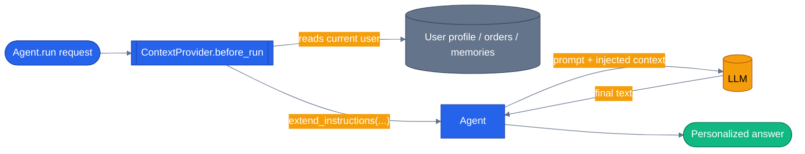

# Chapter 05 — Context Providers

## Why this chapter

You want your agent to know *who* it's talking to without hard-coding "the user is Alice" into the system prompt. That doesn't scale past a demo — the moment you have more than one user, string-formatting a prompt per request turns into ad-hoc glue code scattered across every agent. A `ContextProvider` gives you a clean hook instead: run some code before every LLM call, add instructions (or messages, or tools) to the context, and let the framework wire it in. One provider per concern, composed in a list, reused across every agent that needs it.

This is exactly the primitive the capstone's specialist agents run on. Every one of the six agents (product discovery, orders, pricing, reviews, inventory, support) is built with a `context_providers=[...]` argument that injects the logged-in user's profile, recent orders, and long-term memories before the LLM ever sees the request — see `agents/python/shared/context_providers.py` for the real implementation.

## Prerequisites

- Completed [Chapter 04 — Sessions](../04-sessions/)
- Repo-root `.env` with working LLM credentials (`OPENAI_API_KEY`, or the `AZURE_OPENAI_*` set)

## The concept

**Python**: subclass `agent_framework.ContextProvider` and override `before_run(*, agent, session, context, state)`. Call `context.extend_instructions("source-id", "...")` to append to the system prompt for that run only, and optionally stash structured data in the `state` dict so your tools (Chapter 02's pattern) can read it too. Register the provider via `Agent(..., context_providers=[...])`.

**.NET**: subclass `Microsoft.Agents.AI.AIContextProvider` and override the protected `ProvideAIContextAsync(InvokingContext, CancellationToken)`. Return an `AIContext { Instructions = "..." }`. Register via `ChatClientAgentOptions.AIContextProviders`.

Both fire on every `agent.run(...)` / `agent.RunAsync(...)` — before the request reaches the LLM. The provider is free to read from a database, call an API, check a feature flag, whatever the current request needs. It's the same shape as ASP.NET middleware or an Express interceptor, just scoped to "the next LLM call" instead of "the next HTTP request."



The provider never talks to the LLM directly — it only shapes what the agent sends on the *next* call. The LLM sees a single, already-composed system prompt; it has no idea a provider ran.

## Python

Run from the repo root using the shared `tutorials/` uv project (one `uv sync` covers every chapter):

```bash
uv sync --project tutorials
uv run --project tutorials python tutorials/05-context-providers/python/main.py
# Uses the default user (Alice). Pass email / name / tier to swap:
uv run --project tutorials python tutorials/05-context-providers/python/main.py bob@example.com Bob gold
```

The chapter's `UserProfileProvider` in [`python/main.py`](./python/main.py):

```python
class UserProfileProvider(ContextProvider):
    """Injects the current user's profile as additional instructions for each run."""

    def __init__(self, *, email: str, name: str, loyalty_tier: str = "silver") -> None:
        super().__init__(source_id="user-profile")
        self.email = email
        self.name = name
        self.loyalty_tier = loyalty_tier

    async def before_run(
        self,
        *,
        agent: Any,
        session: Any,
        context: Any,
        state: dict[str, Any],
    ) -> None:
        context.extend_instructions(
            "user-profile",
            f"Current user: {self.name} ({self.email}). Loyalty tier: {self.loyalty_tier}.",
        )
        state["user"] = {"email": self.email, "name": self.name, "loyalty_tier": self.loyalty_tier}
```

`build_agent()` wires it in with `context_providers=[provider]`, and `main()` reads email/name/tier from `sys.argv` so you can run the same script for different users without touching code. `main.py` also supports `LLM_PROVIDER=replay` (a canned, no-network chat client the tests use for CI) alongside `openai` and `azure` — see `_default_client()` for the full provider switch.

The `source_id` argument to both `super().__init__(...)` and `extend_instructions(...)` lets MAF dedupe and debug which provider injected what when several are chained together (as the capstone does — see below).

## .NET

```bash
cd tutorials/05-context-providers/dotnet
dotnet run
```

The equivalent provider in [`dotnet/Program.cs`](./dotnet/Program.cs):

```csharp
public sealed class UserProfileProvider : AIContextProvider
{
    public string Email { get; }
    public string Name { get; }
    public string LoyaltyTier { get; }

    public UserProfileProvider(string email, string name, string loyaltyTier = "silver")
    {
        Email = email;
        Name = name;
        LoyaltyTier = loyaltyTier;
    }

    protected override ValueTask<AIContext> ProvideAIContextAsync(
        InvokingContext context,
        CancellationToken cancellationToken = default)
    {
        return ValueTask.FromResult(new AIContext
        {
            Instructions = $"Current user: {Name} ({Email}). Loyalty tier: {LoyaltyTier}.",
        });
    }
}
```

`BuildAgent()` registers it via `ChatClientAgentOptions.AIContextProviders = new[] { provider }`, and `Program.Main` reads the same email/name/tier positional args from the command line as the Python version, so both sides of the chapter are runnable the same way.

## Side-by-side differences

| Aspect | Python | .NET |
|--------|--------|------|
| Base class | `ContextProvider` | `AIContextProvider` |
| Override point | `before_run(...)` (public) | `ProvideAIContextAsync(...)` (protected) |
| Injecting instructions | `context.extend_instructions(source_id, text)` | `return new AIContext { Instructions = "..." }` |
| Shared state | `state["..."]` dict passed into `before_run` | No equivalent — use DI / a custom service |
| Registration | `Agent(..., context_providers=[...])` | `ChatClientAgentOptions.AIContextProviders = [...]` |
| Also can add | messages, tools, middleware | messages, tools |

## Gotchas

- **Python requires `source_id`** on both `__init__` (via `super().__init__(source_id=...)`) and `extend_instructions(source_id, text)`. Forgetting either raises at instantiation / call time, not silently.
- **.NET's override point is `ProvideAIContextAsync`, not `InvokingAsync`.** `InvokingAsync` is the base class's own pipeline method that calls into your override internally — trying to override it directly is the wrong extension point; use the protected `ProvideAIContextAsync` shown above.
- **Provider state is per-*provider*, not global.** In Python, the `state` dict passed to `before_run` is scoped to whichever provider chain the agent was built with. When you chain multiple providers (as `ECommerceContextProvider` does — see below), later providers can read fields earlier ones set, but only within that same run's `state` dict.
- **The `agents/python/patch_maf.py` MAF packaging workaround is legacy.** It patched an empty `__init__.py` shipped by `agent-framework-core==1.0.0`; the repo now pins a version where that's fixed upstream, so it's a defensive no-op. Tutorial code doesn't use it at all — `tutorials/_shared/maf_bootstrap.py` is the sanctioned bootstrap that tutorials call instead, and it's what `python/main.py` calls before importing `agent_framework`.

## Tests

```bash
uv run --project tutorials pytest tutorials/05-context-providers/python/tests -v
cd tutorials/05-context-providers/dotnet && dotnet test tests/ContextProviders.Tests.csproj
```

`tutorials/05-context-providers/python/tests/test_context_provider.py` covers: a unit test asserting the injected instructions reach a fake `CannedChatClient` (name, tier, email all present), a unit test asserting `before_run` populates `state["user"]` for downstream tools, a unit test proving two independently-built agents never leak each other's user context, a replay-based test that plays back a recorded fixture (no network or credentials needed, safe for CI), and an integration test gated on real LLM credentials being present in `.env`.

`tutorials/05-context-providers/dotnet/tests/ContextProvidersTests.cs` mirrors that shape: three fast unit facts against the provider and `BuildAgent()`, plus two `[Trait("Category", "Integration")]` tests that hit a real LLM and are skipped (not failed) when no credentials are configured.

## How this shows up in the capstone

- `agents/python/shared/context_providers.py:35` — `UserProfileProvider`, the production equivalent of this chapter's example: it queries `users` by the current request's email (`shared.context.current_user_email`) and calls `context.extend_instructions("user-profile", ...)` with name, role, loyalty tier, and total spend.
- The same file also defines `RecentOrdersProvider` and `AgentMemoriesProvider` (composable in the same way), and `ECommerceContextProvider` — a back-compat composite that chains all three and reassembles their output into a single `state["user_context"]` string for the legacy tool loop.
- `agents/python/product_discovery/agent.py:92` — `context_providers=[ECommerceContextProvider()]` is the argument passed into every specialist agent's `Agent(...)` constructor. Every one of the six specialist agents wires context providers the same way this chapter's `build_agent()` does.

## What's next

- Next chapter: [Chapter 06 — Middleware](../06-middleware/) — intercepting the agent run, tool calls, and LLM calls themselves.
- Full source: [`python/`](./python/) · [`dotnet/`](./dotnet/)
- Shared: [Mermaid style guide](../_shared/mermaid-style-guide.md)
