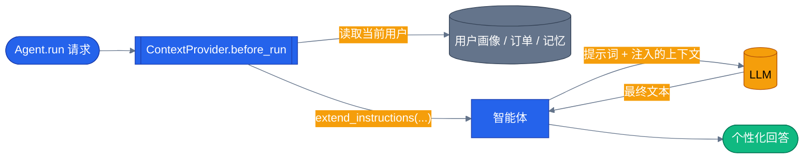

# 第 05 章 · 上下文提供器

[项目首页](../../README.md) · [教程总览](../README.md) · [术语表](../_shared/jargon-glossary.md)

在每次 LLM 调用之前运行你自己的代码，把「当前用户是谁」这类上下文注入进去 —— 而不是把用户信息硬编码进系统提示词。

## 本章动机

你希望智能体知道自己在**跟谁**说话，而不必把「用户是 Alice」硬编码进系统提示词。这撑不过一个演示：一旦用户多于一个，为每个请求拼装提示词就会变成散落在各个智能体里的临时胶水代码。`ContextProvider` 给你一个干净的钩子：在每次 LLM 调用之前跑一段代码，把指令（或消息、或工具）加进上下文，剩下交给框架接线。**一个关注点一个提供器**，用列表组合起来，所有需要它的智能体共用。

这正是完整项目的专家智能体所依赖的原语。六个智能体（商品发现、订单、定价、评价、库存、客服）每一个都用 `context_providers=[...]` 参数构造，在 LLM 看到请求之前注入登录用户的画像、近期订单与长期记忆 —— 真实实现见 `agents/python/shared/context_providers.py`。

## 前置条件

- 已完成 [第 04 章 · 会话持久化](../04-sessions/)
- 仓库根目录的 `.env` 中有可用的 LLM 凭据（`OPENAI_API_KEY`，或 `AZURE_OPENAI_*` 那一组）

## 核心概念

子类化 `agent_framework.ContextProvider`，覆写 `before_run(*, agent, session, context, state)`。调用 `context.extend_instructions("source-id", "...")` 来追加**仅对本次运行生效**的系统提示词内容，并可选择把结构化数据塞进 `state` 字典，好让你的工具（第 02 章的模式）也能读到它。通过 `Agent(..., context_providers=[...])` 注册该提供器。

提供器在每次 `agent.run(...)` 时触发 —— 在请求抵达 LLM **之前**。它可以自由地查数据库、调 API、检查功能开关，一切取决于当前请求需要什么。形态类似 HTTP 中间件或 Express 拦截器，只是作用域从「下一个 HTTP 请求」变成了「下一次 LLM 调用」。


```mermaid
%%{init: {'theme':'base', 'themeVariables': {
  'primaryColor': '#2563eb','primaryTextColor': '#ffffff','primaryBorderColor': '#1e40af',
  'lineColor': '#64748b','secondaryColor': '#f59e0b','tertiaryColor': '#10b981',
  'background': 'transparent'}}}%%
flowchart LR
  classDef core     fill:#2563eb,stroke:#1e40af,color:#ffffff
  classDef external fill:#f59e0b,stroke:#b45309,color:#000000
  classDef infra    fill:#64748b,stroke:#334155,color:#ffffff
  classDef success  fill:#10b981,stroke:#047857,color:#ffffff

  request([Agent.run 请求])
  provider[[ContextProvider.before_run]]
  db[(用户画像 / 订单 / 记忆)]
  agent[智能体]
  llm[(LLM)]
  answer([个性化回答])

  request --> provider
  provider -- "读取当前用户" --> db
  provider -- "extend_instructions(...)" --> agent
  agent -- "提示词 + 注入的上下文" --> llm
  llm -- "最终文本" --> agent
  agent --> answer

  class provider core
  class db infra
  class agent core
  class llm external
  class answer success
```

提供器从不直接与 LLM 对话 —— 它只塑造智能体在**下一次**调用中发送的内容。LLM 看到的是一份已经组装好的系统提示词，它完全不知道有提供器运行过。

## Python

在仓库根目录运行，共用 `tutorials/` 这一个 uv 项目（一次 `uv sync` 覆盖全部章节）：

```bash
uv sync --project tutorials
uv run --project tutorials python tutorials/05-context-providers/python/main.py
# Uses the default user (Alice). Pass email / name / tier to swap:
uv run --project tutorials python tutorials/05-context-providers/python/main.py bob@example.com Bob gold
```

本章 [`python/main.py`](./python/main.py) 中的 `UserProfileProvider`：

```python
class UserProfileProvider(ContextProvider):
    """Injects the current user's profile as additional instructions for each run."""

    def __init__(self, *, email: str, name: str, loyalty_tier: str = "silver") -> None:
        super().__init__(source_id="user-profile")
        self.email = email
        self.name = name
        self.loyalty_tier = loyalty_tier

    async def before_run(
        self,
        *,
        agent: Any,
        session: Any,
        context: Any,
        state: dict[str, Any],
    ) -> None:
        context.extend_instructions(
            "user-profile",
            f"Current user: {self.name} ({self.email}). Loyalty tier: {self.loyalty_tier}.",
        )
        state["user"] = {"email": self.email, "name": self.name, "loyalty_tier": self.loyalty_tier}
```

`build_agent()` 用 `context_providers=[provider]` 把它接进去，`main()` 则从 `sys.argv` 读取邮箱 / 姓名 / 等级，于是同一个脚本不必改代码就能跑不同用户。`main.py` 同样支持 `LLM_PROVIDER=replay`（一个预设的、无需网络的 chat client，测试在 CI 中使用它）。

`super().__init__(...)` 与 `extend_instructions(...)` 都带 `source_id` 参数，这让 MAF 在多个提供器串联（完整项目就是如此 —— 见下文）时能去重，并在调试时分辨出「是谁注入了什么」。

## 常见坑

- **Python 要求 `source_id`。** 既要在 `__init__` 里通过 `super().__init__(source_id=...)` 提供，也要在 `extend_instructions(source_id, text)` 里提供。漏掉任何一处都会在实例化 / 调用时抛错，不会静默通过。
- **提供器状态是「每个提供器」的，不是全局的。** `before_run` 收到的 `state` 字典作用域限于智能体构造时所用的那条提供器链。当你串联多个提供器（`ECommerceContextProvider` 就是这么做的 —— 见下文）时，靠后的提供器能读到靠前提供器写入的字段，但仅限同一次运行的 `state` 字典之内。
- **`agents/python/patch_maf.py` 那个 MAF 打包补丁属于历史遗留。** 它修补的是 `agent-framework-core==1.0.0` 附带的一个空 `__init__.py`；仓库现已锁定在上游已修复的版本，因此它只是一个防御性的空操作。教程代码完全不使用它 —— `tutorials/_shared/maf_bootstrap.py` 才是教程应当调用的受认可引导入口，也是 `python/main.py` 在导入 `agent_framework` 之前所调用的东西。

## 测试

```bash
uv run --project tutorials pytest tutorials/05-context-providers/python/tests -v
```

`python/tests/test_context_provider.py` 覆盖：一个断言注入的指令抵达伪 `CannedChatClient` 的单元测试（姓名、等级、邮箱都在）、一个断言 `before_run` 为下游工具填充了 `state["user"]` 的单元测试、一个证明两个独立构造的智能体绝不会互相泄漏用户上下文的单元测试、一个回放已录制 fixture 的测试（无需网络与凭据，可安全用于 CI），以及一个以真实 LLM 凭据为前提的集成测试。

## 在完整项目中的落点

- `agents/python/shared/context_providers.py:25` —— `UserProfileProvider`，本章示例的生产版本：它按当前请求的邮箱（`shared.context.current_user_email`）查询 `users` 表，并以姓名、角色、会员等级与累计消费调用 `context.extend_instructions("user-profile", ...)`。
- 同一文件还定义了 `RecentOrdersProvider` 与 `AgentMemoriesProvider`（可用同样方式组合），以及 `ECommerceContextProvider` —— 一个向后兼容的复合提供器，把三者串起来，并把它们的输出重新拼装成单个 `state["user_context"]` 字符串，供旧的工具循环使用。
- `agents/python/product_discovery/agent.py:92` —— `context_providers=[ECommerceContextProvider()]` 就是传进每个专家智能体 `Agent(...)` 构造器的那个参数。六个专家智能体全都以本章 `build_agent()` 的方式接入上下文提供器。

## 下一步

- 下一章：[第 06 章 · 中间件](../06-middleware/) —— 拦截智能体运行、工具调用乃至 LLM 调用本身。
- 完整源码：[`python/`](./python/)
- 共享材料：[Mermaid 风格指南](../_shared/mermaid-style-guide.md) · [术语表](../_shared/jargon-glossary.md)
