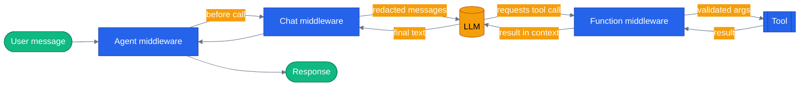

# Chapter 06 — Middleware and the Agent Pipeline

Three layers, one composable pipeline. Wrap every agent run, intercept every tool call, redact PII before the LLM ever sees it — in both Python and .NET, with the same three abstractions.

## Why this chapter

Every agent eventually needs cross-cutting behavior that has nothing to do with its actual job: log every run for observability, block a tool call that violates a business rule, strip a credit-card number out of a user message before it reaches the model. Bolting that logic into the tool functions or the prompt works for a demo and falls apart the moment you have six specialist agents that all need it consistently. Middleware gives you three well-defined interception points — agent run, tool/function call, and chat/LLM call — so this logic lives once, composes predictably, and doesn't require touching business code. This is exactly the shape the capstone app uses: every specialist agent in this repo is built from the same middleware stack, not a bespoke one per agent.

A middleware lets you observe or mutate an agent run at three levels:

- **Agent run** — wrap the entire invocation (before/after logging, span creation, auth checks).
- **Function/tool** — intercept tool calls (approval gates, argument validation, result transformation).
- **Chat/LLM** — transform messages before they reach the provider (PII redaction, caching, model routing).

All three compose in a single pipeline. No surgery on tool code; no prompt string gymnastics.

## Prerequisites

- Completed [Chapter 05 — Context Providers](../05-context-providers/)
- `.env` at the repo root with working credentials (or `LLM_PROVIDER=replay` — see Tests below)

## The concept

Think of it as an onion: the agent-run middleware is the outermost layer (it sees the whole invocation, start to finish), chat middleware wraps every call out to the LLM, and function middleware wraps every call into a tool. A request passes through the outer layer once on the way in and once on the way out; the inner layers can fire multiple times per run (once per LLM round-trip, once per tool call) if the agent loops.



Each layer can short-circuit: function middleware can refuse a tool call without ever invoking it, chat middleware can rewrite the outbound message list, agent middleware can wrap the whole thing in a try/except for a uniform failure log. None of the layers know about each other — they compose because the framework dispatches by type, not because you wired an explicit chain.

## Python

Run from the repo root using the shared `tutorials/` uv project (one `uv sync` covers every chapter):

```bash
uv sync --project tutorials
uv run --project tutorials python tutorials/06-middleware/python/main.py
uv run --project tutorials python tutorials/06-middleware/python/main.py "My card is 4111-1111-1111-1111"
```

Source: [`python/main.py`](./python/main.py). Three middleware classes, one per layer:

```python
class LoggingAgentMiddleware(AgentMiddleware):
    """Observes every agent run. Populates `events` so tests can assert order."""

    def __init__(self) -> None:
        self.events: list[str] = []

    async def process(self, context: AgentContext, call_next: Callable[[], Awaitable[None]]) -> None:
        self.events.append("agent:before")
        await call_next()
        self.events.append("agent:after")


class ArgValidatorMiddleware(FunctionMiddleware):
    """Blocks a canned forbidden city as a stand-in for business-rule validation."""

    FORBIDDEN_CITY = "Atlantis"

    async def process(
        self,
        context: FunctionInvocationContext,
        call_next: Callable[[], Awaitable[None]],
    ) -> None:
        city = context.arguments.get("city", "") if isinstance(context.arguments, dict) else ""
        self.invocations.append(city)
        if city.lower() == self.FORBIDDEN_CITY.lower():
            self.blocked.append(city)
            context.result = "Refused: that city isn't supported."
            return        # short-circuit — real tool never runs
        await call_next()


class PiiRedactionChatMiddleware(ChatMiddleware):
    """Masks credit-card-shaped numbers in outbound user messages."""

    async def process(self, context: ChatContext, call_next: Callable[[], Awaitable[None]]) -> None:
        for message in context.messages:
            for content in message.contents:
                if text := getattr(content, "text", None):
                    redacted, count = _CARD_RE.subn("[REDACTED-CARD]", text)
                    if count:
                        self.redactions += count
                        content.text = redacted
        await call_next()
```

All three are wired in with `Agent(client, ..., middleware=[logger, validator, redactor])` in `build_agent()`. `main.py` also supports `LLM_PROVIDER=replay`, which plays back recorded fixtures instead of hitting a real provider — useful for the one CI-safe test (see Tests below).

## .NET

```bash
cd tutorials/06-middleware/dotnet
dotnet run
dotnet test
```

Source: [`dotnet/Program.cs`](./dotnet/Program.cs). .NET uses the `DelegatingChatClient` + `IChatClient.AsBuilder().Use(...)` pattern for chat middleware, and a plain function guard for the tool intercept. Agent-run middleware exists via `AIAgentBuilder.Use(runFunc, runStreamingFunc)` but is omitted here for brevity — the comment at the top of `Program.cs` notes the capstone's shared agent factory uses that layer for logging + spans.

```csharp
private sealed class PiiRedactingChatClient : DelegatingChatClient
{
    public override Task<ChatResponse> GetResponseAsync(
        IEnumerable<ChatMessage> messages, ChatOptions? options, CancellationToken ct)
    {
        Redact(messages);      // mutates TextContent in-place
        return base.GetResponseAsync(messages, options, ct);
    }
    // ... same for streaming ...
}

IChatClient pipeline = rawChat.AsIChatClient()
    .AsBuilder()
    .Use(new PiiRedactingChatClient.Factory(stats, CardPattern))
    .Build();

var agent = new ChatClientAgent(pipeline, new ChatClientAgentOptions {
    Name = "middleware-agent",
    ChatOptions = new ChatOptions { Instructions = Instructions, Tools = new[] { (AITool)weather } },
});
```

The tool-call guard (the "Atlantis" refusal) lives directly inside the `AIFunctionFactory.Create(...)` lambda for `get_weather` rather than as a separate middleware type — there's no dedicated function-middleware abstraction in this SDK surface the way Python has `FunctionMiddleware`; the guard pattern gets you the same short-circuit behavior.

## Side-by-side differences

| Aspect | Python | .NET |
|--------|--------|------|
| Abstraction | Three abstract classes (`AgentMiddleware`, `FunctionMiddleware`, `ChatMiddleware`) | One pattern (`DelegatingChatClient` / `AIAgentBuilder.Use`) applied at different layers, plus a plain guard for tool calls |
| Registration | `Agent(..., middleware=[...])` | `.AsBuilder().Use(...)` chain on the `IChatClient` pipeline |
| Short-circuit | Set `context.result` and return early | `throw`, or return a canned string from the tool function |

.NET is more plumbing-ey but the abstraction overhead is zero — it's plain C# delegation, no framework-specific base classes for the tool layer.

## Gotchas

- **Don't keep state across runs** unless you intend to. Instantiate a fresh middleware per run if your assertions care about ordering (the tests build a new agent per test).
- **The arguments dict is not mutable in every backend.** To short-circuit a tool call in Python, set `context.result` rather than mutating `context.arguments`.
- **`DelegatingChatClient` must call `base.GetResponseAsync(...)`** (or return a cached response). Forgetting to call the inner client hangs the run.
- **A tool guard baked into the function body is not the same as function middleware.** In .NET, the guard runs as part of the tool call itself; in Python, `FunctionMiddleware` wraps the call from outside. Different layers, different observability — the .NET version can't be reused across tools without duplicating the guard code.
- **MAF packaging bug — now a no-op.** Older `agent-framework-core==1.0.0` wheels shipped an empty `__init__.py`. `tutorials/_shared/maf_bootstrap.py` patches it defensively before any `agent_framework` import; this repo now pins `agent-framework` 1.14.0, which fixed the bug upstream, so the patch step does nothing on a current install. The capstone app carries the equivalent `agents/python/patch_maf.py`, same no-op status (see `CLAUDE.md`'s "MAF Package Patch" note) — don't spend time chasing this if you see the patch code, it's inert.

## Tests

```bash
# Python: 6 tests — 1 replay-based (no credentials, safe for CI) plus 5 live-LLM
# tests covering each middleware type + cross-run isolation
uv run --project tutorials pytest tutorials/06-middleware/python/tests -v

# .NET: 4 live-LLM tests (tool intercept, PII redaction, clean-message bypass, isolation)
cd tutorials/06-middleware/dotnet
dotnet test tests/Middleware.Tests.csproj
```

Structurally: `python/tests/test_middleware.py` has `test_replay_agent_and_function_middleware_observe_weather_call` (runs against recorded fixtures in `python/tests/fixtures/replay/`, no network needed), plus live-LLM tests for agent-middleware ordering, function-middleware interception, the forbidden-city short-circuit, chat-middleware redaction, and no state leaking between agent instances. `dotnet/tests/MiddlewareTests.cs` covers the same ground minus the replay path: tool invocation observation, card redaction, a clean-message bypass check, and cross-run isolation.

## How this shows up in the capstone

This chapter's toy example is a simplified version of what's actually running. The real, single wiring point every specialist and the orchestrator use is `build_specialist_middleware()` in `agents/python/shared/middleware.py:179`. Today it composes considerably more than three layers:

- `AgentRunLogger` (agent middleware, `agents/python/shared/middleware.py:42`) — run timing + correlation id, always on.
- `ToolAuditMiddleware` (function middleware, `agents/python/shared/middleware.py:78`) — structured audit log for every tool call, always on.
- `InjectionDetectionChatMiddleware` (chat middleware, gated by `settings.GUARDRAILS_ENABLED`) — flags inbound prompt injection.
- `PiiRedactionMiddleware` (chat middleware, `agents/python/shared/middleware.py:129`) — the same card/SSN redaction pattern this chapter teaches, always on regardless of the guardrails flag.
- `OutputSanitizationMiddleware` (function middleware, gated by `settings.GUARDRAILS_ENABLED`) — defangs stored injection in tool output.
- `HITLFunctionMiddleware` (function middleware, gated by `settings.HITL_ENABLED`) — human-in-the-loop approval gate.
- Grounding middleware (`GROUNDING_LEDGER_MIDDLEWARE` + `GroundingVerificationMiddleware`, gated by `settings.GROUNDING_MODE != "off"`) — records real product/order facts during the run and verifies the final text against them.
- `STEP_MIDDLEWARE` (from `shared.agent_observability`, on by default via `include_steps=True`) — agentic-timeline capture for the run explorer UI.

None of this is speculative — every agent factory in `agents/python/` calls `build_specialist_middleware()` to get its list. The tutorial's three-class example (`LoggingAgentMiddleware`, `ArgValidatorMiddleware`, `PiiRedactionChatMiddleware`) is the same *shape*, just without the guardrail/grounding/HITL layers this app adds on top. Separately, `AgentAuthMiddleware` in `agents/python/shared/auth.py:85` is HTTP middleware (Starlette `BaseHTTPMiddleware`) — a different layer entirely, wrapping the web request before it ever reaches the agent.

## What's next

- Next chapter: [Chapter 07 — Observability with OpenTelemetry](../07-observability-otel/)
- Full source: [`python/`](./python/) · [`dotnet/`](./dotnet/)
- Shared: [Mermaid style guide](../_shared/mermaid-style-guide.md) · [Jargon glossary](../_shared/jargon-glossary.md)
- [MAF docs — Middleware](https://learn.microsoft.com/en-us/agent-framework/agents/middleware/)
