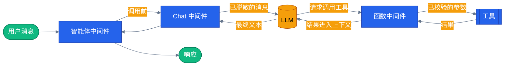

# 第 06 章 · 中间件与智能体管线

[项目首页](../../README.md) · [教程总览](../README.md) · [术语表](../_shared/jargon-glossary.md)

三层、一条可组合的管线：包裹每一次智能体运行、拦截每一次工具调用、在 LLM 看到之前脱敏 PII。

## 本章动机

每个智能体最终都会需要一些与其本职工作无关的横切行为：为可观测性记录每次运行、拦截违反业务规则的工具调用、在用户消息抵达模型之前把卡号抹掉。把这些逻辑塞进工具函数或提示词里，在演示阶段能用，但一旦你有六个需要**一致**具备该行为的专家智能体，它就会散架。中间件给你三个定义清晰的拦截点 —— 智能体运行、工具/函数调用、chat/LLM 调用 —— 于是这类逻辑只写一次、组合行为可预期，并且不必触碰业务代码。这正是完整项目采用的形态：本仓库每个专家智能体都由同一套中间件栈构造，而不是各写一套。

中间件让你在三个层次上观察或改写一次智能体运行：

- **智能体运行** —— 包裹整个调用（前后日志、创建跨度、鉴权检查）。
- **函数 / 工具** —— 拦截工具调用（审批闸门、参数校验、结果转换）。
- **Chat / LLM** —— 在消息抵达提供方之前改写它们（PII 脱敏、缓存、模型路由）。

三者组合进同一条管线。不需要对工具代码动手术，也不需要玩弄提示词字符串。

## 前置条件

- 已完成 [第 05 章 · 上下文提供器](../05-context-providers/)
- 仓库根目录的 `.env` 中有可用凭据（或使用 `LLM_PROVIDER=replay` —— 见下文「测试」）

## 核心概念

把它想成一颗洋葱：智能体运行中间件是最外层（它看到整个调用的始终），chat 中间件包裹每一次对 LLM 的出站调用，函数中间件包裹每一次进入工具的调用。一个请求进入时穿过外层一次、返回时再穿过一次；如果智能体发生循环，内层可以在一次运行中触发多次（每次 LLM 往返一次、每次工具调用一次）。


```mermaid
%%{init: {'theme':'base', 'themeVariables': {
  'primaryColor': '#2563eb','primaryTextColor': '#ffffff','primaryBorderColor': '#1e40af',
  'lineColor': '#64748b','secondaryColor': '#f59e0b','tertiaryColor': '#10b981',
  'background': 'transparent'}}}%%
flowchart LR
  classDef core     fill:#2563eb,stroke:#1e40af,color:#ffffff
  classDef external fill:#f59e0b,stroke:#b45309,color:#000000
  classDef success  fill:#10b981,stroke:#047857,color:#ffffff

  user([用户消息])
  agentmw[智能体中间件]
  chatmw[Chat 中间件]
  llm[(LLM)]
  funcmw[函数中间件]
  tool[[工具]]
  answer([响应])

  user --> agentmw
  agentmw -- "调用前" --> chatmw
  chatmw -- "已脱敏的消息" --> llm
  llm -- "请求调用工具" --> funcmw
  funcmw -- "已校验的参数" --> tool
  tool -- "结果" --> funcmw
  funcmw -- "结果进入上下文" --> llm
  llm -- "最终文本" --> chatmw
  chatmw --> agentmw
  agentmw --> answer

  class user success
  class answer success
  class llm external
  class agentmw core
  class chatmw core
  class funcmw core
  class tool core
```

每一层都可以短路：函数中间件能直接拒绝一次工具调用而不真正执行它，chat 中间件能改写出站消息列表，智能体中间件能用 try/except 把整体包起来以输出统一的失败日志。这些层彼此互不知晓 —— 它们之所以能组合，是因为**框架按类型分发**，而不是因为你显式接了一条链。

## Python

在仓库根目录运行，共用 `tutorials/` 这一个 uv 项目（一次 `uv sync` 覆盖全部章节）：

```bash
uv sync --project tutorials
uv run --project tutorials python tutorials/06-middleware/python/main.py
uv run --project tutorials python tutorials/06-middleware/python/main.py "My card is 4111-1111-1111-1111"
```

源码：[`python/main.py`](./python/main.py)。三个中间件类，每层一个：

```python
class LoggingAgentMiddleware(AgentMiddleware):
    """Observes every agent run. Populates `events` so tests can assert order."""

    def __init__(self) -> None:
        self.events: list[str] = []

    async def process(self, context: AgentContext, call_next: Callable[[], Awaitable[None]]) -> None:
        self.events.append("agent:before")
        await call_next()
        self.events.append("agent:after")


class ArgValidatorMiddleware(FunctionMiddleware):
    """Blocks a canned forbidden city as a stand-in for business-rule validation."""

    FORBIDDEN_CITY = "Atlantis"

    async def process(
        self,
        context: FunctionInvocationContext,
        call_next: Callable[[], Awaitable[None]],
    ) -> None:
        city = context.arguments.get("city", "") if isinstance(context.arguments, dict) else ""
        self.invocations.append(city)
        if city.lower() == self.FORBIDDEN_CITY.lower():
            self.blocked.append(city)
            context.result = "Refused: that city isn't supported."
            return        # short-circuit — real tool never runs
        await call_next()


class PiiRedactionChatMiddleware(ChatMiddleware):
    """Masks credit-card-shaped numbers in outbound user messages."""

    async def process(self, context: ChatContext, call_next: Callable[[], Awaitable[None]]) -> None:
        for message in context.messages:
            for content in message.contents:
                if text := getattr(content, "text", None):
                    redacted, count = _CARD_RE.subn("[REDACTED-CARD]", text)
                    if count:
                        self.redactions += count
                        content.text = redacted
        await call_next()
```

三者都在 `build_agent()` 中通过 `Agent(client, ..., middleware=[logger, validator, redactor])` 接入。`main.py` 同样支持 `LLM_PROVIDER=replay`，它回放已录制的 fixture 而不访问真实提供方 —— 对那个可在 CI 中运行的测试很有用（见下文「测试」）。

## 常见坑

- **不要跨运行保留状态**，除非你确实想这么做。若你的断言关心顺序，就为每次运行实例化一个全新的中间件（测试里每个用例都会新建一个智能体）。
- **`arguments` 字典并非在所有后端都可变。** 要在 Python 中短路一次工具调用，请设置 `context.result`，而不是去改 `context.arguments`。
- **函数体里内置的工具守卫不等于函数中间件。** 在 Python 中，`FunctionMiddleware` 是从外部包裹这次调用；把守卫写进工具函数体内则是另一层、另一套可观测性 —— 无法在不复制守卫代码的前提下跨工具复用。
- **MAF 打包缺陷 —— 现已是空操作。** 早期 `agent-framework-core==1.0.0` 的 wheel 里带了一个空的 `__init__.py`。`tutorials/_shared/maf_bootstrap.py` 会在任何 `agent_framework` 导入之前防御性地修补它；本仓库现已锁定 `agent-framework` 1.14.0，该缺陷在上游已修复，因此这一步在当前安装下什么都不做。完整项目带有等价的 `agents/python/patch_maf.py`，同样是空操作（参见 `CLAUDE.md` 的「MAF 包修补」一节）—— 看到这段补丁代码不必花时间去追，它是惰性的。

## 测试

```bash
uv run --project tutorials pytest tutorials/06-middleware/python/tests -v
```

结构上：`python/tests/test_middleware.py` 含 `test_replay_agent_and_function_middleware_observe_weather_call`（针对 `python/tests/fixtures/replay/` 下已录制的 fixture 运行，无需网络），以及若干访问真实 LLM 的测试 —— 覆盖智能体中间件的顺序、函数中间件的拦截、禁用城市短路、chat 中间件脱敏，以及智能体实例之间不泄漏状态。

## 在完整项目中的落点

本章的玩具示例是**实际在跑的东西**的简化版。所有专家智能体与编排器共用的唯一接线点是 `agents/python/shared/middleware.py:197` 的 `build_specialist_middleware()`。今天它组合的远不止三层：

- `AgentRunLogger`（智能体中间件，`agents/python/shared/middleware.py:34`）—— 运行耗时与关联 id，始终启用。
- `ToolAuditMiddleware`（函数中间件，`agents/python/shared/middleware.py:79`）—— 为每次工具调用写结构化审计日志，始终启用。
- `InjectionDetectionChatMiddleware`（chat 中间件，由 `settings.GUARDRAILS_ENABLED` 控制）—— 标记入站的提示词注入。
- `PiiRedactionMiddleware`（chat 中间件，`agents/python/shared/middleware.py:128`）—— 与本章所教相同的卡号/身份证号脱敏模式，不受护栏开关影响，始终启用。
- `OutputSanitizationMiddleware`（函数中间件，由 `settings.GUARDRAILS_ENABLED` 控制）—— 拆除工具输出中的存储型注入。
- `HITLFunctionMiddleware`（函数中间件，由 `settings.HITL_ENABLED` 控制）—— 人工审批闸门。
- 核验中间件（`GROUNDING_LEDGER_MIDDLEWARE` + `GroundingVerificationMiddleware`，由 `settings.GROUNDING_MODE != "off"` 控制）—— 在运行过程中记录真实的商品/订单事实，并用它们核验最终文本。
- `STEP_MIDDLEWARE`（来自 `shared.agent_observability`，通过 `include_steps=True` 默认开启）—— 为运行浏览器界面捕获智能体时间线。

这些都不是推测 —— `agents/python/` 中每个智能体工厂都调用 `build_specialist_middleware()` 来取得自己的中间件列表。教程的三类示例（`LoggingAgentMiddleware`、`ArgValidatorMiddleware`、`PiiRedactionChatMiddleware`）是同一个**形态**，只是没有应用层再叠加的护栏/核验/人工审批几层。另外，`agents/python/shared/auth.py:78` 的 `AgentAuthMiddleware` 是 HTTP 中间件（Starlette `BaseHTTPMiddleware`）—— 完全是另一层，包裹的是在抵达智能体之前就已存在的 Web 请求。

## 下一步

- 下一章：[第 07 章 · 基于 OpenTelemetry 的可观测性](../07-observability-otel/)
- 完整源码：[`python/`](./python/)
- 共享材料：[Mermaid 风格指南](../_shared/mermaid-style-guide.md) · [术语表](../_shared/jargon-glossary.md)
- [MAF 官方文档 —— 中间件](https://learn.microsoft.com/en-us/agent-framework/agents/middleware/)
