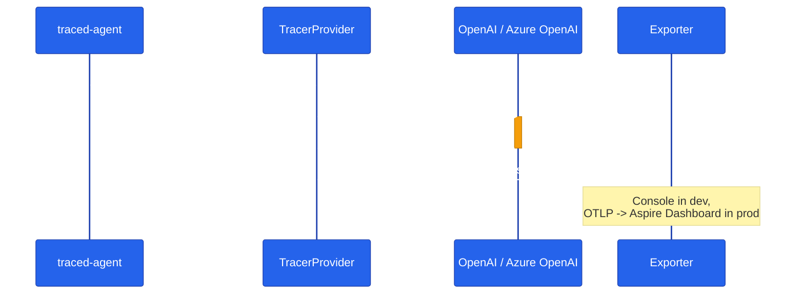

# Chapter 07 — Observability with OpenTelemetry

Wire OpenTelemetry to capture agent runs as spans with GenAI semantic attributes. Console exporter for dev, OTLP for Aspire / Jaeger / Azure Monitor in prod — both stacks.

## Why this chapter

Agents fail in weird ways: the LLM called the wrong tool, the tool returned empty, the model decided not to call anything at all. You won't figure out which by reading logs — a log line tells you an agent ran, not what it decided, what it sent to the model, or how long each hop took. You need spans.

MAF emits OpenTelemetry spans out of the box. One bit of plumbing per language and you're seeing agent-run and provider-HTTP spans annotated with GenAI semantic-convention attributes (model, input tokens, output tokens, finish reason). This is the same mechanism the capstone app uses to render its call tree — orchestrator → A2A → specialist → tool → LLM — in the Aspire Dashboard, so what you build here is a miniature of production telemetry, not a toy.

## Prerequisites

- Completed [Chapter 06 — Middleware](../06-middleware/)
- `.env` with working LLM credentials (`OPENAI_API_KEY`, or `AZURE_OPENAI_ENDPOINT` / `AZURE_OPENAI_KEY` / `AZURE_OPENAI_DEPLOYMENT`)

## The concept

Both languages follow the same three steps:

1. Build a `TracerProvider` with an exporter (console for dev, OTLP for Aspire / Jaeger / Azure Monitor in prod).
2. Register the MAF agent instrumentation source(s) on that provider.
3. Run an agent — spans get emitted automatically, no manual `span.start()` calls in your business logic.

Python opts in with one call — `enable_instrumentation()` — that turns on MAF's built-in instrumentation. .NET instead adds MAF's `ActivitySource` names to the tracer provider explicitly; .NET's tracing model (`System.Diagnostics.Activity`) doesn't have a single global "enable" switch, so you tell the provider which sources to listen to.

A single agent run produces a small tree of nested spans — the agent invocation as the parent, with the underlying LLM call (and any tool calls) as children:



The parent span carries `gen_ai.operation.name`, the child LLM span carries `gen_ai.request.model` / `gen_ai.usage.*` — that's the GenAI semantic convention both languages emit, and it's what makes the Aspire Dashboard's GenAI view group and render them meaningfully.

## Python

Source: [`python/main.py`](./python/main.py).

```python
from agent_framework.observability import enable_instrumentation
from opentelemetry import trace
from opentelemetry.sdk.resources import SERVICE_NAME, Resource
from opentelemetry.sdk.trace import TracerProvider
from opentelemetry.sdk.trace.export import BatchSpanProcessor, ConsoleSpanExporter


def setup_tracing(service_name: str = "maf-v1-ch07", exporter: object | None = None) -> TracerProvider:
    """Configure a TracerProvider. Call once per process before agent calls."""
    resource = Resource.create({SERVICE_NAME: service_name})
    provider = TracerProvider(resource=resource)
    provider.add_span_processor(BatchSpanProcessor(exporter or ConsoleSpanExporter()))
    trace.set_tracer_provider(provider)
    enable_instrumentation(enable_sensitive_data=True)
    return provider
```

`main.py` calls `setup_tracing()` once at startup, then builds an `Agent` and runs it — `enable_instrumentation()` is what makes MAF start emitting spans for every agent/LLM call, and the `BatchSpanProcessor` + `ConsoleSpanExporter` is what prints them.

Run it from the repo root using the shared `tutorials/` uv project (one `uv sync` covers every chapter):

```bash
uv sync --project tutorials
uv run --project tutorials python tutorials/07-observability-otel/python/main.py "What is Python?"
```

`main.py` also supports `LLM_PROVIDER=replay` (via `tutorials/_shared/replay_client.py`), which plays back a recorded fixture instead of calling a real model — that's what the test suite uses so it can run in CI without credentials.

## .NET

Source: [`dotnet/Program.cs`](./dotnet/Program.cs).

```csharp
public static readonly string[] ActivitySources = new[]
{
    "Microsoft.Agents.AI",
    "Microsoft.Extensions.AI",
    "*",
};

public static TracerProvider BuildTracerProvider(BaseExporter<Activity> exporter)
{
    var builder = Sdk.CreateTracerProviderBuilder()
        .SetResourceBuilder(ResourceBuilder.CreateDefault().AddService("maf-v1-ch07"))
        .AddSource(ActivitySources)
        .AddProcessor(new SimpleActivityExportProcessor(exporter));
    return builder.Build()!;
}
```

`Program.Main` calls `BuildTracerProvider(new ConsoleExporter())`, builds the agent with `chatClient.AsAIAgent(...)`, and runs it — the console exporter (a small `BaseExporter<Activity>` defined at the bottom of `Program.cs`) prints each span's display name and tag count as it's exported.

```bash
cd tutorials/07-observability-otel/dotnet
dotnet run
```

## Side-by-side differences

| Aspect | Python | .NET |
|--------|--------|------|
| Enable MAF instrumentation | `enable_instrumentation()` | `.AddSource("Microsoft.Agents.AI", "Microsoft.Extensions.AI", "*")` |
| Span format | OpenTelemetry SDK span | `System.Diagnostics.Activity` (OTel .NET's compat layer) |
| Default exporter | `ConsoleSpanExporter` | Custom `ConsoleExporter : BaseExporter<Activity>` |
| GenAI attributes | `gen_ai.operation.name`, `gen_ai.request.model`, `gen_ai.usage.*` | Same attribute names, exposed as `Activity` tags |
| Provider set-once rule | `trace.set_tracer_provider()` — second call is a silent no-op | `TracerProvider` is a disposable object you own; nothing stops you building two |

Both produce the same data shape — swap the exporter for an OTLP one and point it at Aspire / Jaeger / Azure Monitor to see distributed traces instead of console lines.

## Gotchas

- **Python sets one `TracerProvider` per process.** Calling `trace.set_tracer_provider()` a second time logs a warning and is ignored — the first provider wins. The test suite in [`test_observability.py`](./python/tests/test_observability.py) works around this by installing a single module-level `InMemorySpanExporter` and calling `exporter.clear()` between tests, rather than trying to rebuild the provider.
- **.NET needs explicit `ActivitySource` names.** MAF v1.1 emits under `Microsoft.Agents.AI` and `Microsoft.Extensions.AI`; adding `"*"` on top also picks up ambient HTTP-client spans (DNS, TLS handshake, the actual POST) so you can see the full network hop, not just the agent-level span.
- **`enable_instrumentation(enable_sensitive_data=True)`** includes the full prompt and response text as span attributes. Fine for a local dev trace; in production against real user/PII data, leave it at the default (`False`) or scope it behind an environment flag — see `OTEL_INSTRUMENTATION_GENAI_CAPTURE_MESSAGE_CONTENT` in `docker-compose.yml`, which controls the same trade-off for the capstone app.
- **Both SDKs sample everything by default.** Fine for a tutorial or low-QPS service; for a high-throughput service you'd configure a `TraceIdRatioBased` sampler in both languages rather than exporting 100% of spans.
- **The Aspire OTLP port is not the OTel default.** `docker-compose.yml`'s `aspire` service maps the dashboard UI to host `18888` and the OTLP receiver to host `18890` (container port `18889`) — not the OTel SDK's usual default of `4317`. If you point this chapter's exporter at Aspire instead of the console, use `http://localhost:18890` from the host, or `http://aspire:18889` from inside the compose network (that's the value `docker-compose.yml` sets for the orchestrator's `OTEL_EXPORTER_OTLP_ENDPOINT`).

## Tests

Python tests live in [`python/tests/`](./python/tests/) — `test_observability.py` plus a `fixtures/replay/` directory of recorded fixtures. One test (`test_replay_run_emits_spans`) runs against the replay fixture with no network or credentials, so it's the one that runs in CI; three more (`test_real_llm_run_emits_spans`, `test_spans_include_genai_attributes`, `test_two_runs_produce_distinct_trace_ids`) are marked `@pytest.mark.integration` and skip automatically when no LLM credentials are present in `.env`.

.NET tests live in [`dotnet/tests/ObservabilityTests.cs`](./dotnet/tests/ObservabilityTests.cs) — two integration tests (`Real_LLM_Run_Produces_Spans`, `Spans_Include_Http_Call_To_LLM_Provider`) that each skip with a `[skip]` console line when no credentials are configured.

```bash
# Python
uv sync --project tutorials
uv run --project tutorials pytest tutorials/07-observability-otel/python/tests -v

# .NET
cd tutorials/07-observability-otel/dotnet
dotnet test tests/Observability.Tests.csproj
```

## How this shows up in the capstone

The production-grade version of this chapter is `agents/python/shared/telemetry.py`. `setup_telemetry()` at `agents/python/shared/telemetry.py:30` configures OTLP exporters plus auto-instrumentation for `httpx`, `asyncpg`, and FastAPI — none of which this chapter's minimal example needs, because the chapter has no database and no inbound HTTP server. Two context managers build on top of that: `agent_run_span()` at `agents/python/shared/telemetry.py:224` wraps one agent invocation with the same `gen_ai.operation.name` / `invoke_agent` convention this chapter uses, and `a2a_call_span()` at `agents/python/shared/telemetry.py:261` wraps outbound agent-to-agent HTTP calls with `SpanKind.CLIENT` so the orchestrator → specialist hop shows up as a single connected span tree rather than two disconnected traces. The `aspire` service in `docker-compose.yml` (dashboard on `:18888`, OTLP receiver on `:18890`/`18889`) is where those spans actually land and render as the orchestrator → A2A → specialist → tool → LLM call tree.

## What's next

- Next chapter: [Chapter 08 — MCP Tools](../08-mcp-tools/)
- Full source: [`python/`](./python/) · [`dotnet/`](./dotnet/)
- Shared: [Mermaid style guide](../_shared/mermaid-style-guide.md) · [Jargon glossary](../_shared/jargon-glossary.md)
- [MAF docs — Observability](https://learn.microsoft.com/en-us/agent-framework/agents/observability/)
