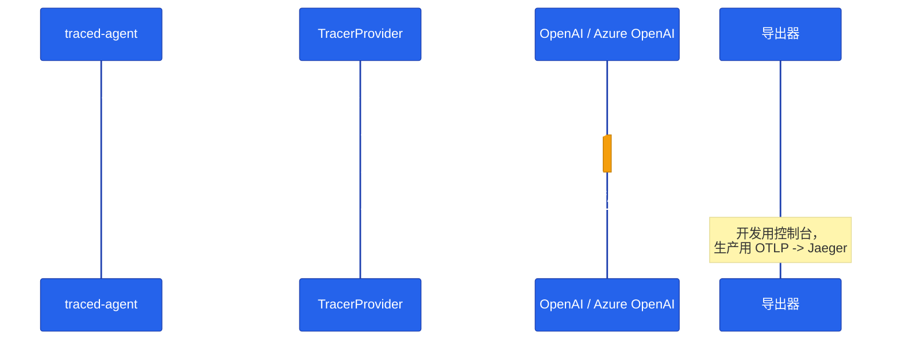

# 第 07 章 · 基于 OpenTelemetry 的可观测性

[项目首页](../../README.md) · [教程总览](../README.md) · [术语表](../_shared/jargon-glossary.md)

接入 OpenTelemetry，把智能体运行捕获为带 GenAI 语义属性的跨度。开发用控制台导出器，生产用 OTLP 送到 Jaeger / Azure Monitor。

## 本章动机

智能体会以奇怪的方式失败：LLM 调错了工具、工具返回了空、模型决定什么都不调用。靠读日志你查不出是哪一种 —— 一行日志只能告诉你「有智能体运行过」，它不告诉你智能体决定了什么、给模型发了什么、每一跳花了多久。你需要**跨度（span）**。

MAF 开箱即输出 OpenTelemetry 跨度。每种语言加一点接线，你就能看到智能体运行跨度与提供方 HTTP 跨度，并附带 GenAI 语义约定属性（模型、输入 token、输出 token、结束原因）。完整项目正是用同一套机制在 Jaeger 界面中渲染它的调用树 —— 编排器 → A2A → 专家 → 工具 → LLM —— 所以这里搭出来的东西是生产遥测的微缩版，而不是玩具。

## 前置条件

- 已完成 [第 06 章 · 中间件与智能体管线](../06-middleware/)
- `.env` 中有可用的 LLM 凭据（`OPENAI_API_KEY`，或 `AZURE_OPENAI_ENDPOINT` / `AZURE_OPENAI_KEY` / `AZURE_OPENAI_DEPLOYMENT`）

## 核心概念

三步走：

1. 构建一个带导出器的 `TracerProvider`（开发用控制台，生产用 OTLP 送到 Jaeger / Azure Monitor）。
2. 在该 provider 上注册 MAF 的智能体插桩来源。
3. 运行智能体 —— 跨度会自动发出，你的业务逻辑里不需要手写 `span.start()`。

Python 用一次调用 `enable_instrumentation()` 打开 MAF 内置插桩。Python 的设置是一次性的：一个进程只有一个 `TracerProvider`。

一次智能体运行会产生一棵小的嵌套跨度树 —— 智能体调用是父，底层的 LLM 调用（以及任何工具调用）是子：


```mermaid
%%{init: {'theme':'base', 'themeVariables': {
  'primaryColor': '#2563eb','primaryTextColor': '#ffffff','primaryBorderColor': '#1e40af',
  'lineColor': '#64748b','secondaryColor': '#f59e0b','tertiaryColor': '#10b981',
  'background': 'transparent'}}}%%
sequenceDiagram
  participant App as traced-agent
  participant Prov as TracerProvider
  participant LLM as OpenAI / Azure OpenAI
  participant Exp as 导出器

  App->>Prov: 启动跨度 "invoke_agent traced-agent"
  Prov->>LLM: chat completion 请求
  activate LLM
  LLM-->>Prov: chat gpt-4.1 跨度（gen_ai.* 属性）
  deactivate LLM
  Prov->>Exp: 导出已完成的跨度
  Note over Exp: 开发用控制台，<br/>生产用 OTLP -> Jaeger
```

父跨度携带 `gen_ai.operation.name`，子 LLM 跨度携带 `gen_ai.request.model` / `gen_ai.usage.*` —— 这就是两种语言都会输出的 GenAI 语义约定，也正是它让 Jaeger 的界面能把它们有意义地分组与渲染。

## Python

源码：[`python/main.py`](./python/main.py)。

```python
from agent_framework.observability import enable_instrumentation
from opentelemetry import trace
from opentelemetry.sdk.resources import SERVICE_NAME, Resource
from opentelemetry.sdk.trace import TracerProvider
from opentelemetry.sdk.trace.export import BatchSpanProcessor, ConsoleSpanExporter


def setup_tracing(service_name: str = "maf-v1-ch07", exporter: object | None = None) -> TracerProvider:
    """Configure a TracerProvider. Call once per process before agent calls."""
    resource = Resource.create({SERVICE_NAME: service_name})
    provider = TracerProvider(resource=resource)
    provider.add_span_processor(BatchSpanProcessor(exporter or ConsoleSpanExporter()))
    trace.set_tracer_provider(provider)
    enable_instrumentation(enable_sensitive_data=True)
    return provider
```

`main.py` 在启动时调用一次 `setup_tracing()`，随后构造 `Agent` 并运行 —— `enable_instrumentation()` 让 MAF 开始为每次智能体/LLM 调用发出跨度，`BatchSpanProcessor` + `ConsoleSpanExporter` 则负责把它们打印出来。

在仓库根目录运行，共用 `tutorials/` 这一个 uv 项目（一次 `uv sync` 覆盖全部章节）：

```bash
uv sync --project tutorials
uv run --project tutorials python tutorials/07-observability-otel/python/main.py "What is Python?"
```

`main.py` 同样支持 `LLM_PROVIDER=replay`（通过 `tutorials/_shared/replay_client.py`），它回放已录制的 fixture 而不调用真实模型 —— 测试套件正是靠它做到无需凭据即可在 CI 中运行。

## 常见坑

- **Python 每个进程只设置一个 `TracerProvider`。** 第二次调用 `trace.set_tracer_provider()` 只会记一条警告然后被忽略 —— 第一个 provider 获胜。测试套件（[`test_observability.py`](./python/tests/test_observability.py)）的绕法是安装一个模块级的 `InMemorySpanExporter`，并在测试之间调用 `exporter.clear()`，而不是试图重建 provider。
- **`enable_instrumentation(enable_sensitive_data=True)`** 会把完整的提示词与响应文本作为跨度属性包含进去。对本地开发追踪没问题；在生产环境面对真实用户/PII 数据时，请保持默认值（`False`），或用环境开关把它圈起来 —— 参见 `docker-compose.yml` 中的 `OTEL_INSTRUMENTATION_GENAI_CAPTURE_MESSAGE_CONTENT`，它控制着完整应用里同一组权衡。
- **两个 SDK 默认都会全量采样。** 对教程或低 QPS 服务没问题；对高吞吐服务，你应当配置基于 `TraceIdRatioBased` 的采样器，而不是导出 100% 的跨度。
- **OTLP 端点不是 OTel 的默认端口。** 本仓库的 compose 栈里，Jaeger 的 OTLP 接收端对外暴露在 `4317`（gRPC）与 `4318`（HTTP），界面在 `16686`。若你把本章的导出器指向 Jaeger 而不是控制台，请使用 `http://localhost:4317`；容器内部则用 `http://jaeger:4317`（`docker-compose.yml` 为编排服务设置的 `OTEL_EXPORTER_OTLP_ENDPOINT` 就是它）。

## 测试

Python 测试位于 [`python/tests/`](./python/tests/) —— `test_observability.py` 加上一个存放已录制 fixture 的 `fixtures/replay/` 目录。其中一个测试（`test_replay_run_emits_spans`）针对回放 fixture 运行，无需网络与凭据，因此它是 CI 中实际运行的那个；另外三个（`test_real_llm_run_emits_spans`、`test_spans_include_genai_attributes`、`test_two_runs_produce_distinct_trace_ids`）标记为 `@pytest.mark.integration`，当 `.env` 中没有 LLM 凭据时自动跳过。

```bash
uv sync --project tutorials
uv run --project tutorials pytest tutorials/07-observability-otel/python/tests -v
```

## 在完整项目中的落点

本章的生产级版本是 `agents/python/shared/telemetry.py`。`agents/python/shared/telemetry.py:25` 的 `setup_telemetry()` 配置 OTLP 导出器，并为 `httpx`、`asyncpg`、FastAPI 开启自动插桩 —— 这些本章的最小示例都不需要，因为本章既没有数据库也没有入站 HTTP 服务。在其之上还有两个上下文管理器：`agents/python/shared/telemetry.py:215` 的 `agent_run_span()` 用与本章相同的 `gen_ai.operation.name` / `invoke_agent` 约定包裹一次智能体调用；`agents/python/shared/telemetry.py:248` 的 `a2a_call_span()` 用 `SpanKind.CLIENT` 包裹出站的智能体间 HTTP 调用，使「编排器 → 专家」这一跳呈现为一棵连通的跨度树，而不是两段互不相连的追踪。`docker-compose.yml` 中的 `jaeger` 服务（界面 `:16686`，OTLP 接收端 `:4317`）就是这些跨度的落点，它们在那里渲染为「编排器 → A2A → 专家 → 工具 → LLM」的调用树。

## 下一步

- 下一章：[第 08 章 · MCP 工具](../08-mcp-tools/)
- 完整源码：[`python/`](./python/)
- 共享材料：[Mermaid 风格指南](../_shared/mermaid-style-guide.md) · [术语表](../_shared/jargon-glossary.md)
- [MAF 官方文档 —— 可观测性](https://learn.microsoft.com/en-us/agent-framework/agents/observability/)
