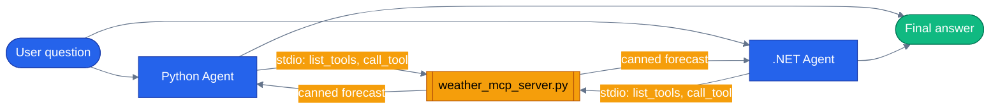

# Chapter 08 — MCP Tools

## Why this chapter

MCP (Model Context Protocol) is the tool-level equivalent of USB: one server exposes capabilities that any MCP-speaking client can consume, regardless of which agent framework wrote the client. You implement a tool once and MAF, LangChain, Claude Desktop, or Cursor can all call it the same way.

This chapter stands up a tiny Python MCP server with a single `get_weather` tool, then calls it from **both** a Python MAF agent and a .NET MAF agent — same server, two clients, one wire protocol. It's deliberately minimal so the protocol mechanics are visible; the capstone app uses the same pattern at production scale (see below).

## Prerequisites

- Completed [Chapter 07 — Observability](../07-observability-otel/)
- Repo-root `.env` with one LLM provider configured (`OPENAI_API_KEY`, or the `AZURE_OPENAI_*` triplet)
- `uv sync --project tutorials` (pulls in the `mcp` package alongside `agent-framework-core`)

## The concept

MCP defines a JSON-RPC protocol over a few transports: **stdio** (spawn a subprocess, talk over its stdin/stdout), **HTTP/SSE**, and **Streamable HTTP**. This chapter uses stdio — the simplest transport and the right choice for a tool that only the calling process needs. The client launches the server as a child process, performs the MCP handshake, and lists the tools it exposes.

MAF hides the wire protocol behind a small client object per language:

- **Python**: `MCPStdioTool(name, command, args=[...])` is an async context manager; entering it spawns the subprocess and runs the handshake. Pass the object straight into `Agent(..., tools=[mcp])`.
- **.NET**: `McpClient.CreateAsync(StdioClientTransport)` connects, then `ListToolsAsync()` returns `McpClientTool[]` — each one already implements `AITool`, so it goes straight into `.AsAIAgent(tools: ...)`.

Both flavors auto-discover tools at connection time. Your agent code never hard-codes the tool list — it just asks the server what it can do.



The same subprocess-spawned server answers both clients — MCP doesn't care what language wrote the tool or what language calls it.

## Python

Run from the repo root using the shared `tutorials/` uv project (one `uv sync` covers every chapter):

```bash
uv sync --project tutorials
uv run --project tutorials python tutorials/08-mcp-tools/python/main.py
```

The server, [`python/weather_mcp_server.py`](./python/weather_mcp_server.py), is a dozen lines of `FastMCP`:

```python
from mcp.server.fastmcp import FastMCP

server = FastMCP("maf-v1-ch08-weather")


@server.tool()
def get_weather(city: str) -> str:
    """Look up the current weather for a city (canned data)."""
    canned = {
        "paris": "Sunny, 18°C.",
        "london": "Overcast, 12°C.",
        "tokyo": "Rain, 15°C.",
    }
    return canned.get(city.lower(), f"No weather data for {city}.")


if __name__ == "__main__":
    server.run()
```

The client, [`python/main.py`](./python/main.py), spawns it and hands it to the agent:

```python
def build_mcp_tool() -> MCPStdioTool:
    """Spawns the weather MCP server as a subprocess and exposes its tools to the agent."""
    return MCPStdioTool(
        name="weather-mcp",
        command=sys.executable,
        args=[SERVER_SCRIPT],
    )


async def run(question: str) -> str:
    async with build_mcp_tool() as mcp:
        agent = Agent(
            _default_client(),
            instructions=INSTRUCTIONS,
            name="mcp-agent",
            tools=[mcp],
        )
        response = await agent.run(question)
        return response.text
```

The `async with` block spawns the subprocess, performs the MCP handshake, and lists tools; when the block exits, the subprocess is terminated. `main.py` also supports `LLM_PROVIDER=replay` for fixture-backed testing — see [Tests](#tests).

## .NET

```bash
cd tutorials/08-mcp-tools/dotnet
dotnet run
```

[`dotnet/Program.cs`](./dotnet/Program.cs) reuses the exact same Python server over stdio — no .NET-side MCP server needed:

```csharp
public static async Task<McpClient> BuildMcpClientAsync()
{
    var pythonBin = Environment.GetEnvironmentVariable("PYTHON_BIN")
                    ?? FirstExisting(
                        Path.Combine(FindRepoRoot(), "tutorials", ".venv", "bin", "python"),
                        Path.Combine(FindRepoRoot(), "agents", "python", ".venv", "bin", "python"))
                    ?? "python3";

    var transport = new StdioClientTransport(new StdioClientTransportOptions
    {
        Name = "weather-mcp",
        Command = pythonBin,
        Arguments = new[] { ServerScript },
    });

    return await McpClient.CreateAsync(transport);
}
```

`Run()` then lists tools and hands them to the agent directly, since `McpClientTool` already implements `AITool`:

```csharp
await using var mcpClient = await BuildMcpClientAsync();
var tools = (await mcpClient.ListToolsAsync()).Select(t => (AITool)t).ToArray();

var chatClient = BuildChatClient();
var agent = chatClient.AsAIAgent(
    instructions: Instructions,
    name: "mcp-agent",
    tools: tools);

var response = await agent.RunAsync(question);
```

`ServerScript` walks up from the running binary to find `tutorials/08-mcp-tools/python/weather_mcp_server.py`, and `PYTHON_BIN` defaults to the tutorials venv (`tutorials/.venv`, what `uv sync --project tutorials` creates), falling back to `agents/python/.venv` — set it explicitly if you keep yours somewhere else.

## Side-by-side differences

| Aspect | Python | .NET |
|--------|--------|------|
| Package | `mcp` (server) + `agent_framework._mcp` | `ModelContextProtocol` + `ModelContextProtocol.Core` |
| Client class | `MCPStdioTool` (async context manager) | `McpClient` + `StdioClientTransport` |
| Tool discovery | Implicit on entering `async with` | Explicit `ListToolsAsync()` call |
| Lifecycle | `async with build_mcp_tool() as mcp:` | `await using var mcpClient = ...` |
| Tool-to-agent handoff | `tools=[mcp]` (whole client object) | `tools: tools` (array of `AITool`, one per discovered tool) |

Both honor the same MCP spec, so either client works against either-language servers — the .NET client here talks to the Python server with no adapter code.

## Gotchas

- **The subprocess needs a Python interpreter that has `mcp` installed.** The .NET test's `PYTHON_BIN` env var controls which interpreter gets spawned; it defaults to the tutorials venv, not whatever `python3` resolves to on your `PATH`. This default was wrong for a long time — it pointed at `agents/.venv`, a path that stopped existing when the Python packages moved under `agents/python/`, so all three .NET tests here failed with a bare "No such file or directory". No CI job built or ran any tutorial .NET project until #20, so nothing noticed.
- **Long-running MCP servers stay alive between calls.** Always scope them with `async with` (Python) or `await using` (.NET) so a crashed or forgotten test doesn't leave an orphan subprocess.
- **Tool name collisions** across multiple MCP servers attached to one agent are a real failure mode in this repo, not a hypothetical: `agents/python/product_discovery/agent.py` explicitly does *not* register a local `get_price_history` tool alongside the MCP server's version of it, because MAF raises "Duplicate tool name" at agent-construction time if it does.
- **`tutorials/_shared/maf_bootstrap.py` still carries an `agent_framework/__init__.py` patch step** for a packaging bug in `agent-framework-core==1.0.0` (empty `__init__.py`). Both `tutorials/pyproject.toml` and `agents/python/pyproject.toml` now pin `agent-framework-core==1.14.0`, where the bug is fixed upstream, so `bootstrap()`'s patch is a no-op on a current install — it only writes when the installed `__init__.py` is empty. It's left in defensively rather than removed.

## Tests

```bash
uv sync --project tutorials
uv run --project tutorials pytest tutorials/08-mcp-tools/python/tests -v
cd tutorials/08-mcp-tools/dotnet && dotnet test
```

Python ([`python/tests/test_mcp.py`](./python/tests/test_mcp.py)) covers, in order:

1. **Replay integration** (`test_replay_calls_mcp_weather_tool`) — the MCP server subprocess runs for real, but the LLM call is replayed from a committed fixture (`tests/fixtures/replay/`), so it needs no credentials and is safe for CI.
2. **Unit tests on the tool function** — canned-data lookup and case-insensitivity, exercised directly via `get_weather.fn` (FastMCP wraps the function; `.fn` reaches the original).
3. **`test_build_mcp_tool_configures_subprocess`** — asserts the `MCPStdioTool` is named correctly without spawning it.
4. **`@pytest.mark.integration` tests** (`test_real_llm_calls_mcp_weather_tool`, `test_real_llm_skips_mcp_tool_for_unrelated_question`) — these hit a live LLM and are skipped automatically (`pytest.mark.skipif`) unless real credentials are present in `.env`; they are not required for a normal test run to pass.

.NET ([`dotnet/tests/McpToolsTests.cs`](./dotnet/tests/McpToolsTests.cs)) mirrors this: three `[Trait("Category", "Integration")]` facts that each check for LLM credentials at the top and no-op (print `[skip]`) if absent, rather than using a build-time skip attribute.

## How this shows up in the capstone

This isn't a toy pattern confined to the tutorial — two real MCP servers back the capstone app:

- `agents/python/packages/mcp-product/src/ecommerce_mcp_product/server.py` and `agents/python/packages/mcp-inventory/src/ecommerce_mcp_inventory/server.py` are `FastMCP` servers exposing product search/details/pricing and inventory/warehouse data over **Streamable HTTP** (not stdio — these run as standalone services, `mcp-product` on port 9000 and `mcp-inventory` on port 9001, see `docker-compose.yml`'s `mcp` profile).
- `agents/python/product_discovery/agent.py:69` builds an `MCPStreamableHTTPTool` pointed at `settings.MCP_PRODUCT_SERVER_URL` when `settings.MCP_ENABLED` is true, and passes it into the agent's `tools` list alongside locally-defined tools like `semantic_search` and `check_stock` — the same "hand the MCP tool object straight to the agent" pattern this chapter's Python client uses, just over HTTP instead of stdio and with OAuth 2.1 resource-server auth optionally layered on (`settings.MCP_AUTH_ENABLED`, `shared/oauth/service_client.py`).
- `agents/python/inventory_fulfillment/agent.py` follows the identical MCP-vs-direct-tools branch for the inventory domain.

## What's next

- Next chapter: [Chapter 09 — Workflow Executors and Edges](../09-workflow-executors-and-edges/)
- Full source: [`python/`](./python/) · [`dotnet/`](./dotnet/)
- [MAF docs — Hosted MCP Tools](https://learn.microsoft.com/en-us/agent-framework/agents/tools/hosted-mcp-tools/)
