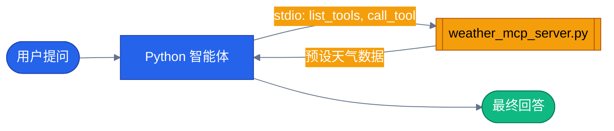

# 第 08 章 · MCP 工具

[项目首页](../../README.md) · [教程总览](../README.md) · [术语表](../_shared/jargon-glossary.md)

MCP（模型上下文协议，Model Context Protocol）是工具层面的「USB」：一个服务器暴露能力，任何会说 MCP 的客户端都能消费，与它用哪个智能体框架无关。你实现一次工具，任何 MCP 客户端都能以同样方式调用它。

## 本章动机

MCP 就是工具层面的 USB：一个服务器暴露能力，任何会说 MCP 的客户端都能消费，无论客户端是用哪个智能体框架写的。你实现一次工具，MAF、LangChain、Claude Desktop、Cursor 都能以同样方式调用它。

本章搭起一个只有 `get_weather` 一个工具的极小 Python MCP 服务器，然后从 MAF 智能体调用它 —— 服务器与客户端之间的**线路协议**是唯一需要对齐的东西。这里刻意做得极简，好让协议机制清晰可见；完整项目在生产尺度上使用同一模式（见下文）。

## 前置条件

- 已完成 [第 07 章 · 基于 OpenTelemetry 的可观测性](../07-observability-otel/)
- 仓库根目录的 `.env` 中已配置一个 LLM 提供方（`OPENAI_API_KEY`，或 `AZURE_OPENAI_*` 三个变量）
- 已执行 `uv sync --project tutorials`（它会连同 `agent-framework-core` 一起拉入 `mcp` 包）

## 核心概念

MCP 在几种传输层之上定义了一套 JSON-RPC 协议：**stdio**（拉起一个子进程，通过它的 stdin/stdout 通信）、**HTTP/SSE**，以及 **Streamable HTTP**。本章使用 stdio —— 最简单的传输方式，也是「只有调用方进程需要用到该工具」时的正确选择。客户端把服务器作为子进程启动，完成 MCP 握手，然后列出它暴露的工具。

MAF 用一个小客户端对象把线路协议藏了起来：

- **Python**：`MCPStdioTool(name, command, args=[...])` 是一个异步上下文管理器；进入它就会拉起子进程并完成握手。把这个对象直接传进 `Agent(..., tools=[mcp])`。

两种写法都会在连接时自动发现工具。**你的智能体代码从不硬编码工具列表** —— 它只是问服务器「你能做什么」。


```mermaid
%%{init: {'theme':'base', 'themeVariables': {
  'primaryColor': '#2563eb','primaryTextColor': '#ffffff','primaryBorderColor': '#1e40af',
  'lineColor': '#64748b','secondaryColor': '#f59e0b','tertiaryColor': '#10b981',
  'background': 'transparent'}}}%%
flowchart LR
  classDef core     fill:#2563eb,stroke:#1e40af,color:#ffffff
  classDef external fill:#f59e0b,stroke:#b45309,color:#000000
  classDef success  fill:#10b981,stroke:#047857,color:#ffffff

  user([用户提问])
  pyAgent[Python 智能体]
  server[[weather_mcp_server.py]]
  answer([最终回答])

  user --> pyAgent
  pyAgent -- "stdio: list_tools, call_tool" --> server
  server -- "预设天气数据" --> pyAgent
  pyAgent --> answer

  class pyAgent core
  class server external
  class answer success
```

同一个由子进程拉起的服务器可以服务任何客户端 —— MCP 不关心工具是用什么语言写的、也不关心是谁在调用它。

## Python

在仓库根目录运行，共用 `tutorials/` 这一个 uv 项目（一次 `uv sync` 覆盖全部章节）：

```bash
uv sync --project tutorials
uv run --project tutorials python tutorials/08-mcp-tools/python/main.py
```

服务器 [`python/weather_mcp_server.py`](./python/weather_mcp_server.py) 只有十几行 `FastMCP`：

```python
from mcp.server.fastmcp import FastMCP

server = FastMCP("maf-v1-ch08-weather")


@server.tool()
def get_weather(city: str) -> str:
    """Look up the current weather for a city (canned data)."""
    canned = {
        "paris": "Sunny, 18°C.",
        "london": "Overcast, 12°C.",
        "tokyo": "Rain, 15°C.",
    }
    return canned.get(city.lower(), f"No weather data for {city}.")


if __name__ == "__main__":
    server.run()
```

客户端 [`python/main.py`](./python/main.py) 拉起它并交给智能体：

```python
def build_mcp_tool() -> MCPStdioTool:
    """Spawns the weather MCP server as a subprocess and exposes its tools to the agent."""
    return MCPStdioTool(
        name="weather-mcp",
        command=sys.executable,
        args=[SERVER_SCRIPT],
    )


async def run(question: str) -> str:
    async with build_mcp_tool() as mcp:
        agent = Agent(
            _default_client(),
            instructions=INSTRUCTIONS,
            name="mcp-agent",
            tools=[mcp],
        )
        response = await agent.run(question)
        return response.text
```

`async with` 代码块负责拉起子进程、完成 MCP 握手并列出工具；块退出时子进程被终止。`main.py` 同样支持 `LLM_PROVIDER=replay` 用于基于 fixture 的测试 —— 见下文「测试」。

## 常见坑

- **子进程需要一个装了 `mcp` 的 Python 解释器。** 要显式指定用哪个解释器，不要依赖 `PATH` 上 `python3` 恰好解析到什么。若你把自己的虚拟环境放在别处，请通过环境变量明确指定。
- **长期存活的 MCP 服务器会在调用之间一直活着。** 始终用 `async with` 把它圈起来，避免崩溃或被遗忘的测试留下孤儿进程。
- **工具重名**（多个 MCP 服务器挂到同一个智能体上）在本仓库是一个真实的失败模式，不是假设：`agents/python/product_discovery/agent.py` 明确**不**在 MCP 服务器版本之外再注册一个本地 `get_price_history` 工具，因为一旦重名，MAF 会在构造智能体时抛出「Duplicate tool name」。
- **`tutorials/_shared/maf_bootstrap.py` 仍带着一步 `agent_framework/__init__.py` 补丁**，对应 `agent-framework-core==1.0.0` 的打包缺陷（空的 `__init__.py`）。`tutorials/pyproject.toml` 与 `agents/python/pyproject.toml` 现已锁定 `agent-framework-core==1.14.0`，该缺陷在上游已修复，因此 `bootstrap()` 的补丁在当前安装下是空操作 —— 只有已安装的 `__init__.py` 为空时它才会写入。保留它是出于防御，而非必要。

## 测试

```bash
uv sync --project tutorials
uv run --project tutorials pytest tutorials/08-mcp-tools/python/tests -v
```

Python（[`python/tests/test_mcp.py`](./python/tests/test_mcp.py)）依次覆盖：

1. **回放集成**（`test_replay_calls_mcp_weather_tool`）—— MCP 服务器子进程真实运行，但 LLM 调用从已提交的 fixture（`tests/fixtures/replay/`）回放，因此不需要凭据，可安全用于 CI。
2. **工具函数的单元测试** —— 预设数据查询与大小写不敏感，通过 `get_weather.fn` 直接调用（FastMCP 会包装函数，`.fn` 才能拿到原函数）。
3. **`test_build_mcp_tool_configures_subprocess`** —— 断言 `MCPStdioTool` 的名称正确，且不真的拉起它。
4. **`@pytest.mark.integration` 测试**（`test_real_llm_calls_mcp_weather_tool`、`test_real_llm_skips_mcp_tool_for_unrelated_question`）—— 会访问真实 LLM，除非 `.env` 中有真实凭据，否则自动跳过（`pytest.mark.skipif`）；一次常规测试运行并不需要它们通过。

## 在完整项目中的落点

这不是只存在于教程里的玩具模式 —— 完整应用背后有两个真实的 MCP 服务器：

- `agents/python/packages/mcp-product/src/ecommerce_mcp_product/server.py` 与 `agents/python/packages/mcp-inventory/src/ecommerce_mcp_inventory/server.py` 是 `FastMCP` 服务器，通过 **Streamable HTTP**（而非 stdio —— 它们作为独立服务运行，`mcp-product` 在 9000 端口、`mcp-inventory` 在 9001 端口，见 `docker-compose.yml` 的 `mcp` profile）暴露商品检索/详情/定价与库存/仓库数据。
- `agents/python/product_discovery/agent.py:69` 在 `settings.MCP_ENABLED` 为真时构造一个指向 `settings.MCP_PRODUCT_SERVER_URL` 的 `MCPStreamableHTTPTool`，并把它与 `semantic_search`、`check_stock` 这类本地工具一起放进智能体的 `tools` 列表 —— 与本章 Python 客户端相同的「把 MCP 工具对象直接交给智能体」模式，只是走 HTTP 而不是 stdio，并可选叠加 OAuth 2.1 资源服务器鉴权（`settings.MCP_AUTH_ENABLED`、`shared/oauth/service_client.py`）。
- `agents/python/inventory_fulfillment/agent.py` 在库存领域采用完全相同的「MCP 与直接工具二选一」分支。

## 下一步

- 下一章：[第 09 章 · 工作流执行器与边](../09-workflow-executors-and-edges/)
- 完整源码：[`python/`](./python/)
- [MAF 官方文档 —— 托管 MCP 工具](https://learn.microsoft.com/en-us/agent-framework/agents/tools/hosted-mcp-tools/)
