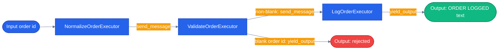

# Chapter 09 — Workflow Executors and Edges

## Why this chapter

Chapters 01–08 treated each agent call as a single atomic request. Real e-commerce flows have *steps*: validate input → fetch reviews → check stock → synthesize a recommendation. You could chain `agent.run()` calls by hand, but as soon as you need parallel steps, a fan-in barrier, or a step that can short-circuit the rest of the pipeline, hand-rolled `asyncio` code gets hard to reason about — and that's exactly the shape the capstone's pre-purchase research flow needs (three tool calls in parallel, then a shipping estimate that depends on their result, then a synthesis step).

MAF's **Workflow** is a deterministic DAG of **Executors** (units of work) connected by **Edges** (message routes). It runs on a Bulk Synchronous Parallel (Pregel-style) scheduler — executors run in supersteps, in-flight messages flush at a barrier, then the next superstep starts. This chapter builds the smallest possible workflow — three executors, two edges, one short-circuit — so the mechanics are visible before Chapter 13 uses the same primitives for real concurrent orchestration.

## Prerequisites

- Completed [Chapter 08 — MCP Tools](../08-mcp-tools/)
- Python 3.12+ via `uv`; .NET SDK (9 or 10)
- No environment variables needed — this chapter runs pure order-id transformation executors, no LLM calls

## The concept

| Piece | What it does |
|-------|--------------|
| **Executor** | A class with one or more typed message handlers (`@handler` in Python, `[MessageHandler]` in .NET). Receives a message, may send more messages downstream, may yield a workflow output. |
| **Edge** | Connects two executors. A plain edge forwards every message; a conditional edge only forwards when a predicate returns true. |
| **WorkflowBuilder** | Wires executors and edges into a `Workflow`. Declares the start executor. |
| **WorkflowContext** | Passed to each handler. Key methods: `send_message(...)` (forward to the next executor along an outbound edge) and `yield_output(...)` (emit a final, workflow-terminating result — no downstream edge fires for that message after this call). |

The demo wires three executors in a line — `NormalizeOrder → ValidateOrder → LogOrder` — where `ValidateOrder` can short-circuit: an empty or whitespace-only order id yields a terminal output immediately and `LogOrder` never runs.



`ValidateOrderExecutor` is the only branch point: a blank order id takes the error/skip path and yields immediately; anything else flows through `LogOrderExecutor` to the success output.

## Python

Run from the repo root using the shared `tutorials/` uv project (one `uv sync` covers every chapter):

```bash
uv sync --project tutorials
uv run --project tutorials python tutorials/09-workflow-executors-and-edges/python/main.py "ord-8842"
uv run --project tutorials python tutorials/09-workflow-executors-and-edges/python/main.py ""   # empty -> short-circuit
```

Source: [`python/main.py`](./python/main.py). The three executors and the build function:

```python
class ValidateOrderExecutor(Executor):
    """Routes valid order ids downstream; short-circuits empty ids to a terminal output."""

    def __init__(self) -> None:
        super().__init__(id="validate-order")

    @handler
    async def run(self, order_id: str, ctx: WorkflowContext[str, str]) -> None:
        if not order_id:
            # Yield a workflow-terminating output; no downstream executor will run.
            await ctx.yield_output("[rejected: empty order id]")
            return
        await ctx.send_message(order_id)


def build_workflow():
    normalize = NormalizeOrderExecutor()
    validate = ValidateOrderExecutor()
    log = LogOrderExecutor()
    return (
        WorkflowBuilder(start_executor=normalize)
        .add_edge(normalize, validate)
        .add_edge(validate, log)
        .build()
    )
```

`run()` drives the workflow with `workflow.run(order_id, stream=True)` and collects every event whose `type` is `"output"` — that's how both the happy-path `ORDER LOGGED: ...` result and the short-circuit `[rejected: empty order id]` result surface to the caller; `main.py` bootstraps via `tutorials/_shared/maf_bootstrap.py` before importing `agent_framework`.

## .NET

```bash
cd tutorials/09-workflow-executors-and-edges/dotnet
dotnet run -- "ord-8842"
dotnet test
```

Source: [`dotnet/Program.cs`](./dotnet/Program.cs). This is a fully working, buildable example — not a reference-only stub. `Microsoft.Agents.AI.Workflows.Generators` is a Roslyn source generator: it reads each `[MessageHandler]`-decorated method on a `partial` executor class and emits the protocol wiring (`ConfigureProtocol(...)`) at compile time.

```csharp
[SendsMessage(typeof(string))]
[YieldsOutput(typeof(string))]
internal sealed partial class ValidateOrderExecutor() : Executor("validate-order")
{
    [MessageHandler]
    public async ValueTask HandleAsync(
        string orderId,
        IWorkflowContext context,
        CancellationToken cancellationToken = default)
    {
        if (string.IsNullOrWhiteSpace(orderId))
        {
            await context.YieldOutputAsync("[rejected: empty order id]", cancellationToken);
            return;
        }

        await context.SendMessageAsync(orderId, cancellationToken);
    }
}
```

`WorkflowFactory.Build()` wires the three executors with `new WorkflowBuilder(normalize).AddEdge(normalize, validate).AddEdge(validate, log).WithOutputFrom(validate, log).Build()` — note `WithOutputFrom` names *both* `validate` and `log` as legitimate output sources, since either can be the last one to fire depending on whether the run short-circuits. `WorkflowRunner.RunAsync` drives it with `InProcessExecution.RunStreamingAsync(workflow, input)` and filters `WorkflowOutputEvent`s off the stream, mirroring the Python `run()` helper.

## Side-by-side differences

| Aspect | Python | .NET |
|--------|--------|------|
| Handler declaration | `@handler` decorator on a method | `[MessageHandler]` attribute on a `partial` class method |
| Message context | `WorkflowContext[InputT, OutputT]` | `IWorkflowContext` |
| Build pipeline | Pure Python — no extra step | Roslyn source generator runs during `dotnet build` (`Microsoft.Agents.AI.Workflows.Generators`) |
| Declaring outputs | Implicit — any `yield_output` call is an output | Explicit — `[YieldsOutput(typeof(T))]` on the class, plus naming sources in `WithOutputFrom(...)` |
| Streaming | `workflow.run(input, stream=True)` → async iterator of events | `InProcessExecution.RunStreamingAsync(workflow, input)` → `StreamingRun` with `WatchStreamAsync()` |

Python's pure-runtime model is easier to iterate on in a tutorial. .NET's source-gen + explicit `[SendsMessage]`/`[YieldsOutput]` attributes trade setup ceremony for compile-time verification of the message graph — the build fails if a handler tries to send a type it never declared.

## Gotchas

- **Python — don't forget `start_executor=`** on `WorkflowBuilder`. Without it, `.build()` has no entry point.
- **Python — `yield_output` is terminal for that message.** It emits a workflow-level output; whatever edges normally follow that executor don't fire for the value that was yielded.
- **.NET — the executor class must be `partial`.** The source generator emits a second partial file with the protocol registration based on your `[MessageHandler]` methods; forgetting `partial` is a compile error, not a silent bug.
- **.NET — `WithOutputFrom(...)` must list every executor that can legitimately yield.** This demo lists both `validate-order` and `log-order` because the short-circuit path ends at `validate-order`. Miss one and that output is silently dropped from the stream.
- **Conditional routing**: Python's `add_edge(...)` takes an optional `condition: (data) -> bool | Awaitable[bool]` (confirmed in the installed `agent_framework._workflows._workflow_builder` module) for routing without a full short-circuit. This chapter's demo doesn't need it — the short-circuit is expressed inside `ValidateOrderExecutor` instead — but Chapter 13's concurrent workflow (see below) uses `add_fan_out_edges` / `add_fan_in_edges`, a related but different mechanism for parallel branches.
- **The old MAF v1.0 packaging bug is not relevant to current installs.** An earlier version of this repo worked around an `agent_framework` wheel that shipped an empty `__init__.py`; `agents/python/patch_maf.py` still exists but is now a documented no-op against the pinned `agent-framework` 1.14.0+, which fixed it upstream. The bootstrap tutorials actually rely on is `tutorials/_shared/maf_bootstrap.py::bootstrap()`, which patches only if the installed `__init__.py` is still empty or carries an older patch marker — on a current install neither is true, so it just loads `.env` and returns.

## Tests

Both languages assert the same three behaviors: happy-path output text, empty-input short-circuit, whitespace-only short-circuit — plus workflow-wiring and event-ordering checks.

```bash
uv run --project tutorials pytest tutorials/09-workflow-executors-and-edges/python/tests -v
cd tutorials/09-workflow-executors-and-edges/dotnet && dotnet test
```

- Python: [`python/tests/test_workflow.py`](./python/tests/test_workflow.py) — 5 tests covering the happy path, empty-input short-circuit, whitespace-only short-circuit, executor/edge wiring (`workflow.get_executors_list()`), and `executor_invoked` event ordering.
- .NET: [`dotnet/tests/WorkflowTests.cs`](./dotnet/tests/WorkflowTests.cs) — the same five cases using xUnit + FluentAssertions, including an `ExecutorInvokedEvent` ordering check that asserts `log` is *not* invoked on the short-circuit path.

## How this shows up in the capstone

The capstone's pre-purchase research flow is the production version of exactly this pattern, scaled up with fan-out/fan-in instead of a linear chain. `agents/python/workflows/pre_purchase.py` defines one `Executor` subclass per parallel data source — `_ReviewsExecutor` (`agents/python/workflows/pre_purchase.py:60`), `_StockExecutor` (`agents/python/workflows/pre_purchase.py:79`), and `_PriceHistoryExecutor` (`agents/python/workflows/pre_purchase.py:98`) — plus `_MergeAndShipExecutor` (`agents/python/workflows/pre_purchase.py:117`) as the fan-in barrier and `_SynthesisExecutor` (`agents/python/workflows/pre_purchase.py:148`) as the terminal node.

`PrePurchaseWorkflow._build_maf_workflow()` (`agents/python/workflows/pre_purchase.py:229`) wires them with the fan-out/fan-in edge helpers this chapter's demo doesn't need:

```python
return (
    WorkflowBuilder(start_executor=fan_out, name="pre-purchase")
    .add_fan_out_edges(fan_out, [reviews, stock, price])
    .add_fan_in_edges([reviews, stock, price], merge)
    .add_edge(merge, synthesis)
    .build()
)
```

`add_fan_out_edges` broadcasts one message to three executors that run concurrently within a superstep; `add_fan_in_edges` is the barrier — `_MergeAndShipExecutor.run(...)` doesn't fire until all three have sent their message, and it receives them as a `list[ResearchState]` rather than a single value. This is the same executor/edge vocabulary as the Uppercase→Validate→Log chain above, just with a wider graph.

## What's next

- Next chapter: [Chapter 10 — Workflow Events and Builder](../10-workflow-events-and-builder/)
- Full source: [`python/`](./python/) · [`dotnet/`](./dotnet/)
- Shared: [Mermaid style guide](../_shared/mermaid-style-guide.md)
