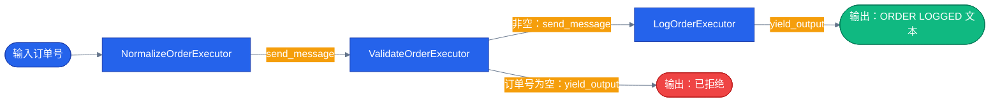

# 第 09 章 · 工作流执行器与边

[项目首页](../../README.md) · [教程总览](../README.md) · [术语表](../_shared/jargon-glossary.md)

把智能体调用从「一次原子请求」升级为**确定性的有向图**：执行器（节点）由边（消息路由）连接，按超步（superstep）调度，支持短路与扇出/扇入。

## 本章动机

第 01–08 章把每次智能体调用当作一次原子请求。真实的电商流程有**步骤**：校验输入 → 拉取评价 → 检查库存 → 综合出建议。你可以手工串起 `agent.run()` 调用，但一旦需要并行步骤、扇入屏障，或者某个步骤可以短路掉管线其余部分，手写的 `asyncio` 代码就变得难以推理 —— 而完整项目的购前调研流程需要的正是这种形态（三个工具调用并行，然后一个依赖它们结果的运费估算，最后一步综合）。

MAF 的**工作流（Workflow）**是由**执行器（Executor，工作单元）**经**边（Edge，消息路由）**连接而成的确定性有向无环图。它跑在「整体同步并行」（BSP，Pregel 风格）调度器上 —— 执行器按超步运行，在途消息在屏障处一次性刷新，然后下一个超步才开始。本章构建尽可能小的工作流 —— 三个执行器、两条边、一次短路 —— 好让机制在第 13 章用同一套原语做真实并发编排之前就清晰可见。

## 前置条件

- 已完成 [第 08 章 · MCP 工具](../08-mcp-tools/)
- 通过 `uv` 安装的 Python 3.12+
- 不需要任何环境变量 —— 本章运行的是纯粹做订单号转换的执行器，不涉及 LLM 调用

## 核心概念

| 构件 | 作用 |
|------|------|
| **Executor（执行器）** | 一个带若干类型化消息处理函数的类（Python 中为 `@handler`）。它接收一条消息，可以向下游继续发消息，也可以产出工作流输出。 |
| **Edge（边）** | 连接两个执行器。普通边转发每一条消息；条件边只在谓词返回真时转发。 |
| **WorkflowBuilder** | 把执行器与边接成一个 `Workflow`，并声明起始执行器。 |
| **WorkflowContext** | 传给每个处理函数。关键方法：`send_message(...)`（沿出边转发给下一个执行器）与 `yield_output(...)`（产出一个终止工作流的最终结果 —— 该调用之后，这条消息不再触发任何下游边）。 |

演示把三个执行器串成一条线 —— `NormalizeOrder → ValidateOrder → LogOrder` —— 其中 `ValidateOrder` 可以短路：空或只有空白的订单号会立即产出一个终止输出，`LogOrder` 永不运行。


```mermaid
%%{init: {'theme':'base', 'themeVariables': {
  'primaryColor': '#2563eb','primaryTextColor': '#ffffff','primaryBorderColor': '#1e40af',
  'lineColor': '#64748b','secondaryColor': '#f59e0b','tertiaryColor': '#10b981',
  'background': 'transparent'}}}%%
flowchart LR
  classDef core     fill:#2563eb,stroke:#1e40af,color:#ffffff
  classDef success  fill:#10b981,stroke:#047857,color:#ffffff
  classDef error    fill:#ef4444,stroke:#b91c1c,color:#ffffff

  input([输入订单号])
  norm[NormalizeOrderExecutor]
  validate[ValidateOrderExecutor]
  log[LogOrderExecutor]
  skipped([输出：已拒绝])
  logged([输出：ORDER LOGGED 文本])

  input --> norm
  norm -- "send_message" --> validate
  validate -- "订单号为空：yield_output" --> skipped
  validate -- "非空：send_message" --> log
  log -- "yield_output" --> logged

  class norm core
  class validate core
  class log core
  class logged success
  class skipped error
```

`ValidateOrderExecutor` 是唯一的分支点：空订单号走错误/跳过路径并立即产出结果；其他任何输入都会流经 `LogOrderExecutor` 到达成功输出。

## Python

在仓库根目录运行，共用 `tutorials/` 这一个 uv 项目（一次 `uv sync` 覆盖全部章节）：

```bash
uv sync --project tutorials
uv run --project tutorials python tutorials/09-workflow-executors-and-edges/python/main.py "ord-8842"
uv run --project tutorials python tutorials/09-workflow-executors-and-edges/python/main.py ""   # 空 -> 短路
```

源码：[`python/main.py`](./python/main.py)。三个执行器与构建函数：

```python
class ValidateOrderExecutor(Executor):
    """Routes valid order ids downstream; short-circuits empty ids to a terminal output."""

    def __init__(self) -> None:
        super().__init__(id="validate-order")

    @handler
    async def run(self, order_id: str, ctx: WorkflowContext[str, str]) -> None:
        if not order_id:
            # Yield a workflow-terminating output; no downstream executor will run.
            await ctx.yield_output("[rejected: empty order id]")
            return
        await ctx.send_message(order_id)


def build_workflow():
    normalize = NormalizeOrderExecutor()
    validate = ValidateOrderExecutor()
    log = LogOrderExecutor()
    return (
        WorkflowBuilder(start_executor=normalize)
        .add_edge(normalize, validate)
        .add_edge(validate, log)
        .build()
    )
```

`run()` 用 `workflow.run(order_id, stream=True)` 驱动工作流，并收集所有 `type` 为 `"output"` 的事件 —— 正常路径的 `ORDER LOGGED: ...` 结果与短路路径的 `[rejected: empty order id]` 结果都是这样暴露给调用方的；`main.py` 在导入 `agent_framework` 之前通过 `tutorials/_shared/maf_bootstrap.py` 完成引导。

## 常见坑

- **Python —— 不要漏掉 `WorkflowBuilder` 的 `start_executor=`。** 没有它，`.build()` 就没有入口点。
- **Python —— `yield_output` 对那条消息是终止性的。** 它产出的是工作流级输出；被产出的那个值不会再触发该执行器之后本来会走的边。
- **条件路由**：Python 的 `add_edge(...)` 接受一个可选的 `condition: (data) -> bool | Awaitable[bool]`（已在安装的 `agent_framework._workflows._workflow_builder` 模块中确认），用于在不完全短路的前提下做路由。本章演示不需要它 —— 短路直接表达在 `ValidateOrderExecutor` 内部 —— 但第 13 章的并发工作流会用到 `add_fan_out_edges` / `add_fan_in_edges`，那是一种相关但不同的并行分支机制。
- **旧的 MAF v1.0 打包缺陷与当前安装无关。** 本仓库早期版本为绕过某个 `agent_framework` wheel 附带空 `__init__.py` 的问题做过处理；`agents/python/patch_maf.py` 仍然存在，但相对于已锁定的 `agent-framework` 1.14.0+ 而言已是有文档记录的空操作，该缺陷在上游已修复。教程实际依赖的引导入口是 `tutorials/_shared/maf_bootstrap.py::bootstrap()`，它只在已安装的 `__init__.py` 仍为空、或带有旧补丁标记时才修补 —— 在当前安装下两者都不成立，于是它只加载 `.env` 然后返回。

## 测试

两种行为契约都要断言：正常路径的输出文本、空输入短路、纯空白短路，外加工作流接线与事件顺序检查。

```bash
uv run --project tutorials pytest tutorials/09-workflow-executors-and-edges/python/tests -v
```

- Python：[`python/tests/test_workflow.py`](./python/tests/test_workflow.py) —— 5 个测试，覆盖正常路径、空输入短路、纯空白短路、执行器/边接线（`workflow.get_executors_list()`），以及 `executor_invoked` 事件顺序。

## 在完整项目中的落点

完整项目的购前调研流程正是这个模式的生产版本，只是把线性链放大成扇出/扇入。`agents/python/workflows/pre_purchase.py` 为每个并行数据源定义一个 `Executor` 子类 —— `_ReviewsExecutor`（`agents/python/workflows/pre_purchase.py:60`）、`_StockExecutor`（`agents/python/workflows/pre_purchase.py:79`）、`_PriceHistoryExecutor`（`agents/python/workflows/pre_purchase.py:98`）—— 外加作为扇入屏障的 `_MergeAndShipExecutor`（`agents/python/workflows/pre_purchase.py:117`）与作为终止节点的 `_SynthesisExecutor`（`agents/python/workflows/pre_purchase.py:148`）。

`PrePurchaseWorkflow._build_maf_workflow()`（`agents/python/workflows/pre_purchase.py:229`）用本章演示不需要的扇出/扇入边辅助方法把它们接起来：

```python
return (
    WorkflowBuilder(start_executor=fan_out, name="pre-purchase")
    .add_fan_out_edges(fan_out, [reviews, stock, price])
    .add_fan_in_edges([reviews, stock, price], merge)
    .add_edge(merge, synthesis)
    .build()
)
```

`add_fan_out_edges` 把一条消息广播给三个在同一超步内并发运行的执行器；`add_fan_in_edges` 则是屏障 —— `_MergeAndShipExecutor.run(...)` 要等三者都发出消息之后才触发，并且它收到的是 `list[ResearchState]` 而不是单个值。这与上面那条 `Normalize → Validate → Log` 链用的是同一套「执行器 / 边」词汇，只是图更宽。

## 下一步

- 下一章：[第 10 章 · 工作流事件与构建器](../10-workflow-events-and-builder/)
- 完整源码：[`python/`](./python/)
- 共享材料：[Mermaid 风格指南](../_shared/mermaid-style-guide.md) · [术语表](../_shared/jargon-glossary.md)
