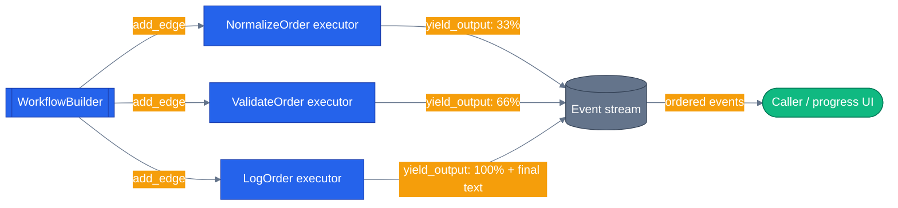

# Chapter 10 — Workflow Events and Builder

Two kinds of workflow events — automatic lifecycle events and the values your own executors yield — flow through the same stream. This chapter builds a live progress indicator on top of that stream, in Python and .NET, and shows a Python/​.NET API split worth knowing about before you build anything real on it.

## Why this chapter

A workflow that takes 30 seconds to finish needs to tell the caller *what it's doing* for those 30 seconds — not just hand back a final answer. `Workflow.run(..., stream=True)` (Python) and `InProcessExecution.RunStreamingAsync(...)` (.NET) already emit lifecycle events for every executor invocation and superstep; the interesting part is layering your own progress payloads into that same ordered stream so a caller can render a progress bar instead of staring at a spinner. In the capstone, this is exactly what backs the live "reviews / stock / price-history" progress the frontend shows while `workflow:pre-purchase` fans a request out to three specialist agents concurrently.

The two SDKs solve this the same way at a conceptual level but with a real API difference underneath — Python retired the "call `ctx.add_event()` with an arbitrary payload" pattern in favor of a build-time output designation, while .NET still emits distinct event subclasses directly. Knowing which one you're in matters the moment you copy a snippet from one language's docs into the other.

## Prerequisites

- Completed [Chapter 09 — Workflow Executors and Edges](../09-workflow-executors-and-edges/)
- Environment variables: none. This chapter's executors are pure order-id transformations — no LLM calls, no `OPENAI_API_KEY` needed.

## The concept

Every workflow run streams a sequence of `WorkflowEvent`s (Python) / `WorkflowEvent` subclasses (.NET). Some are automatic — `ExecutorInvokedEvent`, `ExecutorCompletedEvent`, `SuperStepStartedEvent`, and so on, one per executor per step, emitted by the framework whether you ask for them or not. Others are yours — values your executor produces mid-run that aren't the workflow's final answer, but that a caller still wants to see as they happen.

The three-executor pipeline from Chapter 09 (`NormalizeOrder -> ValidateOrder -> LogOrder`) is extended here so each executor reports a `ProgressPayload(step, percent)` before it does its real work. The final executor's actual output ("ORDER LOGGED: ...") flows through the same stream, distinguished from the progress payloads by shape, not by a separate channel.



WorkflowBuilder assembles the executor graph; each executor's `yield_output` calls land on the same ordered stream the caller iterates, interleaved with the framework's own lifecycle events.

## Python

Run from the repo root using the shared `tutorials/` uv project (one `uv sync` covers every chapter):

```bash
uv sync --project tutorials
uv run --project tutorials python tutorials/10-workflow-events-and-builder/python/main.py
uv run --project tutorials pytest tutorials/10-workflow-events-and-builder/python/tests -v
```

The current Python SDK (`agent-framework-core==1.14.0`, pinned in `tutorials/pyproject.toml`) does **not** use the `ctx.add_event(WorkflowEvent.emit(...))` pattern you may see in older MAF examples — that path is deprecated (`WorkflowEvent.emit()` raises a `DeprecationWarning` telling you to use `ctx.yield_output()` with `intermediate_output_from` instead, and `ctx.add_event()` now actively rejects/warns if an executor tries to emit an `output`/`intermediate`-typed event directly). `python/main.py` uses the current pattern — every executor calls `ctx.yield_output(...)`, and `WorkflowBuilder` decides whether a given executor's yields surface as `type="output"` or `type="intermediate"`:

```python
def build_workflow():
    normalize = NormalizeOrderExecutor()
    validate = ValidateOrderExecutor()
    log = LogOrderExecutor()
    return (
        WorkflowBuilder(
            start_executor=normalize,
            intermediate_output_from=[normalize, validate],
            output_from=[log],
        )
        .add_edge(normalize, validate)
        .add_edge(validate, log)
        .build()
    )
```

`NormalizeOrderExecutor` and `ValidateOrderExecutor` are listed under `intermediate_output_from`, so every `yield_output()` call they make surfaces as `type="intermediate"` — that's the progress channel. `LogOrderExecutor` is listed under `output_from`, so its yields surface as `type="output"` — the pipeline's real result. This designation is fixed per executor at build time, not chosen per call — which is why `ValidateOrderExecutor`'s early-exit `yield_output("[rejected: empty order id]")` still comes through as `type="intermediate"` even though it's really the terminal message for that run. The consumer tells progress from results by payload shape (`isinstance(data, ProgressPayload)`), not by the event's type label:

```python
async for event in workflow.run(text, stream=True):
    etype = getattr(event, "type", None)
    if etype not in ("output", "intermediate"):
        continue
    data = getattr(event, "data", None)
    if isinstance(data, ProgressPayload):
        progress.append(data)
    else:
        outputs.append(data)
```

Running it:

```
input: 'ord-8842'
  progress: normalize-order → 33%
  progress: validate-order → 66%
  progress: log-order → 100%
output: 'ORDER LOGGED: ORD-8842'
```

## .NET

```bash
cd tutorials/10-workflow-events-and-builder/dotnet
dotnet run
dotnet test
```

.NET keeps the "define your own event subclass" model. `ProgressEvent` subclasses `WorkflowEvent` directly, and executors emit it with `context.AddEventAsync(...)` — a genuinely separate call from `YieldOutputAsync`, unlike Python where progress and output both go through `yield_output` and only the build-time designation tells them apart:

```csharp
internal sealed class ProgressEvent(string step, int percent)
    : WorkflowEvent(new ProgressPayload(step, percent))
{
    public string Step => ((ProgressPayload)Data!).Step;
    public int Percent => ((ProgressPayload)Data!).Percent;
}

[MessageHandler]
public async ValueTask HandleAsync(string orderId, IWorkflowContext context, CancellationToken ct = default)
{
    await context.AddEventAsync(new ProgressEvent("normalize-order", 33), ct);
    await context.SendMessageAsync(orderId.Trim().ToUpperInvariant(), ct);
}
```

The consumer pattern-matches on the concrete event type as it streams:

```csharp
await foreach (WorkflowEvent evt in run.WatchStreamAsync())
{
    switch (evt)
    {
        case ProgressEvent p: Console.WriteLine($"  [progress] {p.Step,-14} -> {p.Percent,3}%"); break;
        case ExecutorInvokedEvent i: Console.WriteLine($"[lifecycle] executor_invoked {i.ExecutorId}"); break;
        case WorkflowOutputEvent o: Console.WriteLine($"  [output]   {o.Data}"); break;
    }
}
```

`WorkflowFactory.Build()` uses `.WithOutputFrom(validate, log)` — either executor can be the source of the final workflow output, since `ValidateOrderExecutor` short-circuits on an empty order id and `LogOrderExecutor` is the normal terminal step.

## Side-by-side differences

| Aspect | Python | .NET |
|--------|--------|------|
| Progress channel | `ctx.yield_output(payload)` from an executor listed under `intermediate_output_from` | `context.AddEventAsync(new ProgressEvent(...))` — a distinct call from `YieldOutputAsync` |
| Final output | `ctx.yield_output(payload)` from an executor listed under `output_from` | `context.YieldOutputAsync(payload)` |
| Telling progress from output | By payload shape (`isinstance(data, ProgressPayload)`) — both share `type="intermediate"`/`"output"` labels set at build time per executor | By event type via `switch` pattern-matching (`ProgressEvent` vs. `WorkflowOutputEvent`) |
| Old "emit anything" API | `WorkflowEvent.emit()` / `ctx.add_event()` with an arbitrary payload — **deprecated**, warns at runtime | `AddEventAsync` with a custom `WorkflowEvent` subclass — still the standard pattern |
| Stream API | `workflow.run(input, stream=True)` | `InProcessExecution.RunStreamingAsync(workflow, input)` + `run.WatchStreamAsync()` |

## Gotchas

- **Don't port the Python `add_event()` pattern from older examples or blog posts.** `WorkflowEvent.emit()` triggers a `DeprecationWarning` and `ctx.add_event()` now silently drops (and logs a warning for) any executor-origin event typed `output`/`intermediate` — use `ctx.yield_output()` with `intermediate_output_from`/`output_from` instead.
- **The output/intermediate label is fixed per executor, not per call.** Every `yield_output()` call from a given executor carries the same label, decided by which list (`output_from` / `intermediate_output_from`) that executor was passed to at `WorkflowBuilder` construction time. You can't have one executor emit some yields as progress and others as final output — see `ValidateOrderExecutor`'s short-circuit case in `python/main.py`, which still yields `type="intermediate"` even though `"[rejected: empty order id]"` is really the terminal message for that run.
- **Short-circuited branches drop downstream progress.** If `ValidateOrderExecutor` yields its short-circuit output and returns without calling `send_message`, `LogOrderExecutor` never runs, and its 100% progress event never fires. `test_short_circuit_stops_at_validate_before_log_progress` (Python) and `Empty_Order_Id_Short_Circuits_Before_Log_Emits_Progress` (.NET) lock that in.
- **Filter by payload shape in Python, not by type label alone** — both `ProgressPayload` and a plain-string result can carry `type="intermediate"` (see `ValidateOrderExecutor`'s short-circuit above), so `isinstance()` on the payload is the reliable discriminator, not the event's `type`.

## Tests

Both languages ship unit tests exercising the same five behaviors — see `tutorials/10-workflow-events-and-builder/python/tests/test_events.py` and `tutorials/10-workflow-events-and-builder/dotnet/tests/EventsTests.cs`:

1. Progress events emit in pipeline order with the expected percentages.
2. Progress events carry the structured `ProgressPayload` (not a raw string).
3. Empty order id short-circuits at `validate-order`, so `log-order`'s progress event never fires.
4. The final output arrives after the last progress event, not before it.
5. Events stream incrementally rather than batching — the .NET suite adds a sixth test asserting lifecycle and custom events interleave in true arrival order (`Lifecycle_Events_Interleave_With_Custom_Events_In_Arrival_Order`).

```bash
uv run --project tutorials pytest tutorials/10-workflow-events-and-builder/python/tests -v
cd tutorials/10-workflow-events-and-builder/dotnet && dotnet test
```

## How this shows up in the capstone

- `agents/python/orchestrator/events.py` defines `OrchestrationEvent`, the normalized event shape (`kind`, `node_id`, `agent`, `payload`, `ts_ms`) that unifies workflow events, agent-run events, and tool-router steps into one protocol the web UI consumes — see the class docstring around `agents/python/orchestrator/events.py:44`.
- `agents/python/workflows/pre_purchase.py:229`'s `_build_maf_workflow()` is a real `WorkflowBuilder` fan-out/fan-in graph in production: `add_fan_out_edges(fan_out, [reviews, stock, price])` runs the reviews, stock, and price-history executors concurrently, then `add_fan_in_edges([reviews, stock, price], merge)` joins them before `synthesis`. `execute()` (`agents/python/workflows/pre_purchase.py:245`) streams that workflow with `workflow.run(state, stream=True)` and filters on `event.type == "output"` — the same pattern this chapter's `run_with_events()` uses, just with a single `ResearchState` output instead of a progress/output split.

## What's next

- Next chapter: [Chapter 11 — Agents in Workflows](../11-agents-in-workflows/)
- Full source: [`python/`](./python/) · [`dotnet/`](./dotnet/)
- Shared: [Mermaid style guide](../_shared/mermaid-style-guide.md) · [Jargon glossary](../_shared/jargon-glossary.md)
