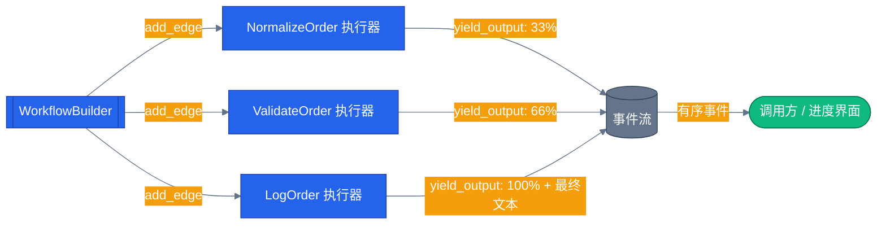

# 第 10 章 · 工作流事件与构建器

[项目首页](../../README.md) · [教程总览](../README.md) · [术语表](../_shared/jargon-glossary.md)

两类工作流事件 —— 框架自动发出的生命周期事件，以及你自己的执行器产出的值 —— 流经**同一条**事件流。本章在这条流上搭一个实时进度指示器。

## 本章动机

一个要跑 30 秒的工作流，需要在这 30 秒里告诉调用方**它在做什么** —— 而不只是最后交回一个答案。`Workflow.run(..., stream=True)` 已经为每次执行器调用与每个超步发出生命周期事件；真正有意思的部分，是把你自己的进度载荷叠进同一条有序的流里，于是调用方能渲染一个进度条，而不是盯着转圈。

在完整项目中，这正是前端在 `workflow:pre-purchase` 把请求扇出给三个专家智能体时、所展示的实时「评价 / 库存 / 价格历史」进度的底层机制。

## 前置条件

- 已完成 [第 09 章 · 工作流执行器与边](../09-workflow-executors-and-edges/)
- 环境变量：无。本章的执行器是纯粹的订单号变换 —— 不涉及 LLM 调用，也不需要 `OPENAI_API_KEY`。

## 核心概念

每次工作流运行都会流出一串 `WorkflowEvent`。其中一些是**自动**的 —— `ExecutorInvokedEvent`、`ExecutorCompletedEvent`、`SuperStepStartedEvent` 等等，每步每个执行器各一条，无论你是否要求，框架都会发出。另一些是**你自己的** —— 执行器在运行过程中产出、并非工作流最终答案，但调用方仍希望实时看到的值。

第 09 章那个三执行器管线（`NormalizeOrder -> ValidateOrder -> LogOrder`）在这里被扩展：每个执行器在做真正的工作之前，先上报一条 `ProgressPayload(step, percent)`。最后一个执行器的真实输出（`ORDER LOGGED: ...`）流经同一条流，靠**形态**而不是靠另一条通道来区分。


```mermaid
%%{init: {'theme':'base', 'themeVariables': {
  'primaryColor': '#2563eb','primaryTextColor': '#ffffff','primaryBorderColor': '#1e40af',
  'lineColor': '#64748b','secondaryColor': '#f59e0b','tertiaryColor': '#10b981',
  'background': 'transparent'}}}%%
flowchart LR
  classDef core     fill:#2563eb,stroke:#1e40af,color:#ffffff
  classDef external fill:#f59e0b,stroke:#b45309,color:#000000
  classDef success  fill:#10b981,stroke:#047857,color:#ffffff
  classDef infra    fill:#64748b,stroke:#334155,color:#ffffff

  builder[[WorkflowBuilder]]
  norm[NormalizeOrder 执行器]
  validate[ValidateOrder 执行器]
  log[LogOrder 执行器]
  stream[(事件流)]
  caller([调用方 / 进度界面])

  builder -- "add_edge" --> norm
  builder -- "add_edge" --> validate
  builder -- "add_edge" --> log
  norm -- "yield_output: 33%" --> stream
  validate -- "yield_output: 66%" --> stream
  log -- "yield_output: 100% + 最终文本" --> stream
  stream -- "有序事件" --> caller

  class builder core
  class norm core
  class validate core
  class log core
  class stream infra
  class caller success
```

WorkflowBuilder 组装执行器图；各执行器 `yield_output` 的调用落在调用方所迭代的同一条有序流上，与框架自身的生命周期事件交错。

## Python

在仓库根目录运行，共用 `tutorials/` 这一个 uv 项目（一次 `uv sync` 覆盖全部章节）：

```bash
uv sync --project tutorials
uv run --project tutorials python tutorials/10-workflow-events-and-builder/python/main.py
```

当前 Python SDK（`tutorials/pyproject.toml` 中锁定的 `agent-framework-core==1.14.0`）**不使用**你在旧版 MAF 示例里可能看到的 `ctx.add_event(WorkflowEvent.emit(...))` 模式 —— 那条路径已废弃（`WorkflowEvent.emit()` 会抛 `DeprecationWarning`，提示你改用 `ctx.yield_output()` 配合 `intermediate_output_from`；而 `ctx.add_event()` 现在会主动拒绝或警告执行器直接发出 `output` / `intermediate` 类型的事件）。`python/main.py` 用的是当前模式 —— 每个执行器都调用 `ctx.yield_output(...)`，由 `WorkflowBuilder` 决定某个执行器的产出是以 `type="output"` 还是 `type="intermediate"` 呈现：

```python
def build_workflow():
    normalize = NormalizeOrderExecutor()
    validate = ValidateOrderExecutor()
    log = LogOrderExecutor()
    return (
        WorkflowBuilder(
            start_executor=normalize,
            intermediate_output_from=[normalize, validate],
            output_from=[log],
        )
        .add_edge(normalize, validate)
        .add_edge(validate, log)
        .build()
    )
```

`NormalizeOrderExecutor` 与 `ValidateOrderExecutor` 列在 `intermediate_output_from` 下，因此它们的每次 `yield_output()` 都以 `type="intermediate"` 呈现 —— 这就是进度通道。`LogOrderExecutor` 列在 `output_from` 下，它的产出以 `type="output"` 呈现 —— 那是管线真正的结果。**这个指定是构建时按执行器固定下来的，不是每次调用现选的** —— 这也是为什么 `ValidateOrderExecutor` 提前退出的那句 `yield_output("[rejected: empty order id]")` 仍然以 `type="intermediate"` 出现，尽管它其实是该次运行的终止消息。消费方靠**载荷形态**（`isinstance(data, ProgressPayload)`）而不是事件类型标签来区分进度与结果：

```python
async for event in workflow.run(text, stream=True):
    etype = getattr(event, "type", None)
    if etype not in ("output", "intermediate"):
        continue
    data = getattr(event, "data", None)
    if isinstance(data, ProgressPayload):
        progress.append(data)
    else:
        outputs.append(data)
```

运行结果：

```
input: 'ord-8842'
  progress: normalize-order → 33%
  progress: validate-order → 66%
  progress: log-order → 100%
output: 'ORDER LOGGED: ORD-8842'
```

## 常见坑

- **不要把旧示例或博客里的 Python `add_event()` 模式搬过来。** `WorkflowEvent.emit()` 会触发 `DeprecationWarning`，而 `ctx.add_event()` 现在会静默丢弃（并记一条警告）任何来自执行器、类型为 `output` / `intermediate` 的事件 —— 请改用 `ctx.yield_output()` 配合 `intermediate_output_from` / `output_from`。
- **输出 / 中间的标签是按执行器固定的，不是按调用固定的。** 某个执行器的每次 `yield_output()` 都带同一个标签，由它在 `WorkflowBuilder` 构造时被传进哪个列表（`output_from` / `intermediate_output_from`）决定。你无法让同一个执行器的一部分产出当进度、另一部分当最终输出 —— 见 `python/main.py` 中 `ValidateOrderExecutor` 的短路情形：尽管 `"[rejected: empty order id]"` 实际是那次运行的终止消息，它仍然以 `type="intermediate"` 产出。
- **被短路的支路会丢掉下游进度。** 如果 `ValidateOrderExecutor` 产出了短路输出并直接返回、没有调用 `send_message`，那么 `LogOrderExecutor` 永不运行，它那条 100% 进度事件也永不触发。`test_short_circuit_stops_at_validate_before_log_progress` 把这一点锁住了。
- **在 Python 里按载荷形态过滤，不要只看类型标签** —— `ProgressPayload` 与一个普通字符串结果都可能带 `type="intermediate"`（见上面 `ValidateOrderExecutor` 的短路），因此对载荷做 `isinstance()` 才是可靠的判别方式，而不是看事件的 `type`。

## 测试

`tutorials/10-workflow-events-and-builder/python/tests/test_events.py` 覆盖同样五种行为：

1. 进度事件按管线顺序、以预期百分比发出。
2. 进度事件携带结构化的 `ProgressPayload`（而不是裸字符串）。
3. 空订单号在 `validate-order` 处短路，因此 `log-order` 的进度事件永不触发。
4. 最终输出在最后一条进度事件**之后**到达，而不是之前。
5. 事件是增量流出的，而不是攒批后一次性吐出。

```bash
uv run --project tutorials pytest tutorials/10-workflow-events-and-builder/python/tests -v
```

## 在完整项目中的落点

- `agents/python/orchestrator/events.py` 定义了 `OrchestrationEvent` —— 归一化后的事件形态（`kind`、`node_id`、`agent`、`payload`、`ts_ms`），它把工作流事件、智能体运行事件与工具路由步骤统一成一套供 Web 界面消费的协议。见 `agents/python/orchestrator/events.py:44` 附近的类文档字符串。
- `agents/python/workflows/pre_purchase.py:229` 的 `_build_maf_workflow()` 是生产环境里一个真实的 `WorkflowBuilder` 扇出/扇入图：`add_fan_out_edges(fan_out, [reviews, stock, price])` 让评价、库存、价格历史三个执行器并发运行，随后 `add_fan_in_edges([reviews, stock, price], merge)` 在 `synthesis` 之前把它们汇合。`execute()`（`agents/python/workflows/pre_purchase.py:245`）用 `workflow.run(state, stream=True)` 流式驱动该工作流，并按 `event.type == "output"` 过滤 —— 与本章 `run_with_events()` 相同的模式，只是输出是单个 `ResearchState`，而不是「进度 / 输出」二分。

## 下一步

- 下一章：[第 11 章 · 工作流中的智能体](../11-agents-in-workflows/)
- 完整源码：[`python/`](./python/)
- 共享材料：[Mermaid 风格指南](../_shared/mermaid-style-guide.md) · [术语表](../_shared/jargon-glossary.md)
