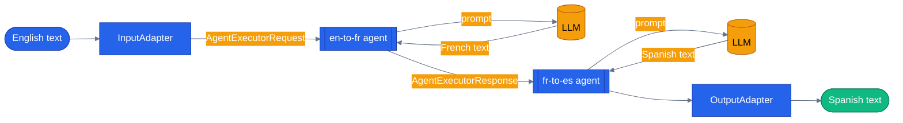

# Chapter 11 — Agents in Workflows

## Why this chapter

Chapters 09–10 built raw executors that transform plain data — strings in, strings out, no LLM involved. This chapter replaces one of those executors with an **agent**: an LLM-powered step that takes a message and produces another. The result is a workflow that can mix deterministic steps (validation, enrichment, merging) with LLM steps (translation, summarization, judgment) in the same graph, without the graph itself caring which is which.

The running example is deliberately simple so the wiring stays visible: **English → French → Spanish** translation. Each arrow in the graph is a real LLM call; the workflow's job is only to pass the previous agent's output as the next agent's input, with zero glue code in between.

This is the same shape the capstone uses for real work — an agent embedded as one node in a bigger pipeline, its output consumed by whatever comes next. See "How this shows up in the capstone" below for the production example.

## Prerequisites

- Completed [Chapter 10 — Workflow Events and Builder](../10-workflow-events-and-builder/)
- Repo-root `.env` with working LLM credentials — either OpenAI (`OPENAI_API_KEY`, optional `LLM_MODEL`, default `gpt-4.1`) or Azure OpenAI (`AZURE_OPENAI_ENDPOINT`, `AZURE_OPENAI_KEY`, `AZURE_OPENAI_DEPLOYMENT`, optional `AZURE_OPENAI_API_VERSION`, default `2024-10-21`)

## The concept

An **agent-executor** is a workflow node whose `run()` handler doesn't transform data directly — it hands the incoming message to an `Agent`, awaits the LLM call, and forwards the agent's response downstream. Two ways to get there:

- **Manual adapter pattern** (what Python's `main.py` and .NET's `--manual` mode do): you write plain `Executor` subclasses. An `InputAdapter` coerces the workflow's raw input into whatever shape the agent step expects; the agent step calls the LLM; an `OutputAdapter` unwraps the agent's response back into a plain value the workflow can yield. Explicit, verbose, and exactly what production code does when a workflow mixes agents with non-agent steps (see the capstone pointer).
- **Convenience builder** (.NET's default `--sequential` mode, via `AgentWorkflowBuilder.BuildSequential`): when every step in the chain is an agent and they just run in sequence, the framework wires the input/output adapters for you. One call instead of four classes.

Either way, the key discipline is the same: agent steps pass structured request/response types internally (Python's `AgentExecutorRequest`/`AgentExecutorResponse` when using the framework's own `AgentExecutor`, or your own DTOs in the manual pattern) — you adapt at the workflow's boundaries so the graph's public input and output stay plain, testable types.



Two real LLM calls happen inside this graph — the French translator's output becomes the Spanish translator's input with no application code touching the string in between.

## Python

Run from the repo root using the shared `tutorials/` uv project (one `uv sync` covers every chapter):

```bash
uv sync --project tutorials
uv run --project tutorials python tutorials/11-agents-in-workflows/python/main.py
uv run --project tutorials pytest tutorials/11-agents-in-workflows/python/tests -v
```

`tutorials/11-agents-in-workflows/python/main.py` uses the framework's built-in `AgentExecutor` to wrap each translator, plus two hand-written adapters at the boundaries:

```python
class InputAdapter(Executor):
    """Converts the workflow input (a plain string) into an AgentExecutorRequest."""

    def __init__(self) -> None:
        super().__init__(id="input-adapter")

    @handler
    async def run(self, message: str, ctx: WorkflowContext[AgentExecutorRequest]) -> None:
        await ctx.send_message(
            AgentExecutorRequest(
                messages=[Message(role="user", contents=[message])],
                should_respond=True,
            )
        )


def build_workflow():
    input_adapter = InputAdapter()
    english_to_french = AgentExecutor(translator("French", name="en-to-fr"), id="en-to-fr")
    french_to_spanish = AgentExecutor(translator("Spanish", name="fr-to-es"), id="fr-to-es")
    output_adapter = OutputAdapter()

    return (
        WorkflowBuilder(start_executor=input_adapter)
        .add_edge(input_adapter, english_to_french)
        .add_edge(english_to_french, french_to_spanish)
        .add_edge(french_to_spanish, output_adapter)
        .build()
    )
```

`OutputAdapter` is the mirror image — it unwraps the final `AgentExecutorResponse` and yields `response.agent_response.text` as the workflow's plain-string output. Running the demo prints:

```
English input: Hello, how are you?
Spanish output: Hola, ¿cómo estás?
```

## .NET

```bash
cd tutorials/11-agents-in-workflows/dotnet
dotnet build
dotnet run -- --sequential "Hello, how are you?"   # convenience builder
dotnet run -- --manual     "Hello, how are you?"   # manual adapter pattern
dotnet test
```

`tutorials/11-agents-in-workflows/dotnet/Program.cs` teaches both patterns side by side. The convenience path (`SequentialAgentWorkflow`, the `--sequential` default) hands two `AIAgent`s straight to `AgentWorkflowBuilder.BuildSequential`:

```csharp
AIAgent enToFr = Program.TranslationAgent(chatClient, "French", id: "en-to-fr");
AIAgent frToEs = Program.TranslationAgent(chatClient, "Spanish", id: "fr-to-es");

// The whole chain, wrapped and wired in one call. BuildSequential
// inserts the input/output adapters internally so the workflow
// takes a List<ChatMessage> in and surfaces a List<ChatMessage> out.
Workflow workflow = AgentWorkflowBuilder.BuildSequential(enToFr, frToEs);

var messages = new List<ChatMessage> { new(ChatRole.User, input) };
await using StreamingRun run = await InProcessExecution.RunStreamingAsync(workflow, messages);

// TurnToken triggers the wrapped agents: AgentExecutor caches
// inbound messages and only calls the LLM once a TurnToken arrives.
await run.TrySendMessageAsync(new TurnToken(emitEvents: true));
```

The `--manual` path (`ManualAdapterWorkflow`) builds the graph from custom `[MessageHandler]` executors — `InputAdapter`, two `TranslationAgentExecutor`s, and `OutputAdapter` — wired with the same raw `WorkflowBuilder.AddEdge` calls Chapters 09–10 used. It exists to show what `BuildSequential` is doing under the hood, and it's the pattern you drop down to once a graph mixes agents with non-agent steps.

## Side-by-side differences

| Aspect | Python | .NET |
|--------|--------|------|
| Wrapping an agent | Manual: `AgentExecutor(agent, id="...")` inside `WorkflowBuilder` | Convenience: `AgentWorkflowBuilder.BuildSequential(agents)`, or manual `[MessageHandler]` executors for custom graphs |
| Input/output adapters | Always explicit — you write `InputAdapter`/`OutputAdapter` | Handled internally by `BuildSequential`; explicit only in the `--manual` mode |
| Trigger to run the LLM | `should_respond=True` on `AgentExecutorRequest` | `TurnToken` sent into the running workflow |
| Request/response types | `AgentExecutorRequest` / `AgentExecutorResponse` | `List<ChatMessage>` in, `AgentResponseUpdate` events out (convenience path) |

Python's explicit boundary executors are more verbose but make the data shape obvious in tests. .NET's convenience builder is faster once you're past the basics, and its manual mode maps onto the exact same shape as Python's.

## Gotchas

- **Don't mix input types across agent-executors.** The framework's `AgentExecutor` communicates in `AgentExecutorRequest`/`AgentExecutorResponse` — sending a raw string to one directly (skipping `InputAdapter`) fails at runtime, not at build time.
- **`should_respond=True` matters** (Python). When `False`, the wrapped agent appends the message to its history but doesn't call the LLM — useful for pre-seeding context across a multi-turn workflow, easy to forget and end up with a silent no-op step.
- **.NET's `TurnToken` is easy to miss.** `BuildSequential` wires the graph, but nothing calls the LLM until you send a `TurnToken` into the running `StreamingRun` — omit it and the workflow just sits there.
- **The old "MAF v1.0 wheel ships an empty `__init__.py`" packaging bug is fixed upstream.** This repo now pins `agent-framework` 1.14.0, which ships a real `__init__.py`. `agents/python/patch_maf.py` is kept as a documented no-op defensive fallback (it only writes when the target file is empty). The bootstrap tutorials actually rely on is `tutorials/_shared/maf_bootstrap.py`, called at the top of every chapter's `main.py` and test module — it loads the repo-root `.env` and idempotently normalizes the package's re-exports.

## Tests

Python ships one workflow-wiring unit test (asserts all four executor IDs are present in the built graph, no LLM call) plus a replay-based integration test (`tutorials/11-agents-in-workflows/python/tests/fixtures/replay/*.json` — recorded once against a real LLM, replayed with `LLM_PROVIDER=replay`, no network or credentials needed) and three real-LLM integration tests gated on `OPENAI_API_KEY`/Azure credentials being present:

```bash
uv run --project tutorials pytest tutorials/11-agents-in-workflows/python/tests -v
```

.NET ships wiring tests against a scripted fake `IChatClient` (asserts the final output string and that both agent-executors fire in order) plus real-LLM integration tests skipped without credentials:

```bash
cd tutorials/11-agents-in-workflows/dotnet
dotnet test
```

## How this shows up in the capstone

The first production caller of an agent-backed responder inside a MAF workflow is `agents/python/orchestrator/modes/group_chat_mode.py:65` — `_make_agent_responder()` constructs a MAF `Agent` per panelist and calls `agent.run(prompt)` inside an `async` closure. That closure is passed as the `Responder` for `agents/python/workflows/group_chat.py`'s `_PanelistExecutor`, which `await`s it if it's awaitable (`agents/python/workflows/group_chat.py:69`) — the same manual-adapter shape this chapter teaches, except the "adapter" is a plain async closure instead of a full `Executor` subclass, because `group_chat.py` was written to stay LLM-agnostic and only `orchestrator/modes/group_chat_mode.py` knows about `Agent`. The workflow itself (panelists take turns over a shared transcript, then a moderator synthesizes a verdict) is reachable in the running app via `mode=group-chat` in `/api/chat`.

## What's next

- Next chapter: [Chapter 12 — Sequential Orchestration](../12-sequential-orchestration/)
- Full source: [`python/`](./python/) · [`dotnet/`](./dotnet/)
- Shared: [Mermaid style guide](../_shared/mermaid-style-guide.md)
- [MAF docs — Agents in Workflows](https://learn.microsoft.com/en-us/agent-framework/workflows/agents-in-workflows/)
