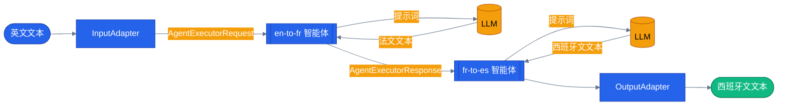

# 第 11 章 · 工作流中的智能体

[项目首页](../../README.md) · [教程总览](../README.md) · [术语表](../_shared/jargon-glossary.md)

把工作流里的某个执行器换成**智能体** —— 一个由 LLM 驱动的步骤。于是同一张图里既能放确定性步骤（校验、补全、合并），也能放 LLM 步骤（翻译、摘要、判断），而图本身不关心哪个是哪个。

## 本章动机

第 09–10 章构建的是转换纯数据的原始执行器 —— 字符串进、字符串出，不涉及 LLM。本章把其中一个执行器换成**智能体**：一个由 LLM 驱动的步骤，接收一条消息并产出另一条。结果是一个能在同一张图里混用确定性步骤（校验、补全、合并）与 LLM 步骤（翻译、摘要、判断）的工作流，而图本身不关心哪个是哪个。

运行示例刻意做得简单，好让接线保持可见：**英文 → 法文 → 西班牙文**翻译。图中的每一支箭头都是一次真实的 LLM 调用；工作流的工作只是把上一个智能体的输出作为下一个智能体的输入传下去，中间零胶水代码。

这正是完整项目做真实工作时所用的形态 —— 一个智能体作为更大管线中的一个节点嵌入，其输出被下游消费。

## 前置条件

- 已完成 [第 10 章 · 工作流事件与构建器](../10-workflow-events-and-builder/)
- 仓库根目录的 `.env` 中有可用的 LLM 凭据 —— 要么 OpenAI（`OPENAI_API_KEY`，可选 `LLM_MODEL`，默认 `gpt-4.1`），要么 Azure OpenAI（`AZURE_OPENAI_ENDPOINT`、`AZURE_OPENAI_KEY`、`AZURE_OPENAI_DEPLOYMENT`，可选 `AZURE_OPENAI_API_VERSION`，默认 `2024-10-21`）

## 核心概念

**智能体执行器（agent-executor）** 是一个工作流节点，它的 `run()` 处理函数不直接转换数据 —— 它把进来的消息交给 `Agent`，等待 LLM 调用，再把智能体的响应转发给下游。有两条路到达那里：

- **手工适配器模式**（Python 的 `main.py` 走的就是这条）：你自己写普通的 `Executor` 子类。一个 `InputAdapter` 把工作流的原始输入强制转换成智能体步骤期望的形态；智能体步骤调用 LLM；一个 `OutputAdapter` 把智能体的响应解包回工作流可以产出的普通值。显式、啰嗦，而当工作流把智能体与非智能体步骤混在一起时，这正是生产代码的做法。
- **便捷构建器**：当链上每一步都是智能体、且只是顺序执行时，框架替你接好输入/输出适配器。一次调用，而不是四个类。

无论走哪条路，关键纪律相同：智能体步骤在**内部**传递结构化的请求/响应类型 —— 你在工作流的**边界**上做适配，使图对外的输入与输出保持为普通、可测试的类型。


```mermaid
%%{init: {'theme':'base', 'themeVariables': {
  'primaryColor': '#2563eb','primaryTextColor': '#ffffff','primaryBorderColor': '#1e40af',
  'lineColor': '#64748b','secondaryColor': '#f59e0b','tertiaryColor': '#10b981',
  'background': 'transparent'}}}%%
flowchart LR
  classDef core     fill:#2563eb,stroke:#1e40af,color:#ffffff
  classDef external fill:#f59e0b,stroke:#b45309,color:#000000
  classDef success  fill:#10b981,stroke:#047857,color:#ffffff

  input([英文文本])
  inAdapter[InputAdapter]
  fr[[en-to-fr 智能体]]
  llm1[(LLM)]
  es[[fr-to-es 智能体]]
  llm2[(LLM)]
  outAdapter[OutputAdapter]
  output([西班牙文文本])

  input --> inAdapter
  inAdapter -- "AgentExecutorRequest" --> fr
  fr -- "提示词" --> llm1
  llm1 -- "法文文本" --> fr
  fr -- "AgentExecutorResponse" --> es
  es -- "提示词" --> llm2
  llm2 -- "西班牙文文本" --> es
  es --> outAdapter
  outAdapter --> output

  class inAdapter core
  class outAdapter core
  class fr core
  class es core
  class llm1 external
  class llm2 external
  class output success
```

这张图内部发生两次真实的 LLM 调用 —— 法文译者的输出成为西班牙文译者的输入，中间没有任何应用代码碰过那个字符串。

## Python

在仓库根目录运行，共用 `tutorials/` 这一个 uv 项目（一次 `uv sync` 覆盖全部章节）：

```bash
uv sync --project tutorials
uv run --project tutorials python tutorials/11-agents-in-workflows/python/main.py
```

`python/main.py` 用框架内置的 `AgentExecutor` 包装每个译者，并在边界处加两个手写适配器：

```python
class InputAdapter(Executor):
    """Converts the workflow input (a plain string) into an AgentExecutorRequest."""

    def __init__(self) -> None:
        super().__init__(id="input-adapter")

    @handler
    async def run(self, message: str, ctx: WorkflowContext[AgentExecutorRequest]) -> None:
        await ctx.send_message(
            AgentExecutorRequest(
                messages=[Message(role="user", contents=[message])],
                should_respond=True,
            )
        )


def build_workflow():
    input_adapter = InputAdapter()
    english_to_french = AgentExecutor(translator("French", name="en-to-fr"), id="en-to-fr")
    french_to_spanish = AgentExecutor(translator("Spanish", name="fr-to-es"), id="fr-to-es")
    output_adapter = OutputAdapter()

    return (
        WorkflowBuilder(start_executor=input_adapter)
        .add_edge(input_adapter, english_to_french)
        .add_edge(english_to_french, french_to_spanish)
        .add_edge(french_to_spanish, output_adapter)
        .build()
    )
```

`OutputAdapter` 是它的镜像 —— 它解包最终的 `AgentExecutorResponse`，并把 `response.agent_response.text` 作为工作流的普通字符串输出产出。运行演示会打印：

```
English input: Hello, how are you?
Spanish output: Hola, ¿cómo estás?
```

## 常见坑

- **不要跨智能体执行器混用输入类型。** 框架的 `AgentExecutor` 以 `AgentExecutorRequest` / `AgentExecutorResponse` 通信 —— 直接给它发一个裸字符串（跳过 `InputAdapter`）会在**运行时**失败，而不是构建时。
- **`should_respond=True` 很重要。** 当它为 `False` 时，被包装的智能体会把消息追加进历史但不调用 LLM —— 这对在多轮工作流里预置上下文很有用，但也容易忘记，结果得到一个静默的空操作步骤。
- **旧的「MAF v1.0 wheel 附带空 `__init__.py`」打包缺陷已在上游修复。** 本仓库现已锁定 `agent-framework` 1.14.0，它带有真实的 `__init__.py`。`agents/python/patch_maf.py` 作为有文档记录的空操作防御性回退保留（只有目标文件为空时它才写入）。教程实际依赖的引导入口是 `tutorials/_shared/maf_bootstrap.py`，它在每章 `main.py` 与测试模块的顶部被调用 —— 它加载仓库根目录的 `.env`，并幂等地归一化该包的再导出。

## 测试

Python 提供一个工作流接线单元测试（断言四个执行器 id 都在构建出的图中出现，不调用 LLM），外加一个基于回放的集成测试（`tutorials/11-agents-in-workflows/python/tests/fixtures/replay/*.json` —— 曾针对真实 LLM 录制一次，之后用 `LLM_PROVIDER=replay` 回放，无需网络与凭据），以及三个以 `OPENAI_API_KEY` / Azure 凭据为前提的真实 LLM 集成测试：

```bash
uv run --project tutorials pytest tutorials/11-agents-in-workflows/python/tests -v
```

## 在完整项目中的落点

在生产环境中，一个「由智能体支撑的应答者」嵌入 MAF 工作流的第一个调用方是 `agents/python/orchestrator/modes/group_chat_mode.py:65` —— `_make_agent_responder()` 为每位小组成员构造一个 MAF `Agent`，并在一个 `async` 闭包内调用 `agent.run(prompt)`。该闭包被作为 `Responder` 传给 `agents/python/workflows/group_chat.py` 的 `_PanelistExecutor`，后者在它可等待时 `await` 它（`agents/python/workflows/group_chat.py:69`）—— 与本章所教相同的手工适配器形态，只不过那个「适配器」是一个普通的 async 闭包，而不是完整的 `Executor` 子类，因为 `group_chat.py` 被写成对 LLM 无感知，只有 `orchestrator/modes/group_chat_mode.py` 知道 `Agent` 的存在。该工作流本身（小组成员围绕共享记录轮流发言，然后由主持人综合出结论）在运行中的应用里可通过 `/api/chat` 的 `mode=group-chat` 触达。

## 下一步

- 下一章：[第 12 章 · 顺序编排](../12-sequential-orchestration/)
- 完整源码：[`python/`](./python/)
- 共享材料：[Mermaid 风格指南](../_shared/mermaid-style-guide.md) · [术语表](../_shared/jargon-glossary.md)
- [MAF 官方文档 —— 工作流中的智能体](https://learn.microsoft.com/en-us/agent-framework/workflows/agents-in-workflows/)
