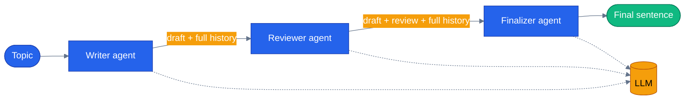

# Chapter 12 — Sequential Orchestration

The assembly-line pattern for agents: `SequentialBuilder` (Python) / `AgentWorkflowBuilder.BuildSequential` (.NET) chains a list of agents into a pipeline where each one sees the full conversation so far and appends its own turn — no manual adapters like the ones Chapter 11 wrote by hand.

## Why this chapter

Chapter 11 wrapped a single `ChatClientAgent` as a workflow executor and wired the input/output adapters yourself. Sequential generalizes that to a chain of N agents: **Writer → Reviewer → Finalizer** is the canonical example here, but the same shape drives a real production flow in this repo — the return/replace pipeline (eligibility check → return initiation → replacement search → approval gate → discount → finalize) covered under "How this shows up in the capstone" below. The one thing that makes Sequential different from hand-rolled chaining: **the builder forwards the entire shared conversation automatically**, so the Reviewer sees the Writer's draft and the Finalizer sees both, without either agent's code doing anything special to receive it.

## Prerequisites

- Completed [Chapter 11 — Agents in Workflows](../11-agents-in-workflows/)
- Repo-root `.env` with one LLM provider configured:

| Provider | Required | Optional |
|----------|----------|----------|
| **OpenAI** | `OPENAI_API_KEY` | `LLM_MODEL` (default `gpt-4.1`) |
| **Azure OpenAI** | `AZURE_OPENAI_ENDPOINT`, `AZURE_OPENAI_KEY`, `AZURE_OPENAI_DEPLOYMENT` | `AZURE_OPENAI_API_VERSION` (default `2024-10-21`) |

## The concept

Hand the builder an ordered list of agents; it returns a `Workflow` where participant 1 runs against the input message, participant 2 runs against the input plus participant 1's response, participant 3 runs against all of that, and so on. Each participant is still a normal MAF agent — same `Agent(...)` / `AsAIAgent(...)` construction as every prior chapter — the builder is what turns the list into a pipeline with shared conversation state.



Three real LLM calls happen per run — the Reviewer's prompt literally contains the Writer's output as prior conversation turns, and the Finalizer's prompt contains both. `SequentialBuilder`/`BuildSequential` is what assembles that forwarding; you never touch a message queue or adapter directly.

## Python

Source: [`python/main.py`](./python/main.py).

```bash
uv sync --project tutorials
uv run --project tutorials python tutorials/12-sequential-orchestration/python/main.py
```

The three participants and the pipeline itself:

```python
def writer() -> Agent:
    return Agent(
        _default_client(),
        instructions=("You are a Writer. Draft a 2-sentence paragraph on the topic the user provides. Keep it short."),
        name="writer",
    )


def reviewer() -> Agent:
    return Agent(
        _default_client(),
        instructions=(
            "You are a Reviewer. Read the draft above and produce a single-sentence review "
            "pointing out one strength and one weakness. Do not rewrite the draft."
        ),
        name="reviewer",
    )


def build_workflow():
    return SequentialBuilder(participants=[writer(), reviewer(), finalizer()]).build()
```

Reading the results back out is the fiddly part — each agent's turn arrives inside an `executor_completed` event whose `data` is a list of `AgentExecutorResponse` objects, not a dedicated "data" event type:

```python
async for event in _workflow_events(workflow, topic):
    if getattr(event, "type", None) != "executor_completed":
        continue
    payload = getattr(event, "data", None)
    if not isinstance(payload, list):
        continue
    for item in payload:
        agent_resp = getattr(item, "agent_response", None)
        eid = getattr(item, "executor_id", "")
        text = getattr(agent_resp, "text", None)
        if text and eid:
            per_agent[eid] = text
```

`main.py` also supports `LLM_PROVIDER=replay`, backed by `tutorials/_shared/replay_client.py` — it replays a committed fixture from `python/tests/fixtures/replay/` so the pipeline can be exercised without network access or credentials.

## .NET

Source: [`dotnet/Program.cs`](./dotnet/Program.cs).

```bash
cd tutorials/12-sequential-orchestration/dotnet
dotnet run
```

```csharp
public static Workflow BuildWorkflow(IChatClient chatClient)
{
    AIAgent writer = chatClient.AsAIAgent(instructions: WriterInstructions, name: "writer");
    AIAgent reviewer = chatClient.AsAIAgent(instructions: ReviewerInstructions, name: "reviewer");
    AIAgent finalizer = chatClient.AsAIAgent(instructions: FinalizerInstructions, name: "finalizer");

    return AgentWorkflowBuilder.BuildSequential(new[] { writer, reviewer, finalizer });
}
```

Running it is where this chapter is easy to get wrong, and the wrong version does not fail — it exits 0 having called no model at all. Three things must all be true:

```csharp
// 1. The input type is List<ChatMessage>, not a topic string.
var messages = new List<ChatMessage> { new(ChatRole.User, topic) };

await using StreamingRun run = await InProcessExecution.RunStreamingAsync(workflow, messages);

// 2. The wrapped agents are lazy — without a TurnToken they cache their input
//    and never call the model.
await run.TrySendMessageAsync(new TurnToken(emitEvents: true));

// 3. BuildSequential emits AgentResponseUpdateEvent, never AgentResponseEvent.
//    The terminal WorkflowOutputEvent carries the whole conversation with
//    AuthorName set per agent, which is the reliable place to read turns from.
await foreach (WorkflowEvent evt in run.WatchStreamAsync())
{
    if (evt is WorkflowOutputEvent { Data: List<ChatMessage> conversation })
    {
        foreach (ChatMessage m in conversation.Where(m => m.Role == ChatRole.Assistant))
        {
            Console.WriteLine($"{m.AuthorName,-9}: {m.Text}");
        }
    }
}
```

This chapter shipped for a while with all three wrong at once. It built, it ran, it printed the topic and exited 0 — and nothing in CI could see it, because `dotnet build` was the only .NET gate. That is what the test project added in this pass is for.

`Program.cs` loads the repo-root `.env` itself (`LoadDotEnv()` walks up from `AppContext.BaseDirectory`) the same way Chapter 01's example does — no `dotnet user-secrets` needed.

## Side-by-side differences

| Aspect | Python | .NET |
|--------|--------|------|
| Builder | `SequentialBuilder(participants=[...]).build()` | `AgentWorkflowBuilder.BuildSequential(new[]{...})` |
| Run call | `workflow.run(topic, stream=True)` | `InProcessExecution.RunStreamingAsync(workflow, messages)` + `run.TrySendMessageAsync(new TurnToken(...))` |
| Per-agent output | `executor_completed` event, `data: list[AgentExecutorResponse]` | Terminal `WorkflowOutputEvent` carrying `List<ChatMessage>`, each tagged with `AuthorName`. `AgentResponseEvent` is *not* emitted on this path — matching on it compiles and yields nothing. |
| Checkpointing | `SequentialBuilder(..., checkpoint_storage=...)` constructor arg | Configure a checkpoint store when building the workflow (see MAF docs) |

## Gotchas

- **Neither runtime gives you a dedicated per-agent event.** Python emits each turn inside `executor_completed`'s `data` field as a `list[AgentExecutorResponse]`, so filtering on `event.type == "data"` finds nothing. .NET emits `AgentResponseUpdateEvent` while streaming and never `AgentResponseEvent`, so matching on the latter compiles, runs and prints nothing. Read the terminal conversation on both sides.
- **.NET's wrapped agents will not start without a `TurnToken`.** `AgentExecutor` caches its input and waits. A run missing the token completes normally, having made no LLM call — the most expensive kind of silent failure, because it looks like a fast success.
- **Instructions matter more than ever.** Every downstream agent sees the entire prior conversation, so each system prompt has to say explicitly what NOT to do — "do not rewrite the draft" on the Reviewer, "output ONLY the final sentence" on the Finalizer — or the pipeline drifts.
- **Sequential isn't checkpointed by default.** Pass `checkpoint_storage=` to the `SequentialBuilder(...)` constructor (not to `.run()`) for durable pipelines; this chapter's demo doesn't configure one.
- **The old "MAF v1.0 wheel ships an empty `__init__.py`" packaging bug is fixed upstream** — this repo now pins `agent-framework` 1.14.0, so it's no longer active. `tutorials/_shared/maf_bootstrap.py` still runs its patch step defensively (every chapter's `main.py` calls `maf_bootstrap.bootstrap()` first), but it's a no-op on a current install; the capstone app's equivalent, `agents/python/patch_maf.py`, is the same documented no-op.

## Tests

`python/tests/test_sequential.py` is integration-oriented, since Sequential's whole point is chaining real agent responses:

1. A wiring test (`test_workflow_builds_with_three_participants`) — no LLM call, just proves the builder assembles a `Workflow`.
2. A replay test (`test_replay_runs_all_three_agents`) that plays back a committed fixture via `LLM_PROVIDER=replay` — no network or credentials required.
3. Three `@pytest.mark.integration` tests that hit a real LLM (skipped automatically when no credentials are in `.env`): all three agents produce output, the Writer/Reviewer content follows the expected shape, and all three outputs differ from each other.

```bash
uv run --project tutorials pytest tutorials/12-sequential-orchestration/python/tests -v
```

The .NET side ships [`dotnet/tests/SequentialTests.cs`](./dotnet/tests/SequentialTests.cs) — seven tests, no key, no network, driven by the shared scripted `IChatClient`:

```bash
cd tutorials/12-sequential-orchestration/dotnet && dotnet test tests/Sequential.Tests.csproj
```

Two of them are worth reading, because they assert things the source cannot show you: that each agent's prompt contains its predecessors' output (the actual claim of sequential orchestration, and it happens inside `BuildSequential`), and that the three calls do **not** overlap in time — the same assertion Chapter 13 makes with the opposite expected answer.

## How this shows up in the capstone

Sequential orchestration is live in production as one of the app's five selectable orchestration modes. `ReturnReplaceMode` in `agents/python/orchestrator/modes/workflow_mode.py:184` wraps `workflows/return_replace.py`'s MAF sequential workflow:

```python
class ReturnReplaceMode:
    name = "workflow:return-replace"
    label = "Return & Replace (sequential + in-workflow HITL)"
    description = (
        "MAF sequential workflow: eligibility check, return initiation, replacement "
        "search, an in-workflow HITL gate for high-value returns (ctx.request_info — "
        "structurally different from the middleware-based approval flow `tool` mode "
        "uses; see shared/hitl.py vs this workflow's hitl-gate executor), then "
        "loyalty discount and finalize."
    )
```

That's a five-step pipeline — eligibility check → return initiation → replacement search → an in-workflow HITL approval gate for high-value returns → loyalty discount → finalize — selectable per request from the web chat UI via `mode-switcher.tsx`, with a checkpoint saved at the HITL gate so a paused run can be resumed later from `POST /api/orchestration/{run_id}/resume` (see `ReturnReplaceMode.resume()` in the same file). It's a considerably richer example of the pattern than this chapter's Writer/Reviewer/Finalizer demo, and it's real, currently-wired code, not a hypothetical refactor target.

## What's next

- Next chapter: [Chapter 13 — Concurrent Orchestration](../13-concurrent-orchestration/)
- Full source: [`python/`](./python/) · [`dotnet/`](./dotnet/)
- Shared: [Mermaid style guide](../_shared/mermaid-style-guide.md) · [Jargon glossary](../_shared/jargon-glossary.md)
- [MAF docs — Sequential Orchestration](https://learn.microsoft.com/en-us/agent-framework/workflows/orchestrations/sequential/)
