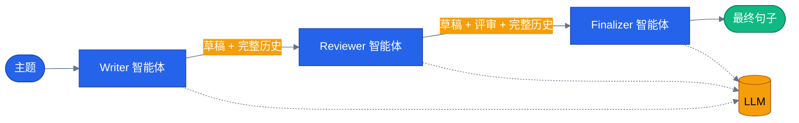

# 第 12 章 · 顺序编排

[项目首页](../../README.md) · [教程总览](../README.md) · [术语表](../_shared/jargon-glossary.md)

智能体的流水线模式：`SequentialBuilder` 把一串智能体接成管线，每一个都能看到此前的完整对话，并追加自己那一轮 —— 不需要第 11 章那种手写适配器。

## 本章动机

第 11 章把一个 `Agent` 包装成工作流执行器，并自己接了输入/输出适配器。顺序编排把它推广到 N 个智能体组成的链：**Writer → Reviewer → Finalizer** 是这里的标准例子，但同一形态也驱动着本仓库一条真实的生产流程 —— 「退货 / 换货」管线（资格校验 → 审批闸门 → 发起退货 → 搜索替换商品 → 折扣 → 定稿），详见下文「在完整项目中的落点」。

让顺序编排区别于手工串链的那一件事是：**构建器会自动转发整段共享对话**，于是 Reviewer 能看到 Writer 的草稿，Finalizer 能看到两者，而这两个智能体的代码都不必为此做任何特殊处理。

## 前置条件

- 已完成 [第 11 章 · 工作流中的智能体](../11-agents-in-workflows/)
- 仓库根目录的 `.env` 中已配置一个 LLM 提供方：

| 提供方 | 必填 | 选填 |
|--------|------|------|
| **OpenAI** | `OPENAI_API_KEY` | `LLM_MODEL`（默认 `gpt-4.1`） |
| **Azure OpenAI** | `AZURE_OPENAI_ENDPOINT`、`AZURE_OPENAI_KEY`、`AZURE_OPENAI_DEPLOYMENT` | `AZURE_OPENAI_API_VERSION`（默认 `2024-10-21`） |

## 核心概念

把一个有序的智能体列表交给构建器，它返回一个 `Workflow`：第 1 个参与者针对输入消息运行，第 2 个针对「输入 + 第 1 个的响应」运行，第 3 个针对以上全部运行，依此类推。每个参与者仍然是普通的 MAF 智能体 —— 与前几章相同的 `Agent(...)` 构造方式 —— 构建器负责把这个列表变成一条共享对话状态的管线。


```mermaid
%%{init: {'theme':'base', 'themeVariables': {
  'primaryColor': '#2563eb','primaryTextColor': '#ffffff','primaryBorderColor': '#1e40af',
  'lineColor': '#64748b','secondaryColor': '#f59e0b','tertiaryColor': '#10b981',
  'background': 'transparent'}}}%%
flowchart LR
  classDef core     fill:#2563eb,stroke:#1e40af,color:#ffffff
  classDef external fill:#f59e0b,stroke:#b45309,color:#000000
  classDef success  fill:#10b981,stroke:#047857,color:#ffffff

  topic([主题])
  writer[Writer 智能体]
  reviewer[Reviewer 智能体]
  finalizer[Finalizer 智能体]
  llm[(LLM)]
  answer([最终句子])

  topic --> writer
  writer -- "草稿 + 完整历史" --> reviewer
  reviewer -- "草稿 + 评审 + 完整历史" --> finalizer
  finalizer --> answer
  writer -.-> llm
  reviewer -.-> llm
  finalizer -.-> llm

  class writer core
  class reviewer core
  class finalizer core
  class llm external
  class answer success
```

每次运行发生三次真实 LLM 调用 —— Reviewer 的提示词里字面上就含有 Writer 的输出（作为先前的对话轮次），Finalizer 的提示词里两者都有。`SequentialBuilder` 负责组装这种转发；你从不直接碰消息队列或适配器。

## Python

源码：[`python/main.py`](./python/main.py)。

```bash
uv sync --project tutorials
uv run --project tutorials python tutorials/12-sequential-orchestration/python/main.py
```

三个参与者与管线本身：

```python
def writer() -> Agent:
    return Agent(
        _default_client(),
        instructions=("You are a Writer. Draft a 2-sentence paragraph on the topic the user provides. Keep it short."),
        name="writer",
    )


def reviewer() -> Agent:
    return Agent(
        _default_client(),
        instructions=(
            "You are a Reviewer. Read the draft above and produce a single-sentence review "
            "pointing out one strength and one weakness. Do not rewrite the draft."
        ),
        name="reviewer",
    )


def build_workflow():
    return SequentialBuilder(participants=[writer(), reviewer(), finalizer()]).build()
```

把结果读回来才是麻烦的部分 —— 每个智能体的那一轮抵达时，包在一个 `executor_completed` 事件里，其 `data` 是 `AgentExecutorResponse` 对象的列表，而不是某个专用的「数据」事件类型：

```python
async for event in _workflow_events(workflow, topic):
    if getattr(event, "type", None) != "executor_completed":
        continue
    payload = getattr(event, "data", None)
    if not isinstance(payload, list):
        continue
    for item in payload:
        agent_resp = getattr(item, "agent_response", None)
        eid = getattr(item, "executor_id", "")
        text = getattr(agent_resp, "text", None)
        if text and eid:
            per_agent[eid] = text
```

`main.py` 同样支持 `LLM_PROVIDER=replay`（由 `tutorials/_shared/replay_client.py` 支撑）—— 它回放 `python/tests/fixtures/replay/` 下已提交的 fixture，因此管线无需网络与凭据就能被演练。

## 常见坑

- **两种运行时都不提供「每智能体专用事件」。** Python 把每一轮放进 `executor_completed` 的 `data` 字段里（`list[AgentExecutorResponse]`），所以按 `event.type == "data"` 过滤什么也找不到。要读终端对话。
- **指令比以往更重要。** 每个下游智能体都能看到此前的整段对话，因此每份系统提示词都必须明确说出**不要**做什么 —— Reviewer 上的「不要重写草稿」、Finalizer 上的「只输出最终句子」—— 否则管线会跑偏。
- **顺序编排默认不做检查点。** 对需要持久化的管线，把 `checkpoint_storage=` 传给 `SequentialBuilder(...)` 构造函数（而不是 `.run()`）；本章演示没有配置它。
- **旧的「MAF v1.0 wheel 附带空 `__init__.py`」打包缺陷已在上游修复** —— 本仓库现已锁定 `agent-framework` 1.14.0，因此它不再生效。`tutorials/_shared/maf_bootstrap.py` 仍防御性地执行它的补丁步骤（每章 `main.py` 都会先调用 `maf_bootstrap.bootstrap()`），但在当前安装下是空操作；完整项目里的对应物 `agents/python/patch_maf.py` 同样是已记录的空操作。

## 测试

`python/tests/test_sequential.py` 偏重集成测试，因为顺序编排的意义就在于串起真实的智能体响应：

1. 一个接线测试（`test_workflow_builds_with_three_participants`）—— 不调用 LLM，只证明构建器组装出了一个 `Workflow`。
2. 一个回放测试（`test_replay_runs_all_three_agents`）—— 通过 `LLM_PROVIDER=replay` 回放已提交的 fixture，无需网络与凭据。
3. 三个 `@pytest.mark.integration` 测试，访问真实 LLM（`.env` 无凭据时自动跳过）：三个智能体都产出输出、Writer/Reviewer 的内容符合预期形态、三个输出彼此不同。

```bash
uv run --project tutorials pytest tutorials/12-sequential-orchestration/python/tests -v
```

## 在完整项目中的落点

顺序编排作为应用五种可选编排模式之一，已上线运行。`agents/python/orchestrator/modes/workflow_mode.py:184` 的 `ReturnReplaceMode` 包装了 `workflows/return_replace.py` 的 MAF 顺序工作流：

```python
class ReturnReplaceMode:
    name = "workflow:return-replace"
    label = "Return & Replace (sequential + in-workflow HITL)"
    description = (
        "MAF sequential workflow: eligibility check, return initiation, replacement "
        "search, an in-workflow HITL gate for high-value returns (ctx.request_info — "
        "structurally different from the middleware-based approval flow `tool` mode "
        "uses; see shared/hitl.py vs this workflow's hitl-gate executor), then "
        "loyalty discount and finalize."
    )
```

那是一条五步管线 —— 资格校验 → 发起退货 → 搜索替换商品 → 针对高价值退货的工作流内人工审批闸门 → 会员折扣 → 定稿 —— 可在 Web 聊天界面通过 `mode-switcher.tsx` 按请求选择；在人工审批闸门处会保存一个检查点，使暂停的运行之后能从 `POST /api/orchestration/{run_id}/resume` 恢复（见同文件中的 `ReturnReplaceMode.resume()`）。它是这个模式比本章 Writer/Reviewer/Finalizer 演示丰富得多的实例，而且是真实、当前已接线的代码，不是一个假设的重构目标。

## 下一步

- 下一章：[第 13 章 · 并发编排](../13-concurrent-orchestration/)
- 完整源码：[`python/`](./python/)
- 共享材料：[Mermaid 风格指南](../_shared/mermaid-style-guide.md) · [术语表](../_shared/jargon-glossary.md)
- [MAF 官方文档 —— 顺序编排](https://learn.microsoft.com/en-us/agent-framework/workflows/orchestrations/sequential/)
