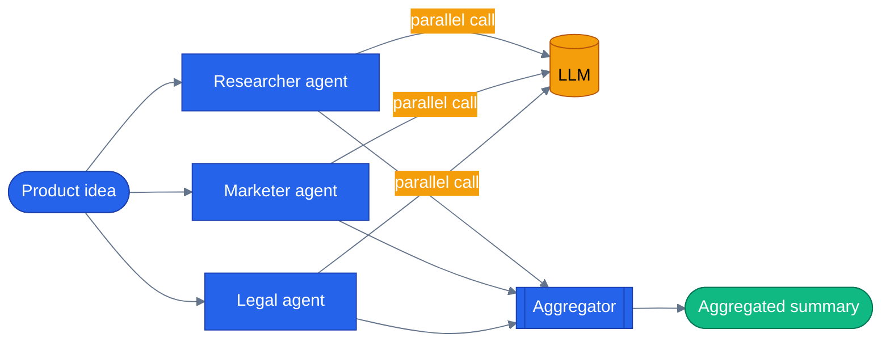

# Chapter 13 — Concurrent Orchestration

## Why this chapter

If Sequential (Chapter 12) is an assembly line, Concurrent is a panel. Send one input to N independent agents at the same time, collect N perspectives, then — optionally — reduce them to a single output with an aggregator. Use it whenever the agents don't depend on each other's output and you want wall-clock latency bounded by the slowest branch, not the sum of all of them.

Worked example: a product-idea review. Researcher checks market fit, Marketer proposes a positioning angle, Legal flags one regulatory concern — all three fire at once instead of waiting on each other.

This is not a toy pattern invented for the tutorial. The capstone app runs a real concurrent fan-out/fan-in workflow in production — see [How this shows up in the capstone](#how-this-shows-up-in-the-capstone) below.

## Prerequisites

- Completed [Chapter 12 — Sequential Orchestration](../12-sequential-orchestration/)
- Repo-root `.env` with one LLM provider configured:

| Provider | Required | Optional |
|----------|----------|----------|
| **OpenAI** | `OPENAI_API_KEY` | `LLM_MODEL` (default `gpt-4.1`) |
| **Azure OpenAI** | `AZURE_OPENAI_ENDPOINT`, `AZURE_OPENAI_KEY`, `AZURE_OPENAI_DEPLOYMENT` | `AZURE_OPENAI_API_VERSION` (default `2024-10-21`) |

## The concept

Concurrent orchestration fans one input out to a fixed set of participants, runs them in parallel, and fans the results back in. There's no coordination between branches while they run — each agent sees only the original input, not its siblings' output — so the pattern only fits problems that are genuinely independent per-branch. If branch B needs branch A's answer, that's Sequential (or a custom graph), not Concurrent.

The fan-in side is where the two SDKs differ in default behavior. Python's `ConcurrentBuilder` collects every participant's response into a list by default and only reduces it to one value if you attach `.with_aggregator(fn)`. .NET's `AgentWorkflowBuilder.BuildConcurrent` takes the aggregator as a constructor argument up front — in this chapter's demo it's a deterministic string-concatenation aggregator, not another LLM call, so wall-clock time still tracks the slowest of the three branches.



Three fan-out branches hit the same LLM concurrently; the aggregator only runs once all three have returned, so total latency tracks `max(researcher, marketer, legal)`, not their sum.

## Python

Source: [`python/main.py`](./python/main.py).

```bash
uv sync --project tutorials
uv run --project tutorials python tutorials/13-concurrent-orchestration/python/main.py
```

`build_workflow()` wires the three participants with `ConcurrentBuilder` (no aggregator — the demo collects each agent's raw response instead of reducing it):

```python
def build_workflow():
    return ConcurrentBuilder(participants=[researcher(), marketer(), legal()]).build()
```

`analyze()` drives the workflow with `stream=True` and reads each participant's response off `executor_completed` events, keyed by `executor_id`:

```python
async def analyze(idea: str) -> tuple[dict[str, str], float]:
    workflow = build_workflow()
    per_agent: dict[str, str] = {}
    start = time.perf_counter()
    async for event in _workflow_events(workflow, idea):
        if getattr(event, "type", None) != "executor_completed":
            continue
        payload = getattr(event, "data", None)
        if not isinstance(payload, list):
            continue
        for item in payload:
            agent_resp = getattr(item, "agent_response", None)
            eid = getattr(item, "executor_id", "")
            text = getattr(agent_resp, "text", None)
            if text and eid in ("researcher", "marketer", "legal"):
                per_agent[eid] = text
    elapsed = time.perf_counter() - start
    return per_agent, elapsed
```

`main.py` prints each agent's verdict plus the wall-clock time, so you can see the three calls overlap rather than queue up.

## .NET

Source: [`dotnet/Program.cs`](./dotnet/Program.cs).

```bash
cd tutorials/13-concurrent-orchestration/dotnet
dotnet run
```

`AgentWorkflowBuilder.BuildConcurrent` takes the aggregator up front, unlike Python's opt-in `.with_aggregator(fn)`:

```csharp
Workflow workflow = AgentWorkflowBuilder.BuildConcurrent(
    new[] { researcher, marketer, legal },
    aggregator: SynthesizeReview);
```

`SynthesizeReview` receives one `List<ChatMessage>` per agent, in call order, and reduces them to a single message that surfaces as the workflow's terminal `WorkflowOutputEvent`:

```csharp
private static List<ChatMessage> SynthesizeReview(IList<List<ChatMessage>> perAgentMessages)
{
    var builder = new StringBuilder();
    builder.AppendLine("Cross-functional review:");

    foreach (List<ChatMessage> agentOutput in perAgentMessages)
    {
        if (agentOutput.Count == 0) continue;
        ChatMessage final = agentOutput[^1];
        string label = final.AuthorName ?? "agent";
        builder.Append("- ").Append(label).Append(": ").AppendLine(final.Text.Trim());
    }

    return new List<ChatMessage>
    {
        new(ChatRole.Assistant, builder.ToString().TrimEnd()) { AuthorName = "concurrent-aggregator" },
    };
}
```

No LLM call inside the aggregator — it's a deterministic reduction, so it doesn't add latency on top of the slowest branch.

## Side-by-side differences

| Aspect | Python | .NET |
|--------|--------|------|
| Build | `ConcurrentBuilder(participants=[...]).build()` | `AgentWorkflowBuilder.BuildConcurrent(agents, aggregator: fn)` |
| Aggregator | Opt-in via `.with_aggregator(fn)` — default is a raw list of responses | Passed as a constructor argument; this demo's aggregator is deterministic string reduction |
| Per-agent response | `executor_completed` events carry a `list` payload keyed by `executor_id` | One `AgentResponseEvent` per agent, then a `WorkflowOutputEvent` for the aggregator's result |
| Streaming | `workflow.run(message, stream=True)` | `InProcessExecution.RunStreamingAsync` + `run.WatchStreamAsync()` |

## Gotchas

- **Parallelism is real, not simulated.** All three LLM calls fire concurrently. If your provider enforces concurrency limits (Azure OpenAI TPM/RPM quotas), a wider fan-out can hit them faster than a sequential chain would.
- **Order is not guaranteed.** Agents complete as they finish, not in the order you listed them — don't assume `researcher`'s event arrives before `marketer`'s.
- **Branches are isolated.** Concurrent participants never see each other's output while running; if one branch needs another's result, this is the wrong pattern — use Sequential or a custom graph instead.
- **The MAF v1.0 empty-`__init__.py` packaging bug is fixed upstream.** `agents/python/patch_maf.py` still exists but is a documented no-op now that the repo pins `agent-framework` 1.14.0, which ships a real `__init__.py`. Tutorials don't depend on that file at all — they call `tutorials/_shared/maf_bootstrap.py`'s `bootstrap()`, which patches `agent_framework`'s `__init__.py` only if it's still empty (defensive, same idempotent no-op in practice) and loads the repo-root `.env`. Don't go looking for a `shared/maf.py` or similar shim — it doesn't exist.
- **The .NET aggregator here is not an LLM call.** If you want a synthesizing LLM summary instead of deterministic concatenation, call an agent inside `SynthesizeReview` — the signature is on an async boundary, so awaiting is safe there.

## Tests


`tutorials/13-concurrent-orchestration/python/tests/` holds `test_concurrent.py`, structured around a `ReplayChatClient` fixture pattern (`tests/fixtures/replay/`) so most of the suite runs without live credentials:

- a wiring check that `build_workflow()` constructs without error
- a replay-based test asserting all three agents (`researcher`, `marketer`, `legal`) respond, using recorded fixtures — no network call
- three `@pytest.mark.integration` tests, skipped unless real LLM credentials are present, that hit a live provider to confirm responses arrive, that wall-clock stays under 6s (parallel, not serial), and that the three perspectives are genuinely distinct strings

```bash
uv run --project tutorials pytest tutorials/13-concurrent-orchestration/python/tests -v
```

The .NET side ships [`dotnet/tests/ConcurrentTests.cs`](./dotnet/tests/ConcurrentTests.cs) — eight tests, no key, no network:

```bash
cd tutorials/13-concurrent-orchestration/dotnet && dotnet test tests/Concurrent.Tests.csproj
```

The one that matters is `The_Three_Calls_Overlap_In_Time`. It asserts concurrency from recorded per-call start/end timestamps rather than from total elapsed time — a wall-clock threshold would flake the first time CI got busy, and "it finished quickly" is not the same claim as "they ran at once". Chapter 12 makes the same assertion and expects the opposite answer.

## How this shows up in the capstone

`agents/python/workflows/pre_purchase.py` is a live production concurrent fan-out/fan-in workflow, not a hypothetical. Its `_build_maf_workflow()` method (`agents/python/workflows/pre_purchase.py:229`) does exactly what this chapter teaches, with `WorkflowBuilder` instead of `ConcurrentBuilder`:

```python
return (
    WorkflowBuilder(start_executor=fan_out, name="pre-purchase")
    .add_fan_out_edges(fan_out, [reviews, stock, price])
    .add_fan_in_edges([reviews, stock, price], merge)
    .add_edge(merge, synthesis)
    .build()
)
```

Three specialist data-gathering steps — reviews, stock, price history — fan out in parallel, fan in to a merge step (which runs a sequential shipping estimate if stock allows), then a synthesis step produces the final recommendation. It's wired live in the orchestrator as `PrePurchaseMode` (`agents/python/orchestrator/modes/workflow_mode.py:89`), reachable in the running app as `mode=workflow:pre-purchase` — contrast it against `tool` mode, which would make the same three calls one at a time, serially.

## What's next

- Next chapter: [Chapter 14 — Handoff Orchestration](../14-handoff-orchestration/)
- Full source: [`python/`](./python/) · [`dotnet/`](./dotnet/)
- [MAF docs — Concurrent Orchestration](https://learn.microsoft.com/en-us/agent-framework/workflows/orchestrations/concurrent/)
