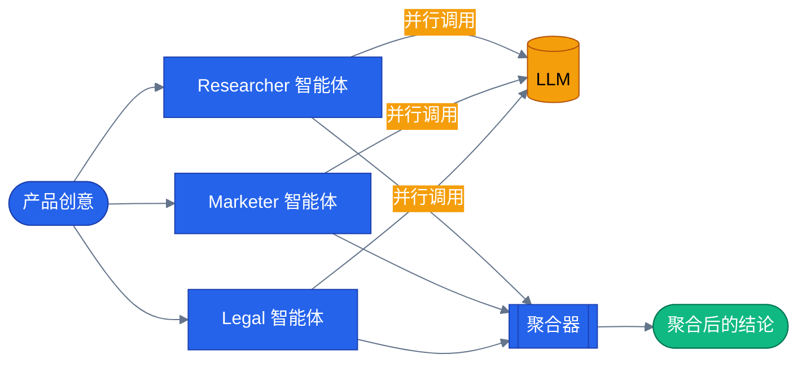

# 第 13 章 · 并发编排

[项目首页](../../README.md) · [教程总览](../README.md) · [术语表](../_shared/jargon-glossary.md)

如果顺序编排是流水线，并发编排就是**圆桌**：把同一个输入同时发给 N 个彼此独立的智能体，收集 N 种视角，然后（可选）用一个聚合器把它们归约成单一输出。

## 本章动机

把同一个输入同时发给 N 个彼此独立的智能体，收集 N 种视角，然后 —— 可选地 —— 用一个聚合器把它们归约成单一输出。只要各智能体彼此不依赖对方的输出，且你希望墙钟延迟由**最慢的分支**而非所有分支之和决定，就该用它。

贯穿示例：一次产品创意评审。Researcher 检查市场契合度，Marketer 提出定位角度，Legal 标出一个合规顾虑 —— 三者同时触发，而不是互相等待。

这不是为教程发明的玩具模式。完整项目在生产环境中运行着一个真实的并发扇出/扇入工作流 —— 见下文「在完整项目中的落点」。

## 前置条件

- 已完成 [第 12 章 · 顺序编排](../12-sequential-orchestration/)
- 仓库根目录的 `.env` 中已配置一个 LLM 提供方：

| 提供方 | 必填 | 选填 |
|--------|------|------|
| **OpenAI** | `OPENAI_API_KEY` | `LLM_MODEL`（默认 `gpt-4.1`） |
| **Azure OpenAI** | `AZURE_OPENAI_ENDPOINT`、`AZURE_OPENAI_KEY`、`AZURE_OPENAI_DEPLOYMENT` | `AZURE_OPENAI_API_VERSION`（默认 `2024-10-21`） |

## 核心概念

并发编排把一个输入扇出给一组固定的参与者，让它们并行运行，再把结果扇入。分支运行期间彼此**没有**协调 —— 每个智能体只看到原始输入，看不到兄弟分支的输出 —— 因此这个模式只适用于各分支确实独立的问题。如果分支 B 需要分支 A 的答案，那属于顺序编排（或自定义图），不是并发。

扇入侧是两个 SDK 默认行为不同之处。Python 的 `ConcurrentBuilder` 默认把每个参与者的响应收进一个列表，只有你挂上 `.with_aggregator(fn)` 才归约成单值。


```mermaid
%%{init: {'theme':'base', 'themeVariables': {
  'primaryColor': '#2563eb','primaryTextColor': '#ffffff','primaryBorderColor': '#1e40af',
  'lineColor': '#64748b','secondaryColor': '#f59e0b','tertiaryColor': '#10b981',
  'background': 'transparent'}}}%%
flowchart LR
  classDef core     fill:#2563eb,stroke:#1e40af,color:#ffffff
  classDef external fill:#f59e0b,stroke:#b45309,color:#000000
  classDef success  fill:#10b981,stroke:#047857,color:#ffffff

  idea([产品创意])
  researcher[Researcher 智能体]
  marketer[Marketer 智能体]
  legal[Legal 智能体]
  llm[(LLM)]
  aggregator[[聚合器]]
  summary([聚合后的结论])

  idea --> researcher
  idea --> marketer
  idea --> legal
  researcher -- "并行调用" --> llm
  marketer -- "并行调用" --> llm
  legal -- "并行调用" --> llm
  researcher --> aggregator
  marketer --> aggregator
  legal --> aggregator
  aggregator --> summary

  class researcher core
  class marketer core
  class legal core
  class llm external
  class aggregator core
  class summary success
```

三个扇出分支并发打到同一个 LLM；聚合器要等三者都返回才运行，因此总延迟是 `max(researcher, marketer, legal)`，而不是它们的和。

## Python

源码：[`python/main.py`](./python/main.py)。

```bash
uv sync --project tutorials
uv run --project tutorials python tutorials/13-concurrent-orchestration/python/main.py
```

`build_workflow()` 用 `ConcurrentBuilder` 接起三个参与者（不带聚合器 —— 演示收集每个智能体的原始响应，而不是归约它）：

```python
def build_workflow():
    return ConcurrentBuilder(participants=[researcher(), marketer(), legal()]).build()
```

`analyze()` 用 `stream=True` 驱动工作流，并从 `executor_completed` 事件里按 `executor_id` 读取每个参与者的响应：

```python
async def analyze(idea: str) -> tuple[dict[str, str], float]:
    workflow = build_workflow()
    per_agent: dict[str, str] = {}
    start = time.perf_counter()
    async for event in _workflow_events(workflow, idea):
        if getattr(event, "type", None) != "executor_completed":
            continue
        payload = getattr(event, "data", None)
        if not isinstance(payload, list):
            continue
        for item in payload:
            agent_resp = getattr(item, "agent_response", None)
            eid = getattr(item, "executor_id", "")
            text = getattr(agent_resp, "text", None)
            if text and eid in ("researcher", "marketer", "legal"):
                per_agent[eid] = text
    elapsed = time.perf_counter() - start
    return per_agent, elapsed
```

`main.py` 会打印每个智能体的结论以及墙钟耗时，于是你能看到三次调用是**重叠**的，而不是排着队。

## 常见坑

- **并行是真的，不是模拟的。** 三次 LLM 调用并发触发。如果你的提供方有并发限制（Azure OpenAI 的 TPM/RPM 配额），更宽的扇出会比顺序链更快撞上它们。
- **顺序没有保证。** 智能体按各自完成的时间到达，而不是你列出的顺序 —— 不要假定 `researcher` 的事件先于 `marketer` 的。
- **分支之间是隔离的。** 并发参与者在运行期间永远看不到彼此的输出；如果某个分支需要另一个的结果，那就是用错了模式 —— 请改用顺序编排或自定义图。
- **MAF v1.0 的空 `__init__.py` 打包缺陷已在上游修复。** `agents/python/patch_maf.py` 仍然存在，但在仓库锁定 `agent-framework` 1.14.0（附带真实 `__init__.py`）之后已是已记录的空操作。教程完全不依赖那个文件 —— 它们调用 `tutorials/_shared/maf_bootstrap.py` 的 `bootstrap()`，后者只在 `agent_framework` 的 `__init__.py` 仍为空时才修补（防御性，实践中同样是幂等的空操作），并加载仓库根目录的 `.env`。

## 测试

`tutorials/13-concurrent-orchestration/python/tests/` 下的 `test_concurrent.py` 围绕一个 `ReplayChatClient` fixture 模式（`tests/fixtures/replay/`）组织，因此套件的大部分无需真实凭据即可运行：

- 一个接线检查，确认 `build_workflow()` 能无错构造
- 一个基于回放的测试，断言三个智能体（`researcher`、`marketer`、`legal`）都作出了响应，使用已录制的 fixture —— 不发网络请求
- 三个 `@pytest.mark.integration` 测试，除非存在真实 LLM 凭据否则跳过；它们访问真实提供方，确认响应确实到达、墙钟耗时低于 6 秒（是并行而非串行），以及三种视角确实是不同的字符串

```bash
uv run --project tutorials pytest tutorials/13-concurrent-orchestration/python/tests -v
```

## 在完整项目中的落点

`agents/python/workflows/pre_purchase.py` 是一个正在运行的**生产**并发扇出/扇入工作流，不是假设。它的 `_build_maf_workflow()` 方法（`agents/python/workflows/pre_purchase.py:229`）正是本章所教的内容，只是用 `WorkflowBuilder` 而不是 `ConcurrentBuilder`：

```python
return (
    WorkflowBuilder(start_executor=fan_out, name="pre-purchase")
    .add_fan_out_edges(fan_out, [reviews, stock, price])
    .add_fan_in_edges([reviews, stock, price], merge)
    .add_edge(merge, synthesis)
    .build()
)
```

三个专家级数据采集步骤 —— 评价、库存、价格历史 —— 并行扇出，扇入到一个合并步骤（若库存允许，它会跑一次顺序的运费估算），随后一个综合步骤产出最终建议。它在编排器里作为 `PrePurchaseMode`（`agents/python/orchestrator/modes/workflow_mode.py:89`）实时接线，可在运行中的应用里通过 `mode=workflow:pre-purchase` 触达 —— 与之相对的是 `tool` 模式，它会把这三次调用一次一个地串行执行。

## 下一步

- 下一章：[第 14 章 · 交接编排](../14-handoff-orchestration/)
- 完整源码：[`python/`](./python/)
- 共享材料：[Mermaid 风格指南](../_shared/mermaid-style-guide.md) · [术语表](../_shared/jargon-glossary.md)
- [MAF 官方文档 —— 并发编排](https://learn.microsoft.com/en-us/agent-framework/workflows/orchestrations/concurrent/)
