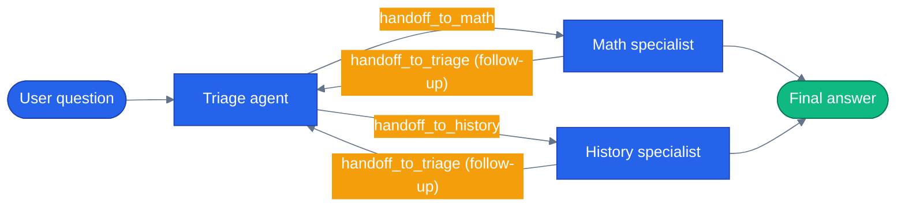

# Chapter 14 — Handoff Orchestration

## Why this chapter

Sequential and Concurrent orchestration (Chapters 12 and 13) both predetermine the flow — the graph shape is fixed before any agent runs. Handoff lets the *agents* decide where the conversation goes next. A Triage agent reads the question and hands off to the right specialist by emitting a synthesized `handoff_to_<name>` tool call; specialists can hand back to Triage for follow-ups. It's the mesh topology that powers customer-support bots and research assistants that pull in domain experts on demand — and it's the same shape this repo's capstone uses to let the orchestrator route live traffic to specialist agents mechanically instead of through hand-rolled tool logic.

Canonical example: **Triage agent routes to a Math or History specialist, which can hand back for follow-ups.**

## Prerequisites

- Completed [Chapter 13 — Concurrent Orchestration](../13-concurrent-orchestration/)
- Repo-root `.env` with one LLM provider: `OPENAI_API_KEY` (+ optional `LLM_MODEL`, default `gpt-4.1`) or `AZURE_OPENAI_ENDPOINT` / `AZURE_OPENAI_KEY` / `AZURE_OPENAI_DEPLOYMENT` (+ optional `AZURE_OPENAI_API_VERSION`, default `2024-10-21`)

## The concept

`HandoffBuilder` wires a set of agents into a mesh and, for every declared edge, synthesizes a `handoff_to_<name>` tool on the source agent. The current speaker decides — using its own reasoning over the conversation so far — whether to answer directly or call that tool and pass control to a target. Nothing external routes the conversation; the routing decision lives entirely inside each agent's own LLM call.

That autonomy is also the risk. A mesh with no exit condition can bounce a conversation between two agents indefinitely, each one legitimately deciding to hand back. `with_autonomous_mode(agents=..., turn_limits={...})` bounds that: it keeps the loop running without waiting for a human turn between hops, but caps how many turns each named agent gets before the workflow is forced to stop.



Each specialist decides for itself whether to hand back — the mesh has no central router; every edge is a tool call one agent chooses to make.

## Python

Run from the repo root using the shared `tutorials/` uv project (one `uv sync` covers every chapter):

```bash
uv sync --project tutorials
uv run --project tutorials python tutorials/14-handoff-orchestration/python/main.py
uv run --project tutorials pytest tutorials/14-handoff-orchestration/python/tests -v
```

Source: [`python/main.py`](./python/main.py). The mesh is built in `build_workflow()`:

```python
def build_workflow():
    t = triage()
    m = math_expert()
    h = history_expert()
    return (
        HandoffBuilder(participants=[t, m, h])
        .with_start_agent(t)
        .add_handoff(t, [m, h])
        .add_handoff(m, [t])  # specialists can hand back to triage for follow-ups
        .add_handoff(h, [t])
        .with_autonomous_mode(agents=[t, m, h], turn_limits={"triage": 3, "math": 2, "history": 2})
        .build()
    )
```

Every participant Agent is constructed with `require_per_service_call_history_persistence=True` — as of `agent-framework-orchestrations>=1.0.1`, `HandoffBuilder.build()` requires this on every participant because its middleware short-circuits tool calls during a handoff, so local history has to stay in sync with what the service actually saw.

`ask()` drives the workflow with `stream=True` and reconstructs each agent's turn from the event stream:

```python
async for event in _workflow_events(workflow, question):
    etype = getattr(event, "type", None)
    eid = getattr(event, "executor_id", "") if etype == "output" else None
    if etype == "output" and eid in {"triage", "math", "history"}:
        if current_agent != eid:
            current_agent = eid
            buffers.append((eid, []))
        update = getattr(event, "data", None)
        text = getattr(update, "text", None) if update is not None else None
        if text:
            buffers[-1][1].append(text)
    elif etype == "handoff_sent":
        data = getattr(event, "data", None)
        target = getattr(data, "target", None)
        if target:
            handoffs.append(target)
```

Running `"What's 37 * 42?"` routes `triage → math` and prints the numeric answer; running `"When did WWII end?"` routes `triage → history` and prints `1945`.

## .NET

```bash
cd tutorials/14-handoff-orchestration/dotnet
dotnet run -- "What is 37 * 42?"
```

[`dotnet/Program.cs`](./dotnet/Program.cs) uses the convenience builder to wire the same mesh shape:

```csharp
Workflow workflow = AgentWorkflowBuilder.CreateHandoffBuilderWith(triage)
    .WithHandoffs(triage, new[] { mathTutor, historyTutor })
    .WithHandoffs(new[] { mathTutor, historyTutor }, triage)
    .Build();
```

The run loop watches `AgentResponseUpdateEvent` for streamed text (printing the executor id the first time each agent speaks) and pulls the final transcript off the `WorkflowOutputEvent` whose `Data` is a `List<ChatMessage>`. `description` on each `AsAIAgent(...)` call shows up as the default handoff reason the builder stamps into that agent's synthesized `handoff_to_<name>` tool schema.

## Side-by-side differences

| Aspect | Python | .NET |
|--------|--------|------|
| Declare mesh | `HandoffBuilder(participants=[...]).add_handoff(source, [targets])` | `AgentWorkflowBuilder.CreateHandoffBuilderWith(start).WithHandoffs(source, targets)` |
| Autonomy | `.with_autonomous_mode(agents=[...], turn_limits={...})` | Interactive loop via `RunStreamingAsync` + `TrySendMessageAsync(new TurnToken(...))` |
| Observe handoffs | `handoff_sent` event, `event.data.target` | Inferred from `AgentResponseUpdateEvent.ExecutorId` changing |
| Streamed text | `output` event, `event.data.text` (an `AgentResponseUpdate`) | `AgentResponseUpdateEvent.Update.Text` |
| Per-participant history requirement | `require_per_service_call_history_persistence=True` on every `Agent` | Not required — handled by the .NET builder internally |

## Gotchas

- **Every participant needs an explicit handoff edge.** If you declare an agent as a participant but never call `add_handoff(agent, [...])` / `WithHandoffs(agent, ...)` for it, that agent can't invoke any handoff tool — it can receive control but never hand off or hand back.
- **Turn limits prevent infinite loops.** Without `turn_limits={}` per agent in Python's `with_autonomous_mode(...)`, a legitimate back-and-forth between triage and a specialist can cycle indefinitely, since each hop is a locally reasonable decision with no global view of the conversation.
- **`require_per_service_call_history_persistence=True` is mandatory in current Python.** `HandoffBuilder.build()` in `agent-framework-orchestrations>=1.0.1` raises if any participant Agent omits it — its middleware short-circuits tool calls during a handoff, so each agent's local history has to track what the service actually saw.
- **The MAF v1.0 empty-`__init__.py` packaging bug is fixed, but the fix wasn't a new tutorial file.** `agents/python/patch_maf.py` still exists as a documented no-op — the bug it patched (`agent-framework-core==1.0.0` shipping an empty `__init__.py` with no public re-exports) was fixed upstream by `agent-framework` 1.14.0, which this repo now pins, so `patch()` only writes when the target file is empty (never, on a current install). The bootstrap tutorials actually rely on today is `tutorials/_shared/maf_bootstrap.py`, called at the top of `main.py` before any `agent_framework` import.
- **`HandoffBuilder`'s mesh construction is sensitive to `PYTHONHASHSEED`.** This chapter discovered that MAF builds its participant mesh from a set-like collection internally, so the exact text baked into a specialist's follow-up turns — and therefore the replay-fixture hash for those turns — varies with Python's per-process hash randomization. None of the other orchestration chapters (12/13/15/16) hit this; their participant lists are consumed in list order. The replay fixtures under `python/tests/fixtures/replay/` were recorded with `PYTHONHASHSEED=0`, the replay test skips itself unless that same pin is set, and CI (`.github/workflows/tutorials.yml`) sets `PYTHONHASHSEED: "0"` at the job level specifically because of this chapter.

## Tests


`python/tests/test_handoff.py` is integration-focused — the mesh needs a real LLM to make routing decisions, so most of it is skipped without credentials:

- A wiring test (`test_workflow_builds`) that always runs.
- A keyless replay test (`test_replay_routes_math_to_math_agent`) that plays back a committed fixture via `LLM_PROVIDER=replay` — this is what CI exercises on every PR, gated on `PYTHONHASHSEED=0` per the gotcha above.
- Three `@pytest.mark.integration` tests against a real LLM: routing math to the math agent, routing history to the history agent, and asserting math/history questions diverge in which specialists they reach.

```bash
uv run --project tutorials pytest tutorials/14-handoff-orchestration/python/tests -v
# Deterministic replay run (matches how CI runs it):
PYTHONHASHSEED=0 uv run --project tutorials pytest tutorials/14-handoff-orchestration/python/tests -v
```

The .NET side ships [`dotnet/tests/HandoffTests.cs`](./dotnet/tests/HandoffTests.cs) — nine tests, no key, no network:

```bash
cd tutorials/14-handoff-orchestration/dotnet && dotnet test tests/Handoff.Tests.csproj
```

They pin the naming surprise described above: `Handoff_Tools_Are_Named_Positionally_Not_By_Agent` fails the day MAF starts emitting `handoff_to_<name>`, which is exactly when this chapter's prose would need rewriting.

## How this shows up in the capstone

This chapter's mesh is not just a teaching example — it's the reference implementation for a live orchestration mode in the capstone app:

- `agents/python/orchestrator/handoff.py:49` — `build_orchestrator_handoff_workflow()` builds the production `HandoffBuilder` mesh: the orchestrator as start agent, one edge to each remote specialist (`agents/python/orchestrator/handoff.py:80`), and a handoff back to the orchestrator from each specialist (`agents/python/orchestrator/handoff.py:81-82`). Every specialist is a `RemoteSpecialistChatClient` (`shared/remote_agent.py`) wrapped in an `Agent`, so handoffs still traverse A2A HTTP on the wire — the mechanism is Handoff, the transport stays A2A.
- `agents/python/orchestrator/modes/handoff_mode.py:1` — `HandoffMode` is what makes the mesh reachable from a live request (`mode="handoff"` on `/api/chat`, or `ORCHESTRATION_MODE=handoff` as the deployment default). Its module docstring says outright that this tutorial's `python/main.py::ask()` is "the verified reference for how to read a handoff workflow's event stream" — the same `output`-event, per-executor-id text assembly shown above is what `HandoffMode.run()` (`agents/python/orchestrator/modes/handoff_mode.py:61`) does against real specialist agents.
- Default orchestration stays `tool` mode (the `call_specialist_agent` router); `handoff` is additive and opt-in, so nothing about the default runtime changes unless a request or deployment config selects it.

## What's next

- Next chapter: [Chapter 15 — Group Chat Orchestration](../15-group-chat-orchestration/)
- Full source: [`python/`](./python/) · [`dotnet/`](./dotnet/)
- [MAF docs — Handoff Orchestration](https://learn.microsoft.com/en-us/agent-framework/workflows/orchestrations/handoff/)
