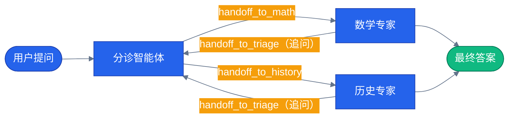

# 第 14 章 · 移交式编排（Handoff）

[项目首页](../../README.md) · [教程总览](../README.md) · [术语表](../_shared/jargon-glossary.md)

## 本章动机

顺序编排与并发编排（第 12、13 章）都会预先确定流程——图的结构在任何智能体运行之前就已固定。移交（Handoff）则让**智能体自己**决定对话接下来走向哪里。一个分诊（Triage）智能体会先读问题，然后通过发出一个合成的 `handoff_to_<name>` 工具调用来把控制权交给合适的专家；专家也可以交回分诊智能体以处理追问。这就是支撑客服机器人与研究助手的网状拓扑——它们按需引入领域专家。本项目的完整系统也采用同一形状：编排器据此把线上请求机械地路由给专家智能体，而不必手写工具逻辑。

典型示例：**分诊智能体路由到数学或历史专家，专家可交回以处理追问。**

## 前置条件

- 已完成[第 13 章 · 并发编排](../13-concurrent-orchestration/)
- 仓库根目录的 `.env` 中配置一个 LLM 提供方：`OPENAI_API_KEY`（可选 `LLM_MODEL`，默认 `gpt-4.1`），或 `AZURE_OPENAI_ENDPOINT` / `AZURE_OPENAI_KEY` / `AZURE_OPENAI_DEPLOYMENT`（可选 `AZURE_OPENAI_API_VERSION`，默认 `2024-10-21`）

## 核心概念

`HandoffBuilder` 把一组智能体连成网状，并为每一条声明的边在源智能体上合成一个 `handoff_to_<name>` 工具。当前发言者依据自身对既有对话的推理，决定是直接作答，还是调用该工具把控制权交给目标。**没有任何外部组件在路由对话**——路由决策完全存在于每个智能体自己的 LLM 调用之内。

这种自主性同时也是风险所在。一个没有退出条件的网状结构会让两个智能体无限来回：每一跳单独看都合理，但没有全局视角。`with_autonomous_mode(agents=..., turn_limits={...})` 对此加以约束：它让循环在无需人工介入的情况下持续运行，同时限制每个具名智能体在流程被强制停止前可获得的轮次上限。


```mermaid
%%{init: {'theme':'base', 'themeVariables': {
  'primaryColor': '#2563eb','primaryTextColor': '#ffffff','primaryBorderColor': '#1e40af',
  'lineColor': '#64748b','secondaryColor': '#f59e0b','tertiaryColor': '#10b981',
  'background': 'transparent'}}}%%
flowchart LR
  classDef core     fill:#2563eb,stroke:#1e40af,color:#ffffff
  classDef external fill:#f59e0b,stroke:#b45309,color:#000000
  classDef success  fill:#10b981,stroke:#047857,color:#ffffff

  user([用户提问])
  triage[分诊智能体]
  math[数学专家]
  history[历史专家]
  answer([最终答案])

  user --> triage
  triage -- "handoff_to_math" --> math
  triage -- "handoff_to_history" --> history
  math -- "handoff_to_triage（追问）" --> triage
  history -- "handoff_to_triage（追问）" --> triage
  math --> answer
  history --> answer

  class triage core
  class math core
  class history core
  class answer success
```

每个专家自行决定是否交回——网状结构中没有中心路由器，每一条边都是某个智能体选择发起的工具调用。

## Python

在仓库根目录运行，使用共享的 `tutorials/` uv 项目（一次 `uv sync` 覆盖全部章节）：

```bash
uv sync --project tutorials
uv run --project tutorials python tutorials/14-handoff-orchestration/python/main.py
uv run --project tutorials pytest tutorials/14-handoff-orchestration/python/tests -v
```

源码：[`python/main.py`](./python/main.py)。网状结构在 `build_workflow()` 中构建：

```python
def build_workflow():
    t = triage()
    m = math_expert()
    h = history_expert()
    return (
        HandoffBuilder(participants=[t, m, h])
        .with_start_agent(t)
        .add_handoff(t, [m, h])
        .add_handoff(m, [t])  # 专家可交回分诊智能体以处理追问
        .add_handoff(h, [t])
        .with_autonomous_mode(agents=[t, m, h], turn_limits={"triage": 3, "math": 2, "history": 2})
        .build()
    )
```

每个参与者 `Agent` 都以 `require_per_service_call_history_persistence=True` 构造——自 `agent-framework-orchestrations>=1.0.1` 起，`HandoffBuilder.build()` 要求每个参与者都设置该参数，因为其中间件会在移交期间短路工具调用，本地历史必须与服务端实际看到的内容保持一致。

`ask()` 以 `stream=True` 驱动流程，并从事件流中重建每个智能体的发言：

```python
async for event in _workflow_events(workflow, question):
    etype = getattr(event, "type", None)
    eid = getattr(event, "executor_id", "") if etype == "output" else None
    if etype == "output" and eid in {"triage", "math", "history"}:
        if current_agent != eid:
            current_agent = eid
            buffers.append((eid, []))
        update = getattr(event, "data", None)
        text = getattr(update, "text", None) if update is not None else None
        if text:
            buffers[-1][1].append(text)
    elif etype == "handoff_sent":
        data = getattr(event, "data", None)
        target = getattr(data, "target", None)
        if target:
            handoffs.append(target)
```

运行 `"37 * 42 等于多少？"` 会走 `triage → math` 并打印数值答案；运行 `"二战是哪一年结束的？"` 会走 `triage → history` 并打印 `1945`。

## 常见坑

- **每个参与者都必须有显式的移交边。** 如果你把某个智能体声明为参与者，却从未对它调用 `add_handoff(agent, [...])`，该智能体就无法调用任何移交工具——它能接收控制权，却永远无法移交或交回。
- **轮次上限用于防止无限循环。** 如果 Python 的 `with_autonomous_mode(...)` 中没有为每个智能体设置 `turn_limits={}`，分诊智能体与专家之间合理的来回往返可能无限循环，因为每一跳都是局部合理的决策，没有任何一方掌握对话的全局视图。
- **当前 Python 版本中 `require_per_service_call_history_persistence=True` 是强制项。** `agent-framework-orchestrations>=1.0.1` 的 `HandoffBuilder.build()` 在任何参与者 `Agent` 遗漏该参数时会直接抛错——其中间件会在移交期间短路工具调用，因此每个智能体的本地历史必须跟踪服务端实际看到的内容。
- **`HandoffBuilder` 的网状构建对 `PYTHONHASHSEED` 敏感。** 本章发现 MAF 内部使用类集合结构来构建参与者网状图，因此写入专家追问轮次的精确文本——进而这些轮次的回放夹具哈希——会随 Python 的逐进程哈希随机化而变化。其他编排章节（12/13/15/16）都没有触发这一点，它们的参与者列表按列表顺序消费。`python/tests/fixtures/replay/` 下的回放夹具是在 `PYTHONHASHSEED=0` 下录制的，回放测试在同一固定值未设置时会跳过自身，而 CI（`.github/workflows/tutorials.yml`）正是在作业级别设置 `PYTHONHASHSEED: "0"`，原因就是本章。

## 测试

`python/tests/test_handoff.py` 侧重集成——网状结构需要真实 LLM 才能做路由决策，因此大部分用例在无凭据时会被跳过：

- 一个接线测试（`test_workflow_builds`），始终运行。
- 一个无需密钥的回放测试（`test_replay_routes_math_to_math_agent`），通过 `LLM_PROVIDER=replay` 回放已提交的夹具——这正是 CI 在每个 PR 上执行的内容，并按上述「常见坑」以 `PYTHONHASHSEED=0` 为前置条件。
- 三个针对真实 LLM 的 `@pytest.mark.integration` 测试：把数学问题路由到数学智能体、把历史问题路由到历史智能体，以及断言数学与历史问题最终到达的专家不同。

```bash
uv run --project tutorials pytest tutorials/14-handoff-orchestration/python/tests -v
# 确定性回放（与 CI 的执行方式一致）：
PYTHONHASHSEED=0 uv run --project tutorials pytest tutorials/14-handoff-orchestration/python/tests -v
```

## 在完整项目中的落点

本章的网状结构不只是教学示例——它是完整项目中一个线上编排模式的参考实现：

- `agents/python/orchestrator/handoff.py:49` —— `build_orchestrator_handoff_workflow()` 构建生产用的 `HandoffBuilder` 网状图：编排器作为起始智能体，到每个远程专家各有一条边（`agents/python/orchestrator/handoff.py:80`），并且每个专家都有一条交回编排器的边（`agents/python/orchestrator/handoff.py:81`）。每个专家都是被 `Agent` 包装的 `RemoteSpecialistChatClient`（`shared/remote_agent.py`），因此移交在链路上依然走 A2A HTTP——机制是移交，传输仍是 A2A。
- `agents/python/orchestrator/modes/handoff_mode.py:1` —— `HandoffMode` 让该网状图可以从线上请求触达（`/api/chat` 的 `mode="handoff"`，或以 `ORCHESTRATION_MODE=handoff` 作为部署默认值）。其模块文档字符串明确指出，本章 `python/main.py::ask()` 是「读取移交式工作流事件流的已验证参考」——上面展示的 `output` 事件与按执行器 id 聚合文本的方式，正是 `HandoffMode.run()`（`agents/python/orchestrator/modes/handoff_mode.py:60`）对真实专家智能体所做的处理。
- 默认编排仍为 `tool` 模式（`call_specialist_agent` 路由）；`handoff` 是可选的增量能力，除非请求或部署配置选择它，默认运行时行为不变。

## 下一步

- 下一章：[第 15 章 · 群聊编排](../15-group-chat-orchestration/)
- 完整源码：[`python/`](./python/)
- [MAF 文档 —— 移交式编排](https://learn.microsoft.com/en-us/agent-framework/workflows/orchestrations/handoff/)
