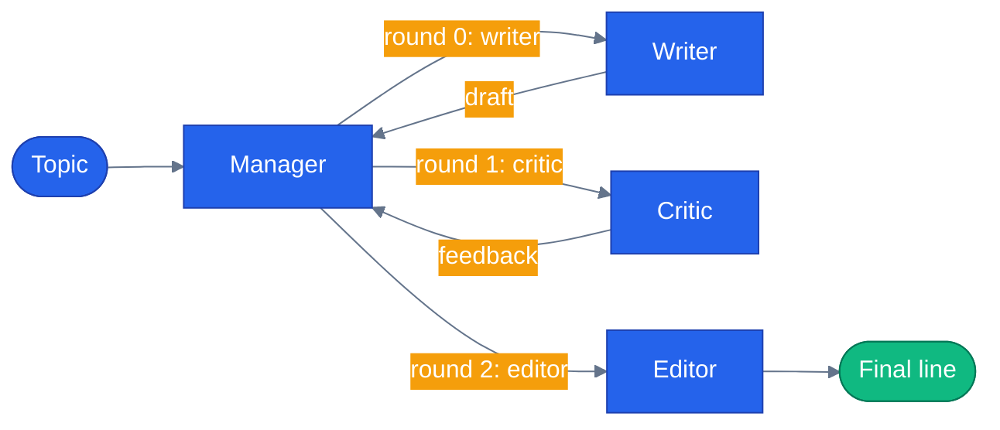

# Chapter 15 — Group Chat Orchestration

## Why this chapter

Group Chat is like a meeting: everyone's at the table, but a manager decides who talks next. Use it when agents need to build on each other's work iteratively without a fixed handoff graph — think review cycles, brainstorming, or multi-angle refinement. It's a different shape from the fan-out/fan-in of Concurrent (Chapter 13) and the control-passing of Handoff (Chapter 14): here every participant speaks, in an order a manager controls, and each one sees what the others already said.

Canonical example in this chapter: **Writer → Critic → Editor** drafting a marketing line together, with a manager picking the next speaker each round. The e-commerce-shaped version of the same pattern is live in this repo's own app — see "How this shows up in the capstone" below.

## Prerequisites

- Completed [Chapter 14 — Handoff Orchestration](../14-handoff-orchestration/)
- Repo-root `.env` with one LLM provider configured:

| Provider | Required | Optional |
|----------|----------|----------|
| **OpenAI** | `OPENAI_API_KEY` | `LLM_MODEL` (default `gpt-4.1`) |
| **Azure OpenAI** | `AZURE_OPENAI_ENDPOINT`, `AZURE_OPENAI_KEY`, `AZURE_OPENAI_DEPLOYMENT` | `AZURE_OPENAI_API_VERSION` (default `2024-10-21`) |

## The concept

The key primitive is the **selection function** (Python) or **manager** (.NET): given the current conversation state, return the next speaker. Both SDKs cap the loop with a maximum round count so a manager that never terminates can't run forever.

Two manager strategies show up in this chapter's code:

- **Round-robin** — a plain function walks a fixed order (`writer → critic → editor`), no LLM call involved in the selection itself.
- **Agent-driven** — a full `Agent` is handed the roster and the conversation so far and decides who speaks next (and when to stop). MAF wires this in as `orchestrator_agent` on the builder; the chapter's CLI calls this the `prompt` strategy since the decision is still just an LLM call, only now made by a real agent object instead of a hand-rolled function.



The manager sits between every turn — each speaker's output goes back through it before the next one is chosen, so the manager (not the agents) owns the loop's termination.

## Python

Run from the repo root using the shared `tutorials/` uv project (one `uv sync` covers every chapter):

```bash
uv sync --project tutorials
uv run --project tutorials python tutorials/15-group-chat-orchestration/python/main.py "slogan for a coffee shop"          # round-robin
uv run --project tutorials python tutorials/15-group-chat-orchestration/python/main.py "slogan for a coffee shop" prompt   # agent-driven
```

Source: [`python/main.py`](./python/main.py). The round-robin selector is a plain function over `GroupChatState`, not a closure — it derives the next speaker from `state.current_round`, so it's stateless and safe for MAF to call repeatedly:

```python
def round_robin_selector(state: GroupChatState) -> str:
    """Round-robin: pick participants by index for each round.

    GroupChatState.participants is an OrderedDict[name, description]. Returning
    the name at ``current_round % n`` cycles through the roster deterministically.
    ``max_rounds=3`` on the builder caps total turns.
    """
    names = list(state.participants.keys())
    return names[state.current_round % len(names)]


def build_workflow(strategy: str = "round-robin"):
    participants = [writer(), critic(), editor()]

    if strategy == "prompt":
        return GroupChatBuilder(
            participants=participants,
            orchestrator_agent=prompt_driven_orchestrator(),
            max_rounds=4,  # hard safety net; the orchestrator may finish earlier
        ).build()

    return GroupChatBuilder(
        participants=participants,
        selection_func=round_robin_selector,
        max_rounds=3,
    ).build()
```

`workflow.run(message, stream=True)` drives each participant's turn through MAF's streaming `AgentExecutor` path. `main.py`'s `run()` collects `(speaker, text)` tuples from the `group_chat` and `executor_completed` events it sees along the way.

## .NET

```bash
cd tutorials/15-group-chat-orchestration/dotnet
dotnet run                                    # round-robin
dotnet run -- "slogan for a bookstore" prompt  # agent-driven
dotnet test
```

[`dotnet/Program.cs`](./dotnet/Program.cs) wires the built-in `RoundRobinGroupChatManager` for the default strategy, and a hand-written `PromptDrivenManager : GroupChatManager` for `prompt` — proof that "agent-driven" isn't a separate MAF product type, just a manager subclass whose `SelectNextAgentAsync` calls an LLM instead of walking an index:

```csharp
Workflow workflow = strategy == "prompt"
    ? AgentWorkflowBuilder
        .CreateGroupChatBuilderWith(agents => new PromptDrivenManager(agents, selectorClient)
        {
            MaximumIterationCount = 3,
        })
        .AddParticipants(writer, critic, editor)
        .Build()
    : AgentWorkflowBuilder
        .CreateGroupChatBuilderWith(agents => new RoundRobinGroupChatManager(agents)
        {
            MaximumIterationCount = 3,
        })
        .AddParticipants(writer, critic, editor)
        .Build();
```

`PromptDrivenManager.SelectNextAgentAsync` asks the LLM for `{"next": "<name>"}`, matches it against the roster, and falls back to round-robin-by-`IterationCount` if the LLM call throws or returns an unrecognized name — the same "safe default" discipline the chapter's Gotchas section calls out below.

## Side-by-side differences

| Aspect | Python | .NET |
|--------|--------|------|
| Round-robin | `selection_func=round_robin_selector` (plain function over `GroupChatState`) | `RoundRobinGroupChatManager` (built-in) |
| Agent-driven | `orchestrator_agent=<Agent instance>` | Custom `GroupChatManager` subclass calling an `IChatClient` in `SelectNextAgentAsync` |
| Max rounds | `max_rounds=3` (or `4` as a safety net above the agent's own stopping logic) | `MaximumIterationCount = 3` on the manager instance |
| Termination | Selector returns a name from an exhausted roster, or `orchestrator_agent` decides to stop | Manager's `ShouldTerminateAsync` (here: "has the editor spoken") plus the iteration cap |
| Failure handling | N/A in this sample — round-robin can't fail; agent-driven relies on MAF's own retry/error surfaces | `PromptDrivenManager` explicitly catches selection failures and falls back to `_agents[(int)(IterationCount % _agents.Count)]` |

## Gotchas

- **The manager can loop forever.** Always set a hard round cap. This chapter pins `max_rounds=3` (Python round-robin) and `MaximumIterationCount = 3` (.NET) even on the agent-driven path, where the agent's own judgment is the primary stop condition and the cap is just the safety net.
- **Selection functions must be safe to call repeatedly.** MAF may invoke the selector once per round; `round_robin_selector` here is a pure function of `GroupChatState.current_round`, not a closure carrying mutable iterator state — that's a deliberate choice to avoid selector state getting out of sync with the workflow's own round counter.
- **Message visibility.** By default every participant sees the full transcript so far. That's what lets the Editor react to both the Writer's draft and the Critic's feedback without extra plumbing — but it also means prompts grow with every round, which matters for longer panels.
- **The MAF v1.0 empty-`__init__.py` packaging bug is fixed.** You may see references to a patch step in older code — `agents/python/patch_maf.py` still exists but is a documented no-op now that the repo pins `agent-framework` 1.14.0, which ships a real `__init__.py`. The bootstrap this chapter's `main.py` actually calls at import time is `tutorials/_shared/maf_bootstrap.py`'s `bootstrap()`, which also loads the repo-root `.env` so tutorials share credentials with the capstone app.

## Tests


[`python/tests/test_group_chat.py`](./python/tests/test_group_chat.py) covers:

1. `test_workflow_builds` — the round-robin workflow constructs without a network call.
2. `test_replay_speakers_in_round_robin_order` — replays committed fixtures in [`python/tests/fixtures/replay/`](./python/tests/fixtures/replay/) (no network, no credentials) and asserts writer speaks before critic before editor.
3. Three `@pytest.mark.integration` tests, skipped unless real LLM credentials are present (`test_real_llm_speakers_in_round_robin_order`, `test_real_llm_each_speaker_produces_content`, `test_real_llm_editor_output_differs_from_writer`) — they exercise the real round-robin loop end to end and assert the editor's output actually differs from the writer's draft.

```bash
uv sync --project tutorials
uv run --project tutorials pytest tutorials/15-group-chat-orchestration/python/tests -v
cd tutorials/15-group-chat-orchestration/dotnet && dotnet test
```

The .NET side ships [`dotnet/tests/GroupChatTests.cs`](./dotnet/tests/GroupChatTests.cs) — twelve tests, no key, no network:

```bash
cd tutorials/15-group-chat-orchestration/dotnet && dotnet test tests/GroupChat.Tests.csproj
```

Most of them are about `PromptDrivenManager`'s failure paths — unknown agent named, unparseable JSON, selector call throws — because those three fallbacks are the difference between a demo and something you would run, and none is reachable from a `dotnet build`.

One is a regression test with a deliberate timeout: `PromptDriven_Respects_MaximumIterationCount_When_Its_Own_Condition_Never_Fires`. This chapter shipped with an override of `ShouldTerminateAsync` that did not chain to `base`, which is where `MaximumIterationCount` is enforced — so a selector that never picked the Editor ran forever, one provider call per turn. The failure mode is a hang rather than a wrong value, so the test asserts against a clock.

## How this shows up in the capstone

This repo's own app has a live, production version of this pattern — and it's built differently from the tutorial's `GroupChatBuilder` API, which is worth noticing.

`agents/python/workflows/group_chat.py:99` defines `GroupChatWorkflow` — a hand-rolled sequential round-table built directly from MAF's `Executor`/`WorkflowBuilder` primitives rather than the tutorial's `GroupChatBuilder`/`selection_func` manager abstraction. Panelists run in a fixed order (no dynamic speaker selection), each one appending to a shared `GroupChatState.transcript` that the next panelist reads, followed by a `_ModeratorExecutor` that synthesizes a verdict.

`agents/python/orchestrator/modes/group_chat_mode.py:78`'s `GroupChatMode` is the first production caller: two agent-backed panelists — a value/pricing perspective and a quality/reviews perspective (`_PANEL_PROMPTS` at line 32) — each seeing what the prior speaker said, then a moderator synthesizes a "is this worth buying?" verdict. Wiring an agent-backed (async) responder into `GroupChatWorkflow` required one small change noted in that file's docstring: `Responder` used to be strictly synchronous, since every existing test only ever passed a plain function; `_PanelistExecutor.run()` now awaits the responder's result when it's awaitable.

Registered in the orchestrator as the `group-chat` mode alongside `tool`, `handoff`, `workflow:pre-purchase`, and `workflow:return-replace` (see `CLAUDE.md`'s orchestrator route layout notes) — reachable from the chat UI's mode switcher, not just this tutorial.

## What's next

- Next chapter: [Chapter 16 — Magentic Orchestration](../16-magentic-orchestration/)
- Full source: [`python/`](./python/) · [`dotnet/`](./dotnet/)
- Shared: [Mermaid style guide](../_shared/mermaid-style-guide.md) · [Jargon glossary](../_shared/jargon-glossary.md)
- [Series index](../README.md) · Previous: [Chapter 14 — Handoff Orchestration](../14-handoff-orchestration/)
