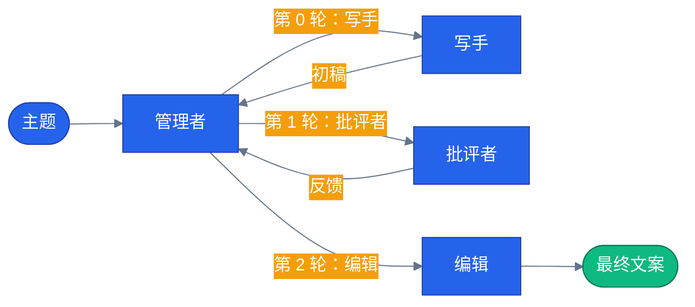

# 第 15 章 · 群聊编排

[项目首页](../../README.md) · [教程总览](../README.md) · [术语表](../_shared/jargon-glossary.md)

## 本章动机

群聊（Group Chat）就像一场会议：所有人都坐在桌边，但由一位管理者决定下一个谁发言。当多个智能体需要在不预设固定移交图的前提下迭代式地相互接续时，就该用它——比如评审循环、头脑风暴、或多角度打磨。它与并发编排（第 13 章）的扇出/汇聚、移交式编排（第 14 章）的控制权传递是不同的形状：这里每个参与者都会发言，顺序由管理者控制，且每个人都能看到其他人已经说过的内容。

本章的典型示例：**写手 → 批评者 → 编辑**共同打磨一句营销文案，每轮由管理者挑选下一位发言者。同一模式的电商版本已在本项目的应用中上线——见下文「在完整项目中的落点」。

## 前置条件

- 已完成[第 14 章 · 移交式编排](../14-handoff-orchestration/)
- 仓库根目录的 `.env` 中配置一个 LLM 提供方：

| 提供方 | 必填 | 可选 |
|----------|----------|----------|
| **OpenAI** | `OPENAI_API_KEY` | `LLM_MODEL`（默认 `gpt-4.1`） |
| **Azure OpenAI** | `AZURE_OPENAI_ENDPOINT`、`AZURE_OPENAI_KEY`、`AZURE_OPENAI_DEPLOYMENT` | `AZURE_OPENAI_API_VERSION`（默认 `2024-10-21`） |

## 核心概念

关键原语是**选择函数**：根据当前对话状态返回下一位发言者，并用最大轮次上限约束循环，防止对话无限运行。

本章代码中出现两种管理者策略：

- **轮询（round-robin）**——一个普通函数按固定顺序走（`writer → critic → editor`），选择过程本身不涉及 LLM 调用。
- **智能体驱动**——把一个完整的 `Agent` 连同成员名单与已有对话交给它，由它决定下一个谁发言（以及何时停止）。MAF 在构建器上以 `orchestrator_agent` 接入；本章 CLI 称其为 `prompt` 策略，因为该决策本质上仍是一次 LLM 调用，只是现在由真实的智能体对象而非手写函数做出。


```mermaid
%%{init: {'theme':'base', 'themeVariables': {
  'primaryColor': '#2563eb','primaryTextColor': '#ffffff','primaryBorderColor': '#1e40af',
  'lineColor': '#64748b','secondaryColor': '#f59e0b','tertiaryColor': '#10b981',
  'background': 'transparent'}}}%%
flowchart LR
  classDef core     fill:#2563eb,stroke:#1e40af,color:#ffffff
  classDef external fill:#f59e0b,stroke:#b45309,color:#000000
  classDef success  fill:#10b981,stroke:#047857,color:#ffffff

  topic([主题])
  manager[管理者]
  writer[写手]
  critic[批评者]
  editor[编辑]
  final([最终文案])

  topic --> manager
  manager -- "第 0 轮：写手" --> writer
  writer -- "初稿" --> manager
  manager -- "第 1 轮：批评者" --> critic
  critic -- "反馈" --> manager
  manager -- "第 2 轮：编辑" --> editor
  editor --> final

  class manager core
  class writer core
  class critic core
  class editor core
  class final success
```

管理者位于每一轮之间——每位发言者的输出都要先回到它这里，才选择下一位，因此循环的终止权归管理者（而非各智能体）所有。

## Python

在仓库根目录运行，使用共享的 `tutorials/` uv 项目（一次 `uv sync` 覆盖全部章节）：

```bash
uv sync --project tutorials
uv run --project tutorials python tutorials/15-group-chat-orchestration/python/main.py "slogan for a coffee shop"          # 轮询
uv run --project tutorials python tutorials/15-group-chat-orchestration/python/main.py "slogan for a coffee shop" prompt   # 智能体驱动
```

> 上面命令里的 `"slogan for a coffee shop"` 是传给模型的**主题字面量**，需与回放夹具保持一致，故保留英文原文。

源码：[`python/main.py`](./python/main.py)。轮询选择器是针对 `GroupChatState` 的普通函数，而非闭包——它从 `state.current_round` 推导下一位发言者，因此无状态，可被 MAF 反复安全调用：

```python
def round_robin_selector(state: GroupChatState) -> str:
    """轮询：按索引为每一轮挑选参与者。

    GroupChatState.participants 是一个 OrderedDict[name, description]。返回
    ``current_round % n`` 位置的名字即可确定性地在成员名单中循环。
    构建器上的 ``max_rounds=3`` 限制总轮次。
    """
    names = list(state.participants.keys())
    return names[state.current_round % len(names)]


def build_workflow(strategy: str = "round-robin"):
    participants = [writer(), critic(), editor()]

    if strategy == "prompt":
        return GroupChatBuilder(
            participants=participants,
            orchestrator_agent=prompt_driven_orchestrator(),
            max_rounds=4,  # 硬性安全网；编排器可能更早结束
        ).build()

    return GroupChatBuilder(
        participants=participants,
        selection_func=round_robin_selector,
        max_rounds=3,
    ).build()
```

`workflow.run(message, stream=True)` 通过 MAF 的流式 `AgentExecutor` 路径驱动每个参与者的发言。`main.py` 的 `run()` 从沿途看到的 `group_chat` 与 `executor_completed` 事件中收集 `(发言者, 文本)` 元组。

## 常见坑

- **管理者可能无限循环。** 务必设置硬性轮次上限。本章在 Python 轮询路径上固定 `max_rounds=3`，即使在智能体驱动路径上也同样设置上限——该路径的首要停止条件是智能体自身的判断，上限只是安全网。
- **选择函数必须可被反复安全调用。** MAF 可能每轮调用一次选择器；此处的 `round_robin_selector` 是 `GroupChatState.current_round` 的纯函数，而不是携带可变迭代器状态的闭包——这是刻意选择，以避免选择器状态与工作流自身的轮次计数器失步。
- **消息可见性。** 默认情况下，每个参与者都能看到此前的完整记录。这使编辑无需额外管道就能同时回应写手的初稿与批评者的反馈——但也意味着提示词会随每一轮增长，对较长的评审小组需要留意。
- **MAF v1.0 的空 `__init__.py` 打包缺陷已修复。** 你可能在较早的代码中看到补丁步骤的引用——`agents/python/patch_maf.py` 仍然存在，但已是有文档说明的空操作，因为本项目已固定 `agent-framework` 1.14.0，该版本随附真实的 `__init__.py`。本章 `main.py` 在导入时实际调用的是 `tutorials/_shared/maf_bootstrap.py` 的 `bootstrap()`，它同时会加载仓库根目录的 `.env`，使教程与完整项目应用共享凭据。

## 测试

[`python/tests/test_group_chat.py`](./python/tests/test_group_chat.py) 覆盖：

1. `test_workflow_builds`——轮询工作流无需网络调用即可构建。
2. `test_replay_speakers_in_round_robin_order`——回放 [`python/tests/fixtures/replay/`](./python/tests/fixtures/replay/) 中已提交的夹具（无网络、无凭据），并断言写手先于批评者、批评者先于编辑发言。
3. 三个 `@pytest.mark.integration` 测试，在缺少真实 LLM 凭据时跳过（`test_real_llm_speakers_in_round_robin_order`、`test_real_llm_each_speaker_produces_content`、`test_real_llm_editor_output_differs_from_writer`）——它们端到端跑真实的轮询循环，并断言编辑的输出确实与写手的初稿不同。

```bash
uv sync --project tutorials
uv run --project tutorials pytest tutorials/15-group-chat-orchestration/python/tests -v
```

## 在完整项目中的落点

本项目的应用里有该模式的线上生产版本——而且它的构建方式与教程中的 `GroupChatBuilder` API 不同，这一点值得注意。

`agents/python/workflows/group_chat.py:99` 定义了 `GroupChatWorkflow`——一个手写的顺序圆桌，直接基于 MAF 的 `Executor`/`WorkflowBuilder` 原语构建，而非教程中的 `GroupChatBuilder`/`selection_func` 管理者抽象。参与讨论者按固定顺序运行（不做动态发言者选择），每人向共享的 `GroupChatState.transcript` 追加内容，供下一位参与者读取，最后由 `_ModeratorExecutor` 汇总出结论。

`agents/python/orchestrator/modes/group_chat_mode.py:78` 的 `GroupChatMode` 是第一个生产调用方：两位由智能体驱动的参与者——一个价值/定价视角、一个质量/评价视角（第 32 行的 `_PANEL_PROMPTS`）——各自看到前一位发言者的内容，随后由主持人汇总出「这件商品值不值得买」的结论。把由智能体驱动的（异步）应答器接入 `GroupChatWorkflow` 需要一处小改动，该文件文档字符串中已有说明：`Responder` 原本严格同步，因为此前所有测试都只传入普通函数；现在 `_PanelistExecutor.run()` 会在应答器结果可等待时对其 await。

它在编排器中以 `group-chat` 模式注册，与 `tool`、`handoff`、`workflow:pre-purchase`、`workflow:return-replace` 并列（参见 `CLAUDE.md` 中的编排器路由布局说明）——可从聊天界面的模式切换器触达，而不只是本教程。

## 下一步

- 下一章：[第 16 章 · Magentic 编排](../16-magentic-orchestration/)
- 完整源码：[`python/`](./python/)
- 共享资料：[Mermaid 风格指南](../_shared/mermaid-style-guide.md) · [术语表](../_shared/jargon-glossary.md)
- [教程总览](../README.md) · 上一章：[第 14 章 · 移交式编排](../14-handoff-orchestration/)
