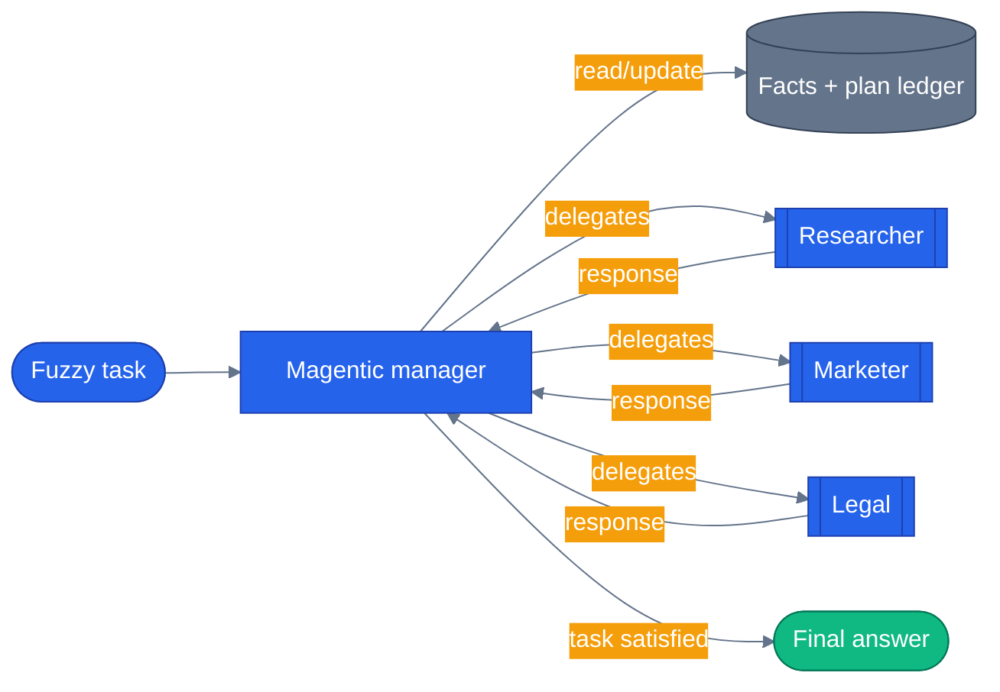

# Chapter 16 — Magentic Orchestration

## Why this chapter

Sequential knows the path. Concurrent runs everything at once. Handoff lets agents pick their own
neighbor. Group Chat uses a manager to schedule speakers round by round. **Magentic** goes further:
the manager reasons over a **task ledger** — what's known, what's unknown, what to try next — and
delegates to workers until the task is actually done, replanning when it stalls.

Use this pattern when you can't predict the flow ahead of time and want the manager to adapt based
on intermediate results. In an e-commerce setting: "put together a launch brief for a new product"
is not a fixed sequence — the manager might consult a market researcher once, or go back to them
twice if the first answer was thin, and it should decide that at run time, not have it hardcoded.

## Prerequisites

- Completed [Chapter 15 — Group Chat Orchestration](../15-group-chat-orchestration/)
- Repo-root `.env` with one LLM provider configured:

| Provider | Required | Optional |
|----------|----------|----------|
| **OpenAI** | `OPENAI_API_KEY` | `LLM_MODEL` (default `gpt-4.1`) |
| **Azure OpenAI** | `AZURE_OPENAI_ENDPOINT`, `AZURE_OPENAI_KEY`, `AZURE_OPENAI_DEPLOYMENT` | `AZURE_OPENAI_API_VERSION` (default `2024-10-21`) |

- **Budget matters here.** Magentic makes multiple manager LLM calls in addition to every worker
  call. Expect somewhere between 5 and 15 LLM calls for a single task on the default settings.

## The concept

Two kinds of agents are involved:

- **Workers** — your specialists (Researcher, Marketer, Legal in this chapter's example). Same
  shape as every prior chapter's agents.
- **Manager** — a `StandardMagenticManager` wrapping its own planning LLM. It owns the loop, not
  the caller.

The manager's loop, each round:

1. Build or refresh a **facts ledger** — what's known, what's still needed.
2. Draft or revise a **plan** — the ordered subtasks left to do.
3. Pick the next worker based on the plan and what's happened so far.
4. Observe that worker's response and update the ledger.
5. Repeat until the task is satisfied, or `max_round_count` / `max_stall_count` trips.



The manager's own reasoning (the ledger updates and delegation choices) is opaque to the caller by
design — from the outside you only see which worker got called and the final synthesized answer.

## Python

Run from the repo root using the shared `tutorials/` uv project (one `uv sync` covers every
chapter):

```bash
uv sync --project tutorials
uv run --project tutorials python tutorials/16-magentic-orchestration/python/main.py "plan a product launch for an AI meal planner"
```

Source: [`python/main.py`](./python/main.py). The three workers and the manager are all plain
`Agent` instances — the manager's instructions are what make it a *planner*, not a special type:

```python
# tutorials/16-magentic-orchestration/python/main.py:79-101
def manager_agent() -> Agent:
    """A planning LLM the Magentic manager uses to decompose and delegate."""
    return Agent(
        _default_client(),
        instructions=(
            "You are a program manager coordinating a small team. "
            "Decompose the user's task into concrete subtasks and route each to the "
            "right specialist. Keep your reasoning tight."
        ),
        name="magentic-manager",
    )


def build_workflow():
    manager = StandardMagenticManager(
        agent=manager_agent(),
        max_round_count=6,
        max_stall_count=2,
    )
    return MagenticBuilder(
        participants=[researcher(), marketer(), legal()],
        manager=manager,
    ).build()
```

`plan()` (`main.py:118-141`) drives the streamed run and separates two kinds of events: a
`group_chat` event whose payload is a `GroupChatRequestSentEvent` (the manager dispatching to a
named worker) and an `output` event carrying the final synthesized answer. Sample output:

```
Task: plan a product launch for an AI meal planner

Delegates consulted: marketer, researcher

Final answer:
Here's a concise launch brief for your AI meal planner:
  Are you tired of stressing over what to cook each day? ...
```

## .NET

Magentic orchestration is **Python-only** in Microsoft Agent Framework today. The official docs
say so directly, and it's confirmed against `Microsoft.Agents.AI.Workflows` 1.1.0 — there is no
`MagenticBuilder` / `StandardMagenticManager` symbol in the .NET assembly.

```bash
cd tutorials/16-magentic-orchestration/dotnet
dotnet run   # prints the "not yet supported in C#" status and points back at the Python example
```

[`dotnet/Program.cs`](./dotnet/Program.cs) is a status stub, not a working sample — it exists so
the chapter's dotnet project still builds and runs, and it links straight back to the Python
walkthrough above. If a future `agent-framework` release adds C# Magentic support, this stub is
what gets replaced with a real example.

## Side-by-side differences

| Aspect | Python | .NET |
|--------|--------|------|
| Availability | Fully supported (`agent_framework.orchestrations.MagenticBuilder`) | Not yet supported — no `MagenticBuilder` type exists |
| Builder | `MagenticBuilder(participants=..., manager=...).build()` | n/a |
| Standard manager | `StandardMagenticManager(agent=..., max_round_count=, max_stall_count=)` | n/a |
| Delegation event | `group_chat` event with a `GroupChatRequestSentEvent` payload | n/a |
| Final output | `output` event carrying the synthesized answer | n/a |

## Gotchas

- **Cost adds up fast.** Magentic makes several manager calls per round on top of every worker
  call — a default `max_round_count=6` against 3 workers can mean 10+ LLM calls for one task. Cap
  `max_round_count` and `max_stall_count` aggressively for anything interactive.
- **Stall detection ends the run, not just a round.** If the manager makes no progress for
  `max_stall_count` consecutive rounds, the whole workflow ends — watch for stall warnings in logs
  rather than assuming a short answer means success.
- **Manager quality dominates.** A vague manager prompt produces vague delegation. Give it short,
  directive instructions, as `manager_agent()` does above.
- **Worker boundaries matter.** Keep each worker's instructions narrow (one concrete kind of
  output) so the manager can chain them reliably instead of getting overlapping, redundant answers.
- **The old "empty `__init__.py`" packaging bug is not something you need to work around anymore.**
  `agent-framework-core==1.0.0` shipped with an empty `__init__.py`; that's fixed upstream as of
  1.14.0, which this repo now pins. `agents/python/patch_maf.py` (used by the capstone app) is a
  documented no-op today — it only writes when the file is empty, which it no longer is. Tutorials
  use a separate, still-active helper, `tutorials/_shared/maf_bootstrap.py`, which both patches
  `agent_framework`'s `__init__.py` defensively (same no-op-if-already-patched logic) and loads the
  repo-root `.env`; every chapter's `main.py` and tests call `maf_bootstrap.bootstrap()` before
  importing `agent_framework`, including this one (`main.py:21-22`).

## Tests


```bash
uv run --project tutorials pytest tutorials/16-magentic-orchestration/python/tests -v
```

[`python/tests/`](./python/tests/) holds `test_magentic.py` plus a `fixtures/replay/` directory.
Structurally, the suite covers:

- A wiring check that `build_workflow()` constructs without error.
- A replay-based test that plays back recorded fixtures (no network, no credentials needed) and
  asserts the manager produces a substantive final answer.
- Two `@pytest.mark.integration` tests, skipped automatically when no LLM credentials are present,
  that exercise a real manager loop — one checking a delegation happened, one checking the manager
  can draw on multiple workers for a broader task.

Magentic's manager loop is non-deterministic in how many rounds it takes, so the tests assert on
outcome (a real, substantive answer) rather than an exact call count or turn sequence.

The .NET side ships [`dotnet/tests/MagenticTests.cs`](./dotnet/tests/MagenticTests.cs), and they are unusual: there is no behaviour to test, because the .NET project is a status stub.

```bash
cd tutorials/16-magentic-orchestration/dotnet && dotnet test tests/Magentic.Tests.csproj
```

What they test is the claim's shelf life. A stub that says "not supported yet" is only honest while it stays true, and left alone it decays silently — the package gets bumped, Magentic lands, and this chapter goes on telling .NET readers to go use Python. Nothing fails, so nobody notices.

So the tests reflect over the shipped `Microsoft.Agents.AI.Workflows` assembly and assert `Magentic` types are still absent, with a control test asserting the sibling builders (`BuildSequential`, `BuildConcurrent`, and the handoff/group-chat builders) *are* present — without which a failed assembly load would look identical to "still missing". **A failure here is good news:** it means the chapter needs rewriting.

## How this shows up in the capstone

Magentic is **not** wired into the production orchestrator yet. The mode registry in
`agents/python/orchestrator/modes/__init__.py` lists five live modes — `tool`, `handoff`,
`workflow:pre-purchase`, `workflow:return-replace`, `group-chat` — and its own module docstring
says plainly that `"magentic"` and a declarative-YAML mode "may land in later steps." Calling
`get_mode("magentic")` raises a named `UnknownModeError` rather than silently falling through to a
default, so the gap is explicit, not accidental — see `docs/concepts/06-orchestration-patterns.md`
for the same point made from the app side ("What's missing").

Until that lands, this chapter's own code is the standalone teaching example of the pattern — the
manager loop you'd wire in once Magentic gets a capstone mode:

```
tutorials/16-magentic-orchestration/python/main.py:92-101
```

`build_workflow()` — a `StandardMagenticManager` wrapping three workers — is the shape a future
`MagenticMode` in `orchestrator/modes/` would adapt: same manager/worker split, same event stream,
just pointed at the e-commerce specialist agents instead of Researcher/Marketer/Legal.

## What's next

- Next chapter: [Chapter 17 — Human-in-the-Loop](../17-human-in-the-loop/)
- Full source: [`python/`](./python/) · [`dotnet/`](./dotnet/)
- [MAF docs — Magentic Orchestration](https://learn.microsoft.com/en-us/agent-framework/workflows/orchestrations/magentic/)
