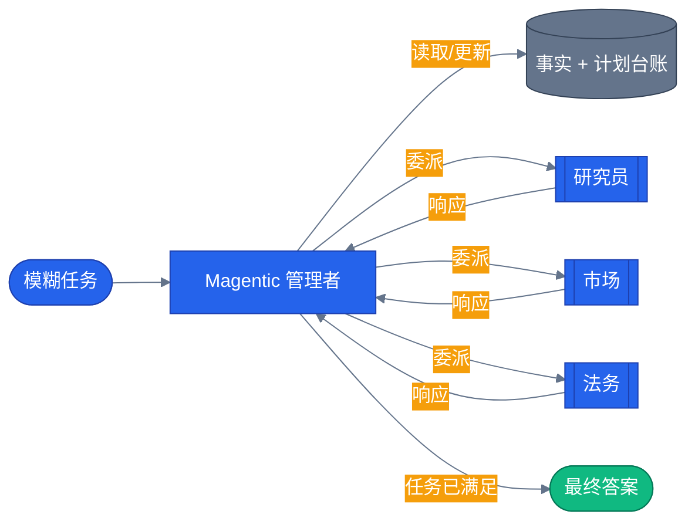

# 第 16 章 · Magentic 编排

[项目首页](../../README.md) · [教程总览](../README.md) · [术语表](../_shared/jargon-glossary.md)

## 本章动机

顺序编排知道路径。并发编排一次跑完所有分支。移交式编排让智能体自己挑选邻居。群聊编排用一位管理者逐轮调度发言者。**Magentic** 走得更远：管理者围绕一份**任务台账**（task ledger）推理——已知什么、未知什么、下一步该试什么——并持续委派给工作者，直到任务真正完成，在停滞时重新规划。

当你无法预先预测流程、又希望管理者依据中间结果自适应时，就用这个模式。放到电商场景里：「为新商品整理一份上市简报」并不是固定序列——管理者可能只咨询一次市场研究员，也可能因为第一次回答太单薄而再回头问两次，而这应该由它在运行时决定，而不是硬编码。

## 前置条件

- 已完成[第 15 章 · 群聊编排](../15-group-chat-orchestration/)
- 仓库根目录的 `.env` 中配置一个 LLM 提供方：

| 提供方 | 必填 | 可选 |
|----------|----------|----------|
| **OpenAI** | `OPENAI_API_KEY` | `LLM_MODEL`（默认 `gpt-4.1`） |
| **Azure OpenAI** | `AZURE_OPENAI_ENDPOINT`、`AZURE_OPENAI_KEY`、`AZURE_OPENAI_DEPLOYMENT` | `AZURE_OPENAI_API_VERSION`（默认 `2024-10-21`） |

- **这里要特别注意预算。** Magentic 除了每次工作者调用之外，还会产生多次管理者 LLM 调用。默认设置下，单个任务预计需要 5 到 15 次 LLM 调用。

## 核心概念

涉及两类智能体：

- **工作者（Workers）**——你的专家（本章示例中是研究员、市场、法务）。形状与前面各章的智能体相同。
- **管理者（Manager）**——一个包装了自身规划 LLM 的 `StandardMagenticManager`。它拥有循环，而不是调用方拥有循环。

管理者的循环，每轮：

1. 构建或刷新**事实台账**——已知什么、还缺什么。
2. 起草或修订**计划**——剩余待办的有序子任务。
3. 依据计划与当前进展挑选下一位工作者。
4. 观察该工作者的响应并更新台账。
5. 重复，直到任务被满足，或 `max_round_count` / `max_stall_count` 触发。


```mermaid
%%{init: {'theme':'base', 'themeVariables': {
  'primaryColor': '#2563eb',
  'primaryTextColor': '#ffffff',
  'primaryBorderColor': '#1e40af',
  'lineColor': '#64748b',
  'secondaryColor': '#f59e0b',
  'tertiaryColor': '#10b981',
  'background': 'transparent'
}}}%%
flowchart LR
  classDef core     fill:#2563eb,stroke:#1e40af,color:#ffffff
  classDef external fill:#f59e0b,stroke:#b45309,color:#000000
  classDef success  fill:#10b981,stroke:#047857,color:#ffffff
  classDef infra    fill:#64748b,stroke:#334155,color:#ffffff

  task([模糊任务])
  manager[Magentic 管理者]
  ledger[(事实 + 计划台账)]
  researcher[[研究员]]
  marketer[[市场]]
  legal[[法务]]
  answer([最终答案])

  task --> manager
  manager -- "读取/更新" --> ledger
  manager -- "委派" --> researcher
  manager -- "委派" --> marketer
  manager -- "委派" --> legal
  researcher -- "响应" --> manager
  marketer -- "响应" --> manager
  legal -- "响应" --> manager
  manager -- "任务已满足" --> answer

  class manager core
  class ledger infra
  class researcher,marketer,legal core
  class answer success
```

管理者自身的推理（台账更新与委派选择）在设计上对调用方不透明——从外部你只能看到哪个工作者被调用，以及最终合成的答案。

## Python

在仓库根目录运行，使用共享的 `tutorials/` uv 项目（一次 `uv sync` 覆盖全部章节）：

```bash
uv sync --project tutorials
uv run --project tutorials python tutorials/16-magentic-orchestration/python/main.py "plan a product launch for an AI meal planner"
```

> 命令中的任务字符串是传给模型的**字面输入**，需与回放夹具保持一致，故保留英文原文。

源码：[`python/main.py`](./python/main.py)。三个工作者与管理者都是普通的 `Agent` 实例——让管理者成为*规划者*的是它的指令，而不是某个特殊类型：

```python
# tutorials/16-magentic-orchestration/python/main.py:73-101
def manager_agent() -> Agent:
    """Magentic 管理者用于分解与委派的规划 LLM。"""
    return Agent(
        _default_client(),
        instructions=(
            "You are a program manager coordinating a small team. "
            "Decompose the user's task into concrete subtasks and route each to the "
            "right specialist. Keep your reasoning tight."
        ),
        name="magentic-manager",
    )


def build_workflow():
    manager = StandardMagenticManager(
        agent=manager_agent(),
        max_round_count=6,
        max_stall_count=2,
    )
    return MagenticBuilder(
        participants=[researcher(), marketer(), legal()],
        manager=manager,
    ).build()
```

> `instructions` 是发给模型的提示词，直接参与回放夹具的请求哈希，因此保留英文原文；其含义是：「你是一位协调小团队的项目经理。把用户的任务分解为具体子任务，并把每一项路由给合适的专家。保持推理紧凑。」

`plan()`（`main.py:118-141`）驱动流式运行，并区分两类事件：`group_chat` 事件，其载荷是 `GroupChatRequestSentEvent`（管理者向具名工作者派发）；以及 `output` 事件，携带最终合成的答案。示例输出：

```
Task: plan a product launch for an AI meal planner

Delegates consulted: marketer, researcher

Final answer:
Here's a concise launch brief for your AI meal planner:
  Are you tired of stressing over what to cook each day? ...
```

## 常见坑

- **成本增长很快。** Magentic 每轮除了每次工作者调用之外还会做多次管理者调用——默认 `max_round_count=6` 配 3 个工作者，单个任务就可能超过 10 次 LLM 调用。对任何交互式场景，都应激进地压低 `max_round_count` 与 `max_stall_count`。
- **停滞检测结束的是整次运行，而不只是某一轮。** 如果管理者连续 `max_stall_count` 轮没有进展，整个工作流就会结束——要留意日志中的停滞警告，不要因为答案很短就默认成功。
- **管理者质量起决定作用。** 模糊的管理者提示词会带来模糊的委派。要给它简短、指令式的说明，就像上面的 `manager_agent()` 那样。
- **工作者边界很重要。** 让每个工作者的指令保持狭窄（只产出一种具体结果），管理者才能可靠地串联它们，而不是拿到重叠、冗余的答案。
- **旧的「空 `__init__.py`」打包缺陷已无需绕行。** `agent-framework-core==1.0.0` 曾随附一个空的 `__init__.py`；该问题在 1.14.0 起已在上游修复，本项目现已固定该版本。`agents/python/patch_maf.py`（供完整项目应用使用）如今是有文档说明的空操作——它只在文件为空时写入，而文件已不再为空。教程使用另一个仍然有效的辅助模块 `tutorials/_shared/maf_bootstrap.py`，它既防御性地修补 `agent_framework` 的 `__init__.py`（同样是「已修补则不动」的逻辑），又加载仓库根目录的 `.env`；每一章的 `main.py` 与测试都会在导入 `agent_framework` 之前调用 `maf_bootstrap.bootstrap()`，本章亦然（`main.py:21-22`）。

## 测试

```bash
uv run --project tutorials pytest tutorials/16-magentic-orchestration/python/tests -v
```

[`python/tests/`](./python/tests/) 下有 `test_magentic.py` 与 `fixtures/replay/` 目录。结构上，测试套件覆盖：

- 一项接线检查：`build_workflow()` 可无错构建。
- 一项基于回放的测试：播放已录制的夹具（无需网络、无需凭据），并断言管理者产出了实质性的最终答案。
- 两项 `@pytest.mark.integration` 测试，在无 LLM 凭据时自动跳过，它们跑真实的管理者循环——一项检查确实发生了委派，另一项检查管理者能为更宽泛的任务调动多个工作者。

Magentic 的管理者循环在轮次数上是不确定的，因此测试断言的是**结果**（真实、实质性的答案），而不是精确的调用次数或轮次序列。

## 在完整项目中的落点

Magentic **尚未**接入生产编排器。`agents/python/orchestrator/modes/__init__.py` 中的模式注册表列出了五个在线模式——`tool`、`handoff`、`workflow:pre-purchase`、`workflow:return-replace`、`group-chat`——其模块文档字符串明确说明 `"magentic"` 与声明式 YAML 模式「可能在后续步骤中落地」。调用 `get_mode("magentic")` 会抛出具名的 `UnknownModeError`，而不是静默回退到默认值，因此这个缺口是显式的、而非意外——应用侧的同一观点见 `docs/concepts/06-orchestration-patterns.md` 的「What's missing」一节。

在该能力落地之前，本章自身的代码就是该模式的独立教学示例——也就是 Magentic 获得完整项目模式后你会接进去的那套管理者循环：

```
tutorials/16-magentic-orchestration/python/main.py:86-101
```

`build_workflow()`——一个包装三个工作者的 `StandardMagenticManager`——正是未来 `orchestrator/modes/` 中 `MagenticMode` 会参照的形状：同样的管理者/工作者划分、同样的事件流，只是指向电商专家智能体，而非研究员/市场/法务。

## 下一步

- 下一章：[第 17 章 · 人在回路](../17-human-in-the-loop/)
- 完整源码：[`python/`](./python/)
- [MAF 文档 —— Magentic 编排](https://learn.microsoft.com/en-us/agent-framework/workflows/orchestrations/magentic/)
