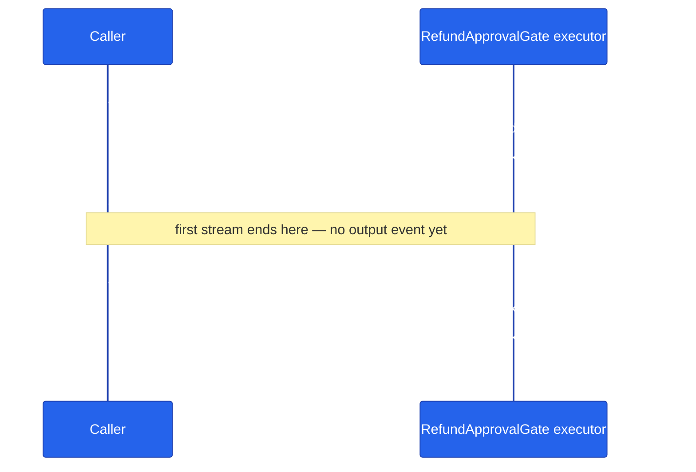

# Chapter 17 — Human-in-the-Loop

Pause a workflow mid-run, ask a human, resume with their answer. Two calls to `workflow.run()`, one `request_id` tying them together — the caller's perspective is the whole story.

## Why this chapter

Some decisions shouldn't be autonomous. Approving a refund over $500. Confirming a return shipping label. Selecting which of three draft emails to send. Workflows need a way to pause for a human and resume seamlessly when the answer arrives, without losing whatever state the run had accumulated so far.

MAF provides `ctx.request_info()` in Python and `RequestPort` in .NET. The workflow suspends, emits a request event, and waits for the caller to supply a response before continuing. This chapter demonstrates the pattern with a refund-approval gate: a workflow holds a proposed refund and pauses to ask a human approver to approve or deny it — minimal domain logic, maximum focus on the pause/resume mechanics.

## Prerequisites

- Completed [Chapter 16 — Magentic Orchestration](../16-magentic-orchestration/)
- No LLM needed — HITL is framework plumbing, not model behavior
- Environment variables: none required for this chapter (the demo runs entirely offline)

## The concept

1. An executor calls `await ctx.request_info(request_data, response_type)`.
2. The workflow emits a `request_info` event containing a unique `request_id` and the request payload, then suspends.
3. The caller's streaming loop over the first `workflow.run(..., stream=True)` call sees that event but never sees an `output` event — the run has paused, not finished.
4. The caller pairs the `request_id` with a human-supplied response and calls `workflow.run(responses={request_id: value}, stream=True)` again.
5. A method decorated with `@response_handler` on the same executor receives `(request, response, ctx)` and continues the workflow from where it left off.



The diagram shows the two separate `run()` calls a caller makes: the first pauses on `request_info`, the second resumes with `responses={...}` and drives the workflow to an `output` event.

## Python

Source: [`python/main.py`](./python/main.py).

```bash
uv sync --project tutorials
uv run --project tutorials python tutorials/17-human-in-the-loop/python/main.py
uv run --project tutorials pytest tutorials/17-human-in-the-loop/python/tests -v
```

The executor pauses on `request_info` and resumes via a `@response_handler`:

```python
class RefundApprovalGate(Executor):
    def __init__(self) -> None:
        super().__init__(id="refund-approval-gate")

    @handler
    async def start(self, refund: RefundApprovalRequest, ctx: WorkflowContext[None, str]) -> None:
        await ctx.request_info(request_data=refund, response_type=bool)

    @response_handler
    async def check(
        self,
        request: RefundApprovalRequest,
        approved: bool,
        ctx: WorkflowContext[None, str],
    ) -> None:
        if approved:
            await ctx.yield_output(f"refund approved for order {request.order_id}: ${request.amount:.2f}")
        else:
            await ctx.yield_output(f"refund denied for order {request.order_id}")
```

`run_with_response()` (used by the tests) shows the caller side — two `workflow.run()` calls tied together by `pending_request_id`:

```python
pending_request_id: str | None = None
async for event in workflow.run(RefundApprovalRequest(order_id=order_id, amount=amount), stream=True):
    if pending_request_id is None and getattr(event, "type", None) == "request_info":
        pending_request_id = getattr(event, "request_id", None)

outputs: list[str] = []
async for event in workflow.run(responses={pending_request_id: approved}, stream=True):
    if getattr(event, "type", None) == "output":
        outputs.append(event.data)
```

## .NET

```bash
cd tutorials/17-human-in-the-loop/dotnet
dotnet run -- y   # scripted, non-interactive: approves the refund
dotnet run -- n   # scripted, non-interactive: denies the refund
```

.NET's `RequestPort` folds request and response into a single `StreamingRun` loop instead of two separate calls — the port is wired into the graph as both the workflow's start node and the upstream source of the decision executor:

```csharp
RequestPort approvalPort = RequestPort.Create<RefundRequest, bool>("ApproveRefund");
RefundDecisionExecutor decision = new(refund);

Workflow workflow = new WorkflowBuilder(approvalPort)
    .AddEdge(approvalPort, decision)
    .WithOutputFrom(decision)
    .Build();

await using StreamingRun run = await InProcessExecution.RunStreamingAsync(workflow, refund);

await foreach (WorkflowEvent evt in run.WatchStreamAsync())
{
    switch (evt)
    {
        case RequestInfoEvent request:
            bool approved = scriptedApproval ?? ReadApprovalFrom(request);
            await run.SendResponseAsync(request.Request.CreateResponse(approved));
            break;
        case WorkflowOutputEvent output:
            Console.WriteLine(output.Data);
            return 0;
    }
}
```

`RefundDecisionExecutor` receives the routed `bool` decision directly via `HandleAsync` and reports the outcome — the refund's `order_id`/`amount` were captured at construction time, since the same run already knows what it's asking approval for.

## Side-by-side differences

| Aspect | Python | .NET |
|--------|--------|------|
| Request | `ctx.request_info(request_data, response_type)` | `RequestPort.Create<TRequest, TResponse>(id)` wired into the graph |
| Response handler | `@response_handler` method with `(self, request, response, ctx)` | Downstream executor receives the routed value directly via `HandleAsync` |
| Resume | A **second, separate** `workflow.run(responses={request_id: value}, stream=True)` call | `run.SendResponseAsync(...)` inside the **same** `StreamingRun`/`WatchStreamAsync()` loop |
| Caller shape | Two async generators, correlated by `request_id` | One `await foreach` handling every pause inline |

## Gotchas

- **Draining the first stream matters.** This repo hit a real bug: resuming a workflow only correctly re-enters its `@response_handler` if the *first* `workflow.run(..., stream=True)` stream is drained to completion. Breaking out of the loop as soon as a `request_info` event arrives — the obvious move if you want to return an HTTP response to the user right away — left the workflow's internal `_is_running` flag stuck `True`, so the resuming `run()` raised `RuntimeError: Workflow is already running`. `tutorials/pyproject.toml`'s dependency comment documents this explicitly: it was a bug in `agent-framework-core==1.0.0`, fixed upstream in `core>=1.11.0` (this repo now pins `1.14.0`). `python/main.py`'s `run_with_response()` (used by the test suite) still drains the full first stream defensively before resuming — worth keeping that habit even on a fixed core, since a caller can't assume every consumer of this pattern is on a patched version. Note that `main()`'s interactive driver *does* `break` out of the first loop early (it only needs the `request_id`, not every event) — that now works because of the 1.11.0 fix, not because it was ever the safe pattern.
- **Two structurally different HITL mechanisms exist in this repo — don't conflate them.** This chapter (and the production `_HitlGateExecutor` below) teaches the in-workflow `ctx.request_info`/`@response_handler` pattern: the workflow graph itself pauses and resumes. `agents/python/shared/hitl.py` is a completely different mechanism — function-invocation middleware that intercepts a gated tool call (`cancel_order`, `process_refund`, `initiate_return`, `modify_order`, `place_backorder`) before it runs and simply never executes it until an admin approves it out-of-band, via a separate `resolve_hitl_request()` + `execute_approved_action()` call path that never re-enters the workflow or LLM loop. There's no workflow pause/resume involved; the tool call just doesn't happen. If you're looking for one and find the other, you're not in the wrong file — they solve adjacent but different problems, and this chapter's own `RefundApprovalGate` uses the *pause-and-resume* mechanism, not `shared/hitl.py`'s middleware-interception one, even though both happen to gate a refund-shaped decision.
- **The old "MAF v1.0 wheel has an empty `__init__.py`" packaging bug is fixed, and no longer needs the file layout this chapter used to suggest.** `agents/python/patch_maf.py` still exists but is a documented no-op now that `agent-framework-core` is pinned to `1.14.0` (the bug only affected `1.0.0`); it's kept only as a defensive fallback. The tutorials use their own bootstrap, `tutorials/_shared/maf_bootstrap.py`, which both patches an empty `__init__.py` if one is ever encountered and loads the repo-root `.env` — both `python/main.py` and `python/tests/test_hitl.py` call `maf_bootstrap.bootstrap()` before importing `agent_framework`.
- **`WorkflowContext[T, U]` type parameters are required** on both the request-emitting handler's and the response handler's `ctx` argument — a bare `WorkflowContext` isn't enough for MAF to validate the request/response types.

## Tests


```bash
uv sync --project tutorials
uv run --project tutorials pytest tutorials/17-human-in-the-loop/python/tests -v
```

`tutorials/17-human-in-the-loop/python/tests/test_hitl.py` covers, with no LLM involved:

1. **Happy path per outcome** — `test_approved_refund_reports_approved` and `test_denied_refund_reports_denied` each drive `run_with_response()` with a different decision and assert on the resulting message.
2. **Workflow construction** — `test_workflow_builds` asserts `build_workflow()` returns a workflow.
3. **The concept assertion** — `test_workflow_pauses_for_human_before_first_response` drains the first `workflow.run(..., stream=True)` and asserts it emits a `request_info` event but *no* `output` event, proving the pause actually happens rather than the workflow completing immediately.

The scripted `dotnet run -- y` / `dotnet run -- n` runs shown above are still the quickest manual check; the test project below is what CI gates on.

The .NET side ships [`dotnet/tests/HitlTests.cs`](./dotnet/tests/HitlTests.cs) — seven tests, no LLM involved at all, since HITL is framework plumbing rather than model behaviour:

```bash
cd tutorials/17-human-in-the-loop/dotnet && dotnet test tests/Hitl.Tests.csproj
```

`Program.RunAsync` takes the approval decision as a `Func<RequestInfoEvent, bool>` — a console prompt in the app, a lambda in the tests. Without that seam the test hangs on `Console.ReadLine`.

The sharpest assertion is `Nothing_Downstream_Runs_Before_The_Decision_Arrives`, which checks the event ordering rather than the final answer. A gate that could be overtaken by its own downstream executor would still produce the right message.

## How this shows up in the capstone

The production analog of *this chapter's own mechanism* — `ctx.request_info`/`@response_handler` pausing and resuming a workflow graph — is `agents/python/workflows/return_replace.py`'s `_HitlGateExecutor`. When a return's order total exceeds `RETURN_HITL_THRESHOLD` (`agents/python/shared/config.py:209`, default `$500`), the gate executor calls `ctx.request_info(...)` at `agents/python/workflows/return_replace.py:172`, pausing the sequential return/replace workflow. A `@response_handler`-decorated method, `on_approval()`, resumes it at `agents/python/workflows/return_replace.py:185` — rebuilding a minimal `WorkflowState` from the original request snapshot (since the paused run's in-memory state doesn't survive to the resuming request) and either continuing the chain on approval or yielding a rejection output. This is the same `ctx.request_info`/`@response_handler` pair this chapter teaches, just applied inside a multi-step sequential workflow instead of a single-executor gate.

The web app surfaces the pause as a pending approval row in `/runs` (`web/src/app/(app)/runs/page.tsx`), and `POST /api/orchestration/{run_id}/resume` drives `ReturnReplaceMode.resume()`, which rebuilds a fresh `Workflow` object and resumes purely from `checkpoint_id` + `responses={request_id: approved}` — because the process that paused the original run may not be the process handling the resume request.

Separately — and structurally unrelated despite the similar name — `agents/python/shared/hitl.py` (358 lines) is the *other* production HITL mechanism: `HITLFunctionMiddleware` intercepts a gated tool call (`cancel_order`, `modify_order`, `process_refund`, `initiate_return`, `place_backorder` — see `HITL_GATED_TOOLS`) before it executes, writes a `tool_approval_requests` row, and returns a `pending_approval` result *without ever calling `call_next()`* — the tool simply never runs until an admin approves it later through `resolve_hitl_request()` + `execute_approved_action()`, a completely separate code path. No workflow pause/resume is involved there at all. Don't confuse the two: this chapter and `_HitlGateExecutor` teach/use pause-and-resume; `shared/hitl.py` teaches intercept-and-never-execute.

## What's next

- Next chapter: [Chapter 18 — State and Checkpoints](../18-state-and-checkpoints/)
- Full source: [`python/`](./python/) · [`dotnet/`](./dotnet/)
- Shared: [Mermaid style guide](../_shared/mermaid-style-guide.md) · [Jargon glossary](../_shared/jargon-glossary.md)
