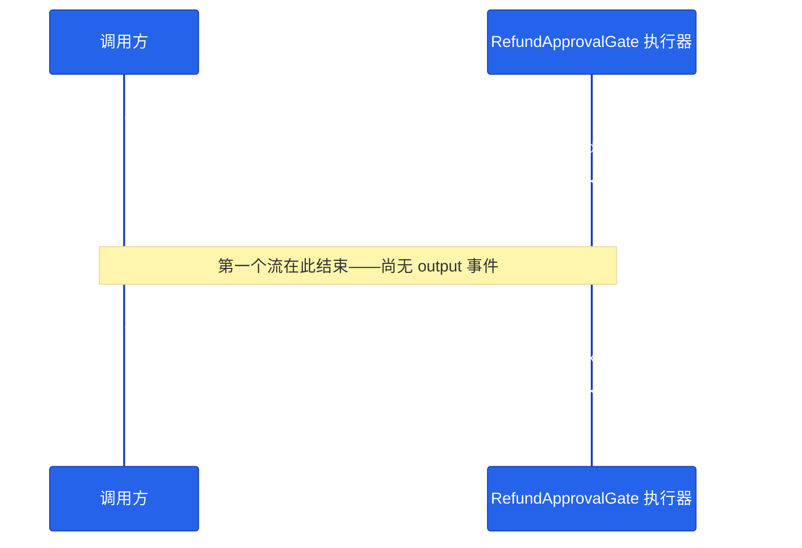

# 第 17 章 · 人在回路

[项目首页](../../README.md) · [教程总览](../README.md) · [术语表](../_shared/jargon-glossary.md)

把工作流在执行途中暂停、向人询问、再带着对方的回答恢复。两次 `workflow.run()` 调用，一个 `request_id` 把它们串起来——从调用方视角看，这就是全部故事。

## 本章动机

有些决策不应由系统自主作出。批准一笔超过 500 元的退款。确认退货面单。在三封草拟邮件中挑一封发出。工作流需要一种方式：为人暂停，并在回答到达时无缝恢复，同时不丢失该次运行此前累积的任何状态。

MAF 提供 `ctx.request_info()` 来请求人工输入。工作流会挂起、发出请求事件，并等待调用方给出响应后再继续。本章用一个退款审批闸门来演示该模式：工作流持有待处理的退款并暂停，请人工审批人批准或驳回——领域逻辑尽可能少，把焦点最大化地放在暂停/恢复机制上。

## 前置条件

- 已完成[第 16 章 · Magentic 编排](../16-magentic-orchestration/)
- 无需 LLM——人在回路是框架管道，不是模型行为
- 环境变量：本章不需要（演示完全离线运行）

## 核心概念

1. 某个执行器调用 `await ctx.request_info(request_data, response_type)`。
2. 工作流发出一个 `request_info` 事件，其中包含唯一的 `request_id` 与请求载荷，随后挂起。
3. 调用方在第一次 `workflow.run(..., stream=True)` 上的流式循环会看到该事件，但始终看不到 `output` 事件——这次运行是**暂停了**，而非结束了。
4. 调用方把 `request_id` 与人工提供的响应配对，再次调用 `workflow.run(responses={request_id: value}, stream=True)`。
5. 同一执行器上被 `@response_handler` 装饰的方法接收 `(request, response, ctx)`，并从中断处继续工作流。


```mermaid
%%{init: {'theme':'base', 'themeVariables': {
  'primaryColor': '#2563eb','primaryTextColor': '#ffffff','primaryBorderColor': '#1e40af',
  'lineColor': '#64748b','secondaryColor': '#f59e0b','tertiaryColor': '#10b981',
  'background': 'transparent'}}}%%
sequenceDiagram
  participant Caller as 调用方
  participant Workflow as RefundApprovalGate 执行器
  Caller->>Workflow: run(RefundApprovalRequest(order_id, amount), stream=True)
  Workflow->>Workflow: ctx.request_info(refund, response_type=bool)
  Workflow-->>Caller: request_info 事件（request_id、order_id、amount）
  Note over Caller,Workflow: 第一个流在此结束——尚无 output 事件
  Caller->>Workflow: run(responses={request_id: approved}, stream=True)
  Workflow->>Workflow: response_handler check(request, approved, ctx)
  Workflow-->>Caller: output 事件（「退款已批准 / 已驳回」）
```

该图展示了调用方所做的两次独立 `run()` 调用：第一次在 `request_info` 处暂停，第二次带着 `responses={...}` 恢复并把工作流驱动到 `output` 事件。

## Python

源码：[`python/main.py`](./python/main.py)。

```bash
uv sync --project tutorials
uv run --project tutorials python tutorials/17-human-in-the-loop/python/main.py
uv run --project tutorials pytest tutorials/17-human-in-the-loop/python/tests -v
```

执行器在 `request_info` 处暂停，并通过 `@response_handler` 恢复：

```python
class RefundApprovalGate(Executor):
    def __init__(self) -> None:
        super().__init__(id="refund-approval-gate")

    @handler
    async def start(self, refund: RefundApprovalRequest, ctx: WorkflowContext[None, str]) -> None:
        await ctx.request_info(request_data=refund, response_type=bool)

    @response_handler
    async def check(
        self,
        request: RefundApprovalRequest,
        approved: bool,
        ctx: WorkflowContext[None, str],
    ) -> None:
        if approved:
            await ctx.yield_output(f"订单 {request.order_id} 退款已批准：¥{request.amount:.2f}")
        else:
            await ctx.yield_output(f"订单 {request.order_id} 退款已驳回")
```

`run_with_response()`（供测试使用）展示了调用方一侧——两次 `workflow.run()` 调用由 `pending_request_id` 串联：

```python
pending_request_id: str | None = None
async for event in workflow.run(RefundApprovalRequest(order_id=order_id, amount=amount), stream=True):
    if pending_request_id is None and getattr(event, "type", None) == "request_info":
        pending_request_id = getattr(event, "request_id", None)

outputs: list[str] = []
async for event in workflow.run(responses={pending_request_id: approved}, stream=True):
    if getattr(event, "type", None) == "output":
        outputs.append(event.data)
```

## 常见坑

- **把第一个流消费完很重要。** 本项目踩过一个真实的坑：只有当*第一次* `workflow.run(..., stream=True)` 的流被完整消费时，恢复工作流才能正确重新进入它的 `@response_handler`。一旦收到 `request_info` 事件就跳出循环——如果你想立刻向用户返回 HTTP 响应，这是最自然的做法——会让工作流内部的 `_is_running` 标志卡在 `True`，于是恢复用的 `run()` 抛出 `RuntimeError: Workflow is already running`。`tutorials/pyproject.toml` 的依赖注释明确记录了这一点：这是 `agent-framework-core==1.0.0` 的缺陷，已在上游 `core>=1.11.0` 修复（本项目现固定 `1.14.0`）。`python/main.py` 的 `run_with_response()`（测试套件使用）仍然防御性地把第一个流完整消费后再恢复——即便在已修复的 core 上也值得保留这个习惯，因为调用方无法假定该模式的每一个使用方都在已打补丁的版本上。注意 `main()` 的交互式驱动*确实*会提前 `break` 出第一个循环（它只需要 `request_id`，不需要每个事件）——现在这能工作是因为 1.11.0 的修复，而不是因为它曾经是安全的做法。
- **本仓库存在两套结构上不同的人在回路机制——不要混淆。** 本章（以及下文生产代码中的 `_HitlGateExecutor`）讲的是工作流内的 `ctx.request_info`/`@response_handler` 模式：工作流图自身暂停与恢复。`agents/python/shared/hitl.py` 是完全不同的机制——函数调用中间件，它在受管控的工具调用（`cancel_order`、`process_refund`、`initiate_return`、`modify_order`、`place_backorder`）执行前将其拦截，并在管理员通过独立的 `resolve_hitl_request()` + `execute_approved_action()` 调用路径（该路径从不重新进入工作流或 LLM 循环）带外批准之前，**根本不执行**它。那里不涉及任何工作流暂停/恢复；工具调用只是没有发生。如果你在找其中一个却找到了另一个，你并没有走错文件——它们解决的是相邻但不同的问题。本章自己的 `RefundApprovalGate` 使用的是*暂停并恢复*机制，而非 `shared/hitl.py` 的中间件拦截机制，尽管两者恰好都在管控一笔退款形状的决策。
- **旧的「MAF v1.0 wheel 带空 `__init__.py`」打包缺陷已修复，本章曾建议的文件布局也不再需要。** `agents/python/patch_maf.py` 仍然存在，但在 `agent-framework-core` 固定为 `1.14.0` 之后已是有文档说明的空操作（该缺陷只影响 `1.0.0`），保留它只是作为防御性回退。教程使用自己的引导模块 `tutorials/_shared/maf_bootstrap.py`，它既会在遇到空的 `__init__.py` 时进行修补，也加载仓库根目录的 `.env`——`python/main.py` 与 `python/tests/test_hitl.py` 都在导入 `agent_framework` 之前调用 `maf_bootstrap.bootstrap()`。
- **`WorkflowContext[T, U]` 的类型参数是必需的**，发出请求的处理函数与响应处理函数的 `ctx` 参数都必须带上——仅写裸的 `WorkflowContext` 不足以让 MAF 校验请求/响应类型。

## 测试

```bash
uv sync --project tutorials
uv run --project tutorials pytest tutorials/17-human-in-the-loop/python/tests -v
```

`tutorials/17-human-in-the-loop/python/tests/test_hitl.py` 在完全不涉及 LLM 的情况下覆盖：

1. **两种结果的正常路径**——`test_approved_refund_reports_approved` 与 `test_denied_refund_reports_denied` 各自以不同决策驱动 `run_with_response()`，并断言最终消息。
2. **工作流构建**——`test_workflow_builds` 断言 `build_workflow()` 返回一个工作流。
3. **概念性断言**——`test_workflow_pauses_for_human_before_first_response` 消费第一次 `workflow.run(..., stream=True)`，断言它发出了 `request_info` 事件但**没有** `output` 事件，从而证明暂停确实发生，而非工作流立即完成。

## 在完整项目中的落点

*本章自身机制*（`ctx.request_info`/`@response_handler` 暂停并恢复工作流图）的生产版本是 `agents/python/workflows/return_replace.py` 中的 `_HitlGateExecutor`（定义于 `agents/python/workflows/return_replace.py:254`）。当退货订单总额超过 `RETURN_HITL_THRESHOLD`（`agents/python/shared/config.py:248`，默认 ¥500）时，闸门执行器在 `agents/python/workflows/return_replace.py:292` 调用 `ctx.request_info(...)`，暂停顺序执行的退货/换货工作流。被 `@response_handler` 装饰的方法 `on_approval()` 在 `agents/python/workflows/return_replace.py:310` 恢复它——从原始请求快照重建一个最小 `WorkflowState`（因为暂停运行的进程内状态不会存活到恢复请求），随后在批准时继续链条，或产出拒绝结果。这正是本章所讲的同一对 `ctx.request_info`/`@response_handler`，只是应用在了一个多步顺序工作流内部，而非单执行器闸门中。

Web 应用把这次暂停呈现为 `/runs` 中的一条待审批记录（`web/src/app/(app)/runs/page.tsx`），而 `POST /api/orchestration/{run_id}/resume` 驱动 `ReturnReplaceMode.resume()`，后者会重建一个全新的 `Workflow` 对象，并仅凭 `checkpoint_id` + `responses={request_id: approved}` 恢复——因为暂停原始运行的进程未必就是处理恢复请求的那个进程。

另外——尽管名字相似但在结构上毫无关系——`agents/python/shared/hitl.py`（513 行）是*另一种*生产用人在回路机制：`HITLFunctionMiddleware`（`agents/python/shared/hitl.py:43`）在受管控的工具调用（`cancel_order`、`modify_order`、`process_refund`、`initiate_return`、`place_backorder`——见 `HITL_GATED_TOOLS`，`agents/python/shared/hitl.py:29`）执行前将其拦截，写入一条 `tool_approval_requests` 记录，并返回 `pending_approval` 结果，**且从不调用 `call_next()`**——该工具在管理员稍后通过 `resolve_hitl_request()`（`agents/python/shared/hitl.py:289`）与 `execute_approved_action()`（`agents/python/shared/hitl.py:334`）（一条完全独立的代码路径）批准之前根本不会运行。那里完全不涉及工作流暂停/恢复。不要把两者混为一谈：本章与 `_HitlGateExecutor` 讲授/使用的是暂停并恢复；`shared/hitl.py` 讲授的是拦截且不执行。

## 下一步

- 下一章：[第 18 章 · 状态与检查点](../18-state-and-checkpoints/)
- 完整源码：[`python/`](./python/)
- 共享资料：[Mermaid 风格指南](../_shared/mermaid-style-guide.md) · [术语表](../_shared/jargon-glossary.md)
