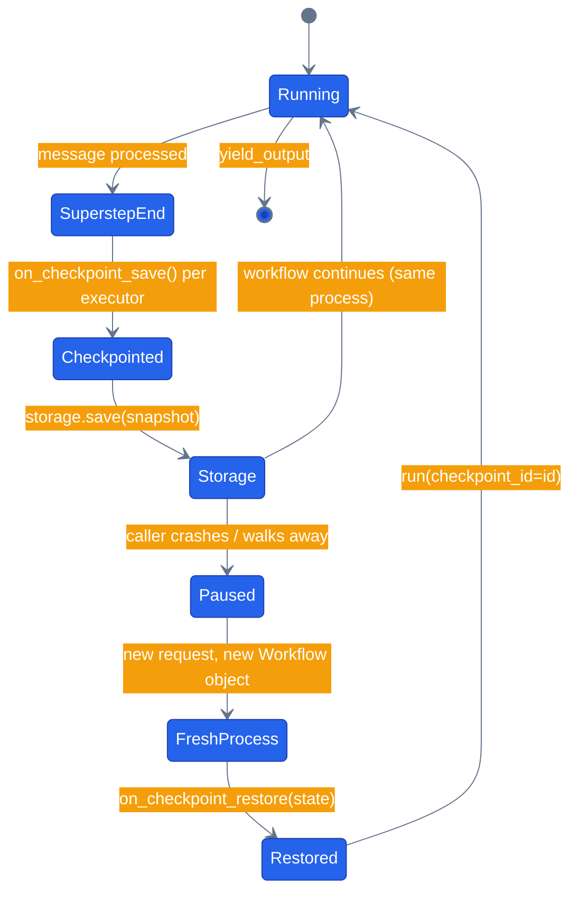

# Chapter 18 — State and Checkpoints

## Why this chapter

Long-running workflows — a multi-day return, an overnight research report, a paused human-in-the-loop approval (Chapter 17) — need to survive a process restart. If the workflow only lives in memory, a redeploy or a crash mid-run loses whatever state it was carrying. MAF's answer is `CheckpointStorage`: the framework snapshots every executor's state at each superstep boundary and hands it to a storage backend — `InMemoryCheckpointStorage` for tests, `FileCheckpointStorage` for durable local runs, and a Postgres/Cosmos-backed implementation for production. You don't write the serialization protocol; you implement two hooks per executor that say what to save and how to restore it, and the framework does the rest.

This is not academic. This repo has a real production checkpoint store, and the `workflow:return-replace` orchestration mode uses it to make a paused approval durable *across separate HTTP requests, possibly served by different processes* — see [How this shows up in the capstone](#how-this-shows-up-in-the-capstone).

## Prerequisites

- Completed [Chapter 17 — Human-in-the-Loop](../17-human-in-the-loop/)
- No LLM needed — this chapter uses a return-refund accumulation, not agents

## The concept

An executor opts into checkpointing by implementing two hooks: `on_checkpoint_save` / `on_checkpoint_restore` in Python, `OnCheckpointingAsync` / `OnCheckpointRestoredAsync` in .NET. At the end of every superstep — the point where all executors have processed their current batch of messages and the workflow is about to move on — MAF calls `on_checkpoint_save` (or queues state via `QueueStateUpdateAsync` in .NET) on every executor that defines it, bundles the results with whatever messages are still in flight, and hands the bundle to the storage backend. Resuming later means pointing a *fresh* workflow instance at a `checkpoint_id`: MAF rehydrates each executor's state through the restore hook before replaying the pending messages.

The important part is what checkpointing does *not* require: the process that resumes doesn't need to be the process that paused. That's what makes it useful for HITL — you can pause a workflow, return an HTTP response, let the container recycle, and resume from a completely different request days later as long as the checkpoint made it to durable storage.



The checkpoint written at `SuperstepEnd` is the only thing that has to survive the gap — a new process rebuilds every executor from scratch and trusts the snapshot over any constructor default.

## Python

Source: [`python/main.py`](./python/main.py).

```bash
uv sync --project tutorials
uv run --project tutorials python tutorials/18-state-and-checkpoints/python/main.py
uv run --project tutorials pytest tutorials/18-state-and-checkpoints/python/tests -v
```

Two executors, standing in for a slice of a return-request pipeline: `ReturnRequestExecutor` holds a running refund amount, seeded with an initial refund and incremented as return line items get processed, then forwards it to a stateless `FinalizeReturnExecutor`, which yields the refund total as the workflow's output. `ReturnRequestExecutor`'s state round-trips through its two hooks:

```python
class ReturnRequestExecutor(Executor):
    def __init__(self, initial_refund: float) -> None:
        super().__init__(id="return-request")
        self.refund_amount = initial_refund

    @handler
    async def handle(self, item_refund: float, ctx: WorkflowContext[float, None]) -> None:
        self.refund_amount += item_refund
        await ctx.send_message(self.refund_amount)

    async def on_checkpoint_save(self) -> dict[str, Any]:
        return {"refund_amount": self.refund_amount}

    async def on_checkpoint_restore(self, state: dict[str, Any]) -> None:
        self.refund_amount = float(state.get("refund_amount", 0.0))
```

The demo's real proof is in `demo()`: run the workflow end to end with `FileCheckpointStorage`, grab the *first* checkpoint (superstep 1, before FinalizeReturn emitted output), then build a **second** `ReturnRequestExecutor` seeded with an initial refund of `999.0` — a deliberately wrong value — and resume from that checkpoint:

```python
wrong_initial_refund = 999.0
replayed = await resume_from_checkpoint(
    storage, first.checkpoint_id, resume_initial_refund=wrong_initial_refund
)
print(f"Phase 2 result: refund_amount = {replayed} (expected {result})")
```

If the replayed refund_amount matches the original run instead of reflecting `resume_initial_refund=999.0`, the checkpoint — not the constructor — was the actual source of truth. `main.py` accepts `initial_refund` and `item_refund` as CLI args (`python main.py 10.0 5.0`, default `10.0 5.0` → refund_amount `15.0`).

## .NET

Source: [`dotnet/Program.cs`](./dotnet/Program.cs).

```bash
cd tutorials/18-state-and-checkpoints/dotnet
dotnet run
dotnet test
```

Same two-executor shape, but .NET's checkpoint API is store-and-manager based rather than a single object: `FileSystemJsonCheckpointStore` writes one JSON file per checkpoint plus an index, and `CheckpointManager.CreateJson(store)` wraps it with the JSON marshaller MAF's workflow engine talks to.

```csharp
var store = new FileSystemJsonCheckpointStore(checkpointDir);
CheckpointManager checkpointManager = CheckpointManager.CreateJson(store);

await using StreamingRun run = await InProcessExecution
    .RunStreamingAsync(workflow1, input: itemRefund, checkpointManager, sessionId);
```

`ReturnRequestExecutor` uses `QueueStateUpdateAsync` / `ReadStateAsync` against a string key instead of returning a dict:

```csharp
protected override ValueTask OnCheckpointingAsync(
    IWorkflowContext context, CancellationToken cancellationToken = default) =>
    context.QueueStateUpdateAsync(StateKey, _refundAmount, cancellationToken: cancellationToken);

protected override async ValueTask OnCheckpointRestoredAsync(
    IWorkflowContext context, CancellationToken cancellationToken = default)
{
    _refundAmount = await context.ReadStateAsync<double>(StateKey, cancellationToken: cancellationToken);
}
```

Resuming builds a fresh `Workflow` (`BuildWorkflow(initialRefund)` again, same initial refund this time — the .NET demo doesn't deliberately poison the seed the way Python's does) and calls `InProcessExecution.ResumeStreamingAsync(workflow2, firstCheckpoint, checkpointManager)`. The program exits `0` if the replayed refund_amount matches the first run, `2` if it doesn't — a cheap smoke-test contract for `dotnet run` itself, not just `dotnet test`.

## Side-by-side differences

| Aspect | Python | .NET |
|--------|--------|------|
| Save hook | `async on_checkpoint_save() -> dict` | `OnCheckpointingAsync(ctx, ct)` + `context.QueueStateUpdateAsync(key, value)` |
| Restore hook | `async on_checkpoint_restore(state: dict)` | `OnCheckpointRestoredAsync(ctx, ct)` + `context.ReadStateAsync<T>(key)` |
| Storage shape | One `CheckpointStorage` object (`FileCheckpointStorage`, `InMemoryCheckpointStorage`, ...) | `store` (backing files) + `CheckpointManager` (marshalling) kept separate |
| Listing checkpoints | `await storage.list_checkpoints(workflow_name=...)` | `await store.RetrieveIndexAsync(sessionId)` |
| Resume | `workflow.run(stream=True, checkpoint_id=id, checkpoint_storage=storage)` | `InProcessExecution.ResumeStreamingAsync(workflow, checkpointInfo, checkpointManager)` |

## Gotchas

- **Resume can't take a new message.** Passing `checkpoint_id=` to `workflow.run()` continues from the saved superstep's pending messages; you don't (and can't) also pass a fresh `message=` to kick it off differently.
- **The workflow needs a stable `name`.** Python's `storage.list_checkpoints(workflow_name=...)` and the .NET `sessionId` used with `RetrieveIndexAsync` are both how you find checkpoints later — lose the name/session id and the checkpoints are still on disk but unreachable through the normal API.
- **State must round-trip through the backend's serializer.** Python's `on_checkpoint_save` returns a plain `dict` that has to survive JSON; .NET's `QueueStateUpdateAsync` is generic but still bound by what `CheckpointManager.CreateJson` can marshal. Custom objects need explicit (de)serialization — don't hand back something with, say, an open file handle or a live DB connection.
- **Checkpoints pile up.** Neither `FileCheckpointStorage` nor `FileSystemJsonCheckpointStore` auto-deletes old snapshots. A production backend needs its own retention policy — see the `workflow_checkpoints` table note below.
- **The MAF v1.0 empty-`__init__.py` packaging bug is fixed upstream.** `agents/python/patch_maf.py` still exists but is a documented no-op now that the repo pins `agent-framework` 1.14.0, which ships a real `__init__.py`. Tutorials don't depend on that file at all — they call `tutorials/_shared/maf_bootstrap.py`'s `bootstrap()`, which patches `agent_framework`'s `__init__.py` only if it's still empty (defensive, same idempotent no-op in practice) and loads the repo-root `.env`. There's no `shared/maf.py` or `tutorials/_shared/maf.py` shim — don't go looking for one.

## Tests


`tutorials/18-state-and-checkpoints/python/tests/test_checkpoints.py` has 8 tests exercising the hooks and the file-backed round trip directly (no LLM, deterministic):

- `on_checkpoint_save` / `on_checkpoint_restore` round-trip `refund_amount` correctly, including that restore overwrites whatever initial refund the constructor set and defaults sanely when the key is missing
- running the workflow actually writes checkpoint files to disk (`FileCheckpointStorage`)
- `list_checkpoints` returns a non-empty list after a run
- resuming from a checkpoint into a **fresh** workflow instance restores the pre-resume state (the core proof of durability)
- `InMemoryCheckpointStorage` produces the same replay result as the file-backed store
- a plain wiring check that `build_workflow()` builds with checkpoint storage attached

```bash
uv run --project tutorials pytest tutorials/18-state-and-checkpoints/python/tests -v
cd tutorials/18-state-and-checkpoints/dotnet && dotnet test
```

The .NET side ships [`dotnet/tests/CheckpointsTests.cs`](./dotnet/tests/CheckpointsTests.cs) — ten tests, no LLM:

```bash
cd tutorials/18-state-and-checkpoints/dotnet && dotnet test tests/Checkpoints.Tests.csproj
```

`The_Restored_Total_Is_Not_Merely_The_Constructor_Seed` is the one doing real work. The resumed run builds a fresh executor seeded with the initial refund, so a no-op `OnCheckpointRestoredAsync` produces exactly `10.0` — a plausible number that passes any assertion looser than this one, with no exception and no warning.

A second test pins a constraint that reads like a bug when you hit it: `FileSystemJsonCheckpointStore` takes an exclusive lock on its directory and does not release it when the run ends, so constructing a second store over the same directory throws "already in use by another process" — from the *same* process, after the first run finished.

## How this shows up in the capstone

This chapter's toy is a narrow approximation: one stateful executor, one checkpoint, torn down and resumed. The real `workflow:return-replace` chain (`agents/python/workflows/return_replace.py`) is a much bigger thing — six executors carrying a full `WorkflowState` dataclass (order id, refund amount, replacement products, HITL flags, completed-steps list) through `check-eligibility → initiate-return → search-replacements → hitl-gate → apply-discount → finalize`. This chapter doesn't rebuild that chain at toy scale; it isolates and teaches the one mechanic all of it depends on — a stateful executor's checkpoint save/restore hooks — so the bigger workflow below reads as a scaled-up version of exactly this, not a different trick.

This chapter's toy example uses `FileCheckpointStorage`. The capstone runs a real one: `agents/python/shared/checkpoint_storage.py:34` defines `PostgresCheckpointStorage`, a `CheckpointStorage` implementation backed by `asyncpg` that reads and writes the `workflow_checkpoints` table (`docker/postgres/init.sql`), encoding each snapshot through MAF's own `encode_checkpoint_value` so the wire format matches what `FileCheckpointStorage` writes to disk — Postgres is just where it's kept. It's selected by `shared.factory.get_checkpoint_storage()` when `MAF_CHECKPOINT_BACKEND=postgres` (the production default), and every attached run is wrapped in `RecordingCheckpointStorage` so each save surfaces as its own `kind="checkpoint"` event on the SSE stream — MAF's own event stream never mentions a save otherwise (`agents/python/orchestrator/modes/workflow_mode.py:132`).

The payoff is `workflow:return-replace` mode's HITL gate (Chapter 17 + this chapter combined): when the workflow pauses on `ctx.request_info`, the orchestrator records the paused checkpoint against a `hitl_requests` row. `ReturnReplaceMode.resume()` (`agents/python/orchestrator/modes/workflow_mode.py:299`), reached from `POST /api/orchestration/{run_id}/resume` (`agents/python/orchestrator/routes/orchestration.py:174`), builds a **fresh** `Workflow` object — there's no live one to reuse, since the one that paused lived in a prior request's process memory — and resumes purely from `checkpoint_id` plus the human's approval, exactly like this chapter's Phase 2. `GET /api/runs/{run_id}/checkpoints` (`agents/python/orchestrator/routes/legacy.py:1117`) surfaces pending approvals to the UI, and `web/src/app/(app)/runs/page.tsx` renders Approve/Reject buttons that call it — you can watch this exact mechanism resume a paused return in the live `/runs` page, not just in a unit test.

## What's next

- Next chapter: [Chapter 19 — Declarative Workflows](../19-declarative-workflows/)
- Full source: [`python/`](./python/) · [`dotnet/`](./dotnet/)
- [MAF docs — Checkpointing](https://learn.microsoft.com/en-us/agent-framework/workflows/checkpoints/)
