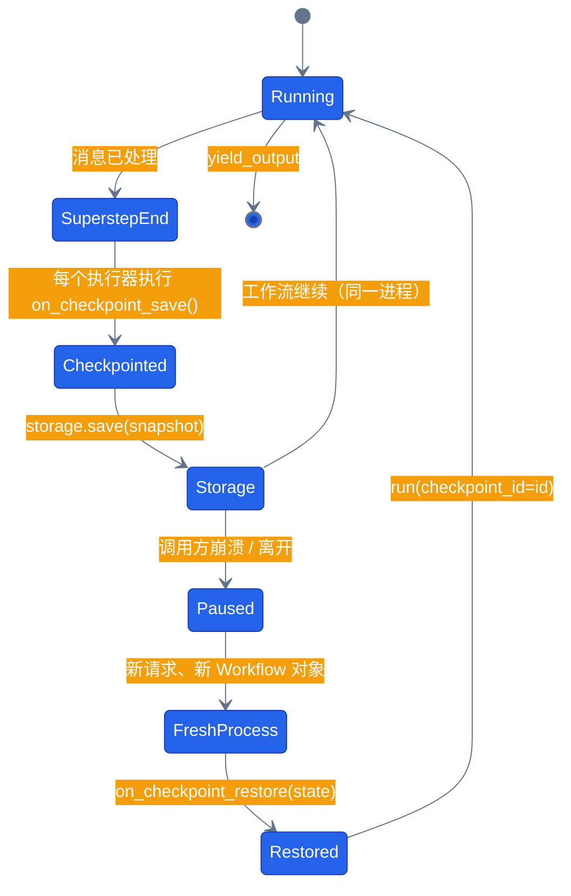

# 第 18 章 · 状态与检查点

[项目首页](../../README.md) · [教程总览](../README.md) · [术语表](../_shared/jargon-glossary.md)

## 本章动机

长时间运行的工作流——跨多日的退货、通宵生成的研究报告、暂停等待人工审批的流程（第 17 章）——必须能挺过进程重启。如果工作流只存在于内存中，一次重新部署或运行途中崩溃就会丢失它携带的所有状态。MAF 的答案是 `CheckpointStorage`：框架在每个超步（superstep）边界为每个执行器的状态做快照，并交给存储后端——测试用 `InMemoryCheckpointStorage`，本地持久化运行用 `FileCheckpointStorage`，生产环境用基于 Postgres/Cosmos 的实现。你不需要编写序列化协议；只需为每个执行器实现两个钩子，说明「保存什么」与「如何恢复」，其余交给框架。

这并非纸上谈兵。本项目有真实的检查点存储，`workflow:return-replace` 编排模式用它让被暂停的审批**跨越不同的 HTTP 请求、甚至可能由不同进程处理**仍然持久——见下文「在完整项目中的落点」。

## 前置条件

- 已完成[第 17 章 · 人在回路](../17-human-in-the-loop/)
- 无需 LLM——本章使用退货退款的累加，而非智能体

## 核心概念

执行器通过实现两个钩子来选择启用检查点：Python 中是 `on_checkpoint_save` / `on_checkpoint_restore`。在每个超步结束时——即所有执行器都处理完当前批次消息、工作流即将继续推进的那一刻——MAF 会对每个定义了该钩子的执行器调用 `on_checkpoint_save`，把结果与仍在传输中的消息打包，交给存储后端。之后恢复，就是把一个**全新的**工作流实例指向某个 `checkpoint_id`：MAF 通过恢复钩子重新水合每个执行器的状态，然后重放待处理的消息。

关键之处在于检查点**不需要**什么：执行恢复的进程不必是当初暂停的那个进程。这正是它对人在回路有价值的原因——你可以暂停工作流、返回 HTTP 响应、让容器被回收，几天后从完全不同的请求恢复，只要检查点落到了持久化存储里。


```mermaid
%%{init: {'theme':'base', 'themeVariables': {
  'primaryColor': '#2563eb','primaryTextColor': '#ffffff','primaryBorderColor': '#1e40af',
  'lineColor': '#64748b','secondaryColor': '#f59e0b','tertiaryColor': '#10b981',
  'background': 'transparent'}}}%%
stateDiagram-v2
  classDef core fill:#2563eb,stroke:#1e40af,color:#ffffff
  classDef infra fill:#64748b,stroke:#334155,color:#ffffff
  classDef success fill:#10b981,stroke:#047857,color:#ffffff

  [*] --> Running
  Running --> SuperstepEnd: 消息已处理
  SuperstepEnd --> Checkpointed: 每个执行器执行 on_checkpoint_save()
  Checkpointed --> Storage: storage.save(snapshot)
  Storage --> Running: 工作流继续（同一进程）
  Storage --> Paused: 调用方崩溃 / 离开
  Paused --> FreshProcess: 新请求、新 Workflow 对象
  FreshProcess --> Restored: on_checkpoint_restore(state)
  Restored --> Running: run(checkpoint_id=id)
  Running --> [*]: yield_output
```

在 `SuperstepEnd` 写入的检查点是唯一必须跨越这段空档的东西——新进程从头重建每个执行器，并信任快照胜过任何构造函数默认值。

## Python

源码：[`python/main.py`](./python/main.py)。

```bash
uv sync --project tutorials
uv run --project tutorials python tutorials/18-state-and-checkpoints/python/main.py
uv run --project tutorials pytest tutorials/18-state-and-checkpoints/python/tests -v
```

两个执行器，代表退货请求流水线的一个切片：`ReturnRequestExecutor` 持有一个累加的退款金额，以初始退款播种，并在处理退货明细项时递增，然后把它转发给无状态的 `FinalizeReturnExecutor`，后者把退款总额作为工作流输出产出。`ReturnRequestExecutor` 的状态通过两个钩子往返：

```python
class ReturnRequestExecutor(Executor):
    def __init__(self, initial_refund: float) -> None:
        super().__init__(id="return-request")
        self.refund_amount = initial_refund

    @handler
    async def handle(self, item_refund: float, ctx: WorkflowContext[float, None]) -> None:
        self.refund_amount += item_refund
        await ctx.send_message(self.refund_amount)

    async def on_checkpoint_save(self) -> dict[str, Any]:
        return {"refund_amount": self.refund_amount}

    async def on_checkpoint_restore(self, state: dict[str, Any]) -> None:
        self.refund_amount = float(state.get("refund_amount", 0.0))
```

演示的真正证明在 `demo()` 里：用 `FileCheckpointStorage` 端到端跑一遍工作流，取出**第一个**检查点（超步 1，即 `FinalizeReturn` 产出输出之前），然后构建**第二个** `ReturnRequestExecutor`，用刻意错误的初始退款 `999.0` 播种，再从该检查点恢复：

```python
wrong_initial_refund = 999.0
replayed = await resume_from_checkpoint(
    storage, first.checkpoint_id, resume_initial_refund=wrong_initial_refund
)
print(f"阶段 2 结果：refund_amount = {replayed}（期望 {result}）")
```

如果重放出的 refund_amount 与原始运行一致，而没有反映 `resume_initial_refund=999.0`，那么真正的信息来源就是检查点，而不是构造函数。`main.py` 接受 `initial_refund` 与 `item_refund` 作为命令行参数（`python main.py 10.0 5.0`，默认 `10.0 5.0` → refund_amount 为 `15.0`）。

## 常见坑

- **恢复时不能传入新消息。** 给 `workflow.run()` 传 `checkpoint_id=` 会从所保存超步的待处理消息继续；你不能（也无法）同时传入一条新的 `message=` 来以不同方式启动它。
- **工作流需要一个稳定的 `name`。** `storage.list_checkpoints(workflow_name=...)` 按工作流名称查找检查点；丢失名称后，即使文件仍在磁盘上，也无法按原名称查询。
- **状态必须能通过后端的序列化器往返。** Python 的 `on_checkpoint_save` 返回普通 `dict`，必须能通过 JSON 序列化。自定义对象需要显式的（反）序列化——不要交回带有例如打开的文件句柄或活跃数据库连接的东西。
- **检查点会不断堆积。** `FileCheckpointStorage` 不会自动删除旧快照。生产后端需要自己的保留策略——见下文 `workflow_checkpoints` 表的说明。
- **MAF v1.0 的空 `__init__.py` 打包缺陷已在上游修复。** `agents/python/patch_maf.py` 仍然存在，但在本项目固定 `agent-framework` 1.14.0 之后已是有文档说明的空操作，该版本随附真实的 `__init__.py`。教程完全不依赖该文件——它们调用 `tutorials/_shared/maf_bootstrap.py` 的 `bootstrap()`，它只在 `agent_framework` 的 `__init__.py` 仍为空时进行修补（防御性，实践中同样是幂等的空操作），并加载仓库根目录的 `.env`。不存在 `shared/maf.py` 或 `tutorials/_shared/maf.py` 之类的兼容垫片——不必去找。

## 测试

`tutorials/18-state-and-checkpoints/python/tests/test_checkpoints.py` 有 8 个测试，直接检验钩子与文件后端的往返（无 LLM，确定性）：

- `on_checkpoint_save` / `on_checkpoint_restore` 正确往返 `refund_amount`，包括恢复会覆盖构造函数设置的初始退款，以及键缺失时回落到合理默认值
- 运行工作流确实会把检查点文件写到磁盘（`FileCheckpointStorage`）
- 一次运行后 `list_checkpoints` 返回非空列表
- 从检查点恢复到**全新**工作流实例能还原恢复前的状态（持久性的核心证明）
- `InMemoryCheckpointStorage` 产生与文件后端相同的重放结果
- 一项普通接线检查：`build_workflow()` 能带着检查点存储构建成功

```bash
uv run --project tutorials pytest tutorials/18-state-and-checkpoints/python/tests -v
```

## 在完整项目中的落点

本章的示例是一个很窄的近似：一个有状态执行器、一个检查点，拆掉再恢复。真实的 `workflow:return-replace` 链条（`agents/python/workflows/return_replace.py`）要大得多——六个执行器携带完整的 `WorkflowState` 数据类（订单 id、退款金额、替换商品、人在回路标志、已完成步骤列表），依次经过 `check-eligibility → initiate-return → search-replacements → hitl-gate → apply-discount → finalize`。本章并不以示例规模重建那条链条；它隔离并讲授那条链条所依赖的唯一机制——有状态执行器的检查点保存/恢复钩子——使下面那个更大的工作流读起来像是它的放大版，而不是另一套把戏。

本章的示例使用 `FileCheckpointStorage`。完整项目跑的是真实实现：`agents/python/shared/checkpoint_storage.py:31` 定义了 `PostgresCheckpointStorage`，一个基于 `asyncpg` 的 `CheckpointStorage` 实现，读写 `workflow_checkpoints` 表（`docker/postgres/init.sql:450`），并通过 MAF 自己的 `encode_checkpoint_value` 编码每个快照，使线上格式与 `FileCheckpointStorage` 写入磁盘的格式一致——Postgres 只是保存它的地方。当 `MAF_CHECKPOINT_BACKEND=postgres`（生产默认值）时，它由 `agents/python/shared/factory.py:207` 的 `get_checkpoint_storage()` 选中；并且每次挂载的运行都被包装进 `RecordingCheckpointStorage`（`agents/python/shared/checkpoint_storage.py:111`），使每次保存都作为独立的 `kind="checkpoint"` 事件出现在 SSE 流上——否则 MAF 自己的事件流根本不会提到保存动作（`agents/python/orchestrator/modes/workflow_mode.py:151`）。

回报是 `workflow:return-replace` 模式的人在回路闸门（第 17 章 + 本章的组合）：当工作流在 `ctx.request_info` 处暂停时，编排器把暂停的检查点记录到对应的 `hitl_requests` 行上。`ReturnReplaceMode.resume()`（`agents/python/orchestrator/modes/workflow_mode.py:318`）由 `POST /api/orchestration/{run_id}/resume`（`agents/python/orchestrator/routes/orchestration.py:174`）触达，它会构建一个**全新的** `Workflow` 对象——没有现成的可复用，因为当初暂停的那个只存在于此前请求的进程内存中——并仅凭 `checkpoint_id` 加人工审批结果恢复，与本章的第 2 阶段完全一致。`GET /api/runs/{run_id}/checkpoints`（`agents/python/orchestrator/routes/legacy.py:1161`）把待审批项暴露给界面，`web/src/app/(app)/runs/page.tsx` 渲染调用它的「批准/驳回」按钮——你可以在线上的 `/runs` 页面里亲眼看到这套机制恢复一个被暂停的退货流程，而不只是在单元测试里。

## 下一步

- 下一章：[第 19 章 · 声明式工作流](../19-declarative-workflows/)
- 完整源码：[`python/`](./python/)
- [MAF 文档 —— 检查点](https://learn.microsoft.com/en-us/agent-framework/workflows/checkpoints/)
