# Chapter 19 — Declarative Workflows

Define a workflow in YAML and load it at runtime. Config-driven orchestration — no recompile to tweak the graph.

## Why this chapter

Code-built workflows are great when engineers own the graph. Declarative workflows shine when:

- Non-engineers tweak step ordering (ops, support, compliance).
- You want GitOps — workflow diffs show up in PRs as YAML changes, not code changes.
- You need to swap a pipeline's shape without a deploy, because the graph lives in a config file instead of compiled code.

MAF ships a built-in declarative schema (`Microsoft.Agents.AI.Workflows.Declarative` on .NET; a Python equivalent exists too), but the simplest way to *understand* the pattern is to roll your own minimal loader. This chapter does exactly that, then points at the capstone for where the same idea is used for real.

## Prerequisites

- Completed [Chapter 18 — State and Checkpoints](../18-state-and-checkpoints/)
- Familiar with YAML
- Environment variables: none — this chapter uses built-in string-transformation ops, no LLM calls

## The concept

A workflow spec names executors, the behavior each one runs (an op + optional config), and the edges between them. A loader reads the YAML and emits the same `Workflow` object you'd get from hand-wired `WorkflowBuilder` calls in Chapter 9 — the graph shape moved from Python/C# source into data.

```yaml
name: text-pipeline
start: uppercase
executors:
  - id: uppercase
    op: upper
  - id: validate
    op: non_empty
  - id: log
    op: prefix
    prefix: "LOGGED: "
edges:
  - from: uppercase
    to: validate
  - from: validate
    to: log
```

Each `op` name resolves to a small pure function (`upper`, `non_empty`, `prefix`, …) via a registry. The loader instantiates one real `Executor` subclass per YAML entry and wires them with `WorkflowBuilder.add_edge(...)`, exactly like the code-built version — the only difference is *where* the graph topology comes from.

```mermaid
%%{init: {'theme':'base', 'themeVariables': {
  'primaryColor': '#2563eb','primaryTextColor': '#ffffff','primaryBorderColor': '#1e40af',
  'lineColor': '#64748b','secondaryColor': '#f59e0b','tertiaryColor': '#10b981',
  'background': 'transparent'}}}%%
flowchart LR
  classDef core     fill:#2563eb,stroke:#1e40af,color:#ffffff
  classDef external fill:#f59e0b,stroke:#b45309,color:#000000
  classDef success  fill:#10b981,stroke:#047857,color:#ffffff
  classDef infra    fill:#64748b,stroke:#334155,color:#ffffff

  yaml[(workflow.yaml)]
  loader[Declarative loader]
  upper[[uppercase executor]]
  validate[[validate executor]]
  log[[log executor]]
  out([Terminal output])

  yaml -- "parsed spec" --> loader
  loader -- "builds + wires" --> upper
  upper --> validate
  validate -- "blank input" --> out
  validate -- "non-blank" --> log
  log --> out

  class yaml infra
  class loader core
  class upper core
  class validate core
  class log core
  class out success
```



The loader never sees your business logic directly — it only sees op names and config. The graph topology is data; the op registry is where actual behavior lives.

## Python

Source: [`python/main.py`](./python/main.py) + [`python/workflow.yaml`](./python/workflow.yaml).

```python
def _build_op(op: str, config: dict[str, Any]) -> Callable[[str], tuple[str | None, str | None]]:
    """Returns a pure function: input_text -> (forwarded_text, terminal_text)."""
    if op == "upper":
        return lambda s: (s.upper(), None)
    if op == "non_empty":
        def _non_empty(s: str) -> tuple[str | None, str | None]:
            return (s, None) if s.strip() else (None, "[skipped: empty input]")
        return _non_empty
    if op == "prefix":
        prefix = config.get("prefix", "")
        return lambda s: (None, f"{prefix}{s}")
    raise ValueError(f"unknown op: {op!r}")


class DeclarativeExecutor(Executor):
    """An executor whose behavior is defined by a YAML 'op' string."""

    def __init__(self, executor_id: str, op: str, config: dict[str, Any]) -> None:
        super().__init__(id=executor_id)
        self._op = _build_op(op, config)

    @handler
    async def run(self, message: str, ctx: WorkflowContext[str, str]) -> None:
        forward, terminal = self._op(message)
        if terminal is not None:
            await ctx.yield_output(terminal)
            return
        if forward is not None:
            await ctx.send_message(forward)
```

`load_workflow()` parses the YAML, builds one `DeclarativeExecutor` per entry, and wires them with `WorkflowBuilder.add_edge(...)` — mirroring Chapter 9's hand-built graph but driven entirely by `workflow.yaml`.

Run from the repo root using the shared `tutorials/` uv project (one `uv sync` covers every chapter):

```bash
uv sync --project tutorials
uv run --project tutorials python tutorials/19-declarative-workflows/python/main.py "hello world"
uv run --project tutorials python tutorials/19-declarative-workflows/python/main.py ""
```

```
$ uv run --project tutorials python tutorials/19-declarative-workflows/python/main.py "hello world"
spec: workflow.yaml
input: 'hello world'
output: 'LOGGED: HELLO WORLD'

$ uv run --project tutorials python tutorials/19-declarative-workflows/python/main.py ""
spec: workflow.yaml
input: ''
output: '[skipped: empty input]'
```

## .NET

[`dotnet/Program.cs`](./dotnet/Program.cs) mirrors the Python shape: a `WorkflowSpec` record deserialized by YamlDotNet, an `OpRegistry` that maps op names to functions, and a `DeclarativeWorkflowLoader` that builds the `Workflow` from the spec. For the officially supported full declarative schema (agent invocation, human-in-the-loop, control flow, Power Fx expressions) see `Microsoft.Agents.AI.Workflows.Declarative` and `DeclarativeWorkflowBuilder.Build<TInput>(path, options)` — this chapter's loader rolls its own minimal version for pedagogy.

```bash
cd tutorials/19-declarative-workflows/dotnet
dotnet run                 # defaults to "hello world"
dotnet run -- ""           # empty  -> validate short-circuits
dotnet run -- "maf rocks"  # happy path
```

## Side-by-side differences

| Aspect | Python | .NET |
|--------|--------|------|
| YAML parser | `pyyaml` | `YamlDotNet` |
| Op registry | Module-level `_build_op` if/elif chain | `OpRegistry` static class |
| Loader | `load_workflow()` function returning a `Workflow` | `DeclarativeWorkflowLoader.Load(path)` static method |
| Built-in declarative surface | Python-side equivalent of MAF's declarative schema | `Microsoft.Agents.AI.Workflows.Declarative` |

## Gotchas

- **Schema freedom is a tax.** Every declarative system is a small language; validate aggressively. Both this chapter's loader and the capstone's `agents/python/shared/workflow_loader.py` raise on unknown `op` values, duplicate executor ids, and edges referencing undeclared executors — do the same in any loader you write.
- **Executors aren't free.** Each YAML entry builds a real `Executor` subclass instance. For very large specs, lazy-instantiate.
- **Custom ops must live somewhere.** This chapter embeds them inline in `main.py`; the capstone's loader exposes `register_op(name, factory)` so production code can add domain-specific ops without touching the loader itself.
- **The old "MAF v1.0 wheel ships an empty `__init__.py`" packaging bug is fixed upstream, not by a workaround file.** `agent-framework` 1.14.0 (now pinned) ships a real `__init__.py`. `agents/python/patch_maf.py` still exists but is a documented no-op — it only patches when the file is empty, which it no longer is. The bootstrap tutorials actually rely on is [`tutorials/_shared/maf_bootstrap.py`](../_shared/maf_bootstrap.py), which every chapter's `main.py` and test suite call at import time; it still carries the patch logic defensively but is a no-op on a current install.
- **`dotnet test` isn't wired up for this chapter yet.** `Declarative.csproj` already excludes a `tests/**/*.cs` glob and lists `InternalsVisibleTo="Declarative.Tests"`, but no `tests/` directory exists on disk in this chapter — unlike Chapter 9's `dotnet/tests/`. Treat the Python suite as the chapter's test coverage for now.

## Tests


Python ships a full suite covering the op registry, the loader, and end-to-end YAML runs: [`python/tests/test_declarative.py`](./python/tests/test_declarative.py) exercises every built-in op (`upper`, `lower`, `reverse`, `non_empty`, `prefix`), the unknown-op error path, `load_workflow()` wiring the correct executor ids, and the YAML-driven pipeline matching the code-built equivalent for both the happy path and the empty-input short-circuit.

```bash
uv sync --project tutorials
uv run --project tutorials pytest tutorials/19-declarative-workflows/python/tests -v
```

The .NET side ships [`dotnet/tests/DeclarativeTests.cs`](./dotnet/tests/DeclarativeTests.cs) — twenty-two tests, no LLM:

```bash
cd tutorials/19-declarative-workflows/dotnet && dotnet test tests/Declarative.Tests.csproj
```

Most of them are validation, because the whole premise of a declarative loader is that a config file can be wrong — and a loader whose errors are unhelpful is worse than no loader, since the failure surfaces at runtime in a file the compiler never checked. Each error test asserts the message names the thing that is actually wrong; "workflow spec invalid" would technically satisfy all of them.

## How this shows up in the capstone

The capstone's declarative loader lives at [`agents/python/shared/workflow_loader.py`](../../agents/python/shared/workflow_loader.py) — `load_workflow()` at `agents/python/shared/workflow_loader.py:158` and `register_op()` at `agents/python/shared/workflow_loader.py:118` are the production versions of this chapter's `main.py` functions, with the same op-registry pattern plus stricter validation (`WorkflowSpecError` for missing keys, duplicate ids, and dangling edges).

As of this session, only one real spec exists: [`agents/python/config/workflows/text-pipeline.yaml`](../../agents/python/config/workflows/text-pipeline.yaml) — the same toy `upper -> non_empty -> prefix` pipeline as this chapter, used to exercise the loader and the visualization pipeline (`docs/workflows/README.md`). The two production workflows referenced elsewhere in the capstone — return/replace and pre-purchase — are hand-coded MAF workflows (`workflows/return_replace.py`, `workflows/pre_purchase.py`), not declarative YAML specs. `agents/python/config/workflows/SCHEMA.md` says explicitly that declarative specs for them "land alongside their respective refactor steps" — they have not landed as of this session. Don't take this chapter as evidence the production workflows are YAML-driven; only the loader and the toy demo spec are real today.

## What's next

- Next chapter: [Chapter 20 — Visualization](../20-visualization/)
- Full source: [`python/`](./python/) · [`dotnet/`](./dotnet/)
- Shared: [Mermaid style guide](../_shared/mermaid-style-guide.md) · [Jargon glossary](../_shared/jargon-glossary.md)
