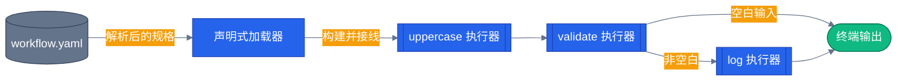

# 第 19 章 · 声明式工作流

[项目首页](../../README.md) · [教程总览](../README.md) · [术语表](../_shared/jargon-glossary.md)

用 YAML 定义工作流，并在运行时加载它。配置驱动的编排——调整图结构无需重新编译。

## 本章动机

当工程师掌握图结构时，用代码构建工作流是很好的选择。声明式工作流在以下场景更出色：

- 非工程角色调整步骤顺序（运维、客服、合规）。
- 你想要 GitOps——工作流变更以 YAML 差异出现在 PR 里，而不是代码差异。
- 你需要在不发版的情况下更换流水线形状，因为图结构存在于配置文件而非编译后的代码里。

MAF 自带一套内置的声明式 schema（Python 侧亦有对应能力），但**理解**这个模式最简单的方式是自己写一个最小加载器。本章正是这么做的，然后指出完整项目中该思路的真实用法。

## 前置条件

- 已完成[第 18 章 · 状态与检查点](../18-state-and-checkpoints/)
- 熟悉 YAML
- 环境变量：无需——本章使用内置的字符串变换算子，不调用 LLM

## 核心概念

一份工作流规格会声明执行器、每个执行器运行的行为（一个算子 + 可选配置），以及它们之间的边。加载器读取 YAML 并产出与第 9 章手写 `WorkflowBuilder` 调用完全相同的 `Workflow` 对象——图的形状从 Python 源码搬进了数据。

```yaml
name: text-pipeline
start: uppercase
executors:
  - id: uppercase
    op: upper
  - id: validate
    op: non_empty
  - id: log
    op: prefix
    prefix: "已记录："
edges:
  - from: uppercase
    to: validate
  - from: validate
    to: log
```

每个 `op` 名称通过注册表解析为一个小型纯函数（`upper`、`non_empty`、`prefix` 等）。加载器为每个 YAML 条目实例化一个真实的 `Executor` 子类，并用 `WorkflowBuilder.add_edge(...)` 把它们连起来，与代码构建的版本完全一致——唯一的区别是图的拓扑**来自哪里**。


```mermaid
%%{init: {'theme':'base', 'themeVariables': {
  'primaryColor': '#2563eb','primaryTextColor': '#ffffff','primaryBorderColor': '#1e40af',
  'lineColor': '#64748b','secondaryColor': '#f59e0b','tertiaryColor': '#10b981',
  'background': 'transparent'}}}%%
flowchart LR
  classDef core     fill:#2563eb,stroke:#1e40af,color:#ffffff
  classDef external fill:#f59e0b,stroke:#b45309,color:#000000
  classDef success  fill:#10b981,stroke:#047857,color:#ffffff
  classDef infra    fill:#64748b,stroke:#334155,color:#ffffff

  yaml[(workflow.yaml)]
  loader[声明式加载器]
  upper[[uppercase 执行器]]
  validate[[validate 执行器]]
  log[[log 执行器]]
  out([终端输出])

  yaml -- "解析后的规格" --> loader
  loader -- "构建并接线" --> upper
  upper --> validate
  validate -- "空白输入" --> out
  validate -- "非空白" --> log
  log --> out

  class yaml infra
  class loader core
  class upper core
  class validate core
  class log core
  class out success
```

加载器从不直接接触你的业务逻辑——它只看到算子名与配置。图的拓扑是数据；真正的行为住在算子注册表里。

## Python

源码：[`python/main.py`](./python/main.py) + [`python/workflow.yaml`](./python/workflow.yaml)。

```python
def _build_op(op: str, config: dict[str, Any]) -> Callable[[str], tuple[str | None, str | None]]:
    """返回一个纯函数：input_text -> (forwarded_text, terminal_text)。"""
    if op == "upper":
        return lambda s: (s.upper(), None)
    if op == "non_empty":
        def _non_empty(s: str) -> tuple[str | None, str | None]:
            return (s, None) if s.strip() else (None, "[已跳过：输入为空]")
        return _non_empty
    if op == "prefix":
        prefix = config.get("prefix", "")
        return lambda s: (None, f"{prefix}{s}")
    raise ValueError(f"unknown op: {op!r}")


class DeclarativeExecutor(Executor):
    """行为由 YAML 中的 'op' 字符串定义的执行器。"""

    def __init__(self, executor_id: str, op: str, config: dict[str, Any]) -> None:
        super().__init__(id=executor_id)
        self._op = _build_op(op, config)

    @handler
    async def run(self, message: str, ctx: WorkflowContext[str, str]) -> None:
        forward, terminal = self._op(message)
        if terminal is not None:
            await ctx.yield_output(terminal)
            return
        if forward is not None:
            await ctx.send_message(forward)
```

`load_workflow()` 解析 YAML，为每个条目构建一个 `DeclarativeExecutor`，并用 `WorkflowBuilder.add_edge(...)` 把它们连起来——与第 9 章手工搭建的图相呼应，但完全由 `workflow.yaml` 驱动。

在仓库根目录运行，使用共享的 `tutorials/` uv 项目（一次 `uv sync` 覆盖全部章节）：

```bash
uv sync --project tutorials
uv run --project tutorials python tutorials/19-declarative-workflows/python/main.py "hello world"
uv run --project tutorials python tutorials/19-declarative-workflows/python/main.py ""
```

```
$ uv run --project tutorials python tutorials/19-declarative-workflows/python/main.py "hello world"
规格：workflow.yaml
输入：'hello world'
输出：'已记录：HELLO WORLD'

$ uv run --project tutorials python tutorials/19-declarative-workflows/python/main.py ""
规格：workflow.yaml
输入：''
输出：'[已跳过：输入为空]'
```

## 常见坑

- **schema 的自由是一种税。** 每个声明式系统都是一门小型语言；要激进地校验。本章的加载器与完整项目的 `agents/python/shared/workflow_loader.py` 都会在遇到未知 `op` 值、重复的执行器 id、以及指向未声明执行器的边时直接抛错——你自己写加载器时也应如此。
- **执行器不是免费的。** 每个 YAML 条目都会构建一个真实的 `Executor` 子类实例。对非常大的规格，应采用惰性实例化。
- **自定义算子必须有落脚处。** 本章把它们内联在 `main.py` 里；完整项目的加载器暴露 `register_op(name, factory)`，使生产代码可以在不修改加载器本身的前提下添加领域算子。
- **旧的「MAF v1.0 wheel 带空 `__init__.py`」打包缺陷已在上游修复，不是靠某个绕行文件。** `agent-framework` 1.14.0（现已固定）随附真实的 `__init__.py`。`agents/python/patch_maf.py` 仍然存在，但已是有文档说明的空操作——它只在文件为空时修补，而文件已不再为空。教程实际依赖的引导模块是 [`tutorials/_shared/maf_bootstrap.py`](../_shared/maf_bootstrap.py)，每一章的 `main.py` 与测试套件都在导入时调用它；它仍防御性地保留补丁逻辑，但在当前安装上是空操作。

## 测试

Python 提供完整测试套件，覆盖算子注册表、加载器与端到端 YAML 运行：[`python/tests/test_declarative.py`](./python/tests/test_declarative.py) 检验了每个内置算子（`upper`、`lower`、`reverse`、`non_empty`、`prefix`）、未知算子的错误路径、`load_workflow()` 接线出的执行器 id 是否正确，以及 YAML 驱动的流水线在正常路径与空输入短路两种情况下都与代码构建的等价实现一致。

```bash
uv sync --project tutorials
uv run --project tutorials pytest tutorials/19-declarative-workflows/python/tests -v
```

## 在完整项目中的落点

完整项目的声明式加载器位于 [`agents/python/shared/workflow_loader.py`](../../agents/python/shared/workflow_loader.py)——`load_workflow()` 在 `agents/python/shared/workflow_loader.py:119`，`register_op()` 在 `agents/python/shared/workflow_loader.py:85`，是本章 `main.py` 中两个函数的生产版本，采用同样的算子注册表模式，并加上更严格的校验（`WorkflowSpecError`，位于 `agents/python/shared/workflow_loader.py:115`，用于缺失的键、重复的 id 与悬空的边）。

截至目前，只存在一份真实规格：[`agents/python/config/workflows/text-pipeline.yaml`](../../agents/python/config/workflows/text-pipeline.yaml)——与本章相同的玩具流水线 `upper -> non_empty -> prefix`，用于检验加载器与可视化流水线（`docs/workflows/README.md`）。完整项目其它地方提到的两条生产工作流——退货/换货与购前——是手工编码的 MAF 工作流（`workflows/return_replace.py`、`workflows/pre_purchase.py`），而非声明式 YAML 规格。`agents/python/config/workflows/SCHEMA.md` 明确说明它们的声明式规格「会随各自的重构步骤一并落地」——截至目前尚未落地。不要把本章当作生产工作流是 YAML 驱动的证据；今天真实存在的只有加载器与那份玩具演示规格。

## 下一步

- 下一章：[第 20 章 · 可视化](../20-visualization/)
- 完整源码：[`python/`](./python/)
- 共享资料：[Mermaid 风格指南](../_shared/mermaid-style-guide.md) · [术语表](../_shared/jargon-glossary.md)
