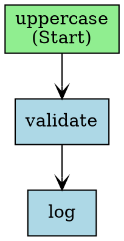

# Chapter 20 — Workflow Visualization

## Why this chapter

A workflow you can't see is hard to review and impossible to reason about on-call at 3 AM. MAF ships visualization helpers that turn any `Workflow` object into Mermaid (renders inline in GitHub markdown, issues, and PRs) or Graphviz DOT (for architecture diagrams, wikis, runbooks). Both are deterministic — the same graph always produces the same bytes — so you can commit the output and diff real changes in a PR instead of eyeballing a screenshot.

This isn't just a tutorial exercise: the same pattern regenerates the diagrams for every production workflow spec in this repo (see [How this shows up in the capstone](#how-this-shows-up-in-the-capstone)), and a live variant of it drives the orchestration graph you see in the web UI while a run is in progress.

## Prerequisites

- Completed [Chapter 19 — Declarative Workflows](../19-declarative-workflows/)
- No LLM calls in this chapter — no API key required, it's pure graph rendering
- Optional: `graphviz` installed locally if you want to rasterize the `.dot` output to PNG/SVG via the `dot` CLI

## The concept

`WorkflowViz` (Python) and the `Workflow` extension methods (.NET) walk the executor graph you built with `WorkflowBuilder`/`WorkflowBuilder<T>` and serialize it to two formats:

- **Mermaid** — a `flowchart` block that GitHub renders inline, no extra tooling needed.
- **Graphviz DOT** — a `digraph` you pipe through the `dot` CLI to get PNG/SVG for docs or wikis.

Both are derived purely from the graph's structure (executor ids and edges), not from any specific run — so the diagram represents every possible path through the workflow, not just the one a particular input happened to take.


This is the actual `demo-pipeline` workflow rendered by this chapter's `main.py` — three executors, two edges, one deterministic diagram.

## Python

Run from the repo root using the shared `tutorials/` uv project (one `uv sync` covers every chapter):

```bash
uv sync --project tutorials
uv run --project tutorials python tutorials/20-visualization/python/main.py
# writes workflow.mmd + workflow.dot into tutorials/20-visualization/python/
```

Source: [`python/main.py`](./python/main.py). The workflow is the same three-executor pipeline used throughout the earlier workflow chapters — uppercase, then a non-empty gate, then a logger — built with the normal `WorkflowBuilder`:

```python
from agent_framework._workflows._viz import WorkflowViz
from agent_framework._workflows._workflow_builder import WorkflowBuilder

def build_workflow():
    up = UppercaseExecutor()
    validate = ValidateExecutor()
    log = LogExecutor()
    return (
        WorkflowBuilder(start_executor=up, name="demo-pipeline")
        .add_edge(up, validate)
        .add_edge(validate, log)
        .build()
    )

def render_mermaid() -> str:
    return WorkflowViz(build_workflow()).to_mermaid()

def render_dot() -> str:
    return WorkflowViz(build_workflow()).to_digraph()
```

`main.py` writes both outputs to disk next to itself. The imports come from `agent_framework._workflows._viz` and `._workflow_builder` — underscore-prefixed internal modules, not the public top-level package; that's the real import path this MAF version exposes for visualization today.

Rendered Mermaid (this is `workflow.mmd`, byte-for-byte):

```
flowchart TD
  uppercase["uppercase (Start)"];
  validate["validate"];
  log["log"];
  uppercase --> validate;
  validate --> log;
```

Rendered DOT (this is `workflow.dot`, byte-for-byte):



## .NET

```bash
cd tutorials/20-visualization/dotnet
dotnet run
```

[`dotnet/Program.cs`](./dotnet/Program.cs) builds the same three-executor pipeline as the Python side and renders it both ways:

```csharp
using Microsoft.Agents.AI.Workflows;

string mermaid = WorkflowVisualizer.ToMermaidString(workflow);
string dot     = WorkflowVisualizer.ToDotString(workflow);

File.WriteAllText("workflow.mmd", mermaid);
File.WriteAllText("workflow.dot", dot);
```

Note the shape: these are **static methods on `WorkflowVisualizer`**, not extension methods on `Workflow`. `workflow.ToMermaidString()` does not compile, which matters because it is what most people try first — Python wraps the workflow in a `WorkflowViz` object, and the .NET name reads like an extension.

This chapter previously shipped a .NET *stub* that printed API usage instead of running any, and the usage it printed was the extension-method form that does not compile. Printed sample code is never compiled, so nothing caught it. Unlike Chapter 16, there was no SDK gap to be blocked on: `WorkflowVisualizer` has been in `Microsoft.Agents.AI.Workflows` since 1.1.0.

## Side-by-side differences

| Aspect | Python | .NET |
|--------|--------|------|
| Mermaid | `WorkflowViz(workflow).to_mermaid()` | `workflow.ToMermaidString()` |
| DOT | `WorkflowViz(workflow).to_digraph()` | `workflow.ToDotString()` |
| Import surface | Internal module (`agent_framework._workflows._viz`) | Public extension methods on `Workflow` |
| Bitmap export | Pipe `.dot` text through the `dot` CLI | Pipe `.dot` text through the `dot` CLI (same approach both languages) |

## Gotchas

- **Node IDs must be unique.** Two executors sharing an `id` fail at `WorkflowBuilder.build()` time (e.g., two `ValidateExecutor()` instances both defaulting to `id="validate"`), not at visualization time — the diagram only renders once the build already succeeded, so a visualization bug is rarely actually a visualization bug.
- **Mermaid is GitHub-native, DOT needs Graphviz.** Commit `.mmd` files and GitHub renders them inline in issues, PRs, and wikis with zero extra tooling. The `.dot` text is portable, but turning it into PNG/SVG requires a local or CI install of `graphviz`.
- **Determinism depends on your builder, not just the renderer.** `WorkflowViz` renders whatever edge order the graph gives it. If your own code adds edges by iterating a `set` or `dict` without a stable order, the rendered output can shuffle between runs even though the *logical* graph didn't change — iterate over ordered collections (lists, tuples) when building the graph.
- **The MAF v1.0 empty-`__init__.py` packaging bug is fixed upstream, but this chapter still patches defensively.** `tutorials/_shared/maf_bootstrap.py::bootstrap()` re-exports the public API into `agent_framework/__init__.py` if it's empty (or carries an older bootstrap patch marker) before any tutorial imports the package — every chapter's `main.py` and tests call it first. This is distinct from `agents/python/patch_maf.py`, which is the production app's copy of the same defensive fix; both are effectively no-ops against the pinned 1.14.0 wheel (which ships a real `__init__.py`), but are left in place rather than removed. There is no `shared/maf.py`.

## Tests


[`python/tests/test_visualization.py`](./python/tests/test_visualization.py) covers, without any LLM call:

- Mermaid output is non-empty and starts with the `flowchart` directive
- All three executor ids and both edges appear in the Mermaid output
- Mermaid rendering is deterministic (`render_mermaid() == render_mermaid()`)
- DOT output starts with `digraph` and references every node
- DOT rendering is deterministic
- `build_workflow()` succeeds

```bash
uv run --project tutorials pytest tutorials/20-visualization/python/tests -v
```

The .NET side ships [`dotnet/tests/VisualizationTests.cs`](./dotnet/tests/VisualizationTests.cs) — eleven tests, no LLM:

```bash
cd tutorials/20-visualization/dotnet && dotnet test tests/Visualization.Tests.csproj
```

They compare rendered output against the actual graph topology rather than checking a non-empty string came back: a diagram listing the right nodes and the wrong arrows is worse than no diagram, because it is confidently wrong. `Rendering_Is_Deterministic` guards the stated use case — committing diagrams and diffing them in PRs only works if identical graphs render byte-identically.

## How this shows up in the capstone

Two complementary mechanisms, one static and one live:

- **Static, build-time.** [`scripts/visualize_workflows.py`](../../scripts/visualize_workflows.py) walks every workflow spec under `agents/python/config/workflows/*.yaml`, loads each via `shared.workflow_loader.load_workflows_directory`, and renders it with the exact same `WorkflowViz` API this chapter teaches (`scripts/visualize_workflows.py:36`). It writes `docs/workflows/{name}.mmd` and `{name}.dot`, and its `--check` flag fails CI on drift — missing files, content that no longer matches the spec, or orphaned output with no matching spec — when `WORKFLOW_VISUALIZATION_ON_BUILD=true` (`scripts/visualize_workflows.py:71`). Today it renders one workflow, `text-pipeline` (`docs/workflows/text-pipeline.mmd`), with production workflows (`return-replace`, `pre-purchase`) documented as landing later.
- **Live, runtime.** `web/src/components/chat/orchestration-graph.tsx` fetches a mode's static `graph_mermaid()` output from `GET /api/orchestration/modes/{name}/graph` (`agents/python/orchestrator/routes/orchestration.py:63`) and re-renders it client-side with the house Mermaid palette, then overlays live state as SSE `node` events arrive during a run — active, done, and errored executors get different node classes (`web/src/components/chat/orchestration-graph.tsx:20`). Correlating a live `node_id` to a diagram node relies on a deliberate backend convention: every mode's `graph_mermaid()` uses the real executor id with dashes swapped for underscores as the Mermaid node id, documented on `PrePurchaseMode.graph_mermaid()` in `agents/python/orchestrator/modes/workflow_mode.py:164`. This is a different code path from `visualize_workflows.py` — one renders a fixed spec at build time and diffs it in CI, the other renders a mode's fixed topology at request time and animates it against a live run.

## What's next

- Next chapter: [Chapter 20b — DevUI](../20b-devui/)
- Full source: [`python/`](./python/) · [`dotnet/`](./dotnet/)
- Shared: [Mermaid style guide](../_shared/mermaid-style-guide.md)
