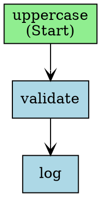

# 第 20 章 · 工作流可视化

[项目首页](../../README.md) · [教程总览](../README.md) · [术语表](../_shared/jargon-glossary.md)

## 本章动机

看不见的工作流难以评审，也无法在凌晨三点的值班场景中推理。MAF 提供可视化辅助工具，可把任意 `Workflow` 对象转成 Mermaid（在 GitHub 的 markdown、issue 与 PR 中内联渲染）或 Graphviz DOT（用于架构图、wiki、运行手册）。两者都是确定性的——同一张图总是产出相同的字节——因此你可以把输出提交进仓库，在 PR 里对真实变化做 diff，而不是靠肉眼比对截图。

这并不只是教程练习：同一模式为本项目每一条生产工作流规格重新生成图（见下文「在完整项目中的落点」），而它的一个实时变体驱动着 Web 界面中运行期间可见的编排图。

## 前置条件

- 已完成[第 19 章 · 声明式工作流](../19-declarative-workflows/)
- 本章不调用 LLM——无需 API 密钥，纯粹是图渲染
- 可选：本地安装 `graphviz`，如果你想通过 `dot` 命令把 `.dot` 输出栅格化为 PNG/SVG

## 核心概念

`WorkflowViz`（Python）会遍历你用 `WorkflowBuilder` 构建的执行器图，并把它序列化为两种格式：

- **Mermaid**——一个 `flowchart` 块，GitHub 可直接内联渲染，无需额外工具。
- **Graphviz DOT**——一个 `digraph`，你可以通过 `dot` 命令管道处理，得到用于文档或 wiki 的 PNG/SVG。

两者都纯粹从图的结构（执行器 id 与边）派生，而不来自某一次具体运行——因此这张图代表的是工作流的**所有**可能路径，而不只是某个输入恰好走过的那条。


```mermaid
%%{init: {'theme':'base', 'themeVariables': {
  'primaryColor': '#2563eb',
  'primaryTextColor': '#ffffff',
  'primaryBorderColor': '#1e40af',
  'lineColor': '#64748b',
  'secondaryColor': '#f59e0b',
  'tertiaryColor': '#10b981',
  'background': 'transparent'
}}}%%
flowchart LR
  classDef core     fill:#2563eb,stroke:#1e40af,color:#ffffff
  classDef success  fill:#10b981,stroke:#047857,color:#ffffff

  uppercase["uppercase (Start)"]
  validate["validate"]
  log["log"]

  uppercase --> validate
  validate --> log

  class uppercase core
  class validate core
  class log success
```

这就是本章 `main.py` 实际渲染出的 `demo-pipeline` 工作流——三个执行器、两条边、一张确定性图。

## Python

在仓库根目录运行，使用共享的 `tutorials/` uv 项目（一次 `uv sync` 覆盖全部章节）：

```bash
uv sync --project tutorials
uv run --project tutorials python tutorials/20-visualization/python/main.py
# 会把 workflow.mmd + workflow.dot 写入 tutorials/20-visualization/python/
```

源码：[`python/main.py`](./python/main.py)。该工作流就是前面各工作流章节一直使用的三执行器流水线——先大写，再一道非空闸门，最后记录器——用常规的 `WorkflowBuilder` 构建：

```python
from agent_framework._workflows._viz import WorkflowViz
from agent_framework._workflows._workflow_builder import WorkflowBuilder

def build_workflow():
    up = UppercaseExecutor()
    validate = ValidateExecutor()
    log = LogExecutor()
    return (
        WorkflowBuilder(start_executor=up, name="demo-pipeline")
        .add_edge(up, validate)
        .add_edge(validate, log)
        .build()
    )

def render_mermaid() -> str:
    return WorkflowViz(build_workflow()).to_mermaid()

def render_dot() -> str:
    return WorkflowViz(build_workflow()).to_digraph()
```

`main.py` 会把两份输出写到与自身同级的磁盘上。导入来自 `agent_framework._workflows._viz` 与 `._workflow_builder`——带下划线前缀的内部模块，而非公开的顶层包；这就是当前这个 MAF 版本为可视化暴露的真实导入路径。

渲染出的 Mermaid（即 `workflow.mmd`，逐字节一致）：

```
flowchart TD
  uppercase["uppercase (Start)"];
  validate["validate"];
  log["log"];
  uppercase --> validate;
  validate --> log;
```

渲染出的 DOT（即 `workflow.dot`，逐字节一致）：


```dot
digraph Workflow {
  rankdir=TD;
  node [shape=box, style=filled, fillcolor=lightblue];
  edge [color=black, arrowhead=vee];

  "uppercase" [fillcolor=lightgreen, label="uppercase\n(Start)"];
  "validate" [label="validate"];
  "log" [label="log"];
  "uppercase" -> "validate";
  "validate" -> "log";
}
```

## 常见坑

- **节点 id 必须唯一。** 两个执行器共用同一个 `id` 会在 `WorkflowBuilder.build()` 时失败（例如两个 `ValidateExecutor()` 实例都默认 `id="validate"`），而不是在可视化阶段失败——图只有在构建成功之后才会被渲染，因此可视化问题很少真的是可视化问题。
- **Mermaid 是 GitHub 原生支持的，DOT 需要 Graphviz。** 提交 `.mmd` 文件后，GitHub 会在 issue、PR 与 wiki 中内联渲染，无需任何额外工具。`.dot` 文本是可移植的，但要把它变成 PNG/SVG，需要本地或 CI 安装 `graphviz`。
- **确定性取决于你的构建器，而不只是渲染器。** `WorkflowViz` 渲染图交给它的任何边顺序。如果你自己的代码通过遍历 `set` 或 `dict`（没有稳定顺序）来添加边，那么即使**逻辑**图没有变化，渲染输出也可能在多次运行之间发生抖动——构建图时请遍历有序集合（列表、元组）。
- **MAF v1.0 的空 `__init__.py` 打包缺陷已在上游修复，但本章仍做防御性修补。** `tutorials/_shared/maf_bootstrap.py::bootstrap()` 会在任何教程导入该包之前，把公开 API 重新导出进 `agent_framework/__init__.py`（如果它为空或带有更早的引导补丁标记）——每一章的 `main.py` 与测试都会先调用它。这与 `agents/python/patch_maf.py` 不同，后者是生产应用对同一防御性修复的副本；面对已固定的 1.14.0 wheel（随附真实 `__init__.py`），两者实际上都是空操作，但都被保留而非移除。不存在 `shared/maf.py`。

## 测试

[`python/tests/test_visualization.py`](./python/tests/test_visualization.py) 在完全不调用 LLM 的情况下覆盖：

- Mermaid 输出非空，且以 `flowchart` 指令开头
- 三个执行器 id 与两条边都出现在 Mermaid 输出中
- Mermaid 渲染是确定性的（`render_mermaid() == render_mermaid()`）
- DOT 输出以 `digraph` 开头，并引用每一个节点
- DOT 渲染是确定性的
- `build_workflow()` 构建成功

```bash
uv run --project tutorials pytest tutorials/20-visualization/python/tests -v
```

## 在完整项目中的落点

两套互补机制，一套静态、一套实时：

- **静态、构建期。** [`scripts/visualize_workflows.py`](../../scripts/visualize_workflows.py) 遍历 `agents/python/config/workflows/*.yaml` 下的每一份工作流规格，通过 `shared.workflow_loader.load_workflows_directory` 加载，并用本章讲授的同一个 `WorkflowViz` API 渲染（`scripts/visualize_workflows.py:34`）。它写出 `docs/workflows/{name}.mmd` 与 `{name}.dot`，其 `--check` 标志会在内容漂移时让 CI 失败——缺失文件、内容与规格不再匹配、或存在没有对应规格的孤立输出——相关逻辑见 `scripts/visualize_workflows.py:52`。目前它只渲染一条工作流 `text-pipeline`（`docs/workflows/text-pipeline.mmd`），生产工作流（`return-replace`、`pre-purchase`）被记为后续落地。
- **实时、运行期。** `web/src/components/chat/orchestration-graph.tsx` 从 `GET /api/orchestration/modes/{name}/graph`（`agents/python/orchestrator/routes/orchestration.py:52`）获取某个模式的静态 `graph_mermaid()` 输出，在客户端用项目统一的 Mermaid 配色重新渲染，随后在运行期间随 SSE `node` 事件到达叠加实时状态——活跃、完成、出错三类执行器获得不同的节点样式（`web/src/components/chat/orchestration-graph.tsx:20`）。把实时 `node_id` 对应到图上的节点，依赖一条刻意的后端约定：每个模式的 `graph_mermaid()` 都用真实执行器 id（把短横线换成下划线）作为 Mermaid 节点 id，该约定记录在 `agents/python/orchestrator/modes/workflow_mode.py:166` 的 `PrePurchaseMode.graph_mermaid()` 上。这与 `visualize_workflows.py` 是两条不同的代码路径——一条在构建期渲染固定规格并在 CI 中做 diff，另一条在请求期渲染某个模式的固定拓扑并让它随实时运行产生动画。

## 下一步

- 下一章：[第 20b 章 · DevUI](../20b-devui/)
- 完整源码：[`python/`](./python/)
- 共享资料：[Mermaid 风格指南](../_shared/mermaid-style-guide.md)
