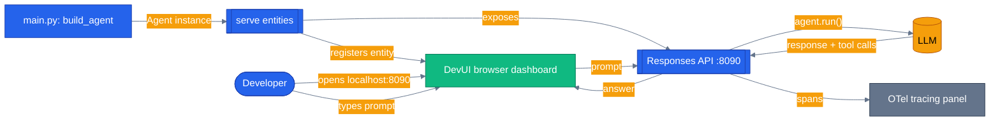

# Chapter 20b — DevUI: interactive dashboard for agents and workflows

> **Post:** [https://nitinksingh.com/posts/maf-v1-20b-devui/](https://nitinksingh.com/posts/maf-v1-20b-devui/) — concept, diagrams, walkthrough.

DevUI is MAF's dev-only browser harness: type a prompt, watch tool calls fire, inspect OTel spans in real time. Directory discovery or programmatic registration, OpenAI-compatible Responses API on localhost. **Python-only today, C# coming soon.**

## Why this chapter

Every prior chapter drives an agent from a script or a test — you never actually *see* it think. That's fine for learning one concept at a time, but it's a bad way to debug a multi-tool agent or a workflow graph: which tool fired, in what order, with what arguments, and what did the LLM see in response? DevUI answers that without you writing a single line of UI code. Point it at an agent (or a whole workflow), open a browser tab, type a prompt, and watch the tool calls and OpenTelemetry spans stream in live. It's the fastest way to iterate on prompts, tools, and context providers before wiring an agent into the real Next.js chat UI — and it's the tool you reach for when a specialist agent in the capstone (product discovery, orders, pricing, reviews, inventory, support) misbehaves and you want to poke at it in isolation.

## Prerequisites

- Completed [Chapter 20 — Visualization](../20-visualization/).
- Repo-root `.env` with one LLM provider:

| Provider | Required | Optional |
|----------|----------|----------|
| **OpenAI** | `OPENAI_API_KEY` | `LLM_MODEL` (default `gpt-4.1`) |
| **Azure OpenAI** | `AZURE_OPENAI_ENDPOINT`, `AZURE_OPENAI_KEY`, `AZURE_OPENAI_DEPLOYMENT` | `AZURE_OPENAI_API_VERSION` (default `2024-10-21`) |

## The concept

DevUI ships as its own package (`agent-framework-devui`, pre-release) and exposes a single entry point: `serve(entities=[...])`. Hand it a list of MAF `Agent` or `Workflow` objects and it spins up a local web server that does three things at once — serves a browser dashboard for typing prompts and watching structured tool-call/response traces, exposes an OpenAI-compatible Responses API on the same port (so any HTTP client, including a test, can drive it the same way ChatGPT-style tooling would), and streams OpenTelemetry spans into a live tracing panel as the agent runs. There's a second mode — directory discovery — where DevUI scans a folder of agent modules and registers them automatically instead of you calling `serve()` yourself; this chapter uses the simpler programmatic form since it's a single demo agent.

The key thing DevUI is *not*: it's not a production surface. It has no auth, no persistence beyond the process lifetime, and no multi-tenant isolation — it's explicitly a local dev harness, the interactive counterpart to the passive Aspire Dashboard telemetry from [Chapter 07 — Observability](../07-observability-otel/) (Aspire shows you what already happened across every service; DevUI lets you drive one agent and watch it happen).



`serve()` is the only line of glue code between an ordinary MAF `Agent` and a fully interactive browser dashboard — nothing about `build_agent()` itself changes to make it DevUI-compatible.

## Python

Source: [`python/main.py`](./python/main.py).

```bash
cd tutorials/20b-devui/python
uv sync
uv run python main.py
# → DevUI opens at http://localhost:8090 (auto-opens browser)
uv run pytest -v
```

This chapter is the one exception in the series to the shared `tutorials/` uv project — it ships its own `pyproject.toml` (pinning `agent-framework-devui`, a separate pre-release package) and runs with a plain `cd` + `uv sync` instead of `uv sync --project tutorials`.

The agent is built exactly like any other chapter's agent — no special DevUI wiring on the `Agent` itself:

```python
def build_agent() -> Agent:
    """Single demo agent — DevUI registers it under the id 'devui-demo'."""
    return Agent(
        _client(),
        instructions="You are a friendly e-commerce assistant for a demo store.",
        name="devui-demo",
        description="Demo agent registered with MAF DevUI",
    )
```

All the DevUI-specific behavior lives in one call, at the bottom of `main.py`:

```python
if __name__ == "__main__":
    # DevUI will open the browser at http://localhost:8090 and stream
    # OpenTelemetry spans into its tracing tab for every run.
    serve(
        entities=[build_agent()],
        port=8090,
        auto_open=True,
        instrumentation_enabled=True,
    )
```

`entities` accepts a list, so a real dashboard session can register several agents (or a `Workflow`) side by side and switch between them in the browser — this chapter registers just one to keep the walkthrough focused. `instrumentation_enabled=True` is what turns on the live OTel tracing tab; without it you still get the chat panel but no span stream.

## .NET

DevUI C# is documented as "coming soon" by Microsoft — see [`dotnet/README.md`](./dotnet/README.md) for the tracking note and the upstream [DevUI docs](https://learn.microsoft.com/en-us/agent-framework/devui/). There is no runnable `dotnet/` code in this chapter today, only that stub; the Python example is the only executable walkthrough until Microsoft ships `Microsoft.Agents.AI.DevUI`. Because DevUI speaks the vendor-neutral OpenAI Responses API, a .NET `HttpClient` can already drive the Python-hosted server directly if you want to exercise the integration from .NET code today.

## Side-by-side differences

| Aspect | Python | .NET |
|--------|--------|------|
| Package | `agent-framework-devui` (pre-release) | Not shipped — "coming soon" per Microsoft docs |
| Entry point | `serve(entities=[...])` | N/A |
| Registration | Programmatic (this chapter) or directory discovery | N/A |
| Transport | OpenAI-compatible Responses API on `localhost:8090` | Same API, reachable from .NET via `HttpClient` against the Python server |

## Gotchas

- **Dev-only — never ship it.** DevUI has no auth and no tenant isolation. It's meant to run on a developer's laptop against a local `.env`, not to be exposed on a shared or public host.
- **Port conflicts.** `serve(..., port=8090)` is hardcoded in this chapter's `main.py`. If something else on your machine already owns 8090, change the `port=` argument — DevUI doesn't auto-pick a free port.
- **Separate pre-release package, separate lockfile.** `agent-framework-devui>=0.1.0b0` is its own dependency in [`python/pyproject.toml`](./python/pyproject.toml), not bundled with `agent-framework` core — an `uv sync --project tutorials` from the repo's shared project won't pull it in, which is exactly why this chapter keeps its own `pyproject.toml`/`uv.lock` instead of joining the shared one.
- **Tests skip without credentials.** `python/tests/test_main.py` builds a real `Agent` via `build_agent()`, which requires a working chat client — the whole module is marked `pytest.mark.skipif` when no `OPENAI_API_KEY` / Azure trio is present, so a green run locally doesn't guarantee credentials are configured in CI.

## Tests

`python/tests/test_main.py` (3 tests) are smoke tests, not integration tests against a live DevUI server — the module docstring is explicit that launching the FastAPI process inside pytest is flaky and out of scope. They assert:

1. **Happy path / imports** — `agent_framework.devui.serve` and this chapter's `main` module both import cleanly, catching drift in the pre-release DevUI package.
2. **Type assertion** — `build_agent()` returns an actual MAF `Agent` instance.
3. **Concept assertion** — the agent is registered under the exact name `"devui-demo"`, which is what DevUI uses as the entity id in its dashboard URLs and metadata; a rename here would silently break the chapter's own instructions.

```bash
cd tutorials/20b-devui/python
uv run pytest -v
```

## How this shows up in the capstone

DevUI is **not** wired into the production capstone app — it's a local dev tool, not a runtime dependency. Nothing under `agents/python/` or `orchestrator/` imports `agent_framework.devui`; the only references to DevUI in the whole repo are this chapter itself and the linter that checks it (`scripts/check_tutorial_readmes.py`).

What DevUI *is* useful for against the real app: exercising one of the six production specialist agents in isolation, the same way this chapter's `serve(entities=[build_agent()])` exercises the demo agent. This chapter's own registration pattern in [`python/main.py`](./python/main.py) is the reference — there's no separate documented DevUI-plus-capstone example anywhere in `docs/` or `CLAUDE.md`, so applying it means importing a real factory instead of the demo one. For example, Product Discovery's factory — `agents/python/product_discovery/agent.py:54`:

```python
def create_product_discovery_agent() -> Agent:
    """Create the Product Discovery ChatAgent.

    Uses the MCP server when ``MCP_ENABLED=true``, direct asyncpg tools otherwise.
    """
```

whose `return Agent(...)` at `agents/python/product_discovery/agent.py:86` produces an ordinary MAF `Agent` — the same type this chapter's `build_agent()` returns. Swapping `entities=[build_agent()]` for `entities=[create_product_discovery_agent()]` would register the real product-discovery agent (semantic search, price history, stock checks and all) with DevUI's dashboard for local debugging, with no changes to the agent factory itself.

## What's next

- Next chapter: [Chapter 21 — Capstone Tour](../21-capstone-tour/)
- Full source: [`python/`](./python/) · [`dotnet/`](./dotnet/README.md)
- Shared: [Mermaid style guide](../_shared/mermaid-style-guide.md) · [Jargon glossary](../_shared/jargon-glossary.md)
- [MAF docs — DevUI](https://learn.microsoft.com/en-us/agent-framework/devui/)
