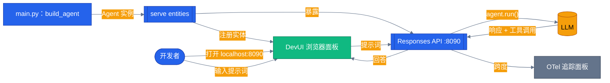

# 第 20b 章 · DevUI：智能体与工作流的交互式面板

[项目首页](../../README.md) · [教程总览](../README.md) · [术语表](../_shared/jargon-glossary.md)

DevUI 是 MAF 的开发专用浏览器调试台：输入提示词，观察工具调用触发，实时查看 OTel 跨度。支持目录发现或程序化注册，在本机暴露 OpenAI 兼容的 Responses API。**目前仅 Python 可用。**

## 本章动机

前面每一章都从脚本或测试里驱动智能体——你从未真正**看见**它思考。学习单个概念时这没问题，但用来调试多工具智能体或工作流图就很糟：哪个工具触发了、按什么顺序、带了什么参数、LLM 看到的响应又是什么？DevUI 让你一行 UI 代码都不写就能回答这些问题。把它指向一个智能体（或整条工作流），打开浏览器标签页，输入提示词，就能看到工具调用与 OpenTelemetry 跨度实时流入。它是在把智能体接入真正的 Next.js 聊天界面之前，迭代提示词、工具与上下文提供方最快的方式——当完整项目中的某个专家智能体（商品发现、订单、定价、评价、库存、客服）行为异常时，也是你会拿它来单独观察的工具。

## 前置条件

- 已完成[第 20 章 · 可视化](../20-visualization/)。
- 仓库根目录的 `.env` 中配置一个 LLM 提供方：

| 提供方 | 必填 | 可选 |
|----------|----------|----------|
| **OpenAI** | `OPENAI_API_KEY` | `LLM_MODEL`（默认 `gpt-4.1`） |
| **Azure OpenAI** | `AZURE_OPENAI_ENDPOINT`、`AZURE_OPENAI_KEY`、`AZURE_OPENAI_DEPLOYMENT` | `AZURE_OPENAI_API_VERSION`（默认 `2024-10-21`） |

## 核心概念

DevUI 作为独立包发布（`agent-framework-devui`，预发布版），只暴露一个入口：`serve(entities=[...])`。把一组 MAF `Agent` 或 `Workflow` 对象交给它，它就会启动一个本地 Web 服务，同时做三件事——提供浏览器面板，用于输入提示词并观察结构化的工具调用/响应轨迹；在同一端口暴露 OpenAI 兼容的 Responses API（于是任何 HTTP 客户端、包括测试，都能以 ChatGPT 风格工具链的方式驱动它）；并在智能体运行时把 OpenTelemetry 跨度实时流入追踪面板。还有第二种模式——目录发现，DevUI 会扫描一个存放智能体模块的文件夹并自动注册，而不需要你自己调用 `serve()`；本章使用更简单的程序化形式，因为只有一个演示智能体。

DevUI **不是**什么：它不是生产级接口。它没有鉴权、除进程生命周期外没有持久化、也没有多租户隔离——它是明确的本地开发调试台，是[第 07 章 · 可观测性](../07-observability-otel/)中被动的 Jaeger 遥测的交互式对应物（Jaeger 展示已经发生在所有服务上的事；DevUI 让你驱动单个智能体并看着它发生）。


```mermaid
%%{init: {'theme':'base', 'themeVariables': {
  'primaryColor': '#2563eb','primaryTextColor': '#ffffff','primaryBorderColor': '#1e40af',
  'lineColor': '#64748b','secondaryColor': '#f59e0b','tertiaryColor': '#10b981',
  'background': 'transparent'}}}%%
flowchart LR
  classDef core     fill:#2563eb,stroke:#1e40af,color:#ffffff
  classDef external fill:#f59e0b,stroke:#b45309,color:#000000
  classDef success  fill:#10b981,stroke:#047857,color:#ffffff
  classDef infra    fill:#64748b,stroke:#334155,color:#ffffff

  dev([开发者])
  main[main.py：build_agent]
  serve[[serve entities]]
  ui[DevUI 浏览器面板]
  api[[Responses API :8090]]
  llm[(LLM)]
  otel[OTel 追踪面板]

  main -- "Agent 实例" --> serve
  serve -- "注册实体" --> ui
  serve -- "暴露" --> api
  dev -- "打开 localhost:8090" --> ui
  dev -- "输入提示词" --> ui
  ui -- "提示词" --> api
  api -- "agent.run()" --> llm
  llm -- "响应 + 工具调用" --> api
  api -- "跨度" --> otel
  api -- "回答" --> ui

  class dev core
  class main core
  class serve core
  class ui success
  class api core
  class llm external
  class otel infra
```

`serve()` 是普通 MAF `Agent` 与完整交互式浏览器面板之间唯一的胶水代码——`build_agent()` 本身不需要任何改动就能兼容 DevUI。

## Python

源码：[`python/main.py`](./python/main.py)。

```bash
cd tutorials/20b-devui/python
uv sync
uv run python main.py
# → DevUI 在 http://localhost:8090 打开（自动打开浏览器）
uv run pytest -v
```

本章是整个系列中唯一不使用共享 `tutorials/` uv 项目的例外——它自带 `pyproject.toml`（固定 `agent-framework-devui` 这一独立的预发布包），并用朴素的 `cd` + `uv sync` 运行，而不是 `uv sync --project tutorials`。

智能体的构建方式与其它任何一章完全一样——`Agent` 本身没有任何 DevUI 专用接线：

```python
def build_agent() -> Agent:
    """单个演示智能体——DevUI 会以 id 'devui-demo' 注册它。"""
    return Agent(
        _client(),
        instructions="你是一个友好的演示商店电商助手。",
        name="devui-demo",
        description="注册到 MAF DevUI 的演示智能体",
    )
```

所有 DevUI 特有的行为都集中在 `main.py` 末尾的一次调用里：

```python
if __name__ == "__main__":
    # DevUI 会在 http://localhost:8090 打开浏览器，并把每次运行的
    # OpenTelemetry 跨度流入它的追踪标签页。
    serve(
        entities=[build_agent()],
        port=8090,
        auto_open=True,
        instrumentation_enabled=True,
    )
```

`entities` 接受一个列表，因此真实的面板会话可以并列注册多个智能体（或一条 `Workflow`）并在浏览器中切换——本章只注册一个，以保持讲解聚焦。`instrumentation_enabled=True` 是开启实时 OTel 追踪标签页的开关；不设置它你仍会得到聊天面板，但没有跨度流。

## 常见坑

- **仅限开发——绝不要把它发布上线。** DevUI 没有鉴权、没有租户隔离。它应当运行在开发者笔记本上、对着本地的 `.env`，不应暴露在共享或公网主机上。
- **端口冲突。** 本章 `main.py` 里 `serve(..., port=8090)` 是硬编码的。如果你机器上已有别的进程占用 8090，请修改 `port=` 参数——DevUI 不会自动挑选空闲端口。
- **独立的预发布包、独立的锁文件。** `agent-framework-devui>=0.1.0b0` 是 [`python/pyproject.toml`](./python/pyproject.toml) 中自己的依赖项，并未随 `agent-framework` 核心一起打包——从仓库共享项目执行 `uv sync --project tutorials` 不会把它拉进来，这正是本章保留自己的 `pyproject.toml`/`uv.lock` 而不并入共享项目的原因。
- **缺少凭据时测试会跳过。** `python/tests/test_main.py` 会通过 `build_agent()` 构建真实 `Agent`，这需要一个可用的聊天客户端——当 `OPENAI_API_KEY` / Azure 三件套缺失时，整个模块被 `pytest.mark.skipif` 标记跳过，因此本地跑绿并不能保证 CI 中已配置好凭据。

## 测试

`python/tests/test_main.py`（3 个测试）是冒烟测试，而不是针对运行中 DevUI 服务的集成测试——模块文档字符串明确指出在 pytest 内启动 FastAPI 进程不稳定且超出范围。它们断言：

1. **正常路径 / 导入**——`agent_framework.devui.serve` 与本章的 `main` 模块都能干净导入，用于捕捉预发布 DevUI 包的漂移。
2. **类型断言**——`build_agent()` 返回真正的 MAF `Agent` 实例。
3. **概念断言**——该智能体以确切名称 `"devui-demo"` 注册，因为 DevUI 把它用作面板 URL 与元数据中的实体 id；在此处改名会静默破坏本章自身的说明。

```bash
cd tutorials/20b-devui/python
uv run pytest -v
```

## 在完整项目中的落点

DevUI **没有**接入生产的完整项目应用——它是本地开发工具，不是运行时依赖。`agents/python/` 或 `orchestrator/` 下没有任何代码导入 `agent_framework.devui`；整个仓库中对 DevUI 的引用只有本章自身，以及检查它的 linter（`scripts/check_tutorial_readmes.py`）。

DevUI 对真实应用**有用**的地方在于：单独演练六个生产专家智能体之一，正如本章的 `serve(entities=[build_agent()])` 演练演示智能体那样。本章 [`python/main.py`](./python/main.py) 中的注册模式就是参考——`docs/` 或 `CLAUDE.md` 中没有任何单独记录的「DevUI + 完整项目」示例，因此套用它意味着导入真实的工厂函数而非演示用的那个。例如商品发现的工厂——`agents/python/product_discovery/agent.py:54`：

```python
def create_product_discovery_agent() -> Agent:
    """创建 Product Discovery ChatAgent。

    ``MCP_ENABLED=true`` 时使用 MCP 服务器，否则使用直连 asyncpg 的工具。
    """
```

它的 `return Agent(...)`（`agents/python/product_discovery/agent.py:86`）产出的就是普通 MAF `Agent`——与本章 `build_agent()` 返回的类型相同。把 `entities=[build_agent()]` 换成 `entities=[create_product_discovery_agent()]`，就能把真实的商品发现智能体（语义搜索、价格历史、库存查询一应俱全）注册进 DevUI 面板用于本地调试，且无需改动智能体工厂本身。

## 下一步

- 下一章：[第 21 章 · 完整项目导览](../21-capstone-tour/)
- 完整源码：[`python/`](./python/)
- 共享资料：[Mermaid 风格指南](../_shared/mermaid-style-guide.md) · [术语表](../_shared/jargon-glossary.md)
- [MAF 文档 —— DevUI](https://learn.microsoft.com/en-us/agent-framework/devui/)
