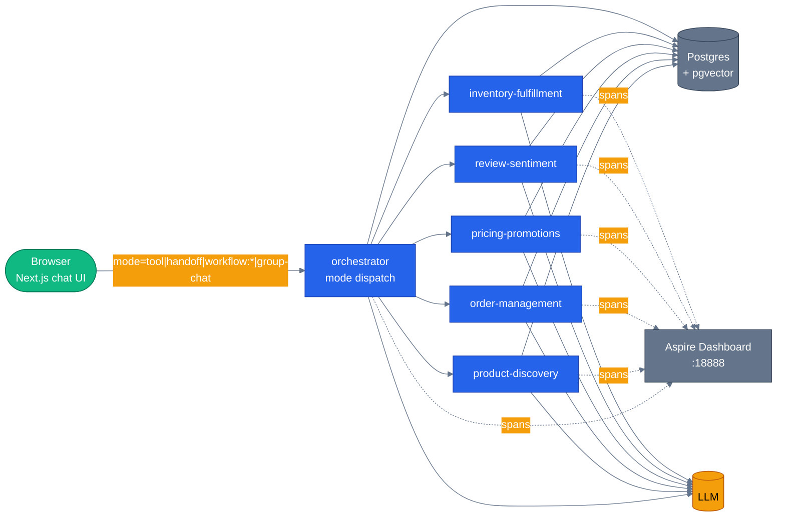

# Chapter 21 — Capstone Tour

Every concept from Chapters 00–20, mapped to the exact file and line where it lives in the running
e-commerce platform — plus the one artifact none of the other chapters can show you: the same
question, run through five different orchestration mechanisms, side by side, with real numbers.

## Why this chapter

The previous 20 chapters each drilled one Microsoft Agent Framework concept in isolation, against a
small standalone example. That's the right way to learn a concept, but it leaves an honest question
unanswered: does any of this actually change how you'd build a real system, or is it 20 disconnected
toy demos? This chapter closes that gap. Every pattern you learned is running, right now, in the
same multi-agent e-commerce platform — a `tool` router, MAF's `HandoffBuilder` mesh, two different
MAF `WorkflowBuilder` graphs (one concurrent, one sequential with a human-approval pause), and a
round-table group chat, all selectable per request, on the same domain. If you've read every prior
chapter, you can open any file this one points at and recognize the shape immediately — no rosetta
stone required.

## Prerequisites

- Completed [Chapter 00 — Setup](../00-setup/) and ideally the chapters your interests touch —
  this tour assumes the vocabulary chapters 01–20 built, it doesn't re-teach it.
- Docker running, and a `.env` at the repo root with one LLM provider configured (same as every
  other chapter — see Chapter 00 for the full variable reference).
- If you haven't read [`docs/concepts/`](../../docs/concepts/) yet, [`docs/concepts/06-orchestration-patterns.md`](../../docs/concepts/06-orchestration-patterns.md)
  is the conceptual companion to this chapter's mode table — read that first if "handoff vs.
  workflow vs. group-chat" still feels fuzzy.

## The concept

Nobody else publishing Microsoft Agent Framework samples runs the same domain through five
orchestration mechanisms side by side. Individually, a router-agent sample, a handoff-mesh sample,
and a workflow sample are each easy enough to find. What's actually hard to find — and the thing
practitioners evaluating MAF for a real project need most — is a direct answer to "when do I reach
for which one, and what does that choice cost me in latency, tokens, and predictability?" That
question is only answerable empirically, on one domain, not from five unrelated toy examples that
each only show their own mechanism working in isolation.

This repository is built so you can answer it yourself: open the chat UI, pick a mode from the
switcher, ask a question, then rerun the same question through a different mode and compare. This
chapter is the map for that tour — where each pattern lives, what each mode actually is, and what
this project's own evals say about the answers each one produces.



## The five orchestration modes, and what each one actually costs

Every mode implements the same `run()` contract (`agents/python/orchestrator/modes/base.py`) and
is registered in one place, `agents/python/orchestrator/modes/__init__.py:27-33`:

```python
MODES: dict[str, OrchestrationMode] = {
    "tool": ToolRouterMode(),
    "handoff": HandoffMode(),
    "workflow:pre-purchase": PrePurchaseMode(),
    "workflow:return-replace": ReturnReplaceMode(),
    "group-chat": GroupChatMode(),
}
```

| Mode | File | What it is | When to choose it |
|---|---|---|---|
| `tool` (default) | `orchestrator/modes/tool_router.py` | LLM decides which specialist to call, per turn, via a tool call | Open-ended questions where the right specialist isn't knowable in advance |
| `handoff` | `orchestrator/modes/handoff_mode.py` | MAF `HandoffBuilder` mesh — a fixed topology of participants, model decides *when* to hand off within it | A bounded, known set of possible transitions, still needing model judgment on timing |
| `workflow:pre-purchase` | `orchestrator/modes/workflow_mode.py` (`PrePurchaseMode`) | Fixed MAF graph, fan-out to 3 concurrent checks (reviews/stock/price), fan-in, synthesize | The steps are always the same and some genuinely parallelize |
| `workflow:return-replace` | `orchestrator/modes/workflow_mode.py` (`ReturnReplaceMode`) | Fixed sequential MAF graph with an in-workflow HITL pause (`ctx.request_info`) for high-value returns | A fixed sequence where part of it must be able to pause across requests |
| `group-chat` | `orchestrator/modes/group_chat_mode.py` | Named panelists take turns over a shared transcript, moderator synthesizes a verdict | Multiple perspectives should be visible to each other before a verdict |

`magentic` is deliberately **not** in this table — see [Chapter 16](../16-magentic-orchestration/)
and [`docs/concepts/06-orchestration-patterns.md`](../../docs/concepts/06-orchestration-patterns.md#whats-missing):
it's a real gap, tracked, not silently missing.

**What this actually costs**, honestly: `tool` and `handoff` both pay for at least one extra
LLM round trip (the routing/handoff decision itself) on top of the specialist's own turn, and
`handoff`'s mesh construction is real MAF machinery with its own overhead. The two `workflow:*`
modes skip that entirely for their fixed steps — no model decides *whether* to check stock, only
the final synthesis step calls an LLM — so for the exact question they're built for for, they're
both faster and cheaper per token than `tool` mode making the same calls one at a time. `group-chat`
costs the most: every panelist speaks, guaranteed, plus a moderator turn, regardless of the
question. None of these are enforced by benchmarks committed to this repo — they're structural
facts about what each mode does — which is exactly why the next section has you run the comparison
yourself instead of trusting a claimed number.

## Run the comparison yourself

```bash
# from the repo root
./scripts/dev.sh                     # PowerShell: ./scripts/dev.ps1
open http://localhost:3000
```

In the chat UI: pick **Compare** from the mode switcher, enter a prompt, select 2 or more modes,
and run it. `POST /api/orchestration/compare` (`agents/python/orchestrator/routes/orchestration.py:88`)
runs your prompt through every selected mode **sequentially** — a fair latency comparison beats a
faster but resource-contended concurrent run — and returns each mode's real text, latency, step
count, and graph, rendered as one column per mode by `web/src/components/chat/mode-comparison.tsx`.
Two prompts worth trying, matched to a real difference between modes:

- *"Is this order eligible for return, and what happens next?"* — compare `tool` (one specialist
  call) against `workflow:return-replace` (the fixed 5-step pipeline with the HITL gate).
- *"Should I buy these headphones?"* — compare `tool` against `workflow:pre-purchase` (concurrent
  reviews/stock/price checks) and `group-chat` (value vs. quality panelists debating it).

**Known gap, stated plainly:** the compare response doesn't include token counts, estimated cost, or
grounding verification results yet, even though `shared/cost.py` (Chapter 13's capstone pointer)
and the grounding verifier (`docs/concepts/09-grounding-and-rag.md`) both exist now — wiring them
into `CompareModeResult` is a small, real follow-up that hasn't landed, not a fabricated number.
Judge cost and correctness by reading the response text and the timeline for now.

**Also try the single-mode chat**, not just Compare: `web/src/components/chat/mode-switcher.tsx`
lets you pin one mode per conversation, and `orchestration-graph.tsx` animates the live graph next
to the response as `event: node` SSE frames arrive — for `workflow:pre-purchase` you'll watch three
nodes go active at once, then converge.

## Concept → file:line map

Every row is a real, currently-verified pointer — most were re-confirmed while restoring that
chapter's own README, not derived fresh for this chapter. If any of these drift, the chapter they
came from is out of sync too; open an issue.

| Chapter | Where it lives today |
|---|---|
| [01 First Agent](../01-first-agent/) | `agents/python/orchestrator/agent.py:147` — `create_orchestrator_agent()`, the same `client`+`instructions`+`name` triple as this chapter, plus tools/context/middleware later chapters add |
| [02 Tools](../02-add-tools/) | `agents/python/product_discovery/tools.py:16` — `search_products`, same `@tool`+`Annotated` shape as this chapter's `get_weather`, now hitting Postgres for real |
| [03 Streaming + Multi-turn](../03-streaming-and-multiturn/) | `agents/python/shared/agent_host.py:87` — `_run_agent_native_stream`; `agents/python/shared/session.py:224` — `session_from_id` |
| [04 Sessions](../04-sessions/) | `agents/python/shared/session.py:201` — `get_history_provider()`, 3 pluggable backends; `agents/python/orchestrator/routes/chat.py:160` — the real call site |
| [05 Context Providers](../05-context-providers/) | `agents/python/shared/context_providers.py:35` — `UserProfileProvider`; `agents/python/product_discovery/agent.py:92` — wired into every specialist |
| [06 Middleware](../06-middleware/) | `agents/python/shared/middleware.py:179` — `build_specialist_middleware()`, the single wiring point every agent uses, composing 8 layers today |
| [07 Observability](../07-observability-otel/) | `agents/python/shared/telemetry.py:30,224,261` — `setup_telemetry`/`agent_run_span`/`a2a_call_span`; Aspire at `:18888` |
| [08 MCP Tools](../08-mcp-tools/) | `agents/python/packages/mcp-product/`, `mcp-inventory/` — two real FastMCP servers over Streamable HTTP; `agents/python/product_discovery/agent.py:69` |
| [09 Executors + Edges](../09-workflow-executors-and-edges/) | `agents/python/workflows/pre_purchase.py:60,79,98,117,148,229` — the fan-out/fan-in executor graph |
| [10 Events + Builder](../10-workflow-events-and-builder/) | `agents/python/orchestrator/events.py:44` — `OrchestrationEvent`, the normalized protocol every mode's stream uses |
| [11 Agents in Workflows](../11-agents-in-workflows/) | `agents/python/orchestrator/modes/group_chat_mode.py:65` — `_make_agent_responder()`, an `Agent` wrapped as a workflow responder |
| [12 Sequential](../12-sequential-orchestration/) | `agents/python/orchestrator/modes/workflow_mode.py:184` — `ReturnReplaceMode`, live as `workflow:return-replace` |
| [13 Concurrent](../13-concurrent-orchestration/) | `agents/python/workflows/pre_purchase.py:229` — same fan-out/fan-in graph, live as `workflow:pre-purchase` |
| [14 Handoff](../14-handoff-orchestration/) | `agents/python/orchestrator/handoff.py:49` — `build_orchestrator_handoff_workflow()`; `orchestrator/modes/handoff_mode.py:1` — live as `handoff` |
| [15 Group Chat](../15-group-chat-orchestration/) | `agents/python/workflows/group_chat.py:99` — `GroupChatWorkflow`; `orchestrator/modes/group_chat_mode.py:78` — live as `group-chat` |
| [16 Magentic](../16-magentic-orchestration/) | Not live — see the mode table above and this chapter's own honest gap note |
| [17 HITL](../17-human-in-the-loop/) | `agents/python/workflows/return_replace.py:172,185` — `ctx.request_info`/`on_approval`, distinct from `shared/hitl.py`'s middleware gate |
| [18 Checkpoints](../18-state-and-checkpoints/) | `agents/python/shared/checkpoint_storage.py:34` — `PostgresCheckpointStorage`, real `workflow_checkpoints` table, resumable from `/runs` |
| [19 Declarative](../19-declarative-workflows/) | `agents/python/shared/workflow_loader.py:118,158` — real loader, but only one toy spec exists (`config/workflows/text-pipeline.yaml`); return-replace/pre-purchase are hand-coded, not YAML |
| [20 Visualization](../20-visualization/) | `scripts/visualize_workflows.py` (static, CI-drift-checked) + `web/src/components/chat/orchestration-graph.tsx` (live, SSE-animated) — two complementary mechanisms |
| [20b DevUI](../20b-devui/) | Not part of the live capstone — it's the recommended way to locally exercise any of these six agents during development |
| [22 Group-Chat Debate](../22-group-chat-debate/) | Same production code as Ch15 — `workflows/group_chat.py` / `group_chat_mode.py`, no separate toy implementation |

## What the evals actually say

[Chapter 12's evaluation concept](../../docs/concepts/12-evaluation.md) and the real eval harness
(`agents/python/evals/harness.py`) run every specialist agent's golden dataset through this exact
production path — not a simplified stand-in. The committed baselines
(`agents/python/evals/baselines/*.json`) are honest, and not flattering:

| Agent | Groundedness | Correctness | Completeness | Overall |
|---|---|---|---|---|
| product-discovery | 40% | 10% | 88% | 37.6% |
| order-management | 40% | 70% | 35% | 51% |
| pricing-promotions | 80% | 40% | 40% | 56% |
| review-sentiment | 100% | 20% | 0% | 48% |
| inventory-fulfillment | 80% | 40% | 20% | 52% |
| orchestrator (routing) | 33.3% | 83.3% | 83.3% | 63.3% |

Every one of these is below the 70% pass threshold the harness itself uses. This isn't a bug in the
harness — it's the actual, current quality of these six agents' prompts and tool coverage, measured
honestly instead of eyeballed from a demo. Re-run them yourself: `LLM_PROVIDER=replay uv run
--project agents/python python -m evals.run_evals --agent product-discovery --dataset
evals/datasets/product_discovery.json` (see [`evals/README.md`](../../agents/python/evals/README.md)).
A repo that only ever shows its best demo run and never its eval scores hasn't actually measured
anything — this table is what makes the "grounded" and "evaluated" claims elsewhere in this project
checkable rather than asserted.

## Gotchas

- **Compare runs modes sequentially, on purpose** — a concurrent compare would be faster to render
  but conflates "this mode is slow" with "five modes were fighting over the same LLM rate limit at
  once." Sequential is slower to run but the latency numbers you see are real per-mode numbers.
- **Default mode is `tool`, not the "best" mode.** `settings.ORCHESTRATION_MODE` (`shared/config.py`)
  picks the deployment default, a per-request `mode` field overrides it, and a conversation can pin
  its own mode — nothing about picking `handoff` or a `workflow:*` mode for one conversation changes
  what any other conversation uses.
- **Not every mode has a live graph.** `is_graph=True`/`False` on each mode's `capabilities` is
  honest, but only `workflow:pre-purchase`, `workflow:return-replace`, and `group-chat` actually
  implement `graph_mermaid()` — `tool` and `handoff` both return `None` (see
  [Chapter 07 — Graphs in agent systems](../../docs/concepts/07-graphs-in-agent-systems.md)).
  Don't expect an animated diagram for every mode in the switcher.
- **The eval table above will drift.** These are the scores as of this session's baseline commit —
  if you improve a prompt or add a tool, re-run the suite and update `evals/baselines/`, or the
  numbers in this chapter stop being true the way half the claims the original audit found already
  were.

## What was deliberately left out, and why

- **Magentic orchestration** (Chapter 16) has no live mode — the manager/worker planning pattern is
  real MAF functionality this repo teaches, but hasn't been wired into a sixth `orchestrator/modes/`
  entry yet. Tracked, not hidden.
- **Cost and grounding columns on the Compare response** — both underlying pieces exist
  (`shared/cost.py`, the grounding verifier) but aren't threaded into `CompareModeResult` yet. Noted
  above, not silently absent.
- **Idempotency, retries, and rate limiting** are real production concerns this repo does not yet
  implement — see [`docs/concepts/14-production-concerns.md`](../../docs/concepts/14-production-concerns.md)
  for the full, honest accounting rather than repeating it here.
- **A `.NET` version of this tour** isn't written — the .NET backend exists (`docker-compose.dotnet.yml`)
  but doesn't yet have the mode registry this chapter is built around; see each Python chapter's own
  `.NET` section for what parity does exist today, chapter by chapter.

## What's next

You've reached the end of the tutorial series proper. From here:

- [`docs/concepts/`](../../docs/concepts/) — the foundations layer, if you started here instead of
  at Chapter 00 and want the conceptual version of everything this tour just pointed at in code.
- [`docs/architecture.md`](../../docs/architecture.md) — the system-level view: auth, data flow,
  technology decisions, beyond what one chapter can cover.
- A published Python-vs-.NET parity matrix doesn't exist yet — until it does, each chapter's own
  `## Side-by-side differences` section is the closest thing, chapter by chapter.
- Or go build something — every pattern in this repo is meant to be copied, not just read.
