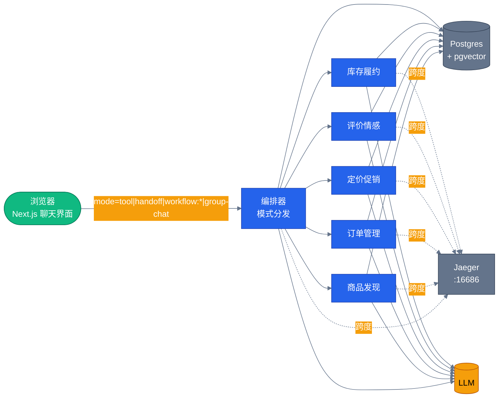

# 第 21 章 · 完整项目导览

[项目首页](../../README.md) · [教程总览](../README.md) · [术语表](../_shared/jargon-glossary.md)

第 00–20 章的每一个概念，都映射到正在运行的电商平台中它所在的确切文件与行号——外加其它章节都无法展示的一件东西：同一个问题，穿过五种不同的编排机制，并排对比，配真实数字。

## 本章动机

前 20 章各自围绕一个小型独立示例，孤立地钻透一个 Microsoft Agent Framework 概念。这是学习概念的正确方式，但它留下一个诚实的疑问没有回答：这些东西真的会改变你构建真实系统的方式吗，还是 20 个互不相干的玩具演示？本章弥合这道鸿沟。你学到的每一个模式，此刻都运行在同一个多智能体电商平台里——一个 `tool` 路由器、MAF 的 `HandoffBuilder` 网状结构、两张不同的 MAF `WorkflowBuilder` 图（一张并发，一张带人工审批暂停的顺序图）、以及一场圆桌群聊，全部可按请求选择，且作用于同一业务域。如果你读完了前面每一章，你可以打开本章指向的任何一个文件，并立刻认出它的形状——不需要对照表。

## 前置条件

- 已完成[第 00 章 · 环境准备](../00-setup/)，最好再读完与你兴趣相关的章节——本次导览假定你已具备第 01–20 章建立的词汇，不会重新讲授。
- Docker 正在运行，且仓库根目录的 `.env` 中配置了一个 LLM 提供方（与其它各章相同——完整变量参考见第 00 章）。
- 如果你还没读过 [`docs/concepts/`](../../docs/concepts/)，那么 [`docs/concepts/06-orchestration-patterns.md`](../../docs/concepts/06-orchestration-patterns.md) 是本章模式表的概念性姊妹篇——如果「移交 vs. 工作流 vs. 群聊」对你仍然模糊，请先读它。

## 核心概念

没有其它公开的 Microsoft Agent Framework 示例会把同一业务域并排穿过五种编排机制。单独看，路由器智能体示例、移交网状示例、工作流示例各自都不难找到。真正难找到的——也是正在为真实项目评估 MAF 的实践者最需要的——是对「我什么时候该用哪一个，这个选择在延迟、token 与可预测性上要付出什么代价」的直接回答。这个问题只能在同一业务域上以实证方式回答，而不能靠五个彼此无关、各自只展示自身机制孤立运行的玩具示例。

本仓库的构建方式让你可以自己回答它：打开聊天界面，从切换器里挑一个模式，提一个问题，再用另一个模式重跑同一个问题并对比。本章就是这趟导览的地图——每个模式住在哪里、每个模式究竟是什么、以及本项目自己的评估对这些模式产出的回答说了什么。


```mermaid
%%{init: {'theme':'base', 'themeVariables': {
  'primaryColor': '#2563eb','primaryTextColor': '#ffffff','primaryBorderColor': '#1e40af',
  'lineColor': '#64748b','secondaryColor': '#f59e0b','tertiaryColor': '#10b981',
  'background': 'transparent'}}}%%
flowchart LR
  classDef core     fill:#2563eb,stroke:#1e40af,color:#ffffff
  classDef external fill:#f59e0b,stroke:#b45309,color:#000000
  classDef success  fill:#10b981,stroke:#047857,color:#ffffff
  classDef infra    fill:#64748b,stroke:#334155,color:#ffffff

  browser([浏览器<br/>Next.js 聊天界面])
  orch["编排器<br/>模式分发"]
  pd["商品发现"]
  om["订单管理"]
  pp["定价促销"]
  rs["评价情感"]
  inv["库存履约"]
  pg[(Postgres<br/>+ pgvector)]
  jaeger["Jaeger<br/>:16686"]
  llm[(LLM)]

  browser -->|"mode=tool|handoff|workflow:*|group-chat"| orch
  orch --> pd & om & pp & rs & inv
  pd & om & pp & rs & inv --> pg
  orch --> pg
  orch -.跨度.-> jaeger
  pd & om & pp & rs & inv -.跨度.-> jaeger
  orch --> llm
  pd & om & pp & rs & inv --> llm

  class browser success
  class orch core
  class pd,om,pp,rs,inv core
  class pg,jaeger infra
  class llm external
```

## 五种编排模式，以及每一种的实际代价

每个模式都实现同一个 `run()` 契约（`agents/python/orchestrator/modes/base.py`），并在一处注册，`agents/python/orchestrator/modes/__init__.py:30`：

```python
MODES: dict[str, OrchestrationMode] = {
    "tool": ToolRouterMode(),
    "handoff": HandoffMode(),
    "workflow:pre-purchase": PrePurchaseMode(),
    "workflow:return-replace": ReturnReplaceMode(),
    "group-chat": GroupChatMode(),
}
```

| 模式 | 文件 | 它是什么 | 何时选择它 |
|---|---|---|---|
| `tool`（默认） | `orchestrator/modes/tool_router.py` | LLM 通过工具调用逐轮决定调用哪个专家 | 开放性问题，且正确答案所需的专家无法事先确定 |
| `handoff` | `orchestrator/modes/handoff_mode.py` | MAF `HandoffBuilder` 网状结构——参与者拓扑固定，模型决定在该拓扑内*何时*移交 | 可能的转移集合有界且已知，但仍需模型判断时机 |
| `workflow:pre-purchase` | `orchestrator/modes/workflow_mode.py`（`PrePurchaseMode`） | 固定的 MAF 图：扇出到 3 项并发检查（评价/库存/价格）、扇入、汇总 | 步骤始终相同，且其中一些确实可以并行 |
| `workflow:return-replace` | `orchestrator/modes/workflow_mode.py`（`ReturnReplaceMode`） | 固定的顺序 MAF 图，对高价值退货带工作流内的人在回路暂停（`ctx.request_info`） | 固定序列，且其中一部分必须能跨请求暂停 |
| `group-chat` | `orchestrator/modes/group_chat_mode.py` | 具名参与者轮流在共享记录上发言，主持人汇总出结论 | 需要在得出结论之前让多个视角彼此可见 |

`magentic` **刻意不**在这张表里——见[第 16 章](../16-magentic-orchestration/)与 [`docs/concepts/06-orchestration-patterns.md`](../../docs/concepts/06-orchestration-patterns.md#尚缺的部分)：这是一个真实、已被追踪的缺口，而不是被悄悄漏掉。

**实际代价，如实说**：`tool` 与 `handoff` 都要在专家自身那一轮之外，额外付出至少一次 LLM 往返（即路由/移交决策本身），且 `handoff` 的网状构建是真实的 MAF 机制，有其自身开销。两个 `workflow:*` 模式在固定步骤上完全跳过这一开销——没有模型来决定*是否*检查库存，只有最后的汇总步骤调用 LLM——因此对于它们专为此构建的那个问题，它们既比 `tool` 模式逐个调用同样的专家更快，也更省 token。`group-chat` 代价最高：无论问题是什么，每位参与者都保证发言，外加一轮主持人。这些都不是由仓库中提交的基准测试强制保证的——它们只是关于每个模式做什么的结构性事实——这正是下一节让你亲自跑对比、而不要相信某个声称数字的原因。

## 亲自跑一次对比

```bash
# 在仓库根目录
./scripts/dev.sh                     # PowerShell：./scripts/dev.ps1
open http://localhost:3000
```

在聊天界面中：从模式切换器里选 **Compare**，输入提示词，勾选 2 个或更多模式，然后运行。`POST /api/orchestration/compare`（`agents/python/orchestrator/routes/orchestration.py:88`）会**顺序**把你的提示词跑过每一个选中的模式——公平的延迟对比优于更快但会相互争抢资源的并发运行——并返回每个模式的真实文本、延迟、步数与图，由 `web/src/components/chat/mode-comparison.tsx` 按模式渲染成一列。两个值得一试、且恰好对应模式间真实差异的提示词：

- *「这个订单符合退货条件吗？接下来会发生什么？」*——对比 `tool`（一次专家调用）与 `workflow:return-replace`（带人在回路闸门的固定 5 步流水线）。
- *「我应该买这副耳机吗？」*——对比 `tool` 与 `workflow:pre-purchase`（并发跑评价/库存/价格检查）以及 `group-chat`（价值派与质量派参与者辩论）。

**已知缺口，直说**：对比响应目前还不包含 token 计数、预估成本或事实核验结果，尽管 `shared/cost.py`（第 13 章的完整项目指针）与事实核验器（`docs/concepts/09-grounding-and-rag.md`）都已存在——把它们接进 `CompareModeResult` 是一件小而真实的后续工作，尚未落地，而不是编造出来的数字。目前请通过阅读响应文本与时间线来判断成本与正确性。

**也试试单模式聊天**，而不只是 Compare：`web/src/components/chat/mode-switcher.tsx` 让你为每个会话固定一个模式，而 `orchestration-graph.tsx` 会在 `event: node` SSE 帧到达时，在响应旁边对实时图做动画——对 `workflow:pre-purchase`，你会看到三个节点同时变为活跃，然后汇聚。

## 概念 → 文件:行号 映射

每一行都是真实、当前已核验的指针——多数是在修复对应章节 README 时重新确认的，而不是为本章新推导的。若其中任何一处发生漂移，说明它所属的那一章也失同步了；请提一个 issue。

| 章节 | 它今天住在哪里 |
|---|---|
| [01 第一个智能体](../01-first-agent/) | `agents/python/orchestrator/agent.py:182` —— `create_orchestrator_agent()`，与本章相同的 `client`+`instructions`+`name` 三元组，另有后续章节添加的工具/上下文/中间件 |
| [02 工具](../02-add-tools/) | `agents/python/product_discovery/tools.py:31` —— `search_products`，与本章 `get_weather` 相同的 `@tool`+`Annotated` 形状，如今真实访问 Postgres |
| [03 流式与多轮](../03-streaming-and-multiturn/) | `agents/python/shared/agent_host.py:82` —— `_run_agent_native_stream`；`agents/python/shared/session.py:210` —— `session_from_id` |
| [04 会话](../04-sessions/) | `agents/python/shared/session.py:189` —— `get_history_provider()`，3 种可插拔后端；`agents/python/orchestrator/routes/chat.py:356` —— 真实调用点 |
| [05 上下文提供方](../05-context-providers/) | `agents/python/shared/context_providers.py:25` —— `UserProfileProvider`；`agents/python/product_discovery/agent.py:92` —— 接入到每个专家 |
| [06 中间件](../06-middleware/) | `agents/python/shared/middleware.py:214` —— `build_specialist_middleware()`，每个智能体都使用的唯一接线点，今天组合了 8 层 |
| [07 可观测性](../07-observability-otel/) | `agents/python/shared/telemetry.py:26,233,272` —— `setup_telemetry`/`agent_run_span`/`a2a_call_span`；Jaeger 界面在 `:16686` |
| [08 MCP 工具](../08-mcp-tools/) | `agents/python/packages/mcp-product/`、`mcp-inventory/` —— 两个基于 Streamable HTTP 的真实 FastMCP 服务器；`agents/python/product_discovery/agent.py:69` |
| [09 执行器与边](../09-workflow-executors-and-edges/) | `agents/python/workflows/pre_purchase.py:49,60,87,110,133,173` —— 扇出/扇入的执行器图 |
| [10 事件与构建器](../10-workflow-events-and-builder/) | `agents/python/orchestrator/events.py:52` —— `OrchestrationEvent`，每个模式的流都使用的归一化协议 |
| [11 工作流中的智能体](../11-agents-in-workflows/) | `agents/python/orchestrator/modes/group_chat_mode.py:51` —— `_make_agent_responder()`，把 `Agent` 包装成工作流应答器 |
| [12 顺序编排](../12-sequential-orchestration/) | `agents/python/orchestrator/modes/workflow_mode.py:186` —— `ReturnReplaceMode`，以 `workflow:return-replace` 上线 |
| [13 并发编排](../13-concurrent-orchestration/) | `agents/python/workflows/pre_purchase.py:280` —— 同一张扇出/扇入图，以 `workflow:pre-purchase` 上线 |
| [14 移交式编排](../14-handoff-orchestration/) | `agents/python/orchestrator/handoff.py:88` —— `build_orchestrator_handoff_workflow()`；`orchestrator/modes/handoff_mode.py:27` —— 以 `handoff` 上线 |
| [15 群聊编排](../15-group-chat-orchestration/) | `agents/python/workflows/group_chat.py:99` —— `GroupChatWorkflow`；`orchestrator/modes/group_chat_mode.py:77` —— 以 `group-chat` 上线 |
| [16 Magentic 编排](../16-magentic-orchestration/) | 未上线——见上面的模式表与本章自己的诚实缺口说明 |
| [17 人在回路](../17-human-in-the-loop/) | `agents/python/workflows/return_replace.py:292,310` —— `ctx.request_info`/`on_approval`，与 `shared/hitl.py` 的中间件闸门不同 |
| [18 状态与检查点](../18-state-and-checkpoints/) | `agents/python/shared/checkpoint_storage.py:31` —— `PostgresCheckpointStorage`，真实的 `workflow_checkpoints` 表，可从 `/runs` 恢复 |
| [19 声明式工作流](../19-declarative-workflows/) | `agents/python/shared/workflow_loader.py:85,153` —— 真实加载器，但只存在一份玩具规格（`config/workflows/text-pipeline.yaml`）；return-replace/pre-purchase 是手工编码的，不是 YAML |
| [20 可视化](../20-visualization/) | `scripts/visualize_workflows.py`（静态、CI 漂移检查）+ `web/src/components/chat/orchestration-graph.tsx`（实时、SSE 动画）——两套互补机制 |
| [20b DevUI](../20b-devui/) | 不属于线上完整项目——它是开发期在本地单独演练这六个智能体的推荐方式 |
| [22 群聊辩论](../22-group-chat-debate/) | 与第 15 章相同的生产代码——`workflows/group_chat.py` / `group_chat_mode.py`，没有单独的玩具实现 |

## 评估结果实际说了什么

[第 12 章的评估概念](../../docs/concepts/12-evaluation.md)与真实的评估框架（`agents/python/evals/harness.py`）会让每个专家智能体的黄金数据集跑过这条**真实生产路径**——而不是简化替身。已提交的基线（`agents/python/evals/baselines/*.json`）是诚实的，而且并不好看：

| 智能体 | 事实核验 | 正确性 | 完整性 | 综合 |
|---|---|---|---|---|
| product-discovery | 40% | 10% | 88% | 37.6% |
| order-management | 40% | 70% | 35% | 51% |
| pricing-promotions | 80% | 40% | 40% | 56% |
| review-sentiment | 100% | 20% | 0% | 48% |
| inventory-fulfillment | 80% | 40% | 20% | 52% |
| orchestrator（路由） | 33.3% | 83.3% | 83.3% | 63.3% |

以上每一项都低于评估框架自身使用的 70% 通过阈值。这不是框架的缺陷——这就是这六个智能体提示词与工具覆盖的真实、当前质量，是诚实测量出来的，而不是从一次演示里目测出来的。你可以自己重跑：`LLM_PROVIDER=replay uv run --project agents/python python -m evals.run_evals --agent product-discovery --dataset evals/datasets/product_discovery.json`（见 [`evals/README.md`](../../agents/python/evals/README.md)）。一个只展示自己最好那次演示、从不展示评估分数的仓库，其实什么都没测量过——正是这张表让本项目其它地方关于「有事实依据」与「已评估」的说法可被核查，而不只是断言。

## 常见坑

- **Compare 是刻意顺序执行的**——并发对比渲染更快，但会把「这个模式慢」与「五个模式在抢同一个 LLM 速率上限」混为一谈。顺序执行跑起来更慢，但你看到的延迟数字是真实的单模式数字。
- **默认模式是 `tool`，而不是「最好」的模式。** `settings.ORCHESTRATION_MODE`（`shared/config.py`）选择部署默认值，请求级的 `mode` 字段可以覆盖它，会话也可以固定自己的模式——为某个会话选择 `handoff` 或某个 `workflow:*` 模式，不会改变其它任何会话使用什么。
- **不是每个模式都有实时图。** 每个模式 `capabilities` 上的 `is_graph=True`/`False` 是诚实的，但只有 `workflow:pre-purchase`、`workflow:return-replace` 与 `group-chat` 真正实现了 `graph_mermaid()`——`tool` 与 `handoff` 都返回 `None`（见[第 07 章 · 智能体系统中的图](../../docs/concepts/07-graphs-in-agent-systems.md)）。不要期待切换器里每个模式都有动画图。
- **上面的评估表会漂移。** 这些是本次基线提交时的分数——如果你改进了提示词或新增了工具，请重跑套件并更新 `evals/baselines/`，否则本章的数字就不再成立，正如原审计发现的一半说法本来就不成立一样。

## 刻意略去的内容及原因

- **Magentic 编排**（第 16 章）没有线上模式——管理者/工作者规划模式是本仓库讲授的真实 MAF 能力，但尚未接入第六个 `orchestrator/modes/` 条目。已被追踪，未被隐藏。
- **Compare 响应上的成本与事实核验列**——两块底层能力都存在（`shared/cost.py`、事实核验器），但尚未串进 `CompareModeResult`。上面已注明，不是悄悄缺席。
- **幂等性、重试与限流**是本仓库尚未实现的真实生产关切——完整而诚实的说明见 [`docs/concepts/14-production-concerns.md`](../../docs/concepts/14-production-concerns.md)，此处不再重复。

## 下一步

你已到达教程系列正篇的终点。从这里出发：

- [`docs/concepts/`](../../docs/concepts/)——基础层。如果你是从这里而不是第 00 章开始的，想读本次导览刚用代码指出的那些内容的概念版本。
- [`docs/architecture.md`](../../docs/architecture.md)——系统级视角：鉴权、数据流、技术决策，超出单章所能覆盖的范围。
- 或者去动手做点什么——本仓库的每一个模式都是供你借鉴的，而不只是供你阅读。
