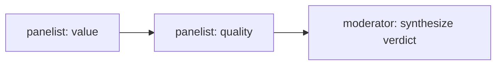

# Chapter 22 — Group-Chat Debate (Round-Table Orchestration)

A fourth MAF workflow pattern for this platform: a **round-table** where several
agents debate a question over a shared transcript, then a moderator synthesizes a
verdict. It complements the existing workflows:

- Concurrent fan-out/fan-in — `workflows/pre_purchase.py` (Chapter 13)
- Sequential + human-in-the-loop — `workflows/return_replace.py` (Chapter 17)
- **Round-table group chat — `workflows/group_chat.py` (this chapter)**

## Why this chapter

[Chapter 15 — Group Chat Orchestration](../15-group-chat-orchestration/) already covers the
cooperative shape of group chat: a manager (round-robin or agent-driven) picks who speaks
next, and the roster — Writer → Critic → Editor — iteratively *refines a single artifact*
across rounds. Every participant is working toward the same output, and the manager's job is
to decide whose turn it is, with a hard `max_rounds` cap because the speaker-selection loop
could otherwise run forever.

This chapter is a different variant of the same underlying primitive (a shared transcript
threaded through named participants): a **debate**, not a refinement pipeline. Each panelist
holds a fixed, named perspective for the whole run — a value/pricing voice, a quality/reviews
voice — and never revises anyone else's turn. They see the running transcript so they can
build on or push back against what's already been said, but their *position* doesn't change;
only their argument accumulates context. There's no manager selecting a speaker either: the
order is fixed at construction time (the order of the `panelists` list), so there's nothing
to loop or cap. The moderator's job is not to smooth one artifact into its next draft — it's
to weigh opposed-or-complementary takes that were never reconciled mid-conversation and render
a single verdict from the tension between them. That's the real difference from Chapter 15:
refinement of one output vs. synthesis across fixed, independent positions.

## When to use it

Use a round-table when several perspectives must *react to each other* before a
decision — e.g. "is this product worth buying?" weighed by a value/pricing voice
and a quality/reviews voice. Unlike the concurrent pattern (independent probes
merged once), each panelist sees the running transcript and can build on or
counter prior turns.



## How it works

Each panelist is an `Executor` that appends one turn to a shared `GroupChatState`
transcript and forwards it; the moderator is the terminal executor that yields the
synthesized verdict.

```python
from agent_framework._workflows._executor import Executor, handler
from agent_framework._workflows._workflow_context import WorkflowContext

class _PanelistExecutor(Executor):
    @handler
    async def run(self, state, ctx: WorkflowContext[GroupChatState, GroupChatState]):
        state.transcript.append({"speaker": self._name,
                                 "text": self._responder(state.question, state.transcript)})
        await ctx.send_message(state)          # forward to the next panelist
```

The forwarders are typed `WorkflowContext[State, State]`; the moderator (terminal)
is `WorkflowContext[None, State]` and calls `ctx.yield_output(state)`.

## Run it

Panelist behavior is a plain `Responder` callable, so you can run it without an LLM:

```python
import asyncio
from workflows.group_chat import GroupChatWorkflow

wf = GroupChatWorkflow(panelists=[
    ("value",   lambda q, transcript: "Strong price for the feature set."),
    ("quality", lambda q, transcript: f"Considering {len(transcript)} prior point(s): build quality is excellent."),
])
state = asyncio.run(wf.execute("Is the Sony WH-1000XM5 worth it?"))
print(state.verdict)
for turn in state.transcript:
    print(f"  {turn['speaker']}: {turn['text']}")
```

`workflows/group_chat.py` lives inside the `agents/python` package (it's the real
production module, not a copy), so the runnable demo script imports it as
`workflows.group_chat` and needs `agents/python` on the path:

```bash
cd agents/python
uv run python ../../tutorials/22-group-chat-debate/python/main.py
```

The chapter's own tests put `agents/python` on `sys.path` themselves, so they collect
under the `tutorials/` project like every other chapter:

```bash
uv run --project tutorials pytest tutorials/22-group-chat-debate/python/tests -v
```

Those tests are separate from `agents/python/tests/test_workflow_group_chat.py`, and
the distinction is worth being clear about. That file tests the **module**. This
chapter previously had none of its own on the reasoning that it was therefore covered
— it was not. The demo's own panelists, its synthesizer, and the claim the chapter is
built on (a later panelist sees earlier turns) were untested, and that claim is
invisible from the demo's output: two panelists who happen not to reference each other
produce the same transcript whether the state was shared or not.

In production, wire each panelist to a specialist agent (e.g. `pricing-promotions`
and `review-sentiment`) by passing an agent-backed responder.

## .NET

Source: [`dotnet/Program.cs`](./dotnet/Program.cs).

```bash
cd tutorials/22-group-chat-debate/dotnet
dotnet run
dotnet test tests/GroupChatDebate.Tests.csproj
```

**This is the one chapter where the two language sides differ on purpose.** Python
imports the production module above and tours real shipped code. There is no
equivalent standalone .NET type — production's round-table lives inside
`ECommerceAgents.Orchestrator.Modes.GroupChatMode` as an LLM-backed sequential loop,
not a reusable workflow class — so the .NET side reimplements the same shape
standalone, keeping the chapter self-contained like every other one in the series.

The behaviour matches exactly. What differs is that one chapter is a tour and the
other is a faithful model; worth knowing before treating them as interchangeable.

```csharp
public sealed record GroupChatWorkflow(
    IReadOnlyList<(string Name, Responder Responder)> Panelists,
    Func<GroupChatState, string>? Synthesizer = null);
```

`GroupChatState` is a **class, not a record**, and deliberately so: it is passed by
reference from executor to executor, and that shared mutable instance *is* the
transcript. A record with value semantics would hand each panelist a private copy and
quietly turn the round-table into a fan-out — every panelist would see an empty
transcript, every take would become a monologue, and nothing would error.

`Responder` returns `ValueTask<string>` so a real agent-backed panelist fits without
changing the signature, which is the path production takes.

The tests on both sides hand panelists a responder that *reports what it could see*,
because that is the only way to distinguish a round-table from a fan-out.

## Gotchas

- **There's no round cap because there's no loop.** Chapter 15's manager-driven group
  chat needs `max_rounds` to stop a selector that might never terminate. This workflow
  has nothing to cap: `GroupChatWorkflow._build()` (`agents/python/workflows/group_chat.py:111-120`)
  wires a straight chain — `panelist[0] -> panelist[1] -> ... -> moderator` — from the
  order of the `panelists` list at construction time. There's no dynamic speaker
  selection, so the debate is exactly `len(panelists)` turns long, always; "more rounds"
  means adding another `(name, responder)` pair, not raising a limit.
- **A panelist that throws doesn't fail the run — it degrades silently into the
  transcript.** `_PanelistExecutor.run()` (`agents/python/workflows/group_chat.py:69-78`)
  wraps the responder call in `try/except`; on failure it logs
  `group_chat.panelist_failed` and appends `"({name} could not respond: {exc})"` as that
  panelist's turn, then lets the chain continue so the moderator still synthesizes a
  verdict. That's good resilience for a live demo, but it means a broken panelist (bad
  prompt, LLM timeout, whatever) won't surface as an error to the caller — you have to
  go look at the logs or notice the placeholder text in the transcript. Covered by
  `test_panelist_failure_is_contained` (`agents/python/tests/test_workflow_group_chat.py:41-48`).
- **`Responder` accepts sync or async, and the executor only awaits when it has to.**
  `_PanelistExecutor.run()` checks `inspect.isawaitable(result)` before awaiting
  (`agents/python/workflows/group_chat.py:71-72`). This was widened specifically so an
  agent-backed panelist (an `async def` closure calling `agent.run()`) could be dropped
  in without teaching `workflows/group_chat.py` anything about MAF `Agent` objects — see
  `orchestrator/modes/group_chat_mode.py`'s module docstring. If that awaitable check
  were missing, an async responder's raw coroutine object would get threaded straight
  into the transcript instead of its resolved text; `test_async_responder_is_awaited`
  (`agents/python/tests/test_workflow_group_chat.py:61-76`) is a regression test for
  exactly that.

## How this shows up in the capstone

Unlike most chapters, this one doesn't have a separate toy implementation to compare
against production code — it exercises the production module directly. Both
`tutorials/22-group-chat-debate/python/main.py` and
`agents/python/tests/test_workflow_group_chat.py` import `GroupChatWorkflow` straight
from `workflows.group_chat` (`agents/python/workflows/group_chat.py:99`), the same class
the live app uses. There's no parallel copy of this pattern living under `tutorials/`.

The production caller is `agents/python/orchestrator/modes/group_chat_mode.py:78`'s
`GroupChatMode`, registered in the orchestrator as the `group-chat` mode alongside
`tool`, `handoff`, `workflow:pre-purchase`, and `workflow:return-replace` (see this
repo's root `CLAUDE.md`, orchestrator route layout notes) — reachable from the chat
UI's mode switcher, not just this tutorial. It wires the same two panelist names used
in this chapter's demo — `value` and `quality` (`_PANEL_PROMPTS` at
`agents/python/orchestrator/modes/group_chat_mode.py:32`) — to real LLM-backed
responders instead of the plain callables above, via `_make_agent_responder()`
(`agents/python/orchestrator/modes/group_chat_mode.py:52-75`), which builds an `Agent`
per panelist and awaits `agent.run(...)`. That's the concrete case the async-responder
gotcha above exists to support.

## Key points

- Sequential round-table ≠ concurrent fan-out: turns are ordered and each sees the
  shared transcript.
- Inject panelist behavior so the workflow is unit-testable without a live LLM.
- Type the terminal executor `WorkflowContext[None, State]` — a forwarding type on
  the terminal stops the chain early.
