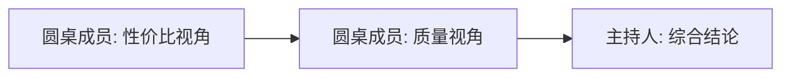

# 第 22 章 · 群聊辩论（圆桌编排）

[项目首页](../../README.md) · [教程总览](../README.md) · [术语表](../_shared/jargon-glossary.md)

本平台的第四种 MAF 工作流模式：**圆桌**——若干智能体围绕同一份共享记录就一个问题展开辩论，最后由主持人（moderator）综合出结论。它与已有工作流形成互补：

- 并发扇出/扇入 —— `workflows/pre_purchase.py`（第 13 章）
- 顺序执行 + 人工参与 —— `workflows/return_replace.py`（第 17 章）
- **圆桌群聊 —— `workflows/group_chat.py`（本章）**

## 本章动机

[第 15 章 · 群聊编排](../15-group-chat-orchestration/)已经讲过群聊的**协作型**形态：由管理者（轮询式或智能体驱动）挑选下一位发言者，而名单 —— 撰写者 → 批评者 → 编辑 —— 在多轮之间迭代地*打磨同一份产物*。每个参与者都在朝同一个输出努力，管理者的职责是决定轮到谁发言，并且必须有一个硬性的 `max_rounds` 上限，否则这个选人循环可能永远跑下去。

本章是同一底层原语（一份贯穿具名参与者的共享记录）的另一种变体：**辩论**，而不是打磨流水线。每位圆桌成员在整个运行期间都持有一个固定的、具名的立场 —— 一个价格/性价比视角、一个质量/评论视角 —— 并且从不修改他人的发言。他们能看到滚动累积的记录，因此可以接续或反驳已经说过的话，但他们的*立场*不会改变，只有论据在不断积累上下文。这里也没有挑选发言者的管理者：顺序在构造时就已固定（即 `panelists` 列表的顺序），因此没有任何东西需要循环或限流。主持人的职责不是把一份产物打磨成下一稿 —— 而是权衡那些在对话过程中从未被调和的、相互对立或互补的观点，并从中提炼出单一结论。这正是与第 15 章的真正差别：一个是对单一输出的打磨，另一个是对若干固定且彼此独立立场的综合。

## 适用场景

当若干视角必须在做出决策之前*相互回应*时，就该用圆桌 —— 例如「这件商品值不值得买？」，由价格/性价比视角与质量/评论视角共同权衡。与并发模式（各自独立探测、最后合并一次）不同，每位圆桌成员都能看到滚动记录，并可接续或反驳此前的发言。


```mermaid
flowchart LR
    V[圆桌成员: 性价比视角] --> Q[圆桌成员: 质量视角]
    Q --> MOD[主持人: 综合结论]
```

## 核心概念

每位圆桌成员都是一个 `Executor`，向共享的 `GroupChatState` 记录追加一轮发言并把它转发出去；主持人则是终末执行器，负责产出综合结论。

```python
from agent_framework._workflows._executor import Executor, handler
from agent_framework._workflows._workflow_context import WorkflowContext

class _PanelistExecutor(Executor):
    @handler
    async def run(self, state, ctx: WorkflowContext[GroupChatState, GroupChatState]):
        state.transcript.append({"speaker": self._name,
                                 "text": self._responder(state.question, state.transcript)})
        await ctx.send_message(state)          # 转发给下一位圆桌成员
```

转发者的类型是 `WorkflowContext[State, State]`；主持人（终末）的类型是 `WorkflowContext[None, State]`，并调用 `ctx.yield_output(state)`。

## 运行方式

圆桌成员的行为就是一个普通的 `Responder` 可调用对象，因此不接 LLM 也能运行：

```python
import asyncio
from workflows.group_chat import GroupChatWorkflow

wf = GroupChatWorkflow(panelists=[
    ("value",   lambda q, transcript: "Strong price for the feature set."),
    ("quality", lambda q, transcript: f"Considering {len(transcript)} prior point(s): build quality is excellent."),
])
state = asyncio.run(wf.execute("Is the Sony WH-1000XM5 worth it?"))
print(state.verdict)
for turn in state.transcript:
    print(f"  {turn['speaker']}: {turn['text']}")
```

`workflows/group_chat.py` 位于 `agents/python` 包内（它是真实的生产模块，不是副本），因此可运行的演示脚本以 `workflows.group_chat` 导入它，并要求 `agents/python` 在路径上：

```bash
cd agents/python
uv run python ../../tutorials/22-group-chat-debate/python/main.py
```

本章自己的测试会自行把 `agents/python` 放进 `sys.path`，因此它们和其他章节一样，在 `tutorials/` 项目下被收集：

```bash
uv run --project tutorials pytest tutorials/22-group-chat-debate/python/tests -v
```

这些测试与 `agents/python/tests/test_workflow_group_chat.py` 是两回事，这个区别值得讲清楚。那个文件测试的是**模块**。本章此前没有自己的测试，理由是「模块已被覆盖，所以本章也被覆盖」—— 这个推理不成立。演示自己的圆桌成员、它的综合器，以及本章赖以成立的那个主张（靠后的圆桌成员能看到此前的发言）都没有被测到；而这个主张在演示输出里是看不见的：两位恰好不引用彼此的圆桌成员，无论状态是否共享，产出的记录都一模一样。

在生产环境中，请通过传入由智能体支撑的 responder，把每位圆桌成员接到一个专业智能体上（例如 `pricing-promotions` 与 `review-sentiment`）。

## 常见坑

- **没有轮次上限，因为没有循环。** 第 15 章那种由管理者驱动的群聊需要 `max_rounds` 来阻止一个可能永不终止的选择器。本工作流没有任何东西需要限流：`GroupChatWorkflow._build()`（`agents/python/workflows/group_chat.py:110-119`）按构造时 `panelists` 列表的顺序接出一条直链 —— `panelist[0] -> panelist[1] -> ... -> moderator`。没有动态选人，所以辩论长度永远精确等于 `len(panelists)` 轮；「更多轮」意味着再加一对 `(name, responder)`，而不是调高某个上限。
- **某位圆桌成员抛异常不会让整轮运行失败 —— 它会静默降级进记录。** `_PanelistExecutor.run()`（`agents/python/workflows/group_chat.py:69-77`）把 responder 调用包在 `try/except` 里；失败时它记录 `group_chat.panelist_failed`，并把 `"({name} could not respond: {exc})"` 作为该成员的发言追加进去，然后让链条继续，好让主持人仍能综合出结论。对实时演示来说这是不错的韧性，但也意味着一个坏掉的圆桌成员（提示词有问题、LLM 超时，等等）不会以错误形式暴露给调用方 —— 你得去翻日志，或者注意到记录里那段占位文本。该行为由 `test_panelist_failure_is_contained`（`agents/python/tests/test_workflow_group_chat.py:39-48`）覆盖。
- **`Responder` 既接受同步也接受异步，而执行器只在必要时才 await。** `_PanelistExecutor.run()` 在 await 之前先检查 `inspect.isawaitable(result)`（`agents/python/workflows/group_chat.py:71-72`）。这个判断是特意放宽的，好让由智能体支撑的圆桌成员（一个调用 `agent.run()` 的 `async def` 闭包）能直接塞进来，而不必让 `workflows/group_chat.py` 对 MAF 的 `Agent` 对象有任何了解 —— 参见 `orchestrator/modes/group_chat_mode.py` 的模块 docstring。如果缺了这个可等待判断，异步 responder 的原始协程对象会被直接串进记录，而不是它解析后的文本；`test_async_responder_is_awaited`（`agents/python/tests/test_workflow_group_chat.py:59-76`）正是针对这一点的回归测试。

## 在完整项目中的落点

与多数章节不同，本章没有一份单独的玩具实现去和生产代码做对照 —— 它直接演练生产模块。`tutorials/22-group-chat-debate/python/main.py` 与 `agents/python/tests/test_workflow_group_chat.py` 都直接从 `workflows.group_chat` 导入 `GroupChatWorkflow`（`agents/python/workflows/group_chat.py:99`），也就是线上应用所用的同一个类。`tutorials/` 下不存在这一模式的平行副本。

生产侧的调用方是 `agents/python/orchestrator/modes/group_chat_mode.py:77` 的 `GroupChatMode`，它以 `group-chat` 模式注册进编排器，与 `tool`、`handoff`、`workflow:pre-purchase`、`workflow:return-replace` 并列（参见本仓库根目录 `CLAUDE.md` 中关于编排器路由布局的说明）—— 可从聊天界面的模式切换器中进入，而不只存在于本教程。它把本章演示所用的两个圆桌成员名 —— `value` 与 `quality`（`agents/python/orchestrator/modes/group_chat_mode.py:31` 的 `_PANEL_PROMPTS`）—— 接到由真实 LLM 支撑的 responder 上（而不是上面那些普通可调用对象），方式是 `_make_agent_responder()`（`agents/python/orchestrator/modes/group_chat_mode.py:51-74`），它为每位圆桌成员构建一个 `Agent` 并 await `agent.run(...)`。这正是上文「异步 responder」那条常见坑所要支撑的具体场景。

## 要点

- 顺序圆桌 ≠ 并发扇出：各轮是有序的，且每一轮都能看到共享记录。
- 把圆桌成员的行为注入进来，工作流才能在没有真实 LLM 的情况下做单元测试。
- 把终末执行器标注为 `WorkflowContext[None, State]` —— 终末执行器上用转发类型会让链条提前停止。
