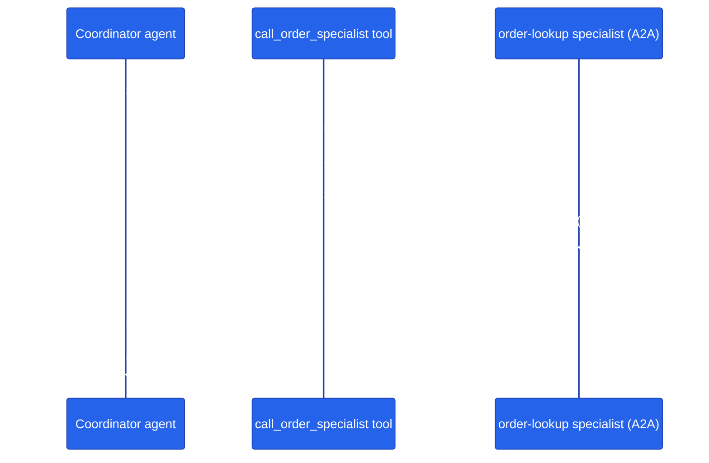

# Chapter 23 — A2A Protocol

## Why this chapter

Every specialist agent in this capstone — product discovery, order management, pricing, reviews, inventory — runs as its own FastAPI process, on its own port, deployed and scaled independently. None of that is MAF. It's a plain HTTP convention this repo calls A2A (agent-to-agent): a tiny manifest so one agent can discover another, and two HTTP shapes so one agent can call another's `Agent.run()` without importing it. The orchestrator's single most important tool, `call_specialist_agent` (`agents/python/orchestrator/agent.py:40`), is nothing but this convention wired to `httpx`. Every other chapter in this series builds an `Agent` in one process and calls `.run()` on it directly — this is the first chapter where the caller and the agent are different processes, and that gap is the entire subject.

Despite being the backbone of the whole app, A2A has had zero tutorial coverage until now — the largest gap in this curriculum. This chapter closes it.

## Prerequisites

- Completed [Chapter 02 — Adding Tools](../02-add-tools/) (tools are how a coordinator agent triggers an A2A call)
- Familiar with the harness concepts in [docs/concepts/04-agent-harness.md](../../docs/concepts/04-agent-harness.md) — this chapter teaches the A2A transport/identity shapes that document introduces
- Environment variables set: `OPENAI_API_KEY` (or `AZURE_OPENAI_*`) and `LLM_MODEL`

## The concept

A2A, as this repo uses it, is a lightweight HTTP convention for one agent process to discover and call another agent process. It is not a special SDK feature of MAF — `Agent` objects don't know anything about A2A. It's three plain HTTP endpoints that `agents/python/shared/agent_host.py::create_agent_app()` puts in front of every specialist's `Agent`, and a `RemoteSpecialistChatClient` / `call_specialist_agent` on the calling side that know how to talk to them.

**Identity.** Every specialist serves `GET /.well-known/agent-card.json` (`agent_host.py:216`) — a small JSON manifest (name, description, url, version) a caller can fetch to confirm who it's about to talk to before sending real traffic. This chapter's demo specialist serves the same document, verbatim shape, at the same well-known path.

**Transport — two shapes.** `POST /message:send` (`agent_host.py:225`) is blocking request/response: send `{"message": "...", "history": [...]}`, get back `{"response": "...", "steps": [...]}` once the specialist's `agent.run()` finishes. `POST /message:stream` (`agent_host.py:263`) is the streaming twin: same request body, but the reply arrives as Server-Sent Events — one `data: <chunk>` frame per piece of text, an `event: step` frame per tool call the specialist made, and a final `data: [DONE]` sentinel (or `data: [ERROR...]` on failure). The orchestrator's `call_specialist_agent` (`agents/python/orchestrator/agent.py:40-138`) actually speaks both: it opens the streaming endpoint when a live SSE connection to the browser is active (forwarding chunks in real time) and falls back to the blocking endpoint otherwise, parsing exactly those sentinels.

**Why this matters.** A2A is what lets each specialist run as an independent, separately-scaled, separately-deployed service instead of one giant agent with every tool bolted on — the same reason microservices exist, applied to agents. The product-discovery agent can be redeployed, scaled to three replicas, or rewritten in a different language without the orchestrator's code changing at all — it only ever depends on the HTTP contract, never on the specialist's internals.

**When to use it — and when not to.** Reach for A2A at a real process boundary: cross-service, cross-team, cross-language, or "this needs to scale/deploy independently." It costs you a network hop, JSON (de)serialization, and a new failure mode (the callee can be down, slow, or unreachable — see the timeout/error handling in `call_specialist_agent`). If two agents will always live in the same process and the same deployment, that cost buys nothing — `Agent.as_tool()` (Chapter 27, in progress) wraps a second agent as an in-process tool call with none of the HTTP overhead. Use A2A when the boundary is real; use an in-process tool when it isn't.



The coordinator never imports the specialist's code. It only knows an HTTP address and the shape of two endpoints — the same relationship the real orchestrator has with every one of its five specialists.

## Python

Run from the repo root using the shared `tutorials/` uv project (one `uv sync` covers every chapter):

```bash
uv sync --project tutorials
uv run --project tutorials python tutorials/23-a2a-protocol/python/main.py
```

Source: [`python/main.py`](./python/main.py).

### Why an in-process transport

The real capstone binds a real TCP port per specialist and calls it with a real `httpx.AsyncClient`. Spinning up an actual `uvicorn` server inside a tutorial's test suite invites exactly the kind of flakiness (port collisions, startup races, leaked sockets between test runs) this repo's testing conventions avoid — every other chapter's tests are deterministic and network-free. So this chapter's specialist is still a real ASGI app — real Starlette routing, real JSON encoding, real SSE framing — but it's driven through `httpx.ASGITransport`, which calls the app in-process instead of opening a socket:

```python
def _specialist_client() -> httpx.AsyncClient:
    transport = httpx.ASGITransport(app=SPECIALIST_APP)
    return httpx.AsyncClient(transport=transport, base_url=SPECIALIST_BASE_URL, timeout=10)
```

Every request still goes through Starlette's full routing and (de)serialization stack — only the socket is skipped. The request/response *shapes* on the wire are identical to what `agent_host.py` actually serves; only the "wire" itself is swapped for an in-process call.

### The specialist: real A2A endpoints

```python
def build_specialist_app() -> Starlette:
    return Starlette(
        routes=[
            Route("/.well-known/agent-card.json", _agent_card, methods=["GET"]),
            Route("/message:send", _message_send, methods=["POST"]),
            Route("/message:stream", _message_stream, methods=["POST"]),
        ]
    )
```

Same three routes, same paths, as `agents/python/shared/agent_host.py::create_agent_app()`. `_message_send` returns `{"response": ..., "steps": []}`; `_message_stream` yields `data: <chunk>` frames and finishes with `data: [DONE]` — the same sentinel `orchestrator/agent.py::call_specialist_agent` looks for.

### The coordinator's tool: the A2A call

```python
@tool(name="call_order_specialist", description="Call the order-lookup specialist over A2A ...")
async def call_order_specialist(message: Annotated[str, Field(description="...")]) -> str:
    request_body = {"message": message}
    async with _specialist_client() as client:
        resp = await client.post("/message:send", json=request_body)
        resp.raise_for_status()
        data = resp.json()
        return str(data.get("response", resp.text))
```

This is `orchestrator/agent.py`'s blocking path, minus the streaming branch and the registry lookup — build a body, `POST /message:send`, read `response`. The LLM decides to call this tool the same way it decided to call Chapter 02's `get_product_price`; the difference is what the tool *does* once called — a real (if in-process) HTTP round trip instead of a dictionary lookup.

Run it and ask an order question — the LLM calls `call_order_specialist`, which does a real A2A round trip to the specialist app, and the answer folds the order's status into a sentence. `main()` also prints the raw agent-card fetch and a raw streamed call afterward, so you can see both transport shapes outside of the LLM's tool-calling loop.

## .NET

Source: [`dotnet/Program.cs`](./dotnet/Program.cs).

```bash
cd tutorials/23-a2a-protocol/dotnet
dotnet run
dotnet test tests/A2AProtocol.Tests.csproj
```

**No A2A SDK is involved, and that is the point.** A2A is a protocol — three endpoints and an SSE frame format — so the .NET specialist is ordinary ASP.NET Core minimal APIs:

```csharp
app.MapGet("/.well-known/agent-card.json", () => Results.Json(Card));

app.MapPost("/message:send", (A2ARequest request) =>
    string.IsNullOrWhiteSpace(request.Message)
        ? Results.Json(new { error = "No message provided" }, statusCode: 400)
        : Results.Json(new A2AResponse(LookupOrder(request.Message), Array.Empty<string>())));
```

A `A2A` NuGet package does exist, but only as `1.0.0-preview2`. Depending on a preview to demonstrate plain HTTP would teach the wrong lesson: any language with an HTTP client can be an A2A caller, and any web framework can host an A2A agent.

The in-process transport is `Microsoft.AspNetCore.TestHost` — the direct counterpart to Python's `httpx.ASGITransport`. Real routing, real model binding, real SSE writing, no socket. Same trade-off, same reason: spawning a server and polling a port makes the chapter's setup longer than its subject.

### The asymmetry between the two transports

`/message:send` can reject an empty message with a `400`. `/message:stream` **cannot** — `200 OK` went out before anything went wrong, so the failure has to travel in-band as a frame:

```csharp
await context.Response.WriteAsync("data: [ERROR: no message]\n\n");
```

A caller that only checks the status code sees a successful, empty answer. That is why the SSE reader treats an `[ERROR` prefix as a failure and the `[DONE]` sentinel as termination, and why both are asserted.

## Side-by-side differences

| Aspect | This chapter | Real capstone (`agents/python/`) |
|--------|--------------|-----------------------------------|
| Transport | `httpx.ASGITransport` (in-process, no socket) | Real TCP, `httpx.AsyncClient` over the network |
| Specialist host | `Starlette` app built ad hoc in `main.py` | `shared/agent_host.py::create_agent_app()`, one per specialist microservice |
| Identity | Same `/.well-known/agent-card.json` shape | Same endpoint, same shape |
| Blocking call | `POST /message:send`, same body/response shape | Same endpoint (`orchestrator/agent.py:116-129`) |
| Streaming call | `POST /message:stream`, same SSE framing | Same endpoint (`orchestrator/agent.py:68-113`), forwarded live to the browser |
| Auth headers | None — same process, no trust boundary to cross | `X-Agent-Secret` + `X-User-Email`/`X-User-Role` (`build_a2a_headers()`) |

## Gotchas

- **A2A is a convention, not a MAF feature.** There's no `agent_framework.a2a` module to import. It's plain HTTP — a JSON manifest and two POST endpoints — which is exactly why it's easy to reproduce faithfully in a tutorial: nothing here is a simplified stand-in for a hidden SDK mechanism.
- **The blocking and streaming endpoints are genuinely different code paths, not one wrapping the other.** `call_specialist_agent` picks one based on whether an SSE connection to the browser is already open (`stream_queue is not None`), and falls back from streaming to blocking on any exception — see `orchestrator/agent.py:111-113`. Don't assume "streaming" is just "blocking, but chunked."
- **The `[DONE]` / `[ERROR...]` sentinels are string prefixes on the SSE payload, not a structured field.** Forgetting to check for `[ERROR` before treating a frame as real content means an upstream failure silently becomes a garbage answer instead of a caught error — see `demo_stream_call()`'s `raise RuntimeError(payload)` for the check this chapter's demo makes.
- **`ASGITransport` is a testing/demo convenience, not what production does.** It proves the request/response *shapes* are real without a live server; it does not exercise real network failure modes (timeouts, connection resets, DNS) the way `agents/python/orchestrator/agent.py`'s `httpx.TimeoutException` / `httpx.HTTPStatusError` handling has to.
- **No auth headers in this demo.** The real orchestrator attaches `X-Agent-Secret` and user-identity headers to every A2A call (`build_a2a_headers()` in `shared/oauth/service_client.py`) because the specialist is a genuine trust boundary. This chapter's coordinator and specialist are the same trusted process, so that's intentionally left out — don't copy that omission into a real cross-service call.

## Tests

```bash
uv run --project tutorials pytest tutorials/23-a2a-protocol/python/tests -v
```

`tutorials/23-a2a-protocol/python/tests/test_a2a_protocol.py` covers, structurally:

1. **Order-lookup unit tests** — canned status for a known order id, a clean fallback for an unknown one, a clean fallback when no order id is present, and case-insensitivity — no LLM, no HTTP.
2. **A2A transport unit tests** — the agent-card endpoint returns the expected identity document, the tool's `.func(...)` performs a real (in-process) `/message:send` round trip and gets the right status back, and `/message:stream` both emits the `[DONE]` sentinel on success and raises on an `[ERROR...]` frame. All of this runs through the real Starlette app via `ASGITransport` — no LLM, no real socket.
3. **Agent wiring** — `call_order_specialist` shows up in `build_agent()`'s registered tools.
4. **A replay test** (`test_replay_calls_order_specialist`) that plays back a committed fixture in `tests/fixtures/replay/` — no network to a real LLM, no credentials required.
5. **Real-LLM integration tests**, skipped unless usable credentials are present — one asserts the LLM calls `call_order_specialist` for an order question, the other asserts it does *not* leak canned order data into an unrelated answer.

## How this shows up in the capstone

This chapter's demo is a small-scale, faithful replica of three real pieces of the capstone:

- `agents/python/shared/agent_host.py:216` — `GET /.well-known/agent-card.json`, the identity endpoint every real specialist serves. `agents/python/shared/agent_host.py:225` and `agents/python/shared/agent_host.py:263` are the real `/message:send` and `/message:stream` handlers this chapter's `_message_send`/`_message_stream` mirror.
- `agents/python/orchestrator/agent.py:40` — `call_specialist_agent`, the orchestrator's real A2A-calling tool. It builds the same `{"message": ...}` body, opens an `a2a_call_span` for tracing, and speaks both transport shapes this chapter teaches — streaming when an SSE context is live, blocking otherwise, with the same `[DONE]`/`[ERROR` sentinel handling `demo_stream_call()` reproduces.
- `agents/python/shared/remote_agent.py:39` — `RemoteSpecialistChatClient`, a second real A2A caller in this codebase: it wraps a specialist as a MAF `BaseChatClient` (rather than a plain tool function) so `HandoffBuilder` can route to a remote specialist as if it were a local `Agent` participant. Same `/message:send` shape underneath, different caller-side wrapping.

For the harness side of this — lifecycle, telemetry, session rehydration — see [docs/concepts/04-agent-harness.md](../../docs/concepts/04-agent-harness.md), which this chapter deliberately doesn't re-explain.

## What's next

- Next chapter: [Chapter 24 — RAG and Grounding](../24-rag-and-grounding/)
- Full source: [`python/`](./python/)
- Shared: [Mermaid style guide](../_shared/mermaid-style-guide.md) · [Jargon glossary](../_shared/jargon-glossary.md)
