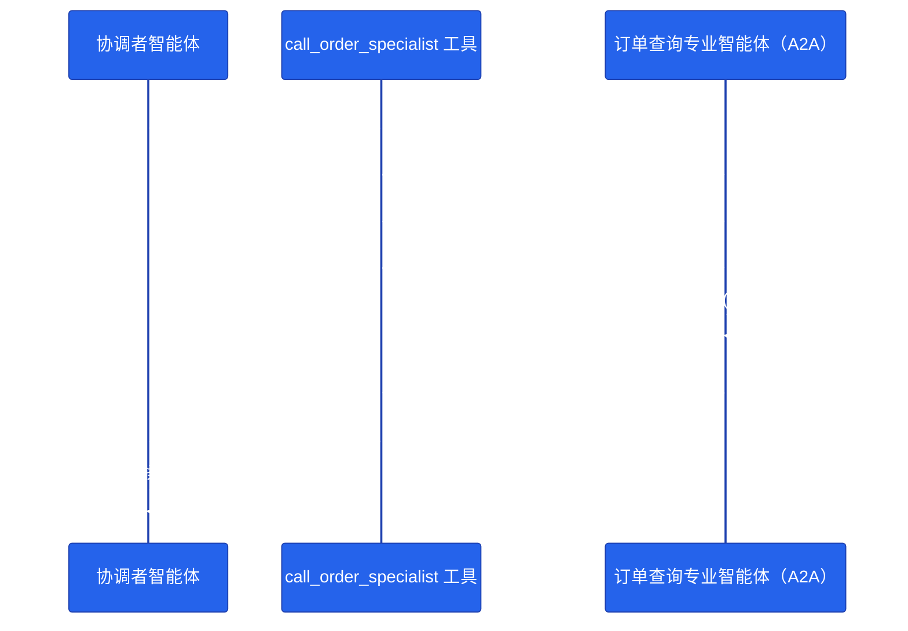

# 第 23 章 · A2A 协议

[项目首页](../../README.md) · [教程总览](../README.md) · [术语表](../_shared/jargon-glossary.md)

## 本章动机

本项目中的每一个专业智能体 —— 商品发现、订单管理、定价、评论、库存 —— 都作为独立的 FastAPI 进程运行，各自占用自己的端口，可独立部署、独立扩缩容。这些都不是 MAF 的能力，而是本仓库称之为 A2A（Agent-to-Agent，智能体间通信协议）的一套朴素 HTTP 约定：一份极小的清单文档，让一个智能体发现另一个；两种 HTTP 形态，让一个智能体无需导入对方代码就能调用对方的 `Agent.run()`。编排器最重要的那个工具 `call_specialist_agent`（`agents/python/orchestrator/agent.py:55`），本质上就是把这套约定接到 `httpx` 上。本系列其他章节都在同一个进程内构建 `Agent` 并直接调用 `.run()` —— 本章是第一次让调用方与被调用智能体处于不同进程，而这道进程鸿沟正是本章的全部主题。

尽管 A2A 是整个应用的骨架，它此前在本教程中完全没有覆盖 —— 这是本课程最大的缺口。本章把它补上。

## 前置条件

- 已完成[第 02 章 · 添加工具](../02-add-tools/)（协调者智能体正是通过工具来触发 A2A 调用）
- 熟悉 [docs/concepts/04-agent-harness.md](../../docs/concepts/04-agent-harness.md) 中的运行框架概念 —— 本章讲授的是该文档引入的 A2A 传输与身份形态
- 已设置环境变量：`OPENAI_API_KEY`（或 `AZURE_OPENAI_*`）与 `LLM_MODEL`

## 核心概念

在本仓库的用法里，A2A 是一套轻量 HTTP 约定，用于让一个智能体进程发现并调用另一个智能体进程。它不是 MAF 的某个特殊 SDK 特性 —— `Agent` 对象对 A2A 一无所知。它是三个朴素的 HTTP 端点：由 `agents/python/shared/agent_host.py::create_agent_app()` 摆在每个专业智能体的 `Agent` 前面；调用侧则有 `RemoteSpecialistChatClient` / `call_specialist_agent`，知道该如何与这些端点通信。

**身份。** 每个专业智能体都提供 `GET /.well-known/agent-card.json`（`agent_host.py:249`）—— 一份小型 JSON 清单（name、description、url、version），调用方可以先取它，在发送真实流量之前确认自己即将对话的对象是谁。本章的演示专家智能体在同一个 well-known 路径下提供逐字同形的文档。

**传输 —— 两种形态。** `POST /message:send`（`agent_host.py:258`）是阻塞式请求/响应：发送 `{"message": "...", "history": [...]}`，待专业智能体的 `agent.run()` 结束后拿回 `{"response": "...", "steps": [...]}`。`POST /message:stream`（`agent_host.py:296`）是它的流式孪生形态：请求体相同，但回复以 SSE（Server-Sent Events，服务端推送事件）形式到达 —— 每段文本一帧 `data: <chunk>`，专业智能体每次工具调用一帧 `event: step`，最后以 `data: [DONE]` 哨兵收尾（失败时为 `data: [ERROR...]`）。编排器的 `call_specialist_agent`（`agents/python/orchestrator/agent.py:55-172`）实际上两种都会说：当与浏览器之间的 SSE 连接处于活跃状态时，它打开流式端点（把分片实时转发出去）；否则回落到阻塞端点，并精确解析上述哨兵。

**为什么这件事重要。** 正是因为 A2A，每个专业智能体才能作为独立、可单独扩缩容、可单独部署的服务运行，而不是变成一个把所有工具都拧上去的巨型智能体 —— 这是微服务存在的同一个理由，只是作用在智能体上。商品发现智能体可以被重新部署、扩到三个副本，或用另一种语言重写，而编排器的代码一行都不用改：它只依赖 HTTP 契约，从不依赖专业智能体的内部实现。

**什么时候该用 —— 以及什么时候不该用。** 在真实的进程边界上才动用 A2A：跨服务、跨团队、跨语言，或者「这东西需要独立扩缩容/部署」。代价是一次网络跳转、JSON 的（反）序列化，以及一种新的失败模式（被调方可能宕机、变慢或不可达 —— 参见 `call_specialist_agent` 中的超时与错误处理）。如果两个智能体永远会处在同一进程、同一次部署中，这份代价什么也换不来 —— `Agent.as_tool()`（第 27 章）会把第二个智能体包装成进程内的工具调用，没有任何 HTTP 开销。边界真实存在时用 A2A；不存在时用进程内工具。


```mermaid
%%{init: {'theme':'base', 'themeVariables': {
  'primaryColor': '#2563eb','primaryTextColor': '#ffffff','primaryBorderColor': '#1e40af',
  'lineColor': '#64748b','secondaryColor': '#f59e0b','tertiaryColor': '#10b981',
  'background': 'transparent'}}}%%
sequenceDiagram
  participant C as 协调者智能体
  participant T as call_order_specialist 工具
  participant S as 订单查询专业智能体（A2A）

  C->>T: LLM 决定调用该工具
  T->>S: GET /.well-known/agent-card.json
  S-->>T: {"name": "order-lookup", ...}
  T->>S: POST /message:send {"message": "..."}
  S->>S: agent.run(message)
  S-->>T: {"response": "...", "steps": []}
  T-->>C: 工具结果进入上下文
  C-->>C: LLM 把结果揉进最终回答
```

协调者从不导入专业智能体的代码。它只知道一个 HTTP 地址和两个端点的形态 —— 这与真实编排器同它五个专业智能体之间的关系完全一样。

### 两种传输的不对称性

`/message:send` 可以用 `400` 拒绝一条空消息。`/message:stream` **做不到** —— 在出错之前 `200 OK` 就已经发出去了，因此失败只能以帧的形式在带内传递：

```
data: [ERROR: no message]
```

只检查状态码的调用方会看到一个成功但为空的回答。正因如此，SSE 读取方把 `[ERROR` 前缀视为失败、把 `[DONE]` 哨兵视为终止，并且这两点都有断言覆盖。

## Python

在仓库根目录运行，使用共享的 `tutorials/` uv 项目（一次 `uv sync` 覆盖全部章节）：

```bash
uv sync --project tutorials
uv run --project tutorials python tutorials/23-a2a-protocol/python/main.py
```

源码：[`python/main.py`](./python/main.py)。

### 为什么用进程内传输

真实项目为每个专业智能体绑定真实的 TCP 端口，并用真实的 `httpx.AsyncClient` 调用它。而在教程的测试套件里拉起一个真正的 `uvicorn` 服务器，恰好会引入本仓库测试约定极力避免的那类不稳定因素（端口冲突、启动竞态、测试运行之间泄漏的套接字）—— 其他每一章的测试都是确定性且不依赖网络的。因此本章的专业智能体仍然是一个真实的 ASGI 应用 —— 真实的 Starlette 路由、真实的 JSON 编码、真实的 SSE 帧 —— 只是通过 `httpx.ASGITransport` 驱动，它在进程内调用该应用，而不打开套接字：

```python
def _specialist_client() -> httpx.AsyncClient:
    transport = httpx.ASGITransport(app=SPECIALIST_APP)
    return httpx.AsyncClient(transport=transport, base_url=SPECIALIST_BASE_URL, timeout=10)
```

每个请求仍然会走完 Starlette 完整的路由与（反）序列化栈 —— 只是跳过了套接字。线缆上的请求/响应*形态*与 `agent_host.py` 实际提供的完全一致；被替换掉的只是「线缆」本身，改成了一次进程内调用。

### 专家侧：真实的 A2A 端点

```python
def build_specialist_app() -> Starlette:
    return Starlette(
        routes=[
            Route("/.well-known/agent-card.json", _agent_card, methods=["GET"]),
            Route("/message:send", _message_send, methods=["POST"]),
            Route("/message:stream", _message_stream, methods=["POST"]),
        ]
    )
```

三条路由、三个路径，与 `agents/python/shared/agent_host.py::create_agent_app()` 完全一致。`_message_send` 返回 `{"response": ..., "steps": []}`；`_message_stream` 逐帧产出 `data: <chunk>`，并以 `data: [DONE]` 结束 —— 正是 `orchestrator/agent.py::call_specialist_agent` 所寻找的同一个哨兵。

### 协调者侧的工具：A2A 调用

```python
@tool(name="call_order_specialist", description="Call the order-lookup specialist over A2A ...")
async def call_order_specialist(message: Annotated[str, Field(description="...")]) -> str:
    request_body = {"message": message}
    async with _specialist_client() as client:
        resp = await client.post("/message:send", json=request_body)
        resp.raise_for_status()
        data = resp.json()
        return str(data.get("response", resp.text))
```

这就是 `orchestrator/agent.py` 的阻塞路径，只是去掉了流式分支与注册表查询 —— 组装请求体、`POST /message:send`、读取 `response`。LLM 决定调用这个工具的方式，与它决定调用第 02 章 `get_product_price` 的方式一模一样；差别在于工具被调用之后*做什么* —— 一次真实的（尽管是进程内的）HTTP 往返，而不是一次字典查询。

运行它并提一个订单相关的问题 —— LLM 会调用 `call_order_specialist`，后者向专家应用发起一次真实的 A2A 往返，回答则把订单状态揉进一句话里。`main()` 之后还会打印原始的 agent-card 拉取结果与一次原始流式调用，这样你就能在 LLM 的工具调用循环之外看到两种传输形态。

## 本章与真实项目的差异

| 方面 | 本章 | 真实项目（`agents/python/`） |
|--------|--------------|-----------------------------------|
| 传输 | `httpx.ASGITransport`（进程内，无套接字） | 真实 TCP，网络上使用 `httpx.AsyncClient` |
| 专家宿主 | `main.py` 中临时构建的 `Starlette` 应用 | `shared/agent_host.py::create_agent_app()`，每个专业智能体微服务一份 |
| 身份 | 相同的 `/.well-known/agent-card.json` 形态 | 相同端点、相同形态 |
| 阻塞调用 | `POST /message:send`，请求/响应形态相同 | 相同端点（`orchestrator/agent.py:149-163`） |
| 流式调用 | `POST /message:stream`，SSE 帧格式相同 | 相同端点（`orchestrator/agent.py:87-144`），实时转发给浏览器 |
| 认证请求头 | 无 —— 同一进程，没有需要跨越的信任边界 | `X-Agent-Secret` + `X-User-Email`/`X-User-Role`（`build_a2a_headers()`） |

## 常见坑

- **A2A 是一套约定，不是 MAF 的功能。** 没有 `agent_framework.a2a` 模块可导入。它就是朴素 HTTP —— 一份 JSON 清单加两个 POST 端点 —— 这也正是它能在教程里被忠实复现的原因：这里没有任何东西是某个隐藏 SDK 机制的简化替身。
- **阻塞端点与流式端点是真正不同的代码路径，而不是一个包着另一个。** `call_specialist_agent` 依据「与浏览器的 SSE 连接是否已经打开」（`stream_queue is not None`）来二选一，并在任何异常时从流式回落到阻塞 —— 参见 `orchestrator/agent.py:145-147`。不要假设「流式」只是「阻塞，但分块」。
- **`[DONE]` / `[ERROR...]` 哨兵是 SSE 负载上的字符串前缀，不是结构化字段。** 在把一帧当作真实内容之前忘了检查 `[ERROR`，上游的失败就会静默地变成一段垃圾回答，而不是一个被捕获的错误 —— 参见本章演示中 `demo_stream_call()` 的 `raise RuntimeError(payload)`，那就是它所做的那次检查。
- **`ASGITransport` 是测试/演示的便利手段，不是生产做法。** 它证明了请求/响应*形态*是真实的，而不需要真实服务器；它并不演练真实网络的失败模式（超时、连接重置、DNS），而 `agents/python/orchestrator/agent.py` 的 `httpx.TimeoutException` / `httpx.HTTPStatusError` 处理则必须面对这些。
- **本演示不带认证请求头。** 真实编排器会给每次 A2A 调用附上 `X-Agent-Secret` 与用户身份请求头（`shared/oauth/service_client.py:117` 的 `build_a2a_headers()`），因为专业智能体是真正的信任边界。本章的协调者与专业智能体处于同一个受信进程，因此这是有意省略的 —— 不要把这种省略照搬进真实的跨服务调用。

## 测试

```bash
uv run --project tutorials pytest tutorials/23-a2a-protocol/python/tests -v
```

`tutorials/23-a2a-protocol/python/tests/test_a2a_protocol.py` 从结构上覆盖：

1. **订单查询单元测试** —— 已知订单号返回预置状态，未知订单号有干净的兜底，消息中不含订单号时也有干净的兜底，以及大小写不敏感 —— 不涉及 LLM，也不涉及 HTTP。
2. **A2A 传输单元测试** —— agent-card 端点返回预期的身份文档；工具的 `.func(...)` 完成一次真实的（进程内）`/message:send` 往返并拿回正确状态；`/message:stream` 在成功时发出 `[DONE]` 哨兵，并在遇到 `[ERROR...]` 帧时抛错。以上全部经由 `ASGITransport` 跑在真实的 Starlette 应用上 —— 没有 LLM，也没有真实套接字。
3. **智能体接线** —— `call_order_specialist` 出现在 `build_agent()` 注册的工具中。
4. **一次回放测试**（`test_replay_calls_order_specialist`），播放 `tests/fixtures/replay/` 中已提交的夹具 —— 不访问真实 LLM，也不需要凭据。
5. **真实 LLM 集成测试**，在缺少可用凭据时跳过 —— 一个断言 LLM 会为订单类问题调用 `call_order_specialist`，另一个断言它*不会*把预置的订单数据泄漏进无关回答。

## 在完整项目中的落点

本章的演示是真实项目中三处实现的小规模忠实复刻：

- `agents/python/shared/agent_host.py:235` —— `GET /.well-known/agent-card.json`，每个真实专业智能体都提供的身份端点。`agents/python/shared/agent_host.py:244` 与 `agents/python/shared/agent_host.py:305` 则是真实的 `/message:send` 与 `/message:stream` 处理函数，本章的 `_message_send`/`_message_stream` 正是它们的镜像。
- `agents/python/orchestrator/agent.py:55` —— `call_specialist_agent`，编排器真实的 A2A 调用工具。它组装同样的 `{"message": ...}` 请求体，为追踪打开一个 `a2a_call_span`（`agents/python/orchestrator/agent.py:89`），并支持本章讲授的两种传输形态 —— SSE 上下文活跃时走流式，否则走阻塞，且采用与 `demo_stream_call()` 所复现的相同的 `[DONE]`/`[ERROR` 哨兵处理。
- `agents/python/shared/remote_agent.py:38` —— `RemoteSpecialistChatClient`，本代码库中第二个真实的 A2A 调用方：它把专业智能体包装成一个 MAF `BaseChatClient`（而不是普通的工具函数），这样 `HandoffBuilder` 就能像路由到本地 `Agent` 参与者一样路由到远程专业智能体。底层仍是相同的 `/message:send` 形态，只是调用侧的包装方式不同。

关于这件事的运行框架一侧 —— 生命周期、遥测、会话重建 —— 请参见 [docs/concepts/04-agent-harness.md](../../docs/concepts/04-agent-harness.md)，本章有意不再重复解释。

## 下一步

- 下一章：[第 24 章 · 检索与事实核验](../24-rag-and-grounding/)
- 完整源码：[`python/`](./python/)
- 共享资料：[Mermaid 风格指南](../_shared/mermaid-style-guide.md) · [术语表](../_shared/jargon-glossary.md)
