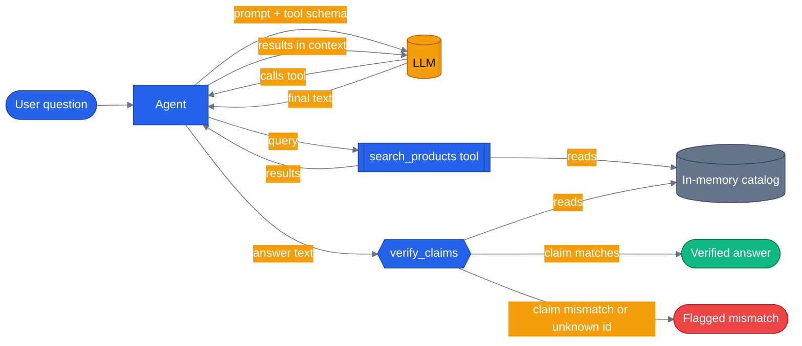

# Chapter 24 — RAG and Grounding

## Why this chapter

Every earlier chapter trusted the model's final sentence. Chapter 02 gave the agent a
`get_product_price` tool and assumed that whatever the LLM said afterward reflected the tool's
canned string — for a four-SKU demo catalog with no other consequence, that's a safe enough
assumption to skip past. It stops being safe the moment "the LLM says a price" is a real
support conversation with real money attached: nothing in Chapter 02 checks that the number
in the LLM's sentence still matches the number the tool actually returned, and a model that
paraphrases "\$79.99" as "\$97.99" would sail through undetected. This chapter builds the two
mechanisms that close that gap: a **retrieval**
tool so the agent has real data to answer from, and a **grounding verification** step that
checks, after the model responds, whether its answer's specific claims actually match that
data. They are not the same thing, and conflating them is the most common mistake in
RAG write-ups — see [`docs/concepts/09-grounding-and-rag.md`](../../docs/concepts/09-grounding-and-rag.md)
for the deeper "why models fabricate" material this chapter leans on rather than re-deriving.

## Prerequisites

- Completed [Chapter 02 — Adding Tools](../02-add-tools/) (tool decorators, `Annotated` params)
- Read [`docs/concepts/09-grounding-and-rag.md`](../../docs/concepts/09-grounding-and-rag.md) —
  this chapter is the hands-on companion, not a restatement
- Repo-root `.env` with a working LLM provider (`OPENAI_API_KEY`, or `AZURE_OPENAI_ENDPOINT` +
  `AZURE_OPENAI_KEY` + `AZURE_OPENAI_DEPLOYMENT`)

## The concept

**Retrieval** is giving the agent a `search` tool over a real knowledge base instead of letting
it answer from training data. Mechanically it's nothing new — it's Chapter 02's tool-calling
loop again: the LLM sees a tool schema, decides to call it, MAF invokes the function, and the
result lands back in context before the model writes its final answer. What's new is *why* —
a product catalog changes daily; the model's weights don't. Without a search tool, the model's
only option for "do you have noise-cancelling headphones" is to generate something plausible,
which is indistinguishable, token by token, from something true.

**Grounding verification** is a completely separate mechanism that runs *after* the model
answers. Having real data available during generation does not guarantee the model's prose
repeats it correctly — the final answer is still produced the same way every other sentence is,
as the most statistically plausible continuation, not as a copy-paste of the tool result. A model
can call `search_products`, see `{"id": "P001", "price": 129.99}`, and still write "$119.99" in
its answer, because nothing about next-token generation enforces numeric fidelity. Verification
closes that specific gap: it extracts the checkable claims from the model's answer (a product id,
a price) and checks each one against the same source of truth the tool used, flagging anything
that doesn't match instead of trusting that retrieval alone produced a correct answer.

Build the minimal version of both yourself and the mechanics stop being mysterious. This
chapter's demo skips Postgres and pgvector entirely — a Python list of dicts stands in for the
product table, a naive keyword match stands in for a search query, and a small dataclass-based
verifier stands in for a real grounding pipeline. The *shape* is identical to what
`agents/python/product_discovery/tools.py` and `agents/python/shared/grounding/verifier.py` do
at production scale: search tool in, claim extraction + source-of-truth check out.

Grounding earns its cost when an answer contains checkable, specific facts with a real cost if
wrong — a price, an order status, a stock count. It's overkill for a purely conversational reply
("happy to help — what are you looking for?") that makes no factual claim at all; there's nothing
to verify, and this chapter's `verify_claims()` reports zero claims for that case rather than
treating "nothing to check" as a failure.



Retrieval (top loop, blue) happens *during* generation. Verification (bottom, after `llm --> agent`)
happens *after* — a second pass against the same source of truth, independent of whether the model
"had access" to the right answer.

## Python

Run from the repo root using the shared `tutorials/` uv project (one `uv sync` covers every
chapter):

```bash
uv sync --project tutorials
uv run --project tutorials python tutorials/24-rag-and-grounding/python/main.py
```

Source: [`python/main.py`](./python/main.py). The retrieval tool — naive substring match over an
in-memory catalog, standing in for `product_discovery/tools.py`'s pgvector query:

```python
@tool(
    name="search_products",
    description="Search the product catalog by keyword. Returns matching products with id, name, and price.",
)
def search_products(
    query: Annotated[str, Field(description="Keyword(s) to match against product name or category.")],
) -> list[dict]:
    words = [w for w in query.lower().split() if w]
    matches = []
    for product in CATALOG:
        haystack = f"{product['name']} {product['category']}".lower()
        if any(word in haystack for word in words):
            matches.append(product)
    return matches
```

The verification step runs after `ask()` returns, not as a tool the model can see or skip:

```python
def verify_claims(claims: list[ProductClaim], catalog: list[dict] | None = None) -> GroundingReport:
    catalog_by_id = {p["id"]: p for p in (catalog or CATALOG)}
    verdicts: list[ClaimVerdict] = []
    for claim in claims:
        product = catalog_by_id.get(claim.id)
        if product is None:
            verdicts.append(ClaimVerdict(claim.id, "not_found", "no product with this id in the catalog"))
            continue
        if claim.price is not None and abs(claim.price - product["price"]) >= _PRICE_TOLERANCE:
            detail = f"catalog price is ${product['price']:.2f}, not ${claim.price:.2f}"
            verdicts.append(ClaimVerdict(claim.id, "price_mismatch", detail))
            continue
        verdicts.append(ClaimVerdict(claim.id, "verified"))
    return GroundingReport(verdicts=verdicts)
```

`main()` prints both halves so the gap between "retrieval happened" and "the answer is grounded"
is visible in the output, not just asserted in a test:

```
Q: Do you have any noise-cancelling headphones? What's the price and product id?
A: Yes, we have Wireless Noise-Cancelling Headphones (product id: P001) available for $129.99.
Grounding: 1/1 claims verified
```

Ask a question with no factual claim in the answer and `verify_claims()` returns an empty
report — `0/0 claims verified`, not a failure. Change a price in `CATALOG` after recording a
reply and rerunning verification against the new catalog reproduces a `price_mismatch` verdict —
that's the exact failure mode retrieval alone cannot catch.

## .NET

Source: [`dotnet/Program.cs`](./dotnet/Program.cs).

```bash
cd tutorials/24-rag-and-grounding/dotnet
dotnet run
dotnet test tests/Rag.Tests.csproj
```

Same two mechanisms, same deliberate separation:

```csharp
// 1. Retrieval — a tool, so the model reads real data instead of remembering.
[Description("Search the product catalog by keyword. Returns matching products with id, name, and price.")]
public static string SearchProducts(string query) { /* ... */ }

// 2. Grounding verification — runs AFTER the answer, against the same catalogue.
public static GroundingReport VerifyAnswer(string answer, IReadOnlyList<CatalogProduct>? catalog = null) =>
    VerifyClaims(ExtractClaims(answer), catalog);
```

The chapter's argument — that retrieval alone does not give you grounding — is awkward to demonstrate against a live model, because a good model usually copies the price correctly and the interesting case is rare. A scripted `IChatClient` makes it reproducible on demand: hand the agent the correct price, have it answer with a rounded one, and `Retrieval_Succeeding_Does_Not_Make_The_Answer_Grounded` shows a run that is correct at every step except the one the customer cares about.

The tests also pin a limitation rather than papering over it. The extractor regex is `\bP0\d{2}\b`, so a hallucinated `P999` is never extracted and therefore never verified — the answer comes back *vacuously grounded*, the worst possible verdict for that input. Right trade-off at toy scale (a looser pattern matches order numbers and postcodes), and exactly why production parses structured card payloads instead of prose.

## Gotchas

- **Retrieval is not verification.** `search_products` being called proves the model *saw* the
  right price; it says nothing about what the model *wrote*. Only `verify_claims()` checks the
  output. Skipping it and assuming "the tool ran, so the answer is correct" is the single most
  common RAG mistake this chapter exists to head off.
- **The extractor here is deliberately dumb.** `extract_claims()` is a regex over free text — good
  enough to demonstrate the idea, not production-grade. `agents/python/shared/grounding/
  extractor.py` parses structured card payloads instead of scraping prose, which is far more
  reliable and is why production doesn't use this chapter's regex approach.
- **A response with zero checkable claims is not an unverified response.** `GroundingReport` with
  `total_count == 0` means nothing to check, not "0/0 failed." Treating an empty report as a
  failure would penalize every purely conversational reply.
- **Instructions still matter.** `INSTRUCTIONS` explicitly tells the model to copy the id and
  price verbatim from the tool result — without that nudge, the model is more likely to paraphrase
  a number, which is exactly the drift `verify_claims()` is built to catch.
- **The toy catalog skips the "ledger" tier.** Production's three-tier verifier checks a free
  in-turn ledger before hitting the database (see `verify_claims()` in
  `agents/python/shared/grounding/verifier.py`); this chapter's one in-memory catalog *is* the
  database, so there's nothing cheaper to check first.

## Tests

```bash
uv run --project tutorials pytest tutorials/24-rag-and-grounding/python/tests -v
```

`tutorials/24-rag-and-grounding/python/tests/test_rag_and_grounding.py` covers, structurally:

1. **Retrieval and verification unit tests** — `search_products` matching by keyword/category and
   returning nothing for a miss, `extract_claims` pulling ids and nearby prices out of free text,
   `verify_claims` flagging `verified` / `price_mismatch` / `not_found` correctly — no LLM
   involved.
2. **Agent wiring** — `search_products` shows up in `build_agent()`'s registered tools.
3. **A replay test** (`test_replay_grounded_answer_names_a_real_product`) that plays back a
   committed fixture in `tests/fixtures/replay/` — no network or credentials required, safe for
   CI.
4. **Real-LLM integration tests**, skipped unless usable credentials are present — one asserts the
   LLM calls `search_products` for a product question, the other asserts every claim in the real
   answer verifies against the catalog.

## How this shows up in the capstone

`agents/python/product_discovery/tools.py:159` is the production retrieval half —
`semantic_search`, a pgvector cosine-similarity search over `product_embeddings` for descriptive
queries a keyword match would miss ("something cozy for winter"):

```python
@tool(name="semantic_search", description="Search products using semantic similarity via pgvector embeddings. Best for vague or descriptive queries like 'something cozy for winter' or 'gift for a tech enthusiast'.")
async def semantic_search(
    query: Annotated[str, Field(description="Descriptive search query in natural language")],
    limit: Annotated[int, Field(description="Max results")] = 5,
) -> list[dict]:
```

`agents/python/shared/grounding/verifier.py:65` is the production verification half —
`verify_claims()`, the three-tier function this chapter's `verify_claims()` mirrors at toy scale
(ledger match, then batched DB match, with consistency checking folded into both):

```python
async def verify_claims(
    claims: ExtractedClaims,
    ledger: GroundingLedger | None,
    pool: asyncpg.Pool | None,
) -> GroundingReport:
```

It runs on every real request via `GroundingVerificationMiddleware`, and the result is visible in
the product UI: `web/src/components/chat/grounding-badge.tsx` renders "N facts verified against
the database, M unverified" under any chat message that made a checkable claim. Same two-mechanism
shape as this chapter, at real scale: a retrieval tool feeding the model real data, and an
independent pass checking what the model actually wrote.

## What's next

- Concept deep-dive: [`docs/concepts/09-grounding-and-rag.md`](../../docs/concepts/09-grounding-and-rag.md)
- Related: [Chapter 06 — Middleware](../06-middleware/) — `GroundingVerificationMiddleware` in
  production is a middleware hook, not a manual post-call function like this chapter's demo
- Full source: [`python/`](./python/)
- Shared: [Mermaid style guide](../_shared/mermaid-style-guide.md) · [Jargon glossary](../_shared/jargon-glossary.md)
