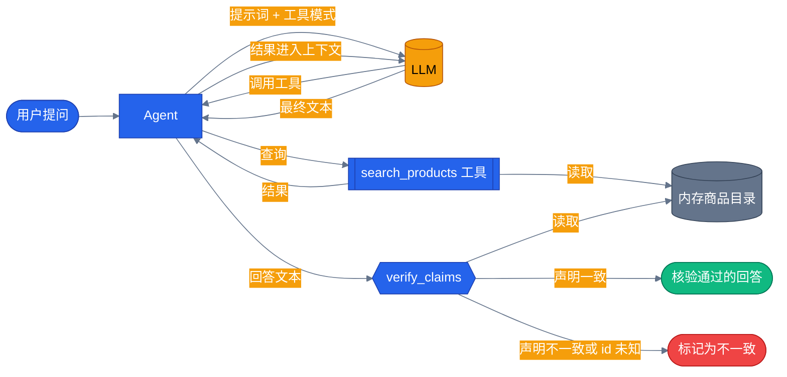

# 第 24 章 · 检索与事实核验

[项目首页](../../README.md) · [教程总览](../README.md) · [术语表](../_shared/jargon-glossary.md)

给智能体一个**检索**工具，让它有真实数据可依；再给它一道**事实核验**，检查模型回答中的具体声明是否真的与数据一致。这两件事不是一回事，把它们混为一谈是 RAG 文章里最常见的错误。

## 本章动机

此前每一章都信任模型最后那句话。第 02 章给了智能体一个 `get_product_price` 工具，并假定 LLM 之后说的内容反映了工具返回的预设字符串 —— 对于一个只有四个 SKU、没有任何实际后果的演示目录，这个假设足以跳过。但从「LLM 报一个价格」变成「一场与真金白银挂钩的真实客服对话」那一刻起，它就不再安全：第 02 章里没有任何东西检查 LLM 句子里那个数字是否仍等于工具真正返回的数字，一个把「\$79.99」转述成「\$97.99」的模型可以毫无阻碍地蒙混过关。

本章构建填补该缺口的两套机制：一个**检索**工具，让智能体有真实数据可依；以及一个**事实核验**步骤，在模型回答之后检查其具体声明是否真的与该数据一致。这两者并不相同，把它们混为一谈是 RAG 类文章中最常见的错误 —— 更深入的「模型为何会编造」材料请见 [`docs/concepts/09-grounding-and-rag.md`](../../docs/concepts/09-grounding-and-rag.md)，本章直接引用它，而不重新推导一遍。

**本章真实实现的范围**：本章用内存商品列表与简单关键词匹配演示检索，并用 `ProductClaim`、`GroundingReport` 等结构表示待核验的声明与结果。它**没有**实现完整的文档切分、向量索引、混合检索、重排或企业知识库。请把它视为「检索 + 核验」流程的最小示例，而不是一个已完成的完整 RAG 系统。

## 前置条件

- 已完成 [第 02 章 · 添加工具](../02-add-tools/)（工具装饰器、`Annotated` 参数）
- 已读 [`docs/concepts/09-grounding-and-rag.md`](../../docs/concepts/09-grounding-and-rag.md) —— 本章是它的动手配套，不是复述
- 仓库根目录的 `.env` 中有一个可用的 LLM 提供方（`OPENAI_API_KEY`，或 `AZURE_OPENAI_ENDPOINT` + `AZURE_OPENAI_KEY` + `AZURE_OPENAI_DEPLOYMENT`）

## 核心概念

**检索（Retrieval）** 是给智能体一个作用于真实知识库的 `search` 工具，而不是让它凭训练数据作答。机制上它并不新鲜 —— 还是第 02 章那个工具调用循环：LLM 看到工具模式、决定调用、MAF 执行函数、结果回到上下文，然后模型写出最终答案。新鲜的是**为什么**要这么做 —— 商品目录每天在变，模型的权重不会。没有检索工具，模型面对「你们有降噪耳机吗」的唯一选择就是生成一段听起来合理的内容，而它与真实内容在逐 token 层面无法区分。

**事实核验（Grounding verification）** 是一套完全独立的机制，在模型作答**之后**运行。生成时有真实数据可用，并不保证模型的文字会正确复述它 —— 最终回答的产生方式与其他任何一句话相同，都是「统计上最可能的续写」，而不是对工具结果的原样复制。模型可以调用 `search_products`、看到 `{"id": "P001", "price": 129.99}`，然后在回答里写下「119.99」—— 因为下一 token 的生成过程中没有任何机制强制数字保真。核验正是堵住这个特定缺口：它从模型回答中抽取**可检查的声明**（商品 id、价格），逐条与工具所用的同一份事实源比对，把不一致的标记出来，而不是假定「检索过了所以答案是对的」。

亲手搭出两者的最小版本，机制就不再神秘。本章演示完全跳过 Postgres 与 pgvector —— 一个 Python 字典列表充当商品表，一次朴素的关键词匹配充当检索查询，一个基于 dataclass 的小核验器充当真实的核验管线。它的**形态**与 `agents/python/product_discovery/tools.py`、`agents/python/shared/grounding/verifier.py` 在生产规模下所做的事情完全一致：入口是检索工具，出口是「声明抽取 + 事实源比对」。

核验的价值只在回答包含**可检查的、具体的事实**且**错了要付出真实代价**时才成立 —— 一个价格、一个订单状态、一个库存数量。对于纯粹寒暄式的回答（「很高兴为您服务 —— 您想找点什么？」）它是过度设计：那里根本没有事实声明可核验，本章的 `verify_claims()` 对这种情况报告「零条声明」，而不是把「没有可检查的内容」当成失败。


```mermaid
%%{init: {'theme':'base', 'themeVariables': {
  'primaryColor': '#2563eb','primaryTextColor': '#ffffff','primaryBorderColor': '#1e40af',
  'lineColor': '#64748b','secondaryColor': '#f59e0b','tertiaryColor': '#10b981',
  'background': 'transparent'}}}%%
flowchart LR
  classDef core     fill:#2563eb,stroke:#1e40af,color:#ffffff
  classDef external fill:#f59e0b,stroke:#b45309,color:#000000
  classDef success  fill:#10b981,stroke:#047857,color:#ffffff
  classDef error    fill:#ef4444,stroke:#b91c1c,color:#ffffff
  classDef infra    fill:#64748b,stroke:#334155,color:#ffffff

  user([用户提问])
  agent[Agent]
  llm[(LLM)]
  tool[[search_products 工具]]
  catalog[(内存商品目录)]
  verify{{verify_claims}}
  ok([核验通过的回答])
  bad([标记为不一致])

  user --> agent
  agent -- "提示词 + 工具模式" --> llm
  llm -- "调用工具" --> agent
  agent -- "查询" --> tool
  tool -- "读取" --> catalog
  tool -- "结果" --> agent
  agent -- "结果进入上下文" --> llm
  llm -- "最终文本" --> agent
  agent -- "回答文本" --> verify
  verify -- "读取" --> catalog
  verify -- "声明一致" --> ok
  verify -- "声明不一致或 id 未知" --> bad

  class agent core
  class llm external
  class tool core
  class catalog infra
  class verify core
  class ok success
  class bad error
```

检索（上半部分循环）发生在生成**过程之中**；核验发生在生成**之后** —— 它是对同一份事实源的第二遍独立比对，与模型是否「拿到过」正确答案无关。

**数据流**：

```
用户问题 → 商品检索 → 结果进入模型上下文 → 生成回答
                                          ↓
                                提取商品与价格声明
                                          ↓
                                与可信商品数据比较
```

`verify_claims` 独立于「模型决定调用哪个工具」。它遍历声明，检查商品是否存在，以及价格是否落在设定容差之内。

**核验结果的含义**：

| 情况 | 解释 |
|------|------|
| `verified` | 本次被提取、被检查的声明与数据一致 |
| `not_found` | 没找到对应商品 |
| `price_mismatch` | 声明价格与参考价格不一致 |
| 未提取到任何声明 | 没有可检查的对象，**不能**自动解释为整段回答可信 |

检查器只能检查它覆盖的字段、以及被成功提取出来的声明。错误的提取器、过时的数据、单位不一致，都可能影响结论。

## Python

在仓库根目录运行，共用 `tutorials/` 这一个 uv 项目（一次 `uv sync` 覆盖全部章节）：

```bash
uv sync --project tutorials
uv run --project tutorials python tutorials/24-rag-and-grounding/python/main.py
```

源码：[`python/main.py`](./python/main.py)。检索工具 —— 对内存目录做朴素子串匹配，用来替代 `product_discovery/tools.py` 的 pgvector 查询：

```python
@tool(
    name="search_products",
    description="Search the product catalog by keyword. Returns matching products with id, name, and price.",
)
def search_products(
    query: Annotated[str, Field(description="Keyword(s) to match against product name or category.")],
) -> list[dict]:
    words = [w for w in query.lower().split() if w]
    matches = []
    for product in CATALOG:
        haystack = f"{product['name']} {product['category']}".lower()
        if any(word in haystack for word in words):
            matches.append(product)
    return matches
```

核验步骤在 `ask()` 返回之后运行，它不是模型能看见、能跳过的工具：

```python
def verify_claims(claims: list[ProductClaim], catalog: list[dict] | None = None) -> GroundingReport:
    catalog_by_id = {p["id"]: p for p in (catalog or CATALOG)}
    verdicts: list[ClaimVerdict] = []
    for claim in claims:
        product = catalog_by_id.get(claim.id)
        if product is None:
            verdicts.append(ClaimVerdict(claim.id, "not_found", "no product with this id in the catalog"))
            continue
        if claim.price is not None and abs(claim.price - product["price"]) >= _PRICE_TOLERANCE:
            detail = f"catalog price is ${product['price']:.2f}, not ${claim.price:.2f}"
            verdicts.append(ClaimVerdict(claim.id, "price_mismatch", detail))
            continue
        verdicts.append(ClaimVerdict(claim.id, "verified"))
    return GroundingReport(verdicts=verdicts)
```

`main()` 会把两半都打印出来，于是「检索发生了」与「回答已被核验」之间的差距在输出里就看得见，而不只是在测试里被断言：

```
Q: Do you have any noise-cancelling headphones? What's the price and product id?
A: Yes, we have Wireless Noise-Cancelling Headphones (product id: P001) available for $129.99.
Grounding: 1/1 claims verified
```

问一个回答中不含事实声明的问题，`verify_claims()` 会返回空报告 —— `0/0 claims verified`，而不是失败。在录制过一次回答之后，改掉 `CATALOG` 里的某个价格，再对新目录重跑核验，就会复现出一个 `price_mismatch` 结论 —— 这正是「只有检索」无法捕捉的失败模式。

## 常见坑

- **检索不是核验。** `search_products` 被调用，只能证明模型**看到过**正确的价格；它对模型**写了什么**一无所知。只有 `verify_claims()` 检查输出。跳过它、并假定「工具跑了所以答案是对的」，是本章专门要拦下的头号 RAG 错误。
- **本章的提取器是刻意做笨的。** `extract_claims()` 是对自由文本做正则 —— 足以演示想法，但达不到生产级。`agents/python/shared/grounding/extractor.py` 改为解析结构化的卡片载荷，而不是从散文里刮数据，这可靠得多，也正是生产环境不用本章正则方案的原因。
- **「零条可检查声明」不等于「未核验」。** `total_count == 0` 的 `GroundingReport` 表示没有东西可查，而不是「0/0 失败」。把空报告当作失败，会惩罚每一句纯寒暄式回复。
- **指令依然重要。** `INSTRUCTIONS` 明确要求模型从工具结果中原样复制 id 与价格 —— 没有这句提醒，模型更容易把数字转述一遍，而那正是 `verify_claims()` 要捕捉的漂移。
- **玩具目录跳过了「账本」层。** 生产环境的三层核验器会先查本轮内的账本，再落库（见 `agents/python/shared/grounding/verifier.py` 中的 `verify_claims()`）；本章只有一个内存目录，它**就是**数据库，因此没有更便宜的层级可先查。
- **流式内容可能先于核验到达用户。** 当前完整系统的流式内容可能先发给用户，核验随后处理最终响应。若需要严格保证「关键事实先验后展示」，必须明确引入输出门控，并承担等待时间的代价。

## 测试

```bash
uv run --project tutorials pytest tutorials/24-rag-and-grounding/python/tests -v
```

`python/tests/test_rag_and_grounding.py` 在结构上覆盖：

1. **检索与核验的单元测试** —— `search_products` 按关键词/类别命中、未命中时返回空；`extract_claims` 从自由文本中抽出 id 与邻近价格；`verify_claims` 正确标记 `verified` / `price_mismatch` / `not_found` —— 完全不涉及 LLM。
2. **智能体接线** —— `search_products` 出现在 `build_agent()` 注册的工具列表中。
3. **回放测试**（`test_replay_grounded_answer_names_a_real_product`）—— 回放 `tests/fixtures/replay/` 下已提交的 fixture，无需网络与凭据，可安全用于 CI。
4. **真实 LLM 集成测试** —— 无可用凭据时跳过。一个断言 LLM 在商品问题上调用了 `search_products`，另一个断言真实回答中的每一条声明都能对目录核验通过。

## 在完整项目中的落点

`agents/python/product_discovery/tools.py:167` 是生产环境的检索那一半 —— `semantic_search`，对 `product_embeddings` 做 pgvector 余弦相似度检索，用于关键词匹配会漏掉的描述性查询（「适合冬天用的、暖暖的东西」）：

```python
@tool(name="semantic_search", description="Search products using semantic similarity via pgvector embeddings. Best for vague or descriptive queries like 'something cozy for winter' or 'gift for a tech enthusiast'.")
async def semantic_search(
    query: Annotated[str, Field(description="Descriptive search query in natural language")],
    limit: Annotated[int, Field(description="Max results")] = 5,
) -> list[dict]:
```

`agents/python/shared/grounding/verifier.py:52` 是生产环境的核验那一半 —— `verify_claims()`，即本章 `verify_claims()` 在玩具规模下所对应的三层函数（先查账本，再批量查库，并把一致性检查折叠进两者）：

```python
async def verify_claims(
    claims: ExtractedClaims,
    ledger: GroundingLedger | None,
    pool: asyncpg.Pool | None,
) -> GroundingReport:
```

它在每个真实请求上通过 `GroundingVerificationMiddleware` 运行，结果在商品界面上可见：`web/src/components/chat/grounding-badge.tsx` 会在任何做出了可检查声明的聊天消息下方渲染「已对数据库核验 N 条事实，M 条未核验」。与本章同一套双机制形态，只是放大到真实规模：一个检索工具把真实数据喂给模型，一次独立比对检查模型实际写了什么。

**迁移到售后场景**：可核验的事实包括订单归属、签收时间、退货状态与退款方式。语义解释可以由模型生成，但**资格判定必须依据明确的业务规则** —— 不能让模型用「用户似乎很着急」覆盖期限或权限条件。

## 下一步

- 概念深入：[`docs/concepts/09-grounding-and-rag.md`](../../docs/concepts/09-grounding-and-rag.md)
- 相关章节：[第 06 章 · 中间件](../06-middleware/) —— 生产环境的 `GroundingVerificationMiddleware` 是一个中间件钩子，而不是本章这种手写的调用后函数
- 完整源码：[`python/`](./python/)
- 共享材料：[Mermaid 风格指南](../_shared/mermaid-style-guide.md) · [术语表](../_shared/jargon-glossary.md)

**本章验收标准**：能够区分「检索失败」「生成错误」「声明提取遗漏」与「参考数据错误」，并能说明为什么「调用过检索工具」不是事实正确性的充分证据。
