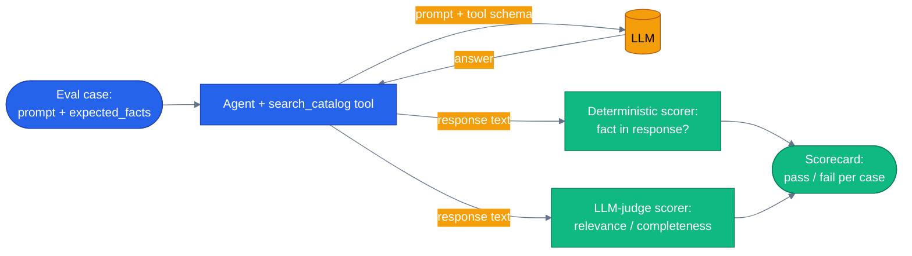

# Chapter 26 — Evals

## Why this chapter

Every prior chapter ends the same way: run the script, read the answer, decide by eye whether it
looks right. That's fine for learning a mechanic, but it doesn't scale — "I tried a prompt and it
looked correct" tells you nothing about the other cases you didn't try, and it doesn't survive a
prompt change, a model upgrade, or someone else re-running your code six months later. This
chapter turns "looks right" into a number: a small set of test cases, each with a fact a script
can check, run automatically and scored the same way every time. For the deeper argument on why a
demo isn't evidence — and a worked example of a scorer that *looked* rigorous but measured the
wrong thing — see [`docs/concepts/12-evaluation.md`](../../docs/concepts/12-evaluation.md); this
chapter focuses on the mechanics of building the eval loop itself.

## Prerequisites

- Completed [Chapter 02 — Add Tools](../02-add-tools/)
- Repo-root `.env` with a working LLM provider (`OPENAI_API_KEY`, or `AZURE_OPENAI_ENDPOINT` +
  `AZURE_OPENAI_KEY` + `AZURE_OPENAI_DEPLOYMENT`)

## The concept

A good eval case is a **prompt plus a checkable fact**, not a prompt plus a vibe. "Ask about the
Wireless Mouse and see if the answer sounds reasonable" isn't an eval case — there's nothing a
script can assert. "Ask about the Wireless Mouse and check that `24.99` appears in the response"
is: it's a prompt (`EvalCase.prompt`) paired with an `expected_facts` list a scorer can grep for.
That's the whole shape this chapter's `EVAL_CASES` list uses, and it's the same shape a real eval
suite needs — a case that can't fail is not testing anything.

Once you have checkable cases, scoring splits into two tiers. **Deterministic scoring** —
`score_deterministic()` in this chapter's `main.py` — is a mechanical substring check: did the
expected fact appear, yes or no. It's free, exact, and safe to run in CI on every commit, but it
can only check what's mechanically checkable; it says nothing about whether the surrounding prose
makes sense. **LLM-judge scoring** asks a second model call to grade something that doesn't have a
mechanically checkable answer — did the response actually address what was asked, in substance.
It costs money and isn't perfectly reproducible between two runs of the identical input, so it's
reserved for what deterministic checks can't reach, not run on everything by default.

This repo's own eval harness has an instructive history worth naming directly. The original
version (`evaluator.py`'s `_run_agent()`) hand-rolled its own OpenAI tool-calling loop, calling
undecorated tool functions directly instead of running the agent through `agent.run()`. That loop
never went through `agent_host.py`'s real MAF execution path — no guardrail middleware, no
grounding verification, none of the machinery the production app actually runs on every live
request. The eval suite could report a clean pass while testing a system that wasn't the one users
were talking to. `agents/python/evals/harness.py`'s `ProductionRunner` (see below) exists
specifically to close that gap: it drives every eval case through the same dispatch a live request
uses, so a passing eval means the deployed system passed, not a simulation of it.



The two scorers run over the same response — one is cheap and exact, the other catches what the
first one structurally can't.

## Python

Run from the repo root using the shared `tutorials/` uv project (one `uv sync` covers every
chapter):

```bash
uv sync --project tutorials
uv run --project tutorials python tutorials/26-evals/python/main.py
```

Source: [`python/main.py`](./python/main.py). The demo agent is a small e-commerce Q&A assistant
over a five-item in-memory catalog, with one tool:

```python
@tool(name="search_catalog", description="Look up the price and stock count for a product in the catalog by name.")
def search_catalog(
    product_name: Annotated[str, Field(description="The product name to look up, e.g. 'Wireless Mouse'.")],
) -> str:
    item = CATALOG.get(product_name.strip().lower())
    if item is None:
        return f"No catalog entry for '{product_name}'."
    availability = "in stock" if item["stock"] > 0 else "out of stock"
    return f"{product_name.title()}: ${item['price']:.2f}, {item['stock']} units ({availability})."
```

Five `EvalCase` entries pair a prompt with the exact fact(s) the answer must contain — a price, a
stock count, or an "out of stock" phrase. `run_eval_suite()` asks the agent each question, then
scores the response two ways: `score_deterministic()` checks whether every expected fact appears
as a literal substring (case-insensitive), and `judge_response_stub()` returns a structured
`JudgeVerdict` (`score`, `reasoning`, `failure_mode`) — the same shape the real
`evals/scorers/llm_judge.py::JudgeVerdict` uses, computed here with a cheap heuristic instead of a
second live LLM call, since spending one extra model call per case isn't worth it for a five-case
teaching demo with a fixed replay fixture set. Swap that function's body for a real
`judge.run(...)` call and nothing else in the loop changes. `main()` runs the suite once and prints
a scorecard:

```
Case                      Deterministic  Judge   Notes
--------------------------------------------------------------------------------
mouse-price               1.00           1.00    Response covers every expected fact.
keyboard-stock            1.00           1.00    Response covers every expected fact.
hub-out-of-stock          1.00           1.00    Response covers every expected fact.
headphones-price          1.00           1.00    Response covers every expected fact.
charger-price-and-stock   1.00           1.00    Response covers every expected fact.
--------------------------------------------------------------------------------
5/5 cases fully grounded (deterministic score == 1.0)
```

## .NET

Source: [`dotnet/Program.cs`](./dotnet/Program.cs).

```bash
cd tutorials/26-evals/dotnet
dotnet run
dotnet test tests/Evals.Tests.csproj
```

Same two tiers, same structured `JudgeVerdict` shape, so the stub judge and a real one are drop-in replacements:

```csharp
public sealed record JudgeVerdict(double Score, string Reasoning, string? FailureMode = null);
```

`Main` returns non-zero when any case fails, so it is usable as a CI gate rather than a report nobody reads.

Testing an eval harness means scoring the scorer, which is worth doing precisely because a broken scorer does not look broken — it reports numbers, the numbers look reasonable, and the suite goes green while measuring nothing. So the tests target the ways a scorer lies:

- a case with no expected facts scores `1.0` (defensible, and a trap — a suite of empty cases reports a perfect pass rate)
- the deterministic tier passes an answer that is rude and off-topic as long as the number appears in it
- `"15"` matches inside `"150"`
- the stub judge agrees with the deterministic tier *by construction*, which is exactly what a real judge must not do — two scorers that always agree are one scorer costing twice as much

Two guard the suite against itself: every case must have at least one checkable fact, and case ids must be unique.

## Gotchas

- **A scorer that doesn't check the thing it claims to check is worse than no scorer.** The
  original version of `AgentEvaluator._score_groundedness` returned `1.0` whenever any tool was
  called, without comparing the response's actual words to what the tool returned — a fabricated
  price scored identically to a real one. `evals/scorers/db_groundedness.py::score_from_report()`
  fixes this by scoring `verified_claims / total_claims` against the real grounding report, not
  "a tool fired." This chapter's `score_deterministic()` is the same idea in miniature: it checks
  for the literal fact string, not "a tool was called."
- **Eval evidence is only as good as the code path it exercises.** Routing eval cases around
  production middleware (the mistake this repo's own harness made and then fixed — see "The
  concept" above) can make a red-team or safety case "pass" without ever exercising the guardrails
  it was supposed to be testing. Always ask what code path an eval actually runs through, not just
  whether it reports green.
- **Deterministic scoring needs a genuinely checkable fact.** `EVAL_CASES` in this chapter's
  `main.py` deliberately uses exact numbers (`"24.99"`, `"15"`) or an unambiguous phrase
  (`"out of stock"`) as `expected_facts` — a vaguer target like "mentions the mouse" would pass
  even for a wrong price.
- **The judge stub is not a substitute for the real judge.** `judge_response_stub()` is clearly
  labeled as a heuristic stand-in so this chapter's replay fixture set stays small (5 cases, one
  LLM round trip each, instead of 10). Production code should call the real
  `evals/scorers/llm_judge.py::judge_response()`, which actually asks a model.
- **Replay fixtures are keyed per request, not per case.** With tool-calling in play, each eval
  case can produce more than one LLM call (one where the model decides to call `search_catalog`,
  one where it composes the final answer from the tool result) — expect more fixture files than
  eval cases; that's normal, not a bug.

## Tests

```bash
uv run --project tutorials pytest tutorials/26-evals/python/tests -v
```

`tutorials/26-evals/python/tests/test_evals.py` covers, structurally:

1. **Unit tests against `search_catalog` and both scorers directly** — canned catalog data, an
   out-of-stock item, an unknown product, case-insensitivity, full/partial/zero deterministic
   matches, and the judge stub's three coverage bands — no LLM involved.
2. **Agent wiring** — `search_catalog` shows up in `build_agent()`'s registered tools, and every
   `EVAL_CASES` entry actually has a checkable fact.
3. **A replay test** (`test_replay_runs_full_eval_suite`) that plays back the committed fixtures in
   `tests/fixtures/replay/` — no network or credentials required, safe for CI.
4. **Real-LLM integration tests**, skipped unless usable credentials are present — one asserts
   every eval case scores fully grounded against a real model, the other asserts an unrelated
   question doesn't leak canned catalog numbers.

## How this shows up in the capstone

The real eval harness lives at `agents/python/evals/`. `agents/python/evals/harness.py:90`'s
`ProductionRunner` class, and its `agents/python/evals/harness.py:110` `run()` method, route every
eval case through the exact dispatch a live request uses — `orchestrator.modes.get_mode("tool")
.run(...)` for the orchestrator, `shared.agent_host._run_agent_native()` for each specialist — the
same production entry points [Chapter 21](../21-capstone-tour/) tours, not a parallel simulation.
That's the direct fix for the bypass-the-middleware mistake described in "The concept" above.

The two scorer tiers this chapter's `score_deterministic()` and `judge_response_stub()` mirror are
real modules: `agents/python/evals/scorers/db_groundedness.py:26`'s `score_from_report()` is the
deterministic tier, computing `verified_claims / total_claims` from the same `GroundingReport` the
production grounding middleware already produced during the run — free, no extra DB round trip.
`agents/python/evals/scorers/llm_judge.py:57`'s `judge_response()` is the LLM-judge tier, sending
the question, the expected fields, and the response to a second model and parsing the result into
the `JudgeVerdict` Pydantic model defined at `agents/python/evals/scorers/llm_judge.py:41` — the
exact shape this chapter's stub `JudgeVerdict` class copies.

## What's next

- Next chapter: [Chapter 21 — Capstone Tour](../21-capstone-tour/) for a guided walk through where
  every chapter's pattern lives in the real app.
- Concept deep-dive: [`docs/concepts/12-evaluation.md`](../../docs/concepts/12-evaluation.md)
- Full source: [`python/`](./python/)
- Shared: [Mermaid style guide](../_shared/mermaid-style-guide.md) · [Jargon glossary](../_shared/jargon-glossary.md)
